# Module 1 — Python for AI & Programming Fundamentals

> **AI Powered Engineering Upskilling Program**
> *From Fundamentals to Generative AI Applications*

---

## Module Information Card

| Field | Detail |
|---|---|
| **Module Number** | 1 of 10 |
| **Module Title** | Python for AI & Programming Fundamentals |
| **Duration** | 8 Hours (≈ 1.5 training days) |
| **Level** | Beginner → Foundation |
| **Target Audience** | Engineering students, age 19–20 |
| **Prerequisites** | None. Basic computer literacy is enough. |
| **Python Version Used** | **Python 3.13 / 3.14** (latest stable in 2026) |
| **Primary Tools** | Python, VS Code, Jupyter Notebook, Google Colab, Anaconda |
| **Learning Outcome** | Build a strong programming foundation in Python for AI development. |
| **Hands-on Projects** | (1) Number Guessing Game · (2) Student Management System · (3) File Processing |

### What you will be able to do after this module

By the end of Module 1, a student will be able to:

1. Install and configure a modern Python environment (2026 tooling).
2. Read, write, and reason about Python syntax confidently.
3. Use variables, all core data types, and type conversion correctly.
4. Apply every category of operator to build expressions.
5. Control program flow using conditions, `match-case`, and loops.
6. Write reusable functions with parameters, return values, and type hints.
7. Choose the right collection (list, tuple, set, dict) for a problem.
8. Read from and write to files (text, CSV, JSON).
9. Handle errors gracefully with exceptions so programs don't crash.
10. Build three complete working programs from scratch.

> **How to use these notes**: Read the theory, **type every code example yourself** (do not copy-paste — muscle memory matters at this stage), run it, then break it on purpose to see the error. Every `# 🖥️ Output:` comment shows what the program prints so you can check your result.

---

## Table of Contents

1. [Why Python, and Why Python for AI in 2026](#1-why-python-and-why-python-for-ai-in-2026)
2. [Setting Up Your Environment](#2-setting-up-your-environment)
3. [Python Basics — Syntax, Comments, Input & Output](#3-python-basics--syntax-comments-input--output)
4. [Variables & Data Types](#4-variables--data-types)
5. [Operators](#5-operators)
6. [Conditions & Decision Making](#6-conditions--decision-making)
7. [Loops & Iteration](#7-loops--iteration)
8. [Functions](#8-functions)
9. [Collections — List, Tuple, Set, Dictionary](#9-collections--list-tuple-set-dictionary)
10. [File Handling](#10-file-handling)
11. [Exception Handling](#11-exception-handling)
12. [Hands-on Project 1 — Number Guessing Game](#12-hands-on-project-1--number-guessing-game)
13. [Hands-on Project 2 — Student Management System](#13-hands-on-project-2--student-management-system)
14. [Hands-on Project 3 — File Processing](#14-hands-on-project-3--file-processing)
15. [Best Practices, PEP 8 & Common Mistakes](#15-best-practices-pep-8--common-mistakes)
16. [Glossary](#16-glossary)
17. [Practice Exercises & Self-Assessment](#17-practice-exercises--self-assessment)
18. [Summary & What's Next](#18-summary--whats-next)

---

## 1. Why Python, and Why Python for AI in 2026

### 1.1 What is a programming language?

A computer only understands **binary** — sequences of 0s and 1s (electrical *off* and *on*). Humans find binary impossible to work with, so we invented **programming languages**: human-readable text that a special program translates into instructions the machine can execute.

```
Human idea → Python code (readable) → Interpreter → Machine code (0s & 1s) → CPU runs it
```

There are two broad ways this translation happens:

| Approach | How it works | Examples | Trade-off |
|---|---|---|---|
| **Compiled** | The whole program is translated to machine code *once*, before running. | C, C++, Rust, Go | Very fast to run, slower to write & test |
| **Interpreted** | Code is translated **line by line** *as it runs*. | **Python**, JavaScript, Ruby | Slower to run, very fast to write & test |

Python is **interpreted**, which is exactly why beginners love it: you can write one line, run it, and instantly see the result — no lengthy "compile" step.

### 1.2 What exactly is Python?

Python is a **high-level, interpreted, general-purpose** programming language created by **Guido van Rossum** and first released in **1991**. "High-level" means it hides messy hardware details (memory addresses, CPU registers) and lets you focus on *logic*. The name comes from the British comedy group *Monty Python*, not the snake.

**Core design philosophy** (type `import this` in Python to read all of it — *The Zen of Python*):

- *Readability counts.*
- *Simple is better than complex.*
- *There should be one — and preferably only one — obvious way to do it.*

### 1.3 Why is Python the #1 language for AI?

As of 2026, Python is the dominant language for Artificial Intelligence, Machine Learning, and Data Science. Here is *why*, point by point:

| Reason | Explanation |
|---|---|
| **Simple, English-like syntax** | You spend time thinking about the *AI problem*, not fighting the language. |
| **Massive AI ecosystem** | NumPy, Pandas, Scikit-learn, TensorFlow, PyTorch, Hugging Face Transformers, LangChain — the entire AI toolchain is Python-first. |
| **Glue language** | Python easily connects to fast C/C++/CUDA code, so it's *readable on the surface but fast underneath*. |
| **Huge community** | Millions of developers, endless tutorials, and answers to almost every question online. |
| **Industry standard** | OpenAI, Google DeepMind, Meta AI, and nearly every AI startup use Python. |
| **Notebooks** | Jupyter/Colab let you run AI experiments cell-by-cell and see plots inline. |

> **Key insight for AI students**: Every advanced topic in this program — Machine Learning (Module 4), Deep Learning (Module 5), NLP (Module 6), Generative AI (Module 7) — is built on the Python foundations you learn *right now* in Module 1. Master this, and everything after becomes easier.

### 1.4 What's new & current in Python (2026 context)

These notes use **Python 3.13/3.14**, the latest stable releases. You should know these modern features exist because you'll see them in real code:

- **f-strings** (formatted string literals) — the modern, readable way to build strings. *(Covered in §3.)*
- **`match` / `case` statement** — structural pattern matching, added in Python 3.10. *(Covered in §6.)*
- **Type hints** — optional annotations like `age: int` that document your code and power AI coding assistants. *(Used throughout.)*
- **The walrus operator `:=`** — assign and use a value in one expression. *(Covered in §5.)*
- **Faster interpreter** — Python 3.11+ is dramatically faster than older versions; 3.13 introduced an experimental **free-threaded (no-GIL)** build and a better interactive shell (REPL).

You do **not** need to memorize versions. Just always install the **latest stable Python** from [python.org](https://python.org).

---

## 2. Setting Up Your Environment

You cannot learn to swim from the shore. Before any code, set up a real working environment. In 2026 the standard beginner + AI toolkit is:

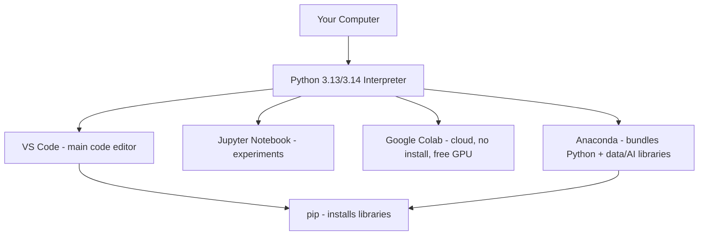

### 2.1 The four ways to run Python

| Tool | What it is | Best for | Install needed? |
|---|---|---|---|
| **Python + VS Code** | Free code editor from Microsoft | Writing real programs & projects | Yes |
| **Jupyter Notebook** | Cell-based coding with inline output | Data analysis, AI experiments | Yes (or via Anaconda) |
| **Google Colab** | Jupyter in the browser, Google's servers | Zero-setup start, free GPU for AI | **No** — just a browser + Google account |
| **Anaconda** | A big bundle: Python + 250+ data/AI libraries + Jupyter | Data Science students who want everything pre-installed | Yes |

> **Recommendation for this program**: Start on **Google Colab** in Hour 1 (nothing to install, works instantly), then install **Python + VS Code** locally for building projects, and use **Anaconda** when we reach the Data Science modules.

### 2.2 Installing Python (local)

1. Go to **[python.org/downloads](https://www.python.org/downloads/)**.
2. Download the latest stable version (3.13 or 3.14).
3. **On Windows: tick the box "Add Python to PATH"** during install. This one checkbox saves hours of pain — it lets you run `python` from any terminal.
4. Verify the install by opening a terminal (PowerShell on Windows) and typing:

```bash
python --version
# 🖥️ Output: Python 3.14.0   (your number may differ slightly)
```

If you see a version number, Python is installed correctly. ✅

### 2.3 pip — the package installer

`pip` is Python's tool for installing external libraries (extra code written by others). You'll use it constantly.

```bash
pip install numpy          # installs the NumPy library
pip install pandas         # installs Pandas
pip list                   # shows everything installed
pip install --upgrade pip  # updates pip itself
```

### 2.4 Virtual environments (professional habit)

A **virtual environment** is an isolated box of libraries for one project, so Project A's libraries don't clash with Project B's. This is a professional best practice — start it early.

```bash
python -m venv myenv           # 1. create an environment named "myenv"

# 2. Activate it:
myenv\Scripts\activate         # Windows
source myenv/bin/activate      # Mac/Linux

# 3. Now pip installs go only into this box:
pip install pandas

deactivate                     # 4. exit the environment when done
```

Line-by-line:
- `python -m venv myenv` → runs the built-in `venv` module (`-m`) to create a folder `myenv` holding a private copy of Python.
- Activating changes your terminal so `python` and `pip` point *inside* the box.
- `deactivate` returns you to the normal system Python.

### 2.5 Your first program

Every programmer's tradition is to make the computer say hello. Create a file named `hello.py` and type:

```python
print("Hello, AI World!")
```

Run it in the terminal:

```bash
python hello.py
# 🖥️ Output: Hello, AI World!
```

**Congratulations — you are now a programmer.** Let's understand *every* piece of what just happened, starting in the next section.

---

## 3. Python Basics — Syntax, Comments, Input & Output

### 3.1 Syntax: indentation is not optional

Most languages (C, Java, JavaScript) group code using **curly braces `{ }`**. Python is different and famous for it: **Python uses indentation (whitespace) to group code.** This forces every Python program to *look* clean.

```python
# ❌ WRONG — this will crash with an IndentationError
if 5 > 2:
print("Five is bigger")

# ✅ CORRECT — the indented line belongs to the 'if'
if 5 > 2:
    print("Five is bigger")   # 4 spaces of indentation
```

**Rules:**
- The standard indent is **4 spaces** (not a tab). VS Code inserts 4 spaces when you press Tab.
- All lines in the same block must be indented by the *same* amount.
- Indentation is how Python knows where a block starts and ends.

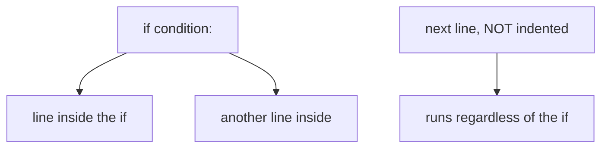

### 3.2 Comments — notes for humans

A **comment** is text the Python interpreter *ignores*. Comments explain *why* code exists to any human reading it (including future-you).

```python
# This is a single-line comment. Python ignores everything after the #.

print("Hi")   # Comments can also go at the end of a line.

# There is no true multi-line comment in Python, but you can either:
# stack several # lines like this,

"""
...or use a triple-quoted string as a block of notes.
This is technically a string, but if it's not assigned to
anything, Python effectively ignores it.
"""
```

> **Why comments matter for AI**: When you later use AI coding assistants (GitHub Copilot, Claude — Module 7), clear comments help the AI understand your intent and generate better suggestions.

### 3.3 Output: the `print()` function

`print()` displays information on the screen. It is the tool you'll use most while learning, to *see what your program is doing*.

```python
print("Hello")               # 🖥️ Hello
print(42)                    # 🖥️ 42
print("Age:", 20)            # 🖥️ Age: 20   (multiple items, separated by a space)
print("A", "B", "C")         # 🖥️ A B C
```

**Useful `print()` options:**

```python
print("A", "B", "C", sep="-")     # 🖥️ A-B-C     (sep = separator between items)
print("No newline", end=" ")      # 🖥️ prints without moving to a new line
print("same line")                # 🖥️ No newline same line
```

- `sep=` controls what goes *between* multiple items (default is a space).
- `end=` controls what is printed *after* everything (default is a newline `\n`).

### 3.4 Input: the `input()` function

`input()` **pauses** the program and waits for the user to type something and press Enter. **Crucially, `input()` always returns a string (text)** — even if the user types a number.

```python
name = input("What is your name? ")   # program waits here for typing
print("Hello,", name)

# 🖥️ What is your name? Aarav
# 🖥️ Hello, Aarav
```

To get a *number* from the user, you must **convert** the text:

```python
age_text = input("Enter your age: ")   # e.g. user types 20 → age_text is "20" (a STRING)
age = int(age_text)                    # convert the string "20" into the integer 20
print("Next year you'll be", age + 1)

# 🖥️ Enter your age: 20
# 🖥️ Next year you'll be 21
```

This is one of the **most common beginner bugs**: forgetting that `input()` gives text, then trying to do math on it. We'll return to type conversion in §4.

### 3.5 Escape characters

Some characters are special inside strings. The backslash `\` "escapes" them:

| Escape | Meaning | Example | Output |
|---|---|---|---|
| `\n` | New line | `print("A\nB")` | `A` then `B` on next line |
| `\t` | Tab | `print("A\tB")` | `A    B` |
| `\"` | Literal double quote | `print("He said \"hi\"")` | `He said "hi"` |
| `\\` | Literal backslash | `print("C:\\Users")` | `C:\Users` |

---

## 4. Variables & Data Types

### 4.1 What is a variable?

A **variable** is a **named label that points to a value stored in the computer's memory**. Think of it as a labelled box: you put a value in, stick a name on it, and later you refer to the value by its name.

```python
age = 20        # create a box named 'age', put the number 20 inside
name = "Aarav"  # create a box named 'name', put the text "Aarav" inside

print(age)      # 🖥️ 20
print(name)     # 🖥️ Aarav
```

The `=` sign is the **assignment operator**. Read `age = 20` as *"age is assigned the value 20"*, **not** "age equals 20" (equality is `==`, covered in §5).

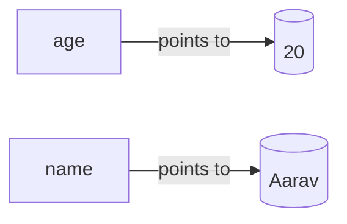

**A subtle but important idea:** In Python, a variable does *not* "contain" the value the way a physical box contains an object. It is a **reference (a name tag) that points to an object in memory**. This is why Python is called a *dynamically typed* language — the same name can point to different types over time:

```python
x = 10        # x points to an integer
x = "hello"   # now the SAME name x points to a string — totally legal in Python
x = [1, 2, 3] # now it points to a list
```

### 4.2 Rules for naming variables

| Rule | ✅ Valid | ❌ Invalid | Why invalid |
|---|---|---|---|
| Must start with a letter or underscore | `name`, `_score` | `2name` | can't start with a digit |
| Can contain letters, digits, underscores | `student_1`, `ageV2` | `student-1` | `-` not allowed |
| No spaces | `first_name` | `first name` | spaces not allowed |
| Case-sensitive | `Age` ≠ `age` | — | these are *two different* variables |
| Can't be a Python keyword | `total` | `for`, `class`, `if` | reserved by the language |

**Naming conventions (style, not rules — but follow them):**
- Use `snake_case` for variables: `student_name`, `total_marks` (lowercase, words joined by `_`).
- Use descriptive names: `average_score` is far better than `a` or `x`.
- Constants (values that never change) are written in `UPPER_CASE`: `PI = 3.14159`.

### 4.3 The core data types

A **data type** tells Python what *kind* of value something is and what you can do with it. Python's built-in core types:

| Type | Name | Example | Description |
|---|---|---|---|
| `int` | Integer | `20`, `-5`, `1000000` | Whole numbers, no decimal point |
| `float` | Floating point | `3.14`, `-0.5`, `2.0` | Numbers with a decimal point |
| `str` | String | `"hello"`, `'AI'` | Text (any characters in quotes) |
| `bool` | Boolean | `True`, `False` | Logical values — only two possibilities |
| `complex` | Complex number | `3 + 4j` | Numbers with a real & imaginary part (rare, used in engineering/signal work) |
| `NoneType` | None | `None` | Represents "nothing" / "no value yet" |

You can always check a value's type with the built-in `type()` function:

```python
print(type(20))        # 🖥️ <class 'int'>
print(type(3.14))      # 🖥️ <class 'float'>
print(type("hello"))   # 🖥️ <class 'str'>
print(type(True))      # 🖥️ <class 'bool'>
print(type(None))      # 🖥️ <class 'NoneType'>
```

### 4.4 Integers (`int`)

Whole numbers. In Python, integers have **unlimited size** (limited only by your computer's memory) — this is unusual and powerful.

```python
students = 45
temperature = -8
big_number = 999_999_999_999   # underscores are ignored, just for readability
print(big_number)              # 🖥️ 999999999999
```

### 4.5 Floating-point numbers (`float`)

Numbers with a decimal point. Used for measurements, averages, prices, probabilities (which matter a lot in AI!).

```python
pi = 3.14159
average = 87.5
probability = 0.001
scientific = 2.5e3   # 'e3' means ×10³  →  2500.0
print(scientific)    # 🖥️ 2500.0
```

> ⚠️ **The floating-point gotcha** (you *will* meet this): computers store decimals in binary, which can't represent some fractions exactly.
> ```python
> print(0.1 + 0.2)   # 🖥️ 0.30000000000000004  (not exactly 0.3!)
> ```
> This is **not a Python bug** — it happens in *every* language. For AI/data work, it rarely matters; when it does (e.g. money), you use the `decimal` module. Never test floats with `==`; check if they are *close enough*.

### 4.6 Strings (`str`)

A **string** is a sequence of characters (text) wrapped in quotes. You can use single `'...'` or double `"..."` quotes — just be consistent.

```python
name = "Artificial Intelligence"
language = 'Python'
```

**String indexing** — each character has a position number (**index**), starting at **0**:

```
 String:   P   y   t   h   o   n
 Index:    0   1   2   3   4   5
 Negative: -6  -5  -4  -3  -2  -1
```

```python
word = "Python"
print(word[0])    # 🖥️ P   (first character)
print(word[5])    # 🖥️ n   (sixth character)
print(word[-1])   # 🖥️ n   (last character — negative counts from the end)
```

**String slicing** — grab a *range* of characters with `[start:stop]` (stop is *excluded*):

```python
word = "Python"
print(word[0:3])   # 🖥️ Pyt   (indexes 0,1,2 — 3 is excluded)
print(word[2:])    # 🖥️ thon  (from index 2 to the end)
print(word[:4])    # 🖥️ Pyth  (from the start to index 3)
print(word[::-1])  # 🖥️ nohtyP (a neat trick to reverse a string!)
```

**Common string methods** (a *method* is a function attached to a value, called with a dot):

| Method | What it does | Example | Result |
|---|---|---|---|
| `.upper()` | Uppercase | `"ai".upper()` | `"AI"` |
| `.lower()` | Lowercase | `"AI".lower()` | `"ai"` |
| `.strip()` | Remove surrounding spaces | `"  hi  ".strip()` | `"hi"` |
| `.replace(a,b)` | Replace text | `"cat".replace("c","b")` | `"bat"` |
| `.split(sep)` | Break into a list | `"a,b,c".split(",")` | `["a","b","c"]` |
| `.find(x)` | Index of first match (or -1) | `"hello".find("l")` | `2` |
| `len(s)` | Length (built-in, not a method) | `len("hello")` | `5` |

**f-strings — the modern way to build strings (learn this well!):**

An **f-string** (formatted string literal) lets you drop variables directly into text by putting an `f` before the quote and wrapping variables in `{ }`. This is *the* standard in modern Python.

```python
name = "Aarav"
age = 20
print(f"My name is {name} and I am {age} years old.")
# 🖥️ My name is Aarav and I am 20 years old.

# You can even run expressions inside the braces:
print(f"Next year I'll be {age + 1}.")     # 🖥️ Next year I'll be 21.
print(f"Pi to 2 decimals is {3.14159:.2f}")# 🖥️ Pi to 2 decimals is 3.14

# Python 3.8+ debug trick — '=' prints the name AND value:
print(f"{age=}")                           # 🖥️ age=20
```

### 4.7 Booleans (`bool`)

A **Boolean** has only two possible values: `True` or `False` (note the capital letters). Booleans are the backbone of decision-making (§6) and are everywhere in AI (e.g. "is this email spam? True/False").

```python
is_student = True
has_passed = False
print(10 > 5)       # 🖥️ True   (comparisons produce Booleans)
print(3 == 4)       # 🖥️ False
```

**Truthy and Falsy:** every value in Python is treated as either "truthy" or "falsy" when used in a condition. These are **falsy**: `False`, `0`, `0.0`, `""` (empty string), `[]` (empty list), `{}` (empty dict), `None`. **Everything else is truthy.**

```python
if "hello":          # a non-empty string is truthy
    print("This runs")   # 🖥️ This runs
if 0:                # 0 is falsy
    print("This does NOT run")
```

### 4.8 None

`None` is a special value meaning "no value" or "nothing here yet". It is *not* the same as `0` or `""`. It's often used as a placeholder before a real value is known.

```python
winner = None          # no winner decided yet
print(winner)          # 🖥️ None
print(winner is None)  # 🖥️ True  (the correct way to check for None)
```

### 4.9 Type conversion (casting)

**Type conversion** means changing a value from one type to another. This is essential because `input()` always gives strings, but you often need numbers.

| Function | Converts to | Example | Result |
|---|---|---|---|
| `int(x)` | Integer | `int("25")` | `25` |
| `float(x)` | Float | `float("3.14")` | `3.14` |
| `str(x)` | String | `str(100)` | `"100"` |
| `bool(x)` | Boolean | `bool(0)` | `False` |

```python
# The classic use case — reading a number from the user:
age = int(input("Enter your age: "))     # convert text → integer immediately
price = float(input("Enter price: "))    # convert text → float

# Combining numbers with text needs str():
score = 95
print("Your score is " + str(score))     # 🖥️ Your score is 95
# Without str(), "text" + number would crash with a TypeError.
```

> ⚠️ **Conversion can fail:** `int("hello")` crashes because "hello" is not a number. In §11 you'll learn to handle this gracefully so your program doesn't die.

### 4.10 Type hints (modern, AI-friendly Python)

**Type hints** are optional annotations that document what type a variable or function expects. Python does **not** enforce them at runtime — they're for humans, editors, and AI assistants. Professional 2026 code uses them heavily.

```python
name: str = "Aarav"        # 'name is a string'
age: int = 20              # 'age is an integer'
scores: list[int] = [90, 85, 88]   # 'a list of integers'

def greet(person: str) -> str:      # takes a str, returns a str
    return f"Hello, {person}"
```

Type hints make VS Code and Copilot far smarter about warning you of mistakes. We'll use them lightly throughout so you get used to reading them.

---

## 5. Operators

**Operators** are symbols that perform operations on values (called **operands**). In `5 + 3`, the `+` is the operator and `5`, `3` are the operands. Python has six main families of operators.

### 5.1 Arithmetic operators

Used for mathematics.

| Operator | Name | Example | Result |
|---|---|---|---|
| `+` | Addition | `7 + 3` | `10` |
| `-` | Subtraction | `7 - 3` | `4` |
| `*` | Multiplication | `7 * 3` | `21` |
| `/` | Division (always gives a **float**) | `7 / 2` | `3.5` |
| `//` | Floor division (drops the decimal) | `7 // 2` | `3` |
| `%` | Modulus (**remainder**) | `7 % 2` | `1` |
| `**` | Exponent (power) | `2 ** 3` | `8` |

```python
print(10 / 3)    # 🖥️ 3.3333333333333335   (true division → float)
print(10 // 3)   # 🖥️ 3                     (floor division → whole part only)
print(10 % 3)    # 🖥️ 1                     (remainder of 10 ÷ 3)
print(2 ** 10)   # 🖥️ 1024                  (2 to the power 10)
```

> **The modulus `%` is more useful than it looks.** `n % 2 == 0` is the standard way to check if a number is **even** (remainder 0). It's used constantly — including in our Number Guessing Game and countless AI data-processing tasks.
> ```python
> print(8 % 2)   # 🖥️ 0  → 8 is even
> print(7 % 2)   # 🖥️ 1  → 7 is odd
> ```

**Operator precedence** (the order operations run, like BODMAS/PEMDAS in maths):

```
1. **        (exponent — highest priority)
2. * / // %  (multiply, divide)
3. + -       (add, subtract — lowest)
```

```python
print(2 + 3 * 4)      # 🖥️ 14   (3*4 first, then +2)
print((2 + 3) * 4)    # 🖥️ 20   (parentheses force + first)
```

> **Golden rule:** when in doubt, use parentheses `( )`. They make intent obvious and prevent bugs.

### 5.2 Comparison (relational) operators

These compare two values and always produce a **Boolean** (`True`/`False`). They are the foundation of every `if` statement.

| Operator | Meaning | Example | Result |
|---|---|---|---|
| `==` | Equal to | `5 == 5` | `True` |
| `!=` | Not equal to | `5 != 3` | `True` |
| `>` | Greater than | `5 > 3` | `True` |
| `<` | Less than | `5 < 3` | `False` |
| `>=` | Greater than or equal | `5 >= 5` | `True` |
| `<=` | Less than or equal | `4 <= 3` | `False` |

> ⚠️ **The #1 beginner mistake:** confusing `=` (assign a value) with `==` (compare two values).
> - `age = 20` → *stores* 20 in age.
> - `age == 20` → *asks* "is age equal to 20?" and gives `True`/`False`.

### 5.3 Logical operators

Used to **combine** multiple conditions.

| Operator | Meaning | Example | Result |
|---|---|---|---|
| `and` | True only if **both** sides are True | `(5 > 3) and (2 > 1)` | `True` |
| `or` | True if **at least one** side is True | `(5 > 3) or (2 > 8)` | `True` |
| `not` | **Reverses** the Boolean | `not (5 > 3)` | `False` |

**Truth tables** (memorize the pattern, not the rows):

| A | B | A `and` B | A `or` B |
|---|---|---|---|
| True | True | True | True |
| True | False | False | True |
| False | True | False | True |
| False | False | False | False |

```python
age = 20
has_id = True
if age >= 18 and has_id:
    print("Entry allowed")   # 🖥️ Entry allowed  (both conditions are True)
```

### 5.4 Assignment operators

`=` assigns; the others are **shortcuts** that update a variable using its current value.

| Operator | Example | Same as |
|---|---|---|
| `=` | `x = 5` | — |
| `+=` | `x += 3` | `x = x + 3` |
| `-=` | `x -= 3` | `x = x - 3` |
| `*=` | `x *= 3` | `x = x * 3` |
| `/=` | `x /= 3` | `x = x / 3` |
| `//=` | `x //= 3` | `x = x // 3` |
| `%=` | `x %= 3` | `x = x % 3` |
| `**=` | `x **= 3` | `x = x ** 3` |

```python
score = 100
score += 50     # score is now 150
score -= 20     # score is now 130
print(score)    # 🖥️ 130
```

These are used constantly for counters and running totals (e.g. adding up marks).

### 5.5 Identity & membership operators

| Operator | Meaning | Example | Result |
|---|---|---|---|
| `is` | Same object in memory? | `x is None` | `True`/`False` |
| `is not` | Different object? | `x is not None` | `True`/`False` |
| `in` | Is a value present in a collection? | `"a" in "cat"` | `True` |
| `not in` | Is a value absent? | `5 not in [1,2,3]` | `True` |

```python
fruits = ["apple", "banana", "mango"]
print("banana" in fruits)      # 🖥️ True
print("grape" not in fruits)   # 🖥️ True

name = None
print(name is None)            # 🖥️ True  (always use 'is' to test for None)
```

> **`==` vs `is`:** `==` asks "are the *values* equal?"; `is` asks "are they *literally the same object* in memory?". For everyday comparisons use `==`. Reserve `is` for `None`, `True`, `False`.

### 5.6 The walrus operator `:=` (modern Python)

Added in Python 3.8, the **walrus operator** assigns a value *and* returns it in the same expression. It's named for looking like walrus eyes & tusks `:=`. Handy for avoiding repeated work:

```python
# Without walrus — you call input() twice conceptually:
data = input("Enter text: ")
while data != "quit":
    print(f"You said: {data}")
    data = input("Enter text: ")

# With walrus — assign and test in one line:
while (data := input("Enter text: ")) != "quit":
    print(f"You said: {data}")
```

You don't need it yet, but you'll recognize it in real 2026 code.

---

## 6. Conditions & Decision Making

Programs become *intelligent* when they make decisions. **Conditional statements** let a program choose different paths based on whether something is `True` or `False`.

### 6.1 The `if` statement

```python
age = 20
if age >= 18:
    print("You are an adult.")   # only runs if the condition is True
# 🖥️ You are an adult.
```

Anatomy:
- `if` keyword, then a **condition** (something that evaluates to True/False), then a **colon `:`**.
- The **indented block** below runs *only* when the condition is True.

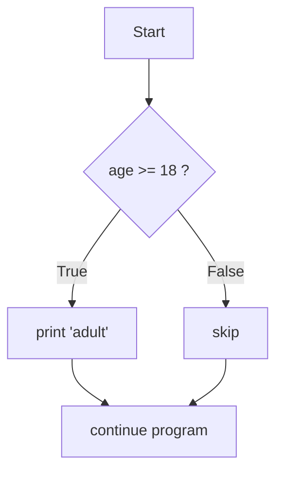

### 6.2 `if ... else`

`else` provides an alternative path when the condition is False.

```python
age = 15
if age >= 18:
    print("You can vote.")
else:
    print("You are too young to vote.")
# 🖥️ You are too young to vote.
```

### 6.3 `if ... elif ... else`

`elif` (short for "else if") lets you check **multiple** conditions in order. Python checks them top to bottom and runs the **first** one that's True, then skips the rest.

```python
marks = 82

if marks >= 90:
    grade = "A+"
elif marks >= 80:
    grade = "A"
elif marks >= 70:
    grade = "B"
elif marks >= 60:
    grade = "C"
else:
    grade = "Fail"

print(f"Your grade is {grade}")   # 🖥️ Your grade is A
```

Line-by-line logic:
- `marks` is 82. Python checks `>= 90`? No. Checks `>= 80`? **Yes** → `grade = "A"`, then it **stops checking**.
- Order matters! If you put `>= 60` first, an 82 would wrongly be graded "C".

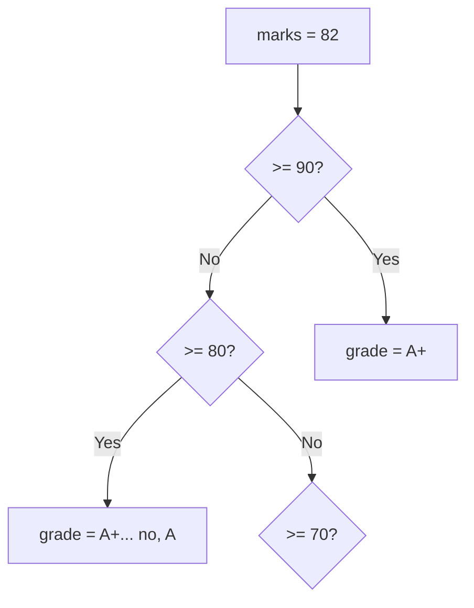

### 6.4 Nested conditions

You can put an `if` inside another `if` to check sub-conditions.

```python
age = 20
citizen = True

if age >= 18:
    if citizen:
        print("Eligible to vote.")    # 🖥️ Eligible to vote.
    else:
        print("Must be a citizen to vote.")
else:
    print("Too young to vote.")
```

> **Tip:** deep nesting gets hard to read. Often you can flatten it with `and`: `if age >= 18 and citizen:` does the same as the outer+inner check above.

### 6.5 The ternary (conditional) expression

A compact one-line `if/else` for simple value choices:

```python
age = 20
status = "adult" if age >= 18 else "minor"
print(status)   # 🖥️ adult
```

Read it as: *"status is 'adult' if age ≥ 18, else 'minor'."*

### 6.6 `match` / `case` — structural pattern matching (modern Python 3.10+)

The `match` statement is a clean way to compare one value against many possible options — similar to `switch` in other languages, but more powerful.

```python
command = "start"

match command:
    case "start":
        print("System starting...")   # 🖥️ System starting...
    case "stop":
        print("System stopping...")
    case "pause":
        print("System paused.")
    case _:                            # _ is the "default / anything else" case
        print("Unknown command")
```

- Each `case` is one possibility.
- `case _:` (underscore) is the catch-all default, like `else`.
- `match` is cleaner than a long `elif` chain when you're comparing *one variable* to many fixed values.

---
## 7. Loops & Iteration

Computers are brilliant at doing repetitive work without getting bored. A **loop** repeats a block of code multiple times. This is essential in AI, where we process thousands or millions of data points.

Python has two loop types:

| Loop | Use it when… |
|---|---|
| **`for` loop** | You know *what to loop over* (a list, a range, characters in a word). |
| **`while` loop** | You want to repeat *until a condition changes* (unknown number of times). |

### 7.1 The `for` loop

A `for` loop iterates over each item in a sequence, one at a time.

```python
fruits = ["apple", "banana", "mango"]
for fruit in fruits:
    print(fruit)
# 🖥️ apple
# 🖥️ banana
# 🖥️ mango
```

Anatomy:
- `for` keyword → a **loop variable** (`fruit`) → `in` → the sequence → colon `:`.
- Each pass ("iteration"), `fruit` takes the next value from the list.
- The indented block runs once per item.

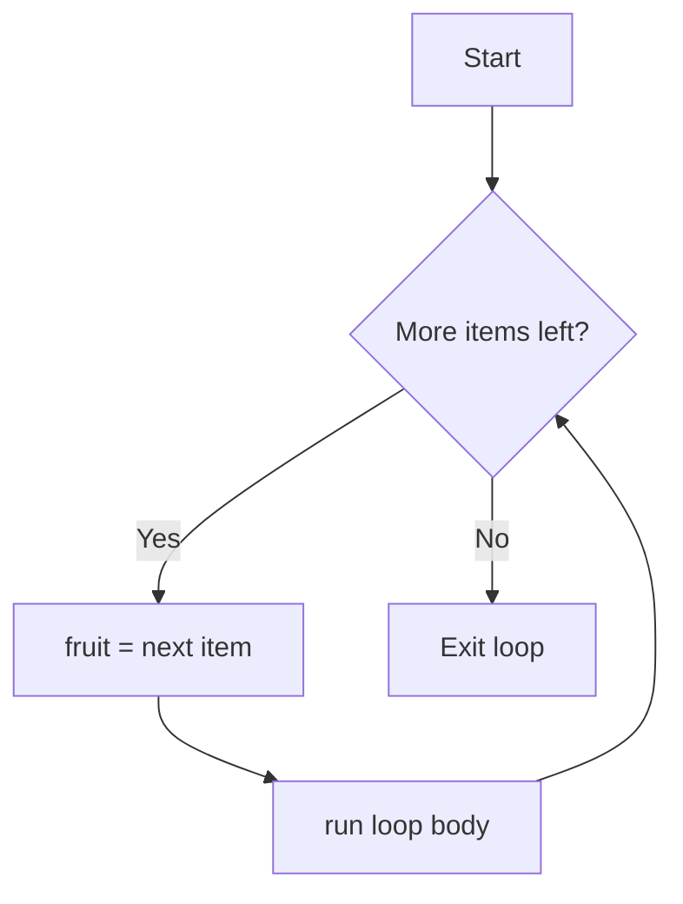

### 7.2 The `range()` function

`range()` generates a sequence of numbers — perfect for looping a fixed number of times.

```python
range(5)         # 0, 1, 2, 3, 4          (start=0, stop=5 excluded)
range(2, 6)      # 2, 3, 4, 5             (start=2, stop=6 excluded)
range(0, 10, 2)  # 0, 2, 4, 6, 8         (start, stop, step)
```

```python
for i in range(5):
    print(i)
# 🖥️ 0
# 🖥️ 1
# 🖥️ 2
# 🖥️ 3
# 🖥️ 4

# Print the 5-times table:
for i in range(1, 11):
    print(f"5 x {i} = {5 * i}")
# 🖥️ 5 x 1 = 5  ... up to ... 5 x 10 = 50
```

> **Why `range(5)` gives 0–4, not 1–5:** Python uses **zero-based, stop-excluded** ranges. It feels odd at first but it's consistent with string/list indexing (which also starts at 0). `range(5)` produces exactly 5 numbers: 0,1,2,3,4.

**Looping over a string** (a string is a sequence of characters):

```python
for letter in "AI":
    print(letter)
# 🖥️ A
# 🖥️ I
```

**`enumerate()`** — when you need both the index *and* the item:

```python
subjects = ["Math", "Physics", "AI"]
for index, subject in enumerate(subjects, start=1):
    print(f"{index}. {subject}")
# 🖥️ 1. Math
# 🖥️ 2. Physics
# 🖥️ 3. AI
```

### 7.3 The `while` loop

A `while` loop repeats *as long as* a condition stays `True`. Use it when you don't know in advance how many repetitions you need.

```python
count = 1
while count <= 5:
    print(count)
    count += 1     # ⚠️ MUST change the variable, or the loop never ends!
# 🖥️ 1 2 3 4 5 (each on its own line)
```

Line-by-line:
1. `count` starts at 1.
2. Check `count <= 5`? True → print, then `count += 1`.
3. Repeat until `count` becomes 6 → condition False → loop stops.

> ⚠️ **The infinite loop trap:** if you forget `count += 1`, the condition stays True forever and your program hangs. If this happens, press **Ctrl + C** in the terminal to stop it. *Every* `while` loop must have something inside that eventually makes the condition False.

### 7.4 `break` and `continue`

These give you fine control inside loops:

- **`break`** — immediately *exits* the entire loop.
- **`continue`** — *skips* the rest of the current iteration and jumps to the next one.

```python
# break: stop as soon as we find 3
for i in range(1, 10):
    if i == 3:
        break
    print(i)
# 🖥️ 1 2   (loop stops before printing 3)

# continue: skip even numbers
for i in range(1, 6):
    if i % 2 == 0:
        continue      # skip the print for even numbers
    print(i)
# 🖥️ 1 3 5   (evens 2 and 4 were skipped)
```

### 7.5 The loop `else` clause (Python-specific)

A loop can have an `else` block that runs **only if the loop finished normally** (i.e. was *not* stopped by `break`). Useful for search logic:

```python
numbers = [1, 3, 5, 7]
for n in numbers:
    if n % 2 == 0:
        print("Found an even number!")
        break
else:
    print("No even numbers found.")   # 🖥️ No even numbers found.
```

### 7.6 Nested loops

A loop inside a loop. The inner loop runs *completely* for **each** pass of the outer loop.

```python
for i in range(1, 4):          # outer loop: 1, 2, 3
    for j in range(1, 4):      # inner loop runs fully each time
        print(f"{i}-{j}", end=" ")
    print()                    # newline after each inner loop finishes
# 🖥️ 1-1 1-2 1-3
# 🖥️ 2-1 2-2 2-3
# 🖥️ 3-1 3-2 3-3
```

Nested loops are common for working with grids, tables, and 2D data (like images in Computer Vision — Module 5).

### 7.7 Comprehensions (the Pythonic power tool)

A **list comprehension** builds a list in a single, readable line. This is extremely common in real Python and AI data code.

```python
# Traditional way — 3 lines:
squares = []
for x in range(1, 6):
    squares.append(x ** 2)
# squares → [1, 4, 9, 16, 25]

# List comprehension — 1 line, same result:
squares = [x ** 2 for x in range(1, 6)]
print(squares)   # 🖥️ [1, 4, 9, 16, 25]

# With a condition (only even numbers):
evens = [x for x in range(1, 11) if x % 2 == 0]
print(evens)     # 🖥️ [2, 4, 6, 8, 10]
```

Read `[x ** 2 for x in range(1, 6)]` as: *"give me x-squared, for each x in 1 to 5."* You'll also see **dict comprehensions** `{k: v for ...}` and **set comprehensions** `{x for ...}`.

---

## 8. Functions

### 8.1 Why functions?

Imagine writing the same 10 lines of code to calculate a student's average — in 20 different places. If the formula changes, you'd fix it 20 times. **Functions** solve this: you write reusable code *once*, give it a name, and *call* it whenever needed. This is the **DRY principle — Don't Repeat Yourself.**

Benefits: reusability, readability, easier testing, and breaking big problems into small pieces (*decomposition* — a core engineering skill).

### 8.2 Defining and calling a function

```python
def greet():                 # 'def' defines a function named 'greet'
    print("Hello, student!") # the function body (indented)

greet()   # this "calls" (runs) the function
# 🖥️ Hello, student!
greet()   # you can call it as many times as you like
# 🖥️ Hello, student!
```

- `def` = keyword to **def**ine a function.
- `greet` = the function's name (use `snake_case`).
- `()` = parentheses hold **parameters** (inputs) — empty here.
- `:` and the indented block = the function body.
- Nothing runs until you **call** it with `greet()`.

### 8.3 Parameters and arguments

**Parameters** are the named inputs in the definition. **Arguments** are the actual values you pass when calling.

```python
def greet(name):             # 'name' is a PARAMETER
    print(f"Hello, {name}!")

greet("Aarav")               # "Aarav" is an ARGUMENT
# 🖥️ Hello, Aarav!
greet("Ayesha")
# 🖥️ Hello, Ayesha!
```

**Multiple parameters:**

```python
def add(a, b):
    print(a + b)

add(5, 3)     # 🖥️ 8   (a=5, b=3 — matched by position)
```

### 8.4 The `return` statement

`print()` *shows* a value; `return` *gives a value back* to the caller so you can store and reuse it. This distinction is critical.

```python
def add(a, b):
    return a + b        # sends the result back

result = add(5, 3)      # capture the returned value
print(result)           # 🖥️ 8
print(add(10, 20) * 2)  # 🖥️ 60  (use the returned value directly in an expression)
```

> **`print` vs `return` — the most important beginner distinction:**
> - A function that `print`s but doesn't `return` gives back `None`. You *see* output but can't reuse it.
> - A function that `return`s hands you a value you can store, do math on, or pass to another function.
> - Real AI functions almost always `return` (e.g. a model returns a prediction, which you then use).

### 8.5 Default parameter values

You can give a parameter a default, used when the caller doesn't supply that argument.

```python
def greet(name, greeting="Hello"):    # greeting defaults to "Hello"
    print(f"{greeting}, {name}!")

greet("Aarav")                 # 🖥️ Hello, Aarav!        (used the default)
greet("Aarav", "Good morning") # 🖥️ Good morning, Aarav! (overrode the default)
```

> ⚠️ Parameters *with* defaults must come *after* parameters without defaults in the definition.

### 8.6 Keyword arguments

You can pass arguments by name, in any order — this makes calls self-documenting.

```python
def describe(name, age, city):
    print(f"{name}, {age}, from {city}")

describe(age=20, city="Chennai", name="Aarav")   # order doesn't matter with names
# 🖥️ Aarav, 20, from Chennai
```

### 8.7 `*args` and `**kwargs` — flexible arguments

Sometimes you don't know how many arguments will be passed.

- `*args` collects extra **positional** arguments into a **tuple**.
- `**kwargs` collects extra **keyword** arguments into a **dictionary**.

```python
def total(*numbers):          # accepts any number of values
    return sum(numbers)

print(total(1, 2, 3))         # 🖥️ 6
print(total(10, 20, 30, 40))  # 🖥️ 100

def profile(**info):          # accepts any number of named values
    for key, value in info.items():
        print(f"{key}: {value}")

profile(name="Aarav", age=20, role="Student")
# 🖥️ name: Aarav
# 🖥️ age: 20
# 🖥️ role: Student
```

### 8.8 Variable scope — local vs global

**Scope** defines where a variable can be seen.
- A **local** variable is created inside a function and exists only there.
- A **global** variable is defined outside all functions and visible everywhere.

```python
x = 10          # global

def show():
    y = 5       # local — only exists inside show()
    print(x)    # can READ the global x → 🖥️ 10
    print(y)    # 🖥️ 5

show()
print(y)        # ❌ ERROR: 'y' is not defined outside the function
```

> **Rule of thumb:** keep variables local; pass data in through parameters and out through `return`. Overusing global variables leads to bugs that are hard to trace.

### 8.9 Docstrings & type hints (professional functions)

A **docstring** is a triple-quoted string right under `def` that documents the function. Combined with type hints, this is what professional 2026 code looks like:

```python
def calculate_average(marks: list[int]) -> float:
    """
    Calculate the average of a list of marks.

    Args:
        marks: A list of integer marks.
    Returns:
        The average as a float.
    """
    return sum(marks) / len(marks)

print(calculate_average([80, 90, 100]))   # 🖥️ 90.0
help(calculate_average)                    # shows the docstring
```

`list[int] -> float` tells the reader (and AI assistants) exactly what goes in and comes out.

### 8.10 Lambda (anonymous) functions

A **lambda** is a tiny, one-line, unnamed function. Useful for short throwaway operations, especially with data tools you'll meet in later modules.

```python
square = lambda x: x ** 2
print(square(5))         # 🖥️ 25

# Common real use — sorting by a custom key:
students = [("Aarav", 85), ("Ayesha", 92), ("Rahul", 78)]
students.sort(key=lambda pair: pair[1], reverse=True)  # sort by score, high→low
print(students)
# 🖥️ [('Ayesha', 92), ('Aarav', 85), ('Rahul', 78)]
```

Think of `lambda x: x ** 2` as a shorthand for a `def` that just returns one expression.

---
## 9. Collections — List, Tuple, Set, Dictionary

So far each variable held **one** value. **Collections** (also called *data structures*) let one variable hold **many** values. Choosing the right collection is a real engineering skill — and it's the bridge to Data Science (Module 3), where you'll organize thousands of records.

Python has four built-in collections. Here is the master comparison table — **study it carefully**, then we'll go through each:

| Feature | **List** | **Tuple** | **Set** | **Dictionary** |
|---|---|---|---|---|
| Syntax | `[ ]` | `( )` | `{ }` | `{key: value}` |
| Ordered? | ✅ Yes | ✅ Yes | ❌ No | ✅ Yes (since 3.7) |
| Changeable (mutable)? | ✅ Yes | ❌ No | ✅ Yes | ✅ Yes |
| Allows duplicates? | ✅ Yes | ✅ Yes | ❌ No | Keys: ❌ / Values: ✅ |
| Indexed by | Position (0,1,2…) | Position | *Not indexable* | Key |
| Example | `[1, 2, 3]` | `(1, 2, 3)` | `{1, 2, 3}` | `{"a": 1}` |
| Best for | A changing ordered collection | Fixed data that shouldn't change | Unique items, fast membership tests | Labelled key→value data |

### 9.1 Lists — ordered, changeable collections

A **list** is the workhorse collection: an ordered, changeable sequence of items. Items can be of any type, even mixed.

```python
fruits = ["apple", "banana", "mango"]
numbers = [10, 20, 30, 40]
mixed = ["Aarav", 20, True, 3.14]     # mixing types is allowed
empty = []                             # an empty list
```

**Accessing items** (same indexing/slicing rules as strings):

```python
fruits = ["apple", "banana", "mango"]
print(fruits[0])     # 🖥️ apple   (first)
print(fruits[-1])    # 🖥️ mango   (last)
print(fruits[0:2])   # 🖥️ ['apple', 'banana']   (slice)
```

**Changing items** (lists are *mutable* = changeable):

```python
fruits[1] = "orange"
print(fruits)        # 🖥️ ['apple', 'orange', 'mango']
```

**Essential list methods:**

| Method | What it does | Example (start `[1,2,3]`) | Result |
|---|---|---|---|
| `.append(x)` | Add x to the end | `nums.append(4)` | `[1,2,3,4]` |
| `.insert(i,x)` | Insert x at index i | `nums.insert(0,9)` | `[9,1,2,3]` |
| `.remove(x)` | Remove first x | `nums.remove(2)` | `[1,3]` |
| `.pop(i)` | Remove & return item at i (last if no i) | `nums.pop()` | returns `3`, list `[1,2]` |
| `.sort()` | Sort in place | `nums.sort()` | ascending |
| `.reverse()` | Reverse in place | `nums.reverse()` | `[3,2,1]` |
| `len(list)` | Count items (built-in) | `len(nums)` | `3` |
| `.count(x)` | How many times x appears | `[1,1,2].count(1)` | `2` |

```python
tasks = ["email", "code"]
tasks.append("test")        # add to end
tasks.insert(0, "plan")     # add to front
print(tasks)                # 🖥️ ['plan', 'email', 'code', 'test']
tasks.remove("email")
print(tasks)                # 🖥️ ['plan', 'code', 'test']
print(len(tasks))           # 🖥️ 3
```

**Looping through a list** (extremely common):

```python
scores = [85, 92, 78, 90]
total = 0
for score in scores:
    total += score
print(f"Average: {total / len(scores)}")   # 🖥️ Average: 86.25
```

### 9.2 Tuples — ordered, unchangeable collections

A **tuple** is like a list but **immutable** — once created, it cannot be changed. Use tuples for data that should stay constant: coordinates, RGB colors, database records, fixed configuration.

```python
point = (10, 20)          # an (x, y) coordinate
rgb = (255, 128, 0)       # a color
print(point[0])           # 🖥️ 10   (indexing works like lists)

point[0] = 5              # ❌ ERROR: tuples cannot be changed
```

**Why use a tuple instead of a list?**
- **Safety:** it can't be accidentally modified.
- **Speed:** tuples are slightly faster than lists.
- **Usable as dictionary keys:** lists can't be dict keys, but tuples can.

**Tuple unpacking** (a very handy feature):

```python
person = ("Aarav", 20, "AI")
name, age, field = person       # unpack all three at once
print(name)                     # 🖥️ Aarav
print(age)                      # 🖥️ 20
```

### 9.3 Sets — unordered collections of unique items

A **set** stores **unique** items only — duplicates are automatically removed. Sets are unordered (no indexing) and are extremely fast at checking "is this item present?".

```python
numbers = {1, 2, 3, 3, 2, 1}
print(numbers)         # 🖥️ {1, 2, 3}   (duplicates gone automatically)

# Real use — remove duplicates from a list:
emails = ["a@x.com", "b@x.com", "a@x.com"]
unique = set(emails)
print(unique)          # 🖥️ {'a@x.com', 'b@x.com'}
```

**Set operations** (straight from mathematics — useful in data analysis):

| Operation | Operator | Meaning |
|---|---|---|
| Union | `a \| b` | all items in either set |
| Intersection | `a & b` | items in **both** sets |
| Difference | `a - b` | items in a but not b |

```python
a = {1, 2, 3, 4}
b = {3, 4, 5, 6}
print(a | b)   # 🖥️ {1, 2, 3, 4, 5, 6}  (union)
print(a & b)   # 🖥️ {3, 4}              (intersection)
print(a - b)   # 🖥️ {1, 2}              (difference)
```

### 9.4 Dictionaries — key-value pairs (the most important for AI)

A **dictionary** stores data as **key → value** pairs, like a real dictionary maps a word (key) to its meaning (value). This is arguably the most important collection for AI and data work — JSON data, model configs, word counts, and API responses are all dictionaries.

```python
student = {
    "name": "Aarav",
    "age": 20,
    "course": "AI",
    "marks": [85, 92, 78]
}
```

**Accessing values by key:**

```python
print(student["name"])          # 🖥️ Aarav
print(student.get("age"))       # 🖥️ 20
print(student.get("phone", "N/A"))  # 🖥️ N/A  (.get gives a default if key is missing — safer)
```

> **`[key]` vs `.get(key)`:** `student["phone"]` **crashes** if "phone" doesn't exist; `student.get("phone", "N/A")` returns a safe default instead. Use `.get()` when a key might be missing.

**Adding / updating / removing:**

```python
student["email"] = "aarav@mail.com"   # add a new key
student["age"] = 21                   # update an existing key
del student["course"]                 # remove a key
print(student)
# 🖥️ {'name': 'Aarav', 'age': 21, 'marks': [85, 92, 78], 'email': 'aarav@mail.com'}
```

**Looping through a dictionary:**

```python
student = {"name": "Aarav", "age": 20, "course": "AI"}

for key in student:                       # loop over keys
    print(key, "->", student[key])

for key, value in student.items():        # loop over key AND value (preferred)
    print(f"{key}: {value}")
# 🖥️ name: Aarav
# 🖥️ age: 20
# 🖥️ course: AI
```

**Key dictionary methods:**

| Method | Returns |
|---|---|
| `.keys()` | all keys |
| `.values()` | all values |
| `.items()` | all (key, value) pairs |
| `.get(k, default)` | value for k, or default if missing |
| `.update(other)` | merge another dict in |
| `.pop(k)` | remove key k and return its value |

### 9.5 Which collection should I use? (decision guide)

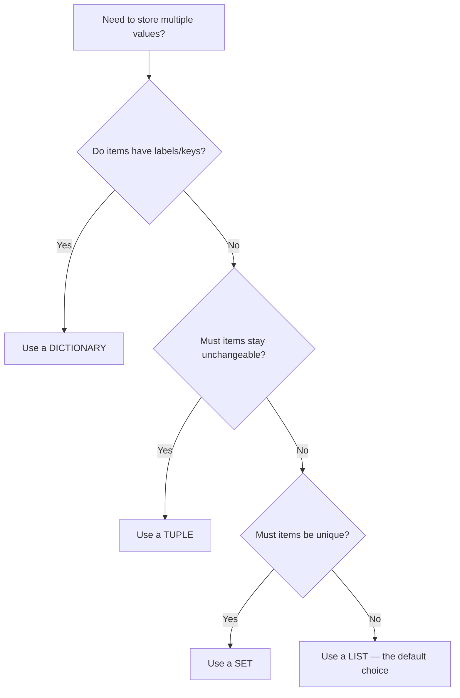

**Quick heuristic:**
- Just a bunch of ordered things → **List**.
- Fixed, never-changing group → **Tuple**.
- Need uniqueness / fast "is it in here?" → **Set**.
- Labelled data (name→value) → **Dictionary**.

---
## 10. File Handling

Until now, all your data disappeared when the program ended (it lived only in RAM). **File handling** lets programs *save* data permanently to disk and *read* it back later. This is essential — AI systems constantly read datasets (CSV files, text, images) and write results.

### 10.1 The file-handling workflow

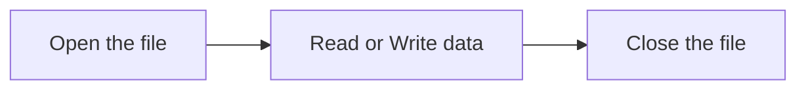

Every file operation follows: **open → operate → close.** Forgetting to close a file can corrupt data or lock the file, so Python gives us a safe shortcut (`with`, below).

### 10.2 File modes

When you open a file, you specify a **mode** telling Python what you intend to do:

| Mode | Name | Behavior |
|---|---|---|
| `"r"` | Read | Open for reading. **Error** if the file doesn't exist. (default) |
| `"w"` | Write | Open for writing. **Creates** the file, or **erases** existing content! |
| `"a"` | Append | Open for adding to the end. Creates the file if needed. |
| `"x"` | Exclusive create | Create a new file; **error** if it already exists. |
| `"r+"` | Read & write | Both, without erasing. |

> ⚠️ **Danger:** `"w"` mode **deletes everything** already in the file the moment you open it. Use `"a"` (append) when you want to *add* without destroying existing data.

### 10.3 Writing to a file — the modern `with` statement

The recommended way to handle files is the `with` statement (a "context manager"). It **automatically closes** the file for you, even if an error occurs — no manual `.close()` needed.

```python
with open("students.txt", "w") as file:   # open in write mode
    file.write("Aarav\n")                 # \n = newline
    file.write("Ayesha\n")
    file.write("Rahul\n")
# File is automatically closed here, when the 'with' block ends.
# 📄 students.txt now contains:
# Aarav
# Ayesha
# Rahul
```

Line-by-line:
- `open("students.txt", "w")` opens (or creates) the file for writing.
- `as file` gives the open file the temporary name `file`.
- `file.write(...)` writes text. **`write()` does not add newlines** — you add `\n` yourself.
- When the indented block finishes, Python closes the file automatically.

**Appending** (adding without erasing):

```python
with open("students.txt", "a") as file:
    file.write("Sneha\n")     # added to the END; existing names are kept
```

### 10.4 Reading from a file

There are three common ways to read:

```python
# Method 1: read the WHOLE file into one string
with open("students.txt", "r") as file:
    content = file.read()
print(content)
# 🖥️ Aarav
# 🖥️ Ayesha
# 🖥️ Rahul

# Method 2: read all lines into a LIST
with open("students.txt", "r") as file:
    lines = file.readlines()
print(lines)   # 🖥️ ['Aarav\n', 'Ayesha\n', 'Rahul\n']

# Method 3 (BEST): loop line by line — memory-efficient for huge files
with open("students.txt", "r") as file:
    for line in file:
        print(line.strip())    # .strip() removes the trailing \n
# 🖥️ Aarav
# 🖥️ Ayesha
# 🖥️ Rahul
```

> **Why Method 3 is preferred for AI:** datasets can be gigabytes. Reading line-by-line uses very little memory because it doesn't load the whole file at once.

### 10.5 Working with CSV files

**CSV** (Comma-Separated Values) is *the* most common data format in Data Science — it's basically a spreadsheet in plain text. Python has a built-in `csv` module.

```python
import csv

# Writing a CSV:
with open("marks.csv", "w", newline="") as file:
    writer = csv.writer(file)
    writer.writerow(["Name", "Subject", "Marks"])   # header row
    writer.writerow(["Aarav", "AI", 92])
    writer.writerow(["Ayesha", "AI", 88])

# Reading a CSV:
with open("marks.csv", "r") as file:
    reader = csv.reader(file)
    for row in reader:
        print(row)
# 🖥️ ['Name', 'Subject', 'Marks']
# 🖥️ ['Aarav', 'AI', '92']
# 🖥️ ['Ayesha', 'AI', '88']
```

> In Module 3 you'll upgrade to the **Pandas** library, which reads a CSV into a table with one line: `pd.read_csv("marks.csv")`. The built-in `csv` module teaches you what's happening underneath.

### 10.6 Working with JSON files

**JSON** (JavaScript Object Notation) is the standard format for structured data on the web and in AI APIs (ChatGPT, Claude, and Gemini all return JSON — Module 7). A JSON object looks *exactly* like a Python dictionary.

```python
import json

student = {"name": "Aarav", "age": 20, "skills": ["Python", "AI"]}

# Write a Python dict → JSON file:
with open("student.json", "w") as file:
    json.dump(student, file, indent=4)   # indent=4 makes it human-readable

# Read a JSON file → Python dict:
with open("student.json", "r") as file:
    data = json.load(file)
print(data["name"])       # 🖥️ Aarav
print(data["skills"])     # 🖥️ ['Python', 'AI']
```

| Function | Direction | Use |
|---|---|---|
| `json.dump(obj, file)` | Python → file | Save a dict/list to a `.json` file |
| `json.load(file)` | File → Python | Load a `.json` file into a dict/list |
| `json.dumps(obj)` | Python → string | Convert to a JSON *string* (for APIs) |
| `json.loads(string)` | String → Python | Parse a JSON *string* (from an API) |

---

## 11. Exception Handling

### 11.1 What is an exception?

An **exception** is an error that occurs *while the program is running* and, if unhandled, **crashes** the program. Consider:

```python
age = int(input("Enter age: "))   # user types "twenty" instead of 20
# 💥 ValueError: invalid literal for int() with base 10: 'twenty'
# The program crashes here and nothing after this line runs.
```

A crashing program is a terrible user experience. **Exception handling** lets us *catch* errors and respond gracefully instead of crashing. Robust AI applications (Module 9 deployment) *must* handle bad input, missing files, and network failures.

### 11.2 Common built-in exceptions

| Exception | When it happens | Example trigger |
|---|---|---|
| `ValueError` | Right type, wrong value | `int("hello")` |
| `TypeError` | Wrong type used | `"a" + 5` |
| `ZeroDivisionError` | Division by zero | `10 / 0` |
| `IndexError` | List index out of range | `[1,2][5]` |
| `KeyError` | Dict key doesn't exist | `d["missing"]` |
| `FileNotFoundError` | File doesn't exist | `open("nope.txt")` |
| `NameError` | Using an undefined variable | `print(xyz)` |

### 11.3 The `try` / `except` block

Wrap risky code in `try`. If an exception occurs, Python jumps to the matching `except` block instead of crashing.

```python
try:
    age = int(input("Enter your age: "))
    print(f"Next year you'll be {age + 1}")
except ValueError:
    print("That's not a valid number! Please enter digits.")
# 🖥️ Enter your age: twenty
# 🖥️ That's not a valid number! Please enter digits.
# ✅ The program continues instead of crashing.
```

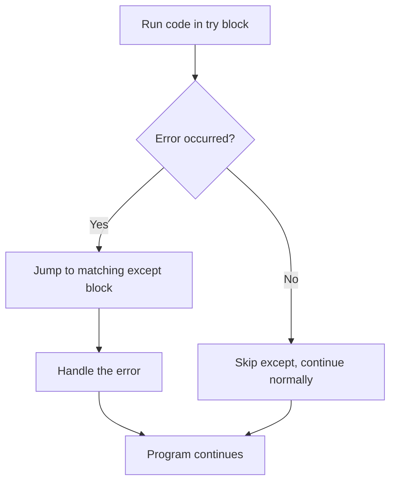

### 11.4 Handling multiple exceptions

Different errors can be handled differently:

```python
try:
    numbers = [10, 20, 30]
    index = int(input("Enter an index (0-2): "))
    print(100 / numbers[index])
except ValueError:
    print("Please enter a whole number.")
except IndexError:
    print("That index is out of range.")
except ZeroDivisionError:
    print("Cannot divide by zero.")
except Exception as e:                     # catch-all safety net
    print(f"Unexpected error: {e}")
```

- Each `except` handles one error type.
- `except Exception as e` catches *anything else*; `e` holds the error details.
- Put specific exceptions **before** the general `Exception` catch-all.

### 11.5 `else` and `finally`

```python
try:
    file = open("data.txt", "r")
except FileNotFoundError:
    print("File not found!")
else:
    print("File opened successfully!")   # runs ONLY if no exception occurred
    file.close()
finally:
    print("This ALWAYS runs - cleanup goes here.")  # runs no matter what
```

| Clause | Runs when… |
|---|---|
| `try` | always — contains the risky code |
| `except` | only if a matching error occurs |
| `else` | only if **no** error occurred |
| `finally` | **always**, error or not — perfect for cleanup (closing files, connections) |

### 11.6 Raising your own exceptions

You can deliberately trigger an exception with `raise` to enforce rules — for example, rejecting invalid data:

```python
def set_age(age):
    if age < 0:
        raise ValueError("Age cannot be negative!")
    return age

try:
    set_age(-5)
except ValueError as e:
    print(f"Error: {e}")     # 🖥️ Error: Age cannot be negative!
```

### 11.7 Why this matters for AI

Every real AI application deals with unpredictable input: a user uploads a corrupt image, an API times out, a dataset has a missing value. Exception handling is what separates a fragile demo from a **production-ready** application. You'll rely on it heavily in Modules 9 (Deployment) and 10 (Capstone).

---
## 12. Hands-on Project 1 — Number Guessing Game

Now we combine *everything*: variables, loops, conditions, operators, functions, and exception handling into a complete, playable game.

> ### 📦 About the three projects (read this first)
>
> The **complete, tested, ready-to-run** versions of all three projects live in the
> `Hands-on Projects/Module 1 Hands-on Projects/` folder — each in its own subfolder
> with a `README.md`. The code below teaches you how to build them step by step.
>
> **⚠️ Important — why the project files avoid emoji in `print()`:**
> On Windows, the default console uses an encoding called *cp1252* that **cannot display
> emoji**. If you `print("🎉 Correct!")` there, Python may crash with a
> `UnicodeEncodeError`. To keep the programs running on **every** computer, the files in
> the project folder use plain ASCII markers instead — e.g. `[OK]`, `[!]`, `Too low!`.
> This is a real, professional habit: production tools keep their console output plain.
>
> If you *do* want emoji, either run in a modern UTF-8 terminal (Windows Terminal / VS Code)
> **or** add this one line at the very top of your program:
> ```python
> import sys
> sys.stdout.reconfigure(encoding="utf-8")   # lets Python print emoji safely
> ```
> The examples below use plain ASCII so they match the tested project files exactly.

### 12.1 What we're building

The computer secretly picks a random number between 1 and 100. The player keeps guessing. After each guess the program hints "too high" or "too low", and counts attempts. When the player guesses correctly, it congratulates them and shows how many tries it took.

**Concepts used:** `random` module, `while` loop, `if/elif/else`, `input()`, type conversion, `try/except`, `break`, f-strings, counters.

### 12.2 Step-by-step build

**Step 1 — Import randomness and set up the secret number.**

```python
import random   # a built-in module for generating random numbers

secret_number = random.randint(1, 100)  # a random integer from 1 to 100 (both included)
attempts = 0                            # a counter for the number of guesses
```

- `import random` loads Python's built-in random-number toolkit.
- `random.randint(1, 100)` returns a random whole number in `[1, 100]`.
- `attempts` starts at 0 and will increase by 1 per guess.

**Step 2 — The main game loop.**

```python
print("Welcome to the Number Guessing Game!")
print("I'm thinking of a number between 1 and 100.")

while True:                     # loop forever until we 'break' on a correct guess
    try:
        guess = int(input("\nEnter your guess: "))   # read & convert input
    except ValueError:
        print("[!] Please enter a valid whole number.")
        continue                # skip the rest and ask again

    attempts += 1               # count this attempt

    if guess < secret_number:
        print("Too low!  Try a higher number.")
    elif guess > secret_number:
        print("Too high! Try a lower number.")
    else:
        print(f"Correct! You guessed it in {attempts} attempts.")
        break                   # exit the loop — game over
```

Line-by-line reasoning:
- `while True:` creates an intentional infinite loop; we control exit with `break`.
- `try/except ValueError` protects against non-numeric input (e.g. "abc") so the game never crashes.
- `continue` restarts the loop without counting a failed non-numeric entry.
- The `if/elif/else` compares the guess and gives a directional hint.
- On a correct guess, we print the score and `break` out.

### 12.3 The complete program

```python
import random

def play_game():
    """Run one round of the Number Guessing Game."""
    secret_number = random.randint(1, 100)
    attempts = 0

    print("Welcome to the Number Guessing Game!")
    print("I'm thinking of a number between 1 and 100.\n")

    while True:
        try:
            guess = int(input("Enter your guess: "))
        except ValueError:
            print("[!] Please enter a valid whole number.\n")
            continue

        if guess < 1 or guess > 100:
            print("[!] Out of range! Guess between 1 and 100.\n")
            continue

        attempts += 1

        if guess < secret_number:
            print("Too low!  Try higher.\n")
        elif guess > secret_number:
            print("Too high! Try lower.\n")
        else:
            print(f"\nCorrect! The number was {secret_number}.")
            print(f"You guessed it in {attempts} attempts.")
            break

# Allow the player to play again:
while True:
    play_game()
    again = input("\nPlay again? (yes/no): ").lower()
    if again != "yes":
        print("Thanks for playing!")
        break
```

> 💡 The version in the project folder adds a couple of extra touches you can study:
> a **best-score tracker** across rounds and a graceful `Ctrl+C` exit. See
> `Hands-on Projects/Module 1 Hands-on Projects/Project 1 - Number Guessing Game/`.

### 12.4 Sample run

```
Welcome to the Number Guessing Game!
I'm thinking of a number between 1 and 100.

Enter your guess: 50
Too low!  Try higher.

Enter your guess: 75
Too high! Try lower.

Enter your guess: 62

Correct! The number was 62.
You guessed it in 3 attempts.

Play again? (yes/no): no
Thanks for playing!
```

### 12.5 Challenge extensions (for fast learners)

1. Limit the player to 7 guesses (add an attempts cap → tie to the `while`).
2. Add difficulty levels (Easy 1–50, Hard 1–500) using a `match` statement.
3. Track the *best* (lowest) score across rounds using a variable outside `play_game()`.

> **The math insight:** with a smart "always guess the middle" strategy (**binary search**), any number 1–100 can be found in **at most 7 guesses**. This halving idea is foundational to algorithms and even to how decision trees work in Machine Learning (Module 4)!

---

## 13. Hands-on Project 2 — Student Management System

A classic mini-application that ties together **dictionaries, lists, functions, loops, file handling, and exception handling** — the exact skills you'll reuse to manage AI datasets.

### 13.1 What we're building

A menu-driven console app that lets a teacher **Add**, **View**, **Search**, **Update**, and **Delete** student records, and **saves everything to a JSON file** so data survives between runs.

**Data design:** each student is a **dictionary**; all students live in a **list**.

```python
students = [
    {"roll": 1, "name": "Aarav",  "marks": 92},
    {"roll": 2, "name": "Ayesha", "marks": 88},
]
```

### 13.2 Architecture

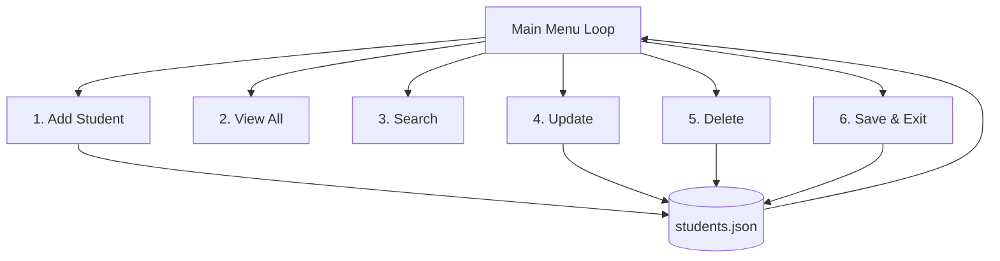

### 13.3 Building the functions (decomposition in action)

We split the program into small functions, each doing one job — the professional way to build software.

```python
import json

FILE = "students.json"

def load_students():
    """Load students from the JSON file, or start empty if none exists."""
    try:
        with open(FILE, "r") as f:
            return json.load(f)
    except FileNotFoundError:
        return []          # first run — no file yet, so start with an empty list

def save_students(students):
    """Save the current list of students to the JSON file."""
    with open(FILE, "w") as f:
        json.dump(students, f, indent=4)
    print("[saved] Data saved.")

def add_student(students):
    """Add a new student record."""
    try:
        roll = int(input("Roll number: "))
        name = input("Name: ").strip()
        marks = float(input("Marks: "))
    except ValueError:
        print("[!] Invalid input. Roll and marks must be numbers.")
        return
    students.append({"roll": roll, "name": name, "marks": marks})
    print(f"[OK] Added {name}.")

def view_students(students):
    """Display all students in a neat table."""
    if not students:                     # empty list is falsy
        print("No students yet.")
        return
    print("\nRoll  | Name            | Marks")
    print("-" * 35)
    for s in students:
        print(f"{s['roll']:<5} | {s['name']:<15} | {s['marks']}")

def search_student(students):
    """Find a student by roll number."""
    try:
        roll = int(input("Enter roll number to search: "))
    except ValueError:
        print("[!] Roll must be a number.")
        return
    for s in students:
        if s["roll"] == roll:
            print(f"Found -> Name: {s['name']}, Marks: {s['marks']}")
            return
    print("[X] Student not found.")

def update_student(students):
    """Update a student's marks."""
    try:
        roll = int(input("Enter roll number to update: "))
    except ValueError:
        print("[!] Roll must be a number.")
        return
    for s in students:
        if s["roll"] == roll:
            s["marks"] = float(input("New marks: "))
            print("[OK] Updated.")
            return
    print("[X] Student not found.")

def delete_student(students):
    """Delete a student by roll number."""
    try:
        roll = int(input("Enter roll number to delete: "))
    except ValueError:
        print("[!] Roll must be a number.")
        return
    for s in students:
        if s["roll"] == roll:
            students.remove(s)
            print("[OK] Deleted.")
            return
    print("[X] Student not found.")
```

### 13.4 The main menu loop

```python
def main():
    students = load_students()      # load saved data at startup

    menu = """
====== STUDENT MANAGEMENT SYSTEM ======
1. Add Student
2. View All Students
3. Search Student
4. Update Marks
5. Delete Student
6. Save & Exit
=======================================
"""
    while True:
        print(menu)
        choice = input("Choose an option (1-6): ").strip()

        match choice:                          # modern pattern matching
            case "1": add_student(students)
            case "2": view_students(students)
            case "3": search_student(students)
            case "4": update_student(students)
            case "5": delete_student(students)
            case "6":
                save_students(students)
                print("Goodbye!")
                break
            case _:
                print("[!] Invalid choice. Pick 1-6.")

# Standard Python entry point:
if __name__ == "__main__":
    main()
```

> **What is `if __name__ == "__main__":`?** It's a standard guard that means "only run `main()` if this file is run directly, not when it's imported by another file." You'll see it in almost every professional Python program — start using it now.

### 13.5 Sample interaction

```
====== STUDENT MANAGEMENT SYSTEM ======
1. Add Student ... 6. Save & Exit
=======================================
Choose an option (1-6): 1
Roll number: 1
Name: Aarav
Marks: 92
[OK] Added Aarav.

Choose an option (1-6): 2
Roll  | Name            | Marks
-----------------------------------
1     | Aarav           | 92.0

Choose an option (1-6): 6
[saved] Data saved.
Goodbye!
```

> The complete, tested version in the project folder adds input validation
> helpers, duplicate-roll checks, an aligned table, and a clean `Ctrl+C` exit.
> See `Hands-on Projects/Module 1 Hands-on Projects/Project 2 - Student Management System/`.

### 13.6 What this project teaches for AI

This is essentially a **CRUD** application (Create, Read, Update, Delete) — the backbone of *every* data-driven system, including the databases behind AI apps. The pattern "load data → manipulate in memory → save back" is exactly what you'll do with datasets and model results throughout the rest of the program.

---

## 14. Hands-on Project 3 — File Processing

This project focuses on the real-world skill of **reading a data file, processing/analyzing it, and writing a report** — a daily task in Data Science and AI.

### 14.1 What we're building

A program that reads a file of student marks (CSV), computes statistics (total, average, highest, lowest, pass/fail count), and writes a clean **report** to a new file — plus a simple text-based bar chart of grades.

### 14.2 Step 1 — Create sample data

```python
import csv

# Create a sample marks.csv to work with:
data = [
    ["Name", "Marks"],
    ["Aarav", 92], ["Ayesha", 88], ["Rahul", 47],
    ["Sneha", 76], ["Arjun", 34], ["Priya", 90],
]
with open("marks.csv", "w", newline="") as f:
    csv.writer(f).writerows(data)   # writerows writes ALL rows at once
print("Sample marks.csv created.")
```

### 14.3 Step 2 — Read and process the data

```python
def read_marks(filename):
    """Read a CSV of (Name, Marks) → return a list of (name, marks) tuples."""
    records = []
    try:
        with open(filename, "r") as f:
            reader = csv.reader(f)
            next(reader)                     # skip the header row
            for row in reader:
                name = row[0]
                marks = int(row[1])
                records.append((name, marks))
    except FileNotFoundError:
        print(f"[X] File '{filename}' not found.")
    return records
```

Line-by-line:
- `next(reader)` reads and discards the first row (the header "Name, Marks").
- Each remaining `row` is a list like `['Aarav', '92']`; we convert marks to `int`.
- We store `(name, marks)` tuples in a list. Wrapped in `try/except` in case the file is missing.

### 14.4 Step 3 — Compute statistics

```python
def analyze(records):
    """Compute statistics from the records."""
    if not records:
        return None

    marks_list = [marks for name, marks in records]   # list comprehension
    stats = {
        "count": len(marks_list),
        "total": sum(marks_list),
        "average": round(sum(marks_list) / len(marks_list), 2),
        "highest": max(marks_list),
        "lowest": min(marks_list),
        "passed": len([m for m in marks_list if m >= 40]),
        "failed": len([m for m in marks_list if m < 40]),
    }
    return stats
```

Here we use built-in functions `sum()`, `len()`, `max()`, `min()` and two list comprehensions to count passes and fails (pass mark = 40). Everything is packed into a **dictionary** for tidy return.

### 14.5 Step 4 — Write a report file

```python
def write_report(records, stats, filename="report.txt"):
    """Write a formatted analysis report to a text file."""
    with open(filename, "w") as f:
        f.write("=" * 40 + "\n")
        f.write("       STUDENT MARKS REPORT\n")
        f.write("=" * 40 + "\n\n")

        # A simple text bar chart — one * per 10 marks:
        f.write("Marks Chart (each * = 10 marks):\n")
        for name, marks in records:
            bar = "*" * (marks // 10)
            f.write(f"{name:<10} | {bar} {marks}\n")

        f.write("\n" + "-" * 40 + "\n")
        f.write("SUMMARY STATISTICS\n")
        f.write("-" * 40 + "\n")
        for key, value in stats.items():
            f.write(f"{key.capitalize():<10}: {value}\n")

    print(f"[OK] Report written to '{filename}'.")
```

### 14.6 Step 5 — Tie it all together

```python
def main():
    records = read_marks("marks.csv")
    if not records:
        return
    stats = analyze(records)
    write_report(records, stats)

    # Also print a quick summary to the screen:
    print(f"\nProcessed {stats['count']} students.")
    print(f"Average: {stats['average']} | Highest: {stats['highest']} | Lowest: {stats['lowest']}")
    print(f"Passed: {stats['passed']} | Failed: {stats['failed']}")

if __name__ == "__main__":
    main()
```

### 14.7 Sample output

**On screen:**
```
Processed 6 students.
Average: 71.17 | Highest: 92 | Lowest: 34
Passed: 5 | Failed: 1
```

**Inside `report.txt`:**
```
========================================
       STUDENT MARKS REPORT
========================================

Marks Chart (each * = 10 marks):
Aarav      | ********* 92
Ayesha     | ******** 88
Rahul      | **** 47
Sneha      | ******* 76
Arjun      | *** 34
Priya      | ********* 90

----------------------------------------
SUMMARY STATISTICS
----------------------------------------
Count     : 6
Total     : 427
Average   : 71.17
Highest   : 92
Lowest    : 34
Passed    : 5
Failed    : 1
```

### 14.8 Why this is the perfect bridge to Data Science

This project is **exactly what Module 3 (Data Analysis) does** — just done manually. In Module 3 you'll replace this hand-written code with **Pandas** (`df.describe()` computes all these stats in one line) and **Matplotlib** (real bar charts instead of `*`). Doing it by hand first means you'll deeply understand what those powerful libraries do for you.

> The complete, tested version of this pipeline (which also auto-creates the sample
> CSV only when missing) is in
> `Hands-on Projects/Module 1 Hands-on Projects/Project 3 - File Processing/`.

---
## 15. Best Practices, PEP 8 & Common Mistakes

### 15.1 PEP 8 — the official Python style guide

**PEP 8** is Python's official style guide. Following it makes your code look professional and readable to any Python developer (and to AI assistants). Key rules:

| Rule | Bad | Good |
|---|---|---|
| 4 spaces per indent | 2 spaces / tabs | 4 spaces |
| `snake_case` for variables/functions | `studentName` | `student_name` |
| `UPPER_CASE` for constants | `pi = 3.14` | `PI = 3.14` |
| Spaces around operators | `x=5+3` | `x = 5 + 3` |
| Blank lines between functions | crammed together | 2 blank lines between top-level functions |
| Meaningful names | `def f(a, b):` | `def add(width, height):` |
| Line length ≤ ~79–99 chars | one giant line | wrap long lines |

> **Modern tooling (2026):** Professionals use auto-formatters so they never think about style manually. Install **Ruff** (`pip install ruff`) — the fast, modern all-in-one linter+formatter that has become the industry standard. Run `ruff format .` and it fixes your style automatically. VS Code can do this on every save.

### 15.2 Top 10 beginner mistakes (and fixes)

| # | Mistake | Symptom | Fix |
|---|---|---|---|
| 1 | Using `=` instead of `==` in a condition | SyntaxError or wrong logic | `if x == 5:` not `if x = 5:` |
| 2 | Forgetting `int()` on `input()` | String math bugs / TypeError | `age = int(input())` |
| 3 | Wrong/mixed indentation | `IndentationError` | Use 4 spaces consistently |
| 4 | Off-by-one in `range()` | Loop runs one too few/many | Remember `stop` is excluded |
| 5 | Infinite `while` loop | Program hangs | Ensure the condition eventually becomes False |
| 6 | Modifying a list while looping over it | Items skipped | Loop over a copy: `for x in list[:]` |
| 7 | Using `[]` on a possibly-missing dict key | `KeyError` | Use `.get(key, default)` |
| 8 | Comparing floats with `==` | Surprising `False` | Check closeness, not equality |
| 9 | `"w"` mode erasing a file | Lost data | Use `"a"` to append |
| 10 | Confusing `print` and `return` | Function returns `None` | `return` the value you need to reuse |

### 15.3 How to read an error message (a vital skill)

When Python crashes, it prints a **traceback**. Read it **bottom-up**:

```
Traceback (most recent call last):
  File "app.py", line 3, in <module>
    print(10 / 0)
ZeroDivisionError: division by zero        ← the actual error is the LAST line
```

- The **last line** names the error type and message — read this first.
- The lines above show **where** it happened (file and line number).
- Don't panic at errors — they are Python *helping* you. Every professional reads tracebacks daily.

### 15.4 Using AI assistants the right way (2026 skill)

You'll have access to Copilot, ChatGPT, Claude, and Gemini (Module 7). For *learning*, use them wisely:
- ✅ **Do**: ask them to *explain* an error, suggest improvements, or teach a concept.
- ❌ **Don't**: blindly paste generated code you don't understand — you won't build real skill.
- **Rule for this module:** type every example yourself first, *then* use AI to check or extend it.

---

## 16. Glossary

| Term | Meaning |
|---|---|
| **Algorithm** | A step-by-step procedure to solve a problem. |
| **Argument** | The actual value passed to a function when calling it. |
| **Boolean** | A value that is either `True` or `False`. |
| **Comment** | Text ignored by Python, written for humans (`#`). |
| **Data type** | The kind of a value (int, float, str, bool, etc.). |
| **Dictionary** | A collection of key→value pairs. |
| **Exception** | A runtime error that can be caught and handled. |
| **f-string** | A modern formatted string: `f"Hi {name}"`. |
| **Function** | A named, reusable block of code. |
| **Immutable** | Cannot be changed after creation (e.g. tuples, strings). |
| **Indentation** | Leading spaces that group code blocks in Python. |
| **Index** | The position number of an item, starting at 0. |
| **Iterate** | To loop over items one by one. |
| **Interpreter** | The program that runs Python code line by line. |
| **List** | An ordered, changeable collection `[ ]`. |
| **Loop** | Code that repeats (`for`, `while`). |
| **Method** | A function attached to an object, called with a dot. |
| **Mutable** | Can be changed after creation (e.g. lists, dicts). |
| **Operator** | A symbol performing an operation (`+`, `==`, `and`). |
| **Parameter** | A named input in a function definition. |
| **PEP 8** | Python's official code style guide. |
| **Return** | Sends a value back from a function to the caller. |
| **Scope** | The region where a variable is visible (local/global). |
| **Set** | An unordered collection of unique items `{ }`. |
| **Slicing** | Extracting a range of items: `s[1:4]`. |
| **String** | Text, a sequence of characters. |
| **Syntax** | The grammar rules of the language. |
| **Traceback** | The error report Python prints when it crashes. |
| **Tuple** | An ordered, unchangeable collection `( )`. |
| **Type hint** | Optional annotation of a value's type (`age: int`). |
| **Variable** | A named reference to a value in memory. |

---

## 17. Practice Exercises & Self-Assessment

### 17.1 Warm-up (basics, variables, operators)

1. Print your name, age, and favorite AI tool on three lines using one `print()` with `\n`.
2. Ask the user for two numbers and print their sum, difference, product, and quotient.
3. Given `radius = 7`, compute a circle's area (`π r²`) using `PI = 3.14159`, rounded to 2 decimals.
4. Ask for a temperature in Celsius and convert it to Fahrenheit (`F = C × 9/5 + 32`).
5. Swap the values of two variables `a` and `b` without a third variable. *(Hint: `a, b = b, a`.)*

### 17.2 Conditions & loops

6. Ask for a number and print whether it is positive, negative, or zero.
7. Print all even numbers from 1 to 50 using a loop.
8. Take a number `n` and print its multiplication table (1–10).
9. Ask for a year and determine if it is a leap year. *(Divisible by 4, but not by 100 unless also by 400.)*
10. Print the first 15 numbers of the Fibonacci sequence (0, 1, 1, 2, 3, 5, …).
11. Ask for a password until the user enters `"python123"` (use a `while` loop).
12. Count how many vowels are in a word the user types.

### 17.3 Functions

13. Write `is_prime(n)` that returns `True`/`False` for whether `n` is prime.
14. Write `factorial(n)` using a loop (`5 → 120`).
15. Write `max_of_three(a, b, c)` that returns the largest — without using `max()`.
16. Write `count_words(sentence)` that returns how many words a sentence has.

### 17.4 Collections

17. Given `[4, 2, 8, 6, 2, 8, 4]`, print the list of unique values (use a set).
18. Build a dictionary mapping 5 students to their marks, then print the topper.
19. Given two lists `names` and `ages`, combine them into one dictionary. *(Hint: `zip()`.)*
20. Count how many times each character appears in a string, using a dictionary.

### 17.5 File & exception handling

21. Write your 5 favorite AI tools to a file, one per line, then read and print them.
22. Modify the temperature converter to catch invalid (non-numeric) input.
23. Write a program that safely divides two user numbers, handling division by zero.

### 17.6 Mini-projects (integration)

24. **To-Do List app**: add/view/remove tasks, saved to a text file (menu-driven).
25. **Simple calculator**: menu with +, −, ×, ÷, with error handling for ÷0.
26. **Word frequency counter**: read a text file, output the top 5 most common words.

### 17.7 Quick self-check quiz (answers in your head)

1. What is printed by `print(7 // 2, 7 % 2)`? *(→ `3 1`)*
2. What type does `input()` always return? *(→ `str`)*
3. Which collection guarantees unique items? *(→ set)*
4. What's the difference between `==` and `is`? *(value vs identity)*
5. What does `range(2, 10, 2)` produce? *(→ 2,4,6,8)*
6. Why use `with open(...)` instead of `open(...)`? *(auto-closes the file)*
7. What runs in a `finally` block? *(always — error or not)*
8. What's the difference between `print` and `return`? *(show vs give back a value)*

> **Self-assessment target:** if you can solve exercises 1–20 comfortably and explain all 8 quiz answers, you are ready for **Module 2 — AI & Data Science Foundations.**

### 17.8 Solutions & Answer Key

> Try each exercise yourself first, then check here. There's often more than one correct way — if yours works, it's right. All code below is verified.

**17.1 Warm-up**

```python
# 1. Name, age, favorite tool on 3 lines with one print()
print("Name: Aarav\nAge: 20\nFavorite AI tool: Claude")

# 2. Two numbers: sum, difference, product, quotient
a = float(input("First number: "))
b = float(input("Second number: "))
print("Sum:", a + b, "| Diff:", a - b, "| Product:", a * b, "| Quotient:", a / b)

# 3. Circle area
PI = 3.14159
radius = 7
print("Area:", round(PI * radius ** 2, 2))          # -> 153.94

# 4. Celsius -> Fahrenheit
c = float(input("Celsius: "))
print("Fahrenheit:", c * 9 / 5 + 32)

# 5. Swap without a third variable
a, b = 5, 9
a, b = b, a
print(a, b)                                          # -> 9 5
```

**17.2 Conditions & loops**

```python
# 6. Positive / negative / zero
n = float(input("Number: "))
print("positive" if n > 0 else "negative" if n < 0 else "zero")

# 7. Even numbers 1..50
for n in range(2, 51, 2):
    print(n, end=" ")

# 8. Multiplication table of n
n = int(input("Number: "))
for i in range(1, 11):
    print(f"{n} x {i} = {n * i}")

# 9. Leap year
y = int(input("Year: "))
is_leap = y % 4 == 0 and (y % 100 != 0 or y % 400 == 0)
print("Leap year" if is_leap else "Not a leap year")

# 10. First 15 Fibonacci numbers
a, b = 0, 1
for _ in range(15):
    print(a, end=" ")
    a, b = b, a + b        # -> 0 1 1 2 3 5 8 13 21 34 55 89 144 233 377

# 11. Ask until password is correct
while input("Password: ") != "python123":
    print("Wrong, try again.")
print("Access granted!")

# 12. Count vowels in a word
word = input("Word: ").lower()
count = sum(1 for ch in word if ch in "aeiou")
print("Vowels:", count)
```

**17.3 Functions**

```python
# 13. is_prime
def is_prime(n):
    if n < 2:
        return False
    for i in range(2, int(n ** 0.5) + 1):   # only check up to sqrt(n)
        if n % i == 0:
            return False
    return True

# 14. factorial with a loop
def factorial(n):
    result = 1
    for i in range(2, n + 1):
        result *= i
    return result                            # factorial(5) -> 120

# 15. max_of_three without max()
def max_of_three(a, b, c):
    biggest = a
    if b > biggest: biggest = b
    if c > biggest: biggest = c
    return biggest

# 16. count_words
def count_words(sentence):
    return len(sentence.split())             # "the cat sat" -> 3
```

**17.4 Collections**

```python
# 17. Unique values with a set
nums = [4, 2, 8, 6, 2, 8, 4]
print(sorted(set(nums)))                     # -> [2, 4, 6, 8]

# 18. Students -> marks; print the topper
marks = {"Aarav": 90, "Diya": 85, "Kabir": 92, "Meera": 78, "Sam": 88}
topper = max(marks, key=marks.get)           # key with the highest value
print("Topper:", topper, "with", marks[topper])   # -> Kabir with 92

# 19. Combine two lists into a dict with zip()
names = ["Ann", "Bob", "Cara"]
ages = [20, 21, 19]
print(dict(zip(names, ages)))                # -> {'Ann': 20, 'Bob': 21, 'Cara': 19}

# 20. Count each character with a dictionary
text = "hello"
counts = {}
for ch in text:
    counts[ch] = counts.get(ch, 0) + 1
print(counts)                                # -> {'h': 1, 'e': 1, 'l': 2, 'o': 1}
```

**17.5 File & exception handling**

```python
# 21. Write 5 AI tools to a file, then read them back
tools = ["ChatGPT", "Claude", "Gemini", "Copilot", "Midjourney"]
with open("tools.txt", "w") as f:
    for t in tools:
        f.write(t + "\n")
with open("tools.txt", "r") as f:
    for line in f:
        print(line.strip())

# 22. Temperature converter with error handling
try:
    c = float(input("Celsius: "))
    print("Fahrenheit:", c * 9 / 5 + 32)
except ValueError:
    print("Please enter a valid number.")

# 23. Safe division
try:
    a = float(input("Numerator: "))
    b = float(input("Denominator: "))
    print("Result:", a / b)
except ZeroDivisionError:
    print("Cannot divide by zero.")
except ValueError:
    print("Please enter valid numbers.")
```

**17.6 Mini-projects** — full worked versions of all three (they build directly on the module's hands-on projects):

```python
# 24. To-Do List app (menu-driven, saved to a text file)
import os
TODO_FILE = "todo.txt"

def load_tasks():
    if not os.path.exists(TODO_FILE):
        return []
    with open(TODO_FILE, "r") as f:
        return [line.strip() for line in f if line.strip()]

def save_tasks(tasks):
    with open(TODO_FILE, "w") as f:
        for t in tasks:
            f.write(t + "\n")

def todo_app():
    tasks = load_tasks()                       # remembers tasks between runs
    while True:
        print("\n1) Add  2) View  3) Remove  4) Quit")
        choice = input("Choose: ").strip()
        if choice == "1":
            tasks.append(input("New task: ").strip())
            save_tasks(tasks)
        elif choice == "2":
            for i, t in enumerate(tasks, 1):
                print(f"{i}. {t}")
            if not tasks:
                print("(no tasks yet)")
        elif choice == "3":
            num = int(input("Task number to remove: "))
            if 1 <= num <= len(tasks):
                tasks.pop(num - 1)
                save_tasks(tasks)
            else:
                print("No task with that number.")
        elif choice == "4":
            break

# todo_app()   # uncomment to run

# 25. Simple calculator (menu + divide-by-zero handling)
def calculator():
    a = float(input("First number: "))
    op = input("Operator (+ - * /): ").strip()
    b = float(input("Second number: "))
    if op == "+": print(a + b)
    elif op == "-": print(a - b)
    elif op == "*": print(a * b)
    elif op == "/":
        print(a / b if b != 0 else "Error: cannot divide by zero")
    else: print("Unknown operator")

# 26. Word frequency counter (top 5)
from collections import Counter
with open("sample.txt", "r") as f:
    words = f.read().lower().split()
for word, freq in Counter(words).most_common(5):
    print(f"{word}: {freq}")
```

**17.7 Quiz** — answers are shown inline next to each question above.

---

## 18. Summary & What's Next

### 18.1 Module 1 in one picture

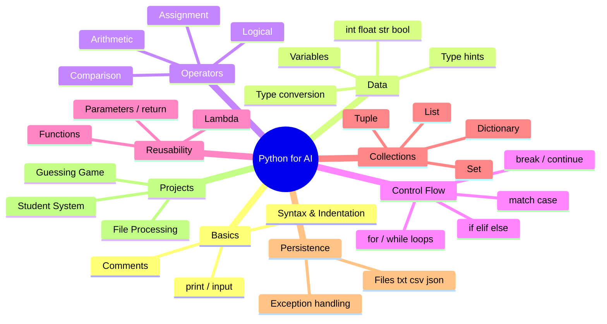

### 18.2 Key takeaways

- **Python is the language of AI in 2026** — simple to read, powerful underneath, with the richest AI ecosystem.
- **Everything is built from a few blocks:** variables, operators, conditions, loops, functions, collections. Master these and you can build anything.
- **Collections choice matters:** list (ordered/changeable), tuple (fixed), set (unique), dict (labelled). Dictionaries are king for AI/data work.
- **Files + exceptions = real programs** that save data and don't crash on bad input.
- **Write modern Python:** f-strings, `match`, type hints, `with open`, and PEP 8 style via Ruff.
- **The three projects** are miniatures of what's coming: the guessing game teaches logic/algorithms, the student system teaches CRUD/data management, and file processing is a hand-built preview of Data Science.

### 18.3 Skills checklist

- [ ] I can set up Python, VS Code, and run a script.
- [ ] I understand variables and all core data types.
- [ ] I can use every operator category correctly.
- [ ] I can control flow with `if/elif/else`, `match`, `for`, and `while`.
- [ ] I can write functions with parameters, returns, and type hints.
- [ ] I can choose and use lists, tuples, sets, and dictionaries.
- [ ] I can read/write text, CSV, and JSON files.
- [ ] I can handle exceptions with `try/except/finally`.
- [ ] I built and ran all three projects.

### 18.4 Bridge to Module 2

You now have the **programming foundation**. Next, in **Module 2 — AI & Data Science Foundations**, we step back to understand the *big picture*: what AI, Machine Learning, and Deep Learning actually are, how they differ, the AI project lifecycle, and where these technologies are transforming industry. You'll use the Python skills from this module throughout the rest of the program — from analyzing data (Module 3) to training models (Module 4) to building Generative AI apps (Module 7).

> **Homework before Module 2:** complete practice exercises 1–20, finish all three projects, and push your code to a **GitHub** repository (we'll formalize GitHub in Module 9, but starting a portfolio now is a smart habit). Bring one question about anything unclear — curiosity is the most important tool an AI engineer has.

---

### Instructor Notes (for the teaching team)

- **Suggested 8-hour split:** Hour 1 — setup + basics (§2–3); Hour 2 — data types + operators (§4–5); Hour 3 — conditions + loops (§6–7); Hour 4 — functions (§8); Hour 5 — collections (§9); Hour 6 — files + exceptions (§10–11); Hours 7–8 — the three hands-on projects (§12–14) as live-coding labs.
- **Teaching approach:** live-code every example on screen; have students type along (no passive watching). Deliberately introduce a bug and debug it together to teach traceback reading.
- **Assessment:** exercises 1–20 as classwork; projects 24–26 as take-home; the quiz (§17.7) as a quick verbal check before moving to Module 2.
- **Differentiation:** the "Challenge extensions" and mini-projects (24–26) keep faster students engaged while others finish the core labs.

---

*End of Module 1 — Python for AI & Programming Fundamentals.*
*AI Powered Engineering Upskilling Program · 2026 Edition.*
