# Module 2 — AI & Data Science Foundations

> **AI Powered Engineering Upskilling Program**
> *From Fundamentals to Generative AI Applications*

---

## Module Information Card

| Field | Detail |
|---|---|
| **Module Number** | 2 of 10 |
| **Module Title** | AI & Data Science Foundations |
| **Duration** | 4 Hours (≈ half a training day) |
| **Level** | Beginner → Foundation (concepts) |
| **Target Audience** | Engineering students, age 19–20 |
| **Prerequisites** | Module 1 (basic Python helps for the hands-on parts) |
| **Reference Year** | **2026** — models, tools, and trends are current as of this year |
| **Primary Tools** | Discussion, whiteboard, Python (for the hands-on activities) |
| **Learning Outcome** | Understand AI concepts and the AI project lifecycle. |
| **Hands-on Activity (syllabus)** | AI Use Case Discussion |
| **Hands-on Projects (this course)** | (1) AI Use Case Explorer · (2) AI vs ML vs DL Classifier Quiz · (3) AI Project Lifecycle Tracker |

### What you will be able to do after this module

By the end of Module 2, a student will be able to:

1. Define Artificial Intelligence in plain language and explain why it matters in 2026.
2. Clearly distinguish **AI vs Machine Learning vs Deep Learning vs Data Science**.
3. Classify AI systems by **capability** (Narrow, General, Super) and **type** (Reactive, Limited Memory, …).
4. Explain the three learning paradigms: **Supervised, Unsupervised, Reinforcement**.
5. Describe what **data** is, why it is the fuel of AI, and what makes data "good".
6. Walk any real problem through the **7-stage AI Project Lifecycle**.
7. Map **industry use cases** of AI across healthcare, finance, retail, and more.
8. Explain **Generative AI**, LLMs, and **AI Agents** at a foundational level (2026 landscape).
9. Recognize core **AI ethics** issues — bias, privacy, fairness, and responsible AI.
10. Identify **career roles** in the AI ecosystem and what each one does.

> **How to use these notes**: This is mostly a *concepts* module — the goal is to build a correct **mental model** of AI before you start coding models in Module 4. Read actively: after each section, try to explain the idea out loud in one sentence, as if teaching a friend. If you can, you understand it.

---

## Table of Contents

1. [What is Artificial Intelligence?](#1-what-is-artificial-intelligence)
2. [AI vs ML vs DL vs Data Science](#2-ai-vs-ml-vs-dl-vs-data-science)
3. [Types of AI](#3-types-of-ai)
4. [How Machine Learning Works — The Three Paradigms](#4-how-machine-learning-works--the-three-paradigms)
5. [Data Science Foundations — The Fuel of AI](#5-data-science-foundations--the-fuel-of-ai)
6. [The AI Project Lifecycle](#6-the-ai-project-lifecycle)
7. [Applications & Industry Use Cases](#7-applications--industry-use-cases)
8. [Generative AI & the 2026 Landscape](#8-generative-ai--the-2026-landscape)
9. [AI Ethics & Responsible AI](#9-ai-ethics--responsible-ai)
10. [Careers & the AI Ecosystem](#10-careers--the-ai-ecosystem)
11. [Hands-on Activities Overview](#11-hands-on-activities-overview)
12. [Hands-on Project 1 — AI Use Case Explorer](#12-hands-on-project-1--ai-use-case-explorer)
13. [Hands-on Project 2 — AI vs ML vs DL Classifier Quiz](#13-hands-on-project-2--ai-vs-ml-vs-dl-classifier-quiz)
14. [Hands-on Project 3 — AI Project Lifecycle Tracker](#14-hands-on-project-3--ai-project-lifecycle-tracker)
15. [Common Misconceptions & Myths](#15-common-misconceptions--myths)
16. [Glossary](#16-glossary)
17. [Practice Exercises & Self-Assessment](#17-practice-exercises--self-assessment)
18. [Summary & What's Next](#18-summary--whats-next)

---

## 1. What is Artificial Intelligence?

### 1.1 A plain-language definition

**Artificial Intelligence (AI)** is the branch of computer science focused on building machines and software that can perform tasks which **normally require human intelligence** — such as understanding language, recognizing images, making decisions, solving problems, and learning from experience.

Break the term itself apart:
- **Artificial** = made by humans, not occurring naturally.
- **Intelligence** = the ability to learn, reason, and solve problems.

So AI literally means *"human-made intelligence"* — a system that behaves in ways we would call "intelligent" if a person did them.

> **A one-sentence definition to memorize:**
> *AI is the science of making computers do things that would require intelligence if done by a human.*

### 1.2 A everyday-life analogy

Think about how a **child** learns that a stove is hot. Nobody hands them a rulebook. They observe, they get feedback (ouch!), and they *learn* a pattern: "glowing stove → hot → don't touch." Modern AI learns in a strikingly similar way: it is shown many **examples** (data), it makes guesses, it gets **feedback** on whether it was right, and it gradually improves. This idea — *learning from data and feedback* — is the beating heart of modern AI.

### 1.3 Two ways to build "intelligence": rules vs learning

There are two fundamentally different approaches to making a machine act intelligently. Understanding this contrast is the single most important idea in this module.

| Approach | How it works | Example | Limitation |
|---|---|---|---|
| **Rule-based (classic / "Good Old-Fashioned AI")** | A human writes explicit `if/else` rules for every situation. | "IF email contains 'lottery' AND 'winner' → mark as spam." | Humans can't possibly write rules for every case; brittle and hard to maintain. |
| **Learning-based (Machine Learning)** | The machine **discovers the rules itself** by finding patterns in thousands of examples. | Show it 100,000 emails labelled "spam" / "not spam"; it *learns* what spam looks like. | Needs lots of good data; can be a "black box". |

The historic shift from **hand-written rules** to **learning from data** is what unleashed the modern AI revolution. When people say "AI" today, they almost always mean the *learning-based* approach — **Machine Learning** — which we explore in §2.

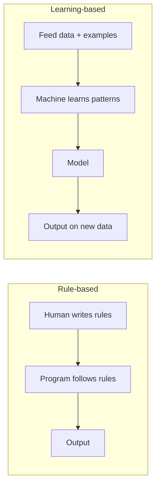

### 1.4 A short history of AI (why 2026 is special)

Understanding the timeline helps you see that AI is not magic — it is decades of steady progress that recently hit an inflection point.

| Era | Period | What happened |
|---|---|---|
| **The birth** | 1950 | Alan Turing asks *"Can machines think?"* and proposes the **Turing Test**. |
| **The naming** | 1956 | The term *"Artificial Intelligence"* is coined at the **Dartmouth Conference**. |
| **AI winters** | 1970s–1990s | Hype outran reality; funding dried up twice. Progress was slow. |
| **Machine Learning rises** | 1997–2010 | IBM's Deep Blue beats world chess champion Kasparov (1997). Statistical ML matures. |
| **The Deep Learning boom** | 2012 | A deep neural network (**AlexNet**) crushes an image-recognition contest. GPUs + big data ignite the field. |
| **The Transformer era** | 2017 | Google's *"Attention Is All You Need"* paper introduces the **Transformer** — the architecture behind today's LLMs. |
| **Generative AI goes mainstream** | 2022–2023 | **ChatGPT** launches (Nov 2022) and reaches 100M users faster than any app in history. |
| **The Agentic era** | 2024–2026 | AI shifts from *answering questions* to *taking actions* — **AI agents** that use tools, write code, and complete multi-step tasks. Multimodal models (text + image + audio + video) become standard. |

> **Why you're learning this now (2026):** AI has moved from research labs into *every* industry and nearly every software product. Companies everywhere need engineers who understand AI — not just researchers, but people who can *apply* it. That is exactly the skill set this program builds.

### 1.5 Where you already meet AI every day

AI is not futuristic — you have used it many times today already:

- **Unlocking your phone** with your face (computer vision).
- **Autocomplete & autocorrect** while typing (language models).
- **Netflix / YouTube / Spotify recommendations** (recommendation systems).
- **Google Maps** predicting traffic and the fastest route (prediction + optimization).
- **Spam filters** in email (classification).
- **Voice assistants** like Siri, Alexa, Google Assistant (speech recognition + NLP).
- **ChatGPT / Claude / Gemini** answering questions and writing code (generative AI).
- **Fraud alerts** from your bank (anomaly detection).

---

## 2. AI vs ML vs DL vs Data Science

These four terms are used loosely (and often wrongly) in the media. As a future AI engineer, you must know *exactly* what each means and how they relate. This is the most commonly asked interview question in the whole field.

### 2.1 The nested relationship (the key diagram)

The cleanest way to understand these terms is that they are **nested inside one another** like Russian dolls:

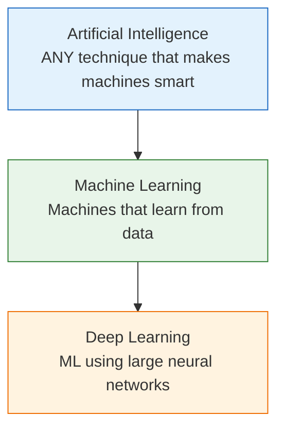

Read it as: **Deep Learning is a *subset* of Machine Learning, which is a *subset* of Artificial Intelligence.** Every deep-learning system is machine learning; every machine-learning system is AI — but **not** the other way around.

> **Where does Data Science fit?** Data Science is a **partly overlapping** field, not a layer in the stack. It is the broader discipline of *extracting insight and value from data*, which uses ML as one of its tools but also includes statistics, data cleaning, visualization, and business communication. Think of it as a **Venn-diagram overlap** with AI, not a doll inside it.

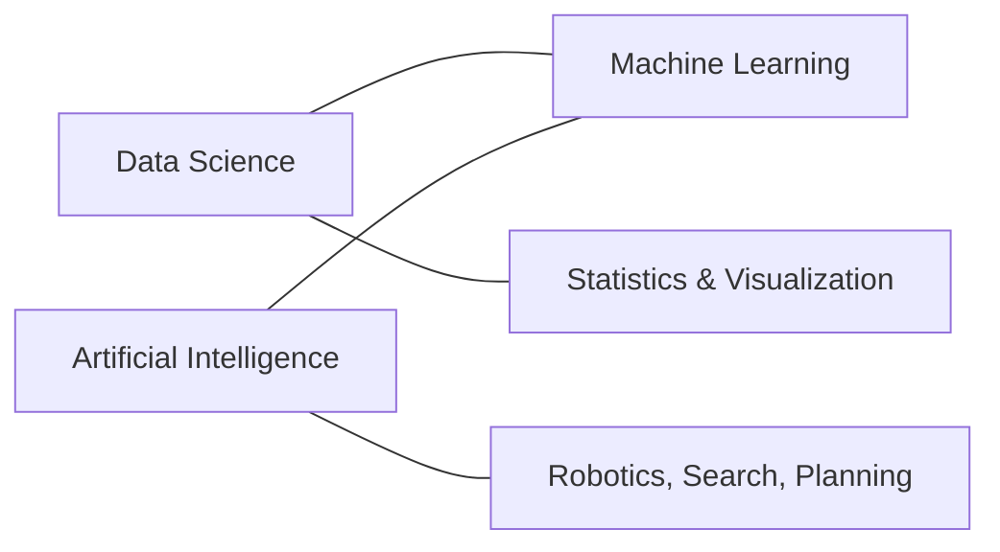

### 2.2 The master comparison table

| Aspect | **Artificial Intelligence** | **Machine Learning** | **Deep Learning** | **Data Science** |
|---|---|---|---|---|
| **Definition** | Making machines mimic human intelligence | Machines that learn patterns from data | ML using multi-layer neural networks | Extracting insight & value from data |
| **Scope** | Broadest | Subset of AI | Subset of ML | Overlaps AI + statistics + business |
| **Goal** | Simulate intelligent behavior | Learn to predict/decide from data | Learn complex patterns automatically | Turn data into decisions & insight |
| **Data needed** | Varies (can be rule-based) | Moderate (thousands of rows) | Very large (often millions) | Any amount, for analysis |
| **Human effort** | Can be fully hand-coded | Human designs the *features* | Model learns *features* itself | Human explores & interprets |
| **Hardware** | Ordinary computer | Ordinary computer / some GPU | **Powerful GPUs/TPUs** | Ordinary computer + tools |
| **Examples** | Chess bot, Roomba, Siri | Spam filter, price prediction | ChatGPT, face recognition, self-driving vision | Sales dashboards, A/B testing, churn analysis |
| **Course module** | This module (2) | Module 4 | Module 5 | Module 3 |

### 2.3 Machine Learning explained simply

**Machine Learning (ML)** is the subset of AI where a computer **learns patterns from data** instead of being explicitly programmed with rules.

**The core idea in one line:** *Traditional programming takes rules + data → produces answers. Machine Learning takes data + answers → produces the rules.*

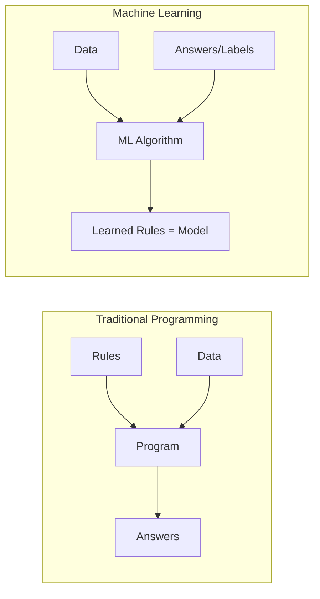

**Example — predicting house prices:**
- *Traditional way:* an expert writes a formula like `price = 5000 × area + 200000 × bedrooms…`. Fragile and always wrong somewhere.
- *ML way:* show the algorithm 10,000 real houses (area, bedrooms, location → actual sale price). It *learns* the relationship on its own, then predicts prices for new houses. (You'll build exactly this in Module 4.)

### 2.4 Deep Learning explained simply

**Deep Learning (DL)** is a subset of ML that uses **artificial neural networks** with many layers (hence "deep") — loosely inspired by how neurons connect in the human brain.

Its superpower: **it learns the useful features by itself.** In classic ML, a human must decide *which* properties of the data matter (this is called "feature engineering"). In deep learning, the network figures out the important features automatically — which is why it excels at messy, high-dimensional data like **images, audio, and language**.

| | Classic Machine Learning | Deep Learning |
|---|---|---|
| Feature extraction | **Human** designs features by hand | **Model** learns features automatically |
| Data appetite | Works with smaller datasets | Needs large datasets |
| Compute | Runs on a normal CPU | Needs GPUs/TPUs |
| Interpretability | Easier to understand | Often a "black box" |
| Best for | Tables, structured data | Images, audio, text, video |
| Example | Predicting loan default from a spreadsheet | Recognizing a cat in a photo; ChatGPT |

> **Analogy:** Classic ML is like a chef who follows a recipe *you* wrote (you chose the ingredients). Deep Learning is like a chef who tastes thousands of dishes and *invents* the recipe — including which ingredients matter — entirely on its own.

### 2.5 Data Science explained simply

**Data Science** is the interdisciplinary field of **collecting, cleaning, analyzing, and interpreting data** to support decisions. A data scientist spends most of their time *understanding data* — and famously, about **80% of the work is cleaning and preparing data**, not building fancy models.

A data scientist blends three skill sets:
1. **Programming** (Python — Module 1 & 3),
2. **Statistics & Math** (to reason about data),
3. **Domain knowledge** (to ask the right questions).

You'll live in this world in **Module 3 (Data Analysis & Visualization)**.

---

## 3. Types of AI

AI is classified in **two** different ways. Students often mix these up — keep them separate: one axis is about **how capable** the AI is, the other is about **how it works internally**.

### 3.1 Classification by Capability (the famous one)

This is the classification you'll be asked about most. It ranks AI by *how broad* its intelligence is.

| Type | Full name | What it means | Status in 2026 | Example |
|---|---|---|---|---|
| **ANI** | Artificial **Narrow** Intelligence | Good at **one** specific task only. Cannot do anything outside it. | ✅ **This is ALL AI that exists today** | ChatGPT, self-driving cars, AlphaGo, face unlock |
| **AGI** | Artificial **General** Intelligence | Human-level intelligence across **any** task; can learn anything a human can. | ⏳ Does **not** exist yet; actively researched | Data from *Star Trek*, or a truly general robot assistant |
| **ASI** | Artificial **Super** Intelligence | Intelligence **far beyond** the smartest humans in every field. | 🔮 Hypothetical / future | Science-fiction "superintelligence" |

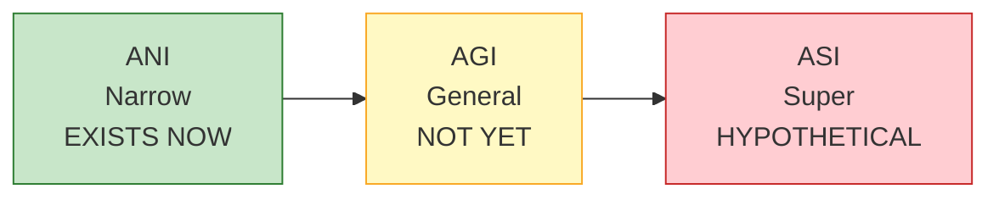

> **Crucial reality check:** Every single AI system in the world today — including the most advanced 2026 models like ChatGPT, Claude, and Gemini — is **Narrow AI (ANI)**. They are astonishingly capable at language and reasoning tasks, but they are still *specialized* systems, not the general, self-aware intelligence of science fiction. **AGI does not exist yet.** When someone claims "the AI is conscious," they are mistaken about what these systems are.

### 3.2 Classification by Functionality

This classification (from a well-known framework) describes AI by *how it processes information and memory*.

| Type | Description | Memory? | Example |
|---|---|---|---|
| **Reactive Machines** | Respond to the current input only; no memory of the past. | ❌ No | IBM Deep Blue (chess); a basic recommendation rule |
| **Limited Memory** | Uses recent past data to make decisions. **Almost all modern AI is here.** | ⏳ Short-term | Self-driving cars, ChatGPT, fraud detection |
| **Theory of Mind** | Would understand emotions, beliefs, and intentions of others. | 🔬 Research | Not yet achieved — an active research goal |
| **Self-Aware** | Would have its own consciousness and self-awareness. | 🔮 Hypothetical | Purely theoretical; does not exist |

> **Simple takeaway:** Today's AI lives in the **"Limited Memory"** category (by functionality) and is entirely **"Narrow"** (by capability). Everything above those levels is research or science fiction.

### 3.3 Another useful split: Generative vs Discriminative / Predictive AI

A very practical 2026 distinction, because it separates the "classic" AI you'll build in Modules 4–6 from the "generative" AI in Module 7.

| | **Predictive / Discriminative AI** | **Generative AI** |
|---|---|---|
| What it does | **Classifies or predicts** — picks a label or a number | **Creates** brand-new content |
| Question it answers | "Is this spam? What's the price?" | "Write me an email. Draw me a logo." |
| Output | A category or value | Text, images, audio, code, video |
| Examples | Spam filter, price predictor, tumor detector | ChatGPT, Claude, Gemini, DALL·E, Midjourney |
| Course module | Modules 4, 5, 6 | Module 7 |

---

## 4. How Machine Learning Works — The Three Paradigms

Since Machine Learning is the engine of modern AI, you must know its three main *learning styles*. Every ML problem you meet in this program falls into one of these three buckets.

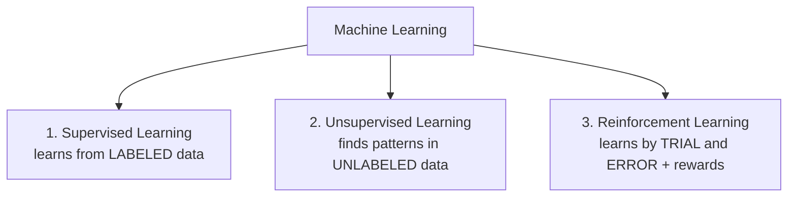

### 4.1 Supervised Learning — learning with a teacher

The algorithm learns from **labeled data** — data where the correct answer is already provided. It's like a student learning with an answer key: for each question (input), they are shown the correct answer (label), and they learn the mapping.

- **Input:** features (e.g., email text). **Label:** the answer (e.g., "spam" or "not spam").
- **Goal:** learn to predict the label for *new*, unseen inputs.

Supervised learning splits into two sub-types:

| Sub-type | Predicts… | Output | Example |
|---|---|---|---|
| **Classification** | A **category** | Discrete label | Spam / not spam; disease / no disease; cat / dog |
| **Regression** | A **number** | Continuous value | House price; tomorrow's temperature; sales forecast |

> You'll build **both** in Module 4: *House Price Prediction* (regression) and *Customer Churn Prediction* (classification).

### 4.2 Unsupervised Learning — learning without a teacher

The algorithm is given **unlabeled data** — no correct answers — and must **find structure or patterns on its own**. It's like being handed a box of mixed photos and asked to sort them into groups without being told what the groups are.

| Sub-type | What it does | Example |
|---|---|---|
| **Clustering** | Groups similar items together | Customer segmentation (group shoppers by behavior) |
| **Dimensionality Reduction** | Simplifies data while keeping the important parts | Compressing data for visualization |
| **Association** | Finds "items that go together" | "People who buy bread also buy butter" |

### 4.3 Reinforcement Learning — learning by trial and error

An **agent** learns by *interacting with an environment*: it takes actions, receives **rewards** (good) or **penalties** (bad), and gradually learns a strategy that maximizes reward. This is exactly how you'd train a dog with treats — or how AI learns to play games and control robots.

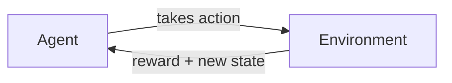

- **Examples:** AlphaGo beating the world Go champion; robots learning to walk; game-playing AI; and, increasingly in 2026, **fine-tuning AI assistants** (a technique called RLHF — Reinforcement Learning from Human Feedback — helps make ChatGPT and Claude helpful and safe).

### 4.4 Quick comparison of the three paradigms

| Feature | Supervised | Unsupervised | Reinforcement |
|---|---|---|---|
| Data | Labeled | Unlabeled | No dataset — learns from experience |
| Goal | Predict the known answer | Discover hidden structure | Maximize long-term reward |
| Feedback | Correct answers given | None | Rewards / penalties |
| Analogy | Learning with an answer key | Sorting without instructions | Training a pet with treats |
| Example | Price prediction, spam filter | Customer segmentation | Game AI, robotics |

---

## 5. Data Science Foundations — The Fuel of AI

If AI is the engine, **data is the fuel**. No matter how clever an algorithm is, it is useless without good data to learn from. There's a famous saying in the field: **"Garbage In, Garbage Out"** — feed a model bad data and it will make bad predictions, no matter how advanced it is.

### 5.1 What is data?

**Data** is simply **recorded facts and figures** — numbers, text, images, sounds, clicks, sensor readings. On its own, raw data is just noise. The job of AI and Data Science is to turn that raw data into **information**, then **knowledge**, then **decisions**.

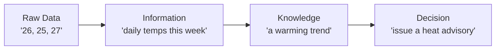

### 5.2 Types of data

Knowing your data type decides which tools and models you can use.

| Category | Type | Description | Example |
|---|---|---|---|
| **By structure** | **Structured** | Neatly organized in rows & columns (tables) | Excel sheet, SQL database, CSV |
| | **Unstructured** | No fixed format | Photos, videos, audio, free text, emails |
| | **Semi-structured** | Some organization, but flexible | JSON, XML, log files |
| **By nature** | **Numerical (Quantitative)** | Numbers you can do math on | Age, price, temperature |
| | **Categorical (Qualitative)** | Labels/categories | Gender, city, color, "spam/not spam" |

> **Why this matters:** ~80–90% of the world's data is **unstructured** (images, video, text). That is precisely why **Deep Learning** (which handles unstructured data brilliantly) and **Generative AI** exploded in importance — they finally unlocked the huge ocean of unstructured data.

### 5.3 What makes data "good"? (Data quality)

A model is only as good as its data. Professionals judge data on these qualities:

| Quality | Question it answers | Bad example |
|---|---|---|
| **Accuracy** | Is the data correct? | A person's age recorded as 250 |
| **Completeness** | Are values missing? | Half the "income" column is blank |
| **Consistency** | Does it agree with itself? | "India" in one row, "IN" in another |
| **Relevance** | Does it relate to the problem? | Using shoe size to predict exam scores |
| **Timeliness** | Is it up to date? | Using 2010 prices to predict 2026 costs |

### 5.4 The concept of "Big Data" — the 5 V's

**Big Data** refers to datasets so large and complex that ordinary tools can't handle them. It is often described by the **5 V's**:

| V | Meaning | Example |
|---|---|---|
| **Volume** | Huge *amount* of data | Terabytes/petabytes of user activity |
| **Velocity** | *Speed* at which it arrives | Millions of tweets per minute |
| **Variety** | Different *types* | Text + images + video + sensor data |
| **Veracity** | *Trustworthiness* / quality | Noisy, uncertain, or biased data |
| **Value** | The *usefulness* extracted | Insights that drive business decisions |

### 5.5 Features and labels (vocabulary you'll use constantly)

Two words appear in every ML discussion — lock them in now:

- A **feature** (also called an *input* or *variable*) is a measurable property used to make a prediction. In a house dataset: `area`, `bedrooms`, `location` are features.
- A **label** (also called the *target* or *output*) is the answer you want to predict. In the house dataset: `price` is the label.

```
    FEATURES (inputs)                 LABEL (output)
 ┌───────┬──────────┬──────────┐   ┌────────────┐
 │ area  │ bedrooms │ location │   │   price    │
 ├───────┼──────────┼──────────┤   ├────────────┤
 │ 1200  │    3     │  Chennai │ → │  55,00,000 │
 │  850  │    2     │  Madurai │ → │  32,00,000 │
 └───────┴──────────┴──────────┘   └────────────┘
```

---

## 6. The AI Project Lifecycle

Building an AI solution is **not** just "train a model." It is a full **lifecycle** — a repeatable set of stages that every real AI project follows, from a business idea to a deployed, monitored system. This is the single most important process to understand as a future AI engineer, and it directly powers **Hands-on Project 3** in this module.

### 6.1 The 7 stages

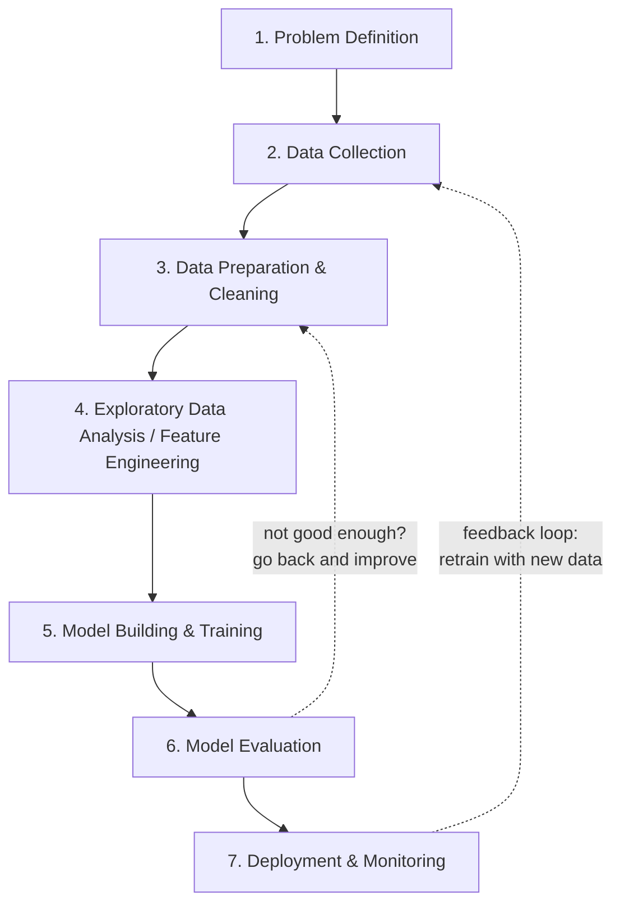

> **Notice the arrows loop back.** The lifecycle is a **cycle**, not a straight line. If evaluation shows the model isn't good enough, you go back and get more data or try a different approach. After deployment, the world changes, so you keep monitoring and retraining. Real AI work is iterative.

### 6.2 Each stage explained

| # | Stage | What happens | Course Module |
|---|---|---|---|
| **1** | **Problem Definition** | Define the goal clearly. *What are we predicting? How will we measure success?* Frame it as an AI problem (classification? regression?). | This module |
| **2** | **Data Collection** | Gather the raw data from databases, files, sensors, APIs, or the web. | Module 3 |
| **3** | **Data Preparation** | Clean the data: handle missing values, remove duplicates, fix errors, format it. **(The 80% job.)** | Module 3 |
| **4** | **EDA & Feature Engineering** | Explore with statistics & charts to find patterns; create/select the best features. | Module 3 |
| **5** | **Model Building** | Choose an algorithm and **train** it on the prepared data. | Modules 4, 5 |
| **6** | **Model Evaluation** | Test the model on unseen data. Measure accuracy and other metrics. Is it good enough? | Modules 4, 5 |
| **7** | **Deployment & Monitoring** | Put the model into a real app users can access; watch its performance over time and retrain as needed. | Module 9 |

### 6.3 A worked example — "Will a customer leave? (churn)"

Let's walk one problem through all 7 stages so it feels concrete:

1. **Problem Definition:** "Predict which customers will cancel their subscription next month." → a *classification* problem; success = catching 80%+ of leavers.
2. **Data Collection:** pull 2 years of customer records — usage, complaints, billing.
3. **Data Preparation:** fill missing values, remove test accounts, standardize date formats.
4. **EDA:** discover that customers who contacted support 3+ times are far more likely to leave.
5. **Model Building:** train a classification model on the historical data.
6. **Evaluation:** it correctly identifies 84% of churners on test data. Good enough!
7. **Deployment:** integrate it so the retention team gets a daily "at-risk customers" list, and monitor whether its predictions stay accurate.

> **This is literally the roadmap of the entire program.** Modules 3–9 each teach one or more of these stages in depth. Module 2 gives you the map; the rest of the program is the journey.

---

## 7. Applications & Industry Use Cases

AI in 2026 is not confined to tech companies — it has spread into **every** industry. As an engineer, your value comes from knowing *where* AI creates real impact. This section is also the knowledge base for **Hands-on Project 1 (AI Use Case Explorer)**.

### 7.1 AI across major industries

| Industry | Use Cases | AI Type Involved |
|---|---|---|
| **Healthcare** | Disease detection from scans, drug discovery, patient risk prediction, medical chatbots | Computer Vision, ML, GenAI |
| **Finance & Banking** | Fraud detection, credit scoring, algorithmic trading, robo-advisors | ML (classification), anomaly detection |
| **Retail & E-commerce** | Recommendation engines, demand forecasting, dynamic pricing, chatbots | ML, NLP, GenAI |
| **Manufacturing** | Predictive maintenance, quality inspection, robotics, supply-chain optimization | Computer Vision, RL |
| **Agriculture** | Crop-disease detection, yield prediction, precision farming with drones | Computer Vision, ML |
| **Transportation** | Self-driving vehicles, route optimization, traffic prediction | DL, RL, Computer Vision |
| **Education** | Personalized learning, automated grading, AI tutors | NLP, GenAI |
| **Entertainment** | Content recommendation, AI-generated art/music, game NPCs | GenAI, RL |
| **Agritech / Energy** | Smart grids, demand prediction, fault detection | ML, time-series |
| **Customer Service** | AI chatbots, ticket routing, sentiment analysis | NLP, GenAI |

### 7.2 A closer look at three high-impact domains

**🏥 Healthcare** — AI models can read X-rays, CT, and MRI scans to flag tumors, often matching specialist accuracy on narrow tasks. AI also accelerates **drug discovery** by predicting how molecules behave, cutting years off research. *(You'll build a Medical Assistant-style project as a Capstone option in Module 10.)*

**💳 Finance** — Every time you swipe a card, an AI model scores the transaction for fraud in milliseconds. Banks use ML for **credit scoring** (should we approve this loan?) and to detect money-laundering patterns humans would miss.

**🛒 Retail** — When Amazon says "customers who bought this also bought…", that's a **recommendation system**. Netflix estimates its recommender saves it huge sums by keeping viewers engaged. These systems are ML models trained on millions of user interactions.

### 7.3 The AI value framework — impact vs feasibility

Not every AI idea is worth building. Professionals evaluate a use case on **two axes**, which is the exact logic behind **Hands-on Project 1**:

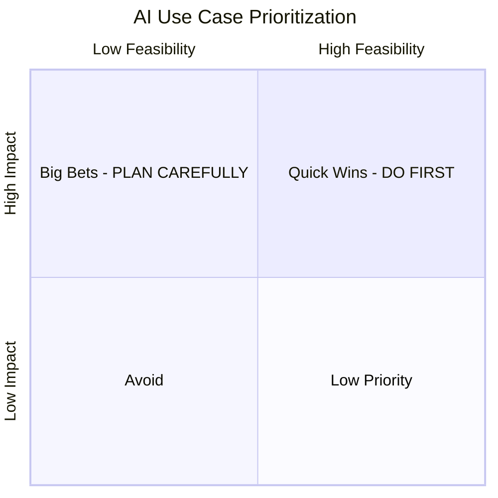

- **High Impact + High Feasibility = "Quick Wins"** → build these first.
- **High Impact + Low Feasibility = "Big Bets"** → strategic, need investment.
- **Low Impact** → deprioritize, regardless of feasibility.

> A good AI engineer doesn't just ask *"can we build it?"* but *"should we build it, and is it worth it?"*

---

## 8. Generative AI & the 2026 Landscape

Because Generative AI has become the face of modern AI, you need a foundational understanding *now*, even though **Module 7** covers it hands-on. This section is deliberately current for **2026**.

### 8.1 What is Generative AI?

**Generative AI** is AI that **creates new, original content** — text, images, code, audio, and video — rather than just classifying or predicting. Instead of answering "is this spam?", it answers "write me a poem" or "generate a product image."

### 8.2 Large Language Models (LLMs) — the engine of the GenAI boom

A **Large Language Model (LLM)** is a deep-learning model trained on enormous amounts of text to **predict the next word** in a sequence. Do that astonishingly well, at massive scale, and the result is a system that can converse, summarize, translate, write code, and reason.

- LLMs are built on the **Transformer** architecture (from the 2017 paper "Attention Is All You Need").
- They are **foundation models**: trained once on broad data, then adapted to many tasks.
- Modern LLMs are **multimodal** — they handle not just text but images, audio, and video.

### 8.3 The major AI assistants in 2026

| Assistant | Maker | Known for |
|---|---|---|
| **ChatGPT** | OpenAI | The product that launched the GenAI era; general-purpose assistant |
| **Claude** | Anthropic | Strong reasoning, coding, long documents, and a focus on safety |
| **Gemini** | Google | Deep integration with Google products; strong multimodal ability |
| **Copilot** | Microsoft/GitHub | AI pair-programmer built into coding tools |

> These tools are all evolving *fast*. New, more capable model versions are released regularly. What matters for you is not memorizing version numbers, but understanding **what** these systems are (Narrow AI, LLM-based) and **how** to use them effectively — which is the subject of **Prompt Engineering** in Module 7.

### 8.4 From Chatbots to AI Agents (the 2024–2026 shift)

The biggest trend of this era is the move from **AI that talks** to **AI that acts**.

| | **Chatbot (2022–2023)** | **AI Agent (2024–2026)** |
|---|---|---|
| What it does | Answers your questions | **Takes actions** to complete goals |
| Tools | None — just text | Uses tools: browsers, code, APIs, files |
| Steps | One question, one answer | Plans and executes **multi-step** tasks |
| Example | "How do I book a flight?" | "Book me the cheapest flight to Delhi next Friday." |

**AI Agents** can break a goal into steps, use software tools, check their own work, and adapt. This is a major theme of **Module 8 (AI Agents & Automation)**. The very tool used to help build this course is an example of an agentic coding assistant.

### 8.5 Key GenAI vocabulary (preview of Module 7)

| Term | Meaning |
|---|---|
| **Prompt** | The instruction/question you give an AI model |
| **Prompt Engineering** | The skill of writing effective prompts to get better results |
| **Token** | A chunk of text (roughly ¾ of a word) that the model processes |
| **Hallucination** | When an AI confidently states something false — always verify! |
| **Fine-tuning** | Further training a model on specific data for a specialized task |
| **RAG** | Retrieval-Augmented Generation — giving the model your own documents to answer from |
| **Multimodal** | A model that handles multiple data types (text, image, audio) |

---

## 9. AI Ethics & Responsible AI

With great power comes great responsibility. AI can cause real harm if built carelessly. As a future AI engineer, you must understand these issues from day one — not as an afterthought. (This connects to the program's objective on *AI ethics, governance, and responsible AI*.)

### 9.1 The main ethical challenges

| Issue | What it means | Real example |
|---|---|---|
| **Bias & Fairness** | AI learns human biases hidden in data and can discriminate | A hiring model that favors men because it learned from biased past hiring data |
| **Privacy** | AI needs data, which can expose personal information | Facial recognition used without consent |
| **Transparency ("black box")** | We often can't explain *why* a model decided something | A loan is denied and nobody can say why |
| **Accountability** | Who is responsible when AI makes a harmful mistake? | A self-driving car causes an accident |
| **Misinformation** | GenAI can mass-produce fake text, images, "deepfakes" | Fake videos of real people saying things they never said |
| **Job displacement** | Automation changes and removes some jobs | Roles being reshaped by automation |
| **Hallucination** | AI states false facts with confidence | A chatbot inventing a fake legal case citation |

### 9.2 The principle of "Garbage In, Bias Out"

Here is the key insight: **AI is a mirror of its training data.** If the historical data reflects human bias, the AI will *learn and amplify* that bias — often at massive scale, and with a false air of "objectivity" because "the computer decided." Responsible AI means actively checking data and models for fairness, not assuming the machine is neutral.

### 9.3 Principles of Responsible AI

Most organizations and governments in 2026 follow principles like these:

1. **Fairness** — treat all groups equitably; test for and reduce bias.
2. **Transparency & Explainability** — be able to explain decisions.
3. **Privacy & Security** — protect people's data.
4. **Accountability** — humans remain responsible for AI systems.
5. **Safety & Reliability** — test thoroughly; fail gracefully.
6. **Human oversight** — keep a "human in the loop" for important decisions.

> **Regulation is real now (2026):** frameworks such as the **EU AI Act** and various national AI guidelines govern how AI can be built and used, especially in "high-risk" areas like healthcare, finance, and hiring. Ethics is no longer optional — it's law in many places.

### 9.4 A simple rule for students

> Before building any AI system, ask three questions:
> 1. **Is the data fair and representative?**
> 2. **Could this harm anyone, or treat a group unfairly?**
> 3. **Can I explain and stand behind what it does?**

---

## 10. Careers & the AI Ecosystem

One goal of this program is **career readiness**. So who actually works in AI, and what do they do? The field has several distinct roles — knowing them helps you aim your learning.

### 10.1 Core AI/Data roles

| Role | What they do | Key skills | Main modules |
|---|---|---|---|
| **Data Analyst** | Analyzes data, builds dashboards & reports | Excel, SQL, Python, visualization | Module 3 |
| **Data Scientist** | Finds insights & builds predictive models | Statistics, ML, Python, storytelling | Modules 3, 4 |
| **Machine Learning Engineer** | Builds & deploys ML models in production | ML, software engineering, deployment | Modules 4, 5, 9 |
| **AI Engineer** | Builds AI-powered applications (often with LLMs) | LLMs, APIs, prompt engineering, agents | Modules 7, 8, 9 |
| **Data Engineer** | Builds the pipelines that move & store data | Databases, big data tools, pipelines | Module 3 |
| **Computer Vision Engineer** | Builds image/video AI systems | Deep learning, OpenCV | Module 5 |
| **NLP Engineer** | Builds language/text AI systems | NLP, transformers | Module 6 |
| **Prompt Engineer / AI Specialist** | Designs prompts & GenAI workflows | Prompt engineering, GenAI tools | Modules 7, 8 |

### 10.2 The typical AI team

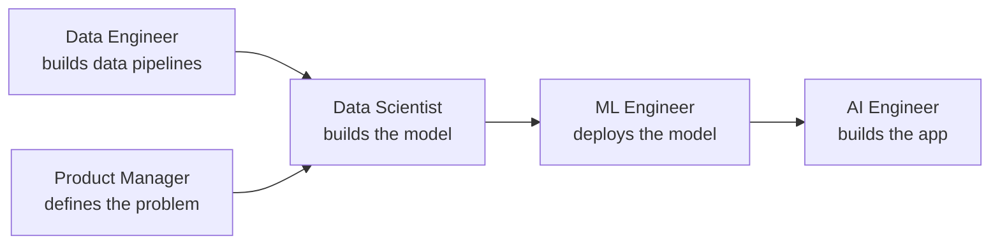

> **The good news:** you don't need to master everything at once. This 10-module program deliberately touches every one of these areas, so by the end you'll know which direction excites you most — and have portfolio projects to prove your skills.

### 10.3 Skills that make you stand out in 2026

- **Python + core ML** (the technical foundation — this program).
- **Working with LLMs & prompt engineering** (the hottest 2026 skill).
- **Understanding the full lifecycle**, not just modeling.
- **Communication** — explaining AI results to non-technical people.
- **A portfolio** — real, demonstrable projects (which you're building right now).

---

## 11. Hands-on Activities Overview

The syllabus activity for this module is the **AI Use Case Discussion**. To make it concrete and to reinforce the module's concepts, we turn it into three short, runnable Python activities. They also let you **practice your Module 1 skills** (functions, dictionaries, files, loops) on real AI-themed problems.

| # | Project | Reinforces | Syllabus link |
|---|---|---|---|
| 1 | **AI Use Case Explorer** | Applications, Impact/Feasibility framework | **AI Use Case Discussion** (core activity) |
| 2 | **AI vs ML vs DL Classifier Quiz** | AI vs ML vs DL, Types of AI | Concept mastery |
| 3 | **AI Project Lifecycle Tracker** | The 7-stage AI Lifecycle | AI Lifecycle |

> These are lighter than Module 1's programs (this is a shorter, concept-focused module), but they follow the same professional standards: plain-ASCII output, input validation, functions, docstrings, and a clean `main()` entry point. The complete, tested versions live in
> `Hands-on Projects/Module 2 Hands-on Projects/`.

> ### 📦 About these projects (read this first)
>
> The **complete, tested, ready-to-run** versions of all three projects live in
> `Hands-on Projects/Module 2 Hands-on Projects/`, each in its own subfolder with a
> `README.md`. The code shown in the notes below highlights the key logic; run the files
> for the full programs.
>
> As in Module 1, all printed output is **plain ASCII** (`[OK]`, `[!]`, `->`) so the
> programs run on **every** terminal, including the default Windows console, with no
> `UnicodeEncodeError`.

---

## 12. Hands-on Project 1 — AI Use Case Explorer

This is the hands-on form of the syllabus activity **"AI Use Case Discussion."** Rather than only talking about where AI helps, you build a tool that **catalogs and prioritizes** AI use cases — exactly how a real AI team decides *what to build first*.

### 12.1 What we're building

A menu-driven program where you record AI use cases (industry, problem, AI type, **impact** 1–5, **feasibility** 1–5). It then **ranks** them by priority and places each in the Impact-vs-Feasibility quadrant from §7.3.

**Concepts used:** dictionaries, lists, functions, input validation, `match/case`, sorting with a key, JSON files — all your Module 1 skills applied to Module 2 ideas.

### 12.2 The heart of it — the priority logic

The whole tool rests on one small, elegant idea: turn two scores into a **quadrant label** and a **ranking number**.

```python
HIGH = 4   # a score of 4 or 5 counts as "HIGH"

def priority_label(impact: int, feasibility: int) -> str:
    """Return the Impact-vs-Feasibility quadrant name for a use case."""
    high_impact = impact >= HIGH
    high_feasibility = feasibility >= HIGH
    if high_impact and high_feasibility:
        return "Quick Win"        # do these first
    if high_impact and not high_feasibility:
        return "Big Bet"          # high value but hard — plan carefully
    if not high_impact and high_feasibility:
        return "Low Priority"     # easy but low value
    return "Avoid"                # low value AND hard

def priority_score(case: dict) -> int:
    """A single number used to rank use cases (higher = do sooner)."""
    return case["impact"] * case["feasibility"]
```

Line-by-line:
- We treat a score of **4 or 5 as "HIGH"** (the `HIGH` constant makes this easy to change).
- `priority_label` returns one of the four quadrant names using simple `and`/`not` logic.
- `priority_score` multiplies the two scores, giving a single number to sort by (a `5×4 = 20` beats a `3×3 = 9`).

### 12.3 Ranking with a sort key

To show the best ideas first, we sort the list using `priority_score` as the **key** — a technique straight from Module 1's lambda/sorting lesson:

```python
def prioritize(cases: list) -> None:
    ranked = sorted(cases, key=priority_score, reverse=True)  # highest first
    for rank, c in enumerate(ranked, start=1):
        label = priority_label(c["impact"], c["feasibility"])
        print(f"{rank}. [{label}] {c['industry']} - {c['problem']}")
```

- `sorted(..., key=priority_score, reverse=True)` orders use cases from highest score to lowest **without changing the original list**.
- `enumerate(ranked, start=1)` gives us a rank number for each.

### 12.4 Sample run (prioritize view)

```
=== AI USE CASES BY PRIORITY (highest first) ===
Rank | Score | Quadrant     | Use Case
----------------------------------------------------------------------
1    | 20    | Quick Win    | Finance - Flag fraudulent card transactions
2    | 20    | Quick Win    | Retail - Recommend products to shoppers
3    | 15    | Big Bet      | Healthcare - Detect tumors in X-ray/CT scans
4    | 15    | Low Priority | Customer Service - Answer FAQs with a chatbot
5    | 8     | Big Bet      | Agriculture - Predict crop disease from leaf photos
----------------------------------------------------------------------
```

> **Full program:** `Hands-on Projects/Module 2 Hands-on Projects/Project 1 - AI Use Case Explorer/ai_use_case_explorer.py`. It comes pre-loaded with 5 example use cases and saves your catalog to `ai_use_cases.json`.

### 12.5 The discussion (the syllabus activity)

Use the tool to run the actual **AI Use Case Discussion** with your team:
1. Each student proposes **5 use cases** for an industry they care about.
2. Debate and agree on the **Impact** and **Feasibility** scores — *this discussion is the real learning*.
3. Run **Prioritize** and see which ideas are "Quick Wins".
4. Defend your top pick to the group.

---

## 13. Hands-on Project 2 — AI vs ML vs DL Classifier Quiz

A short interactive quiz that hardens your understanding of the module's core concepts. It shows a real-world scenario, you classify it, and it **explains** the right answer — so it teaches while it tests.

### 13.1 What we're building

A multiple-choice quiz that presents scenarios and asks you to label each as Rule-based AI, Supervised/Unsupervised/Reinforcement learning, Deep Learning, Generative vs Predictive, ANI/AGI/ASI, and so on.

**Concepts used:** lists of dictionaries (the question bank), functions, loops, conditions, input validation, and the `random` module to shuffle questions.

### 13.2 How a question is stored

Each question is just a **dictionary** — a perfect use of the data structures from Module 1:

```python
QUESTIONS = [
    {
        "scenario": "A model is shown 50,000 emails already labelled 'spam' or "
                    "'not spam' and learns to label new emails on its own.",
        "options": ["Rule-based AI", "Supervised Machine Learning",
                    "Unsupervised Learning", "Reinforcement Learning"],
        "answer": 1,     # index 1 = "Supervised Machine Learning"
        "why": "Learning from LABELLED examples is SUPERVISED Machine Learning.",
    },
    # ... more questions ...
]
```

- `"options"` is a list; `"answer"` is the **index** (0-based) of the correct option.
- `"why"` is the teaching explanation shown after you answer.

### 13.3 Asking one question

```python
LETTERS = ["a", "b", "c", "d"]

def ask_question(q: dict, number: int, total: int) -> bool:
    print(f"\nQuestion {number} of {total}")
    print(q["scenario"])
    for i, option in enumerate(q["options"]):
        print(f"   {LETTERS[i]}) {option}")

    while True:                                  # keep asking until valid input
        choice = input("Your answer (a/b/c/d): ").strip().lower()
        if choice in LETTERS:
            break
        print("[!] Please type one of: a, b, c, d.")

    picked = LETTERS.index(choice)               # letter -> index (a=0, b=1, ...)
    if picked == q["answer"]:
        print("[CORRECT]")
        correct = True
    else:
        print(f"[WRONG] Correct: {q['options'][q['answer']]}")
        correct = False
    print(f"Why: {q['why']}")
    return correct
```

Notice how this reuses **everything** from Module 1: a `while` loop for validation, `enumerate` for numbering options, list membership (`in`), and returning a Boolean.

### 13.4 Sample interaction

```
Question 1 of 10
A model is shown 50,000 emails already labelled 'spam' or 'not spam'
and learns to label new emails on its own.

   a) Rule-based AI
   b) Supervised Machine Learning
   c) Unsupervised Learning
   d) Reinforcement Learning

Your answer (a/b/c/d): b
[CORRECT]
Why: Learning from LABELLED examples (spam / not spam) is SUPERVISED
Machine Learning - specifically classification.
```

> **Full program:** `Hands-on Projects/Module 2 Hands-on Projects/Project 2 - AI vs ML vs DL Classifier Quiz/ai_ml_dl_quiz.py`. It has 10 questions, shuffles them each run, and gives a final score with a rating.

---

## 14. Hands-on Project 3 — AI Project Lifecycle Tracker

This project makes the **7-stage AI Project Lifecycle (§6)** tangible: you plan a real project by moving it through every stage and watching your progress.

### 14.1 What we're building

A tracker where you pick a project, then for each of the 7 lifecycle stages set a **status** (Not Started / In Progress / Done) and **notes**. It shows a text **progress bar** and a completion **percentage**, saved to JSON.

**Concepts used:** dictionaries & lists, functions, loops with `enumerate`, `match/case`, input validation, JSON, and a little integer math for the progress bar.

### 14.2 Modelling the project as data

```python
STAGES = [
    "Problem Definition", "Data Collection", "Data Preparation & Cleaning",
    "EDA & Feature Engineering", "Model Building & Training",
    "Model Evaluation", "Deployment & Monitoring",
]

# Each status is worth a fraction of "done":
STATUS_WEIGHT = {"Not Started": 0.0, "In Progress": 0.5, "Done": 1.0}

def new_project(name: str) -> dict:
    """Create a project with every stage 'Not Started'."""
    return {
        "name": name,
        "stages": [
            {"stage": stage, "status": "Not Started", "notes": ""}
            for stage in STAGES                  # a list comprehension!
        ],
    }
```

- The project is a **dictionary** containing a **list of stage dictionaries** — nested data structures, just like real AI apps store.
- The list comprehension `[... for stage in STAGES]` builds all 7 stages in one line.

### 14.3 Computing progress

```python
def completion_percent(project: dict) -> int:
    """Overall completion as a whole-number percentage (0-100)."""
    weights = [STATUS_WEIGHT[s["status"]] for s in project["stages"]]
    return round(sum(weights) / len(weights) * 100)

def progress_bar(percent: int, width: int = 20) -> str:
    """Build a text bar like [####----------------] for a percentage."""
    filled = round(percent / 100 * width)
    return "[" + "#" * filled + "-" * (width - filled) + "]"
```

- We convert each stage's status to a weight (Done = 1.0, In Progress = 0.5), average them, and multiply by 100.
- The progress bar is pure string math: `"#" * filled` draws the completed part.

### 14.4 Sample output

```
======================================================================
PROJECT: Churn Predictor
======================================================================
#  | Stage                       | Status      | Notes
----------------------------------------------------------------------
1  | Problem Definition          | Done        | Defined goal: predict churn
2  | Data Collection             | In Progress | Pulling 2yr data
3  | Data Preparation & Cleaning | Not Started | -
...
----------------------------------------------------------------------
Overall progress: [####----------------] 21%
```

*(1 stage Done = 100% + 1 In Progress = 50%, out of 7 stages → 1.5/7 ≈ 21%.)*

> **Full program:** `Hands-on Projects/Module 2 Hands-on Projects/Project 3 - AI Project Lifecycle Tracker/ai_lifecycle_tracker.py`. It saves your project to `ai_project.json`.

### 14.5 Tie the three projects together

The projects form one story:

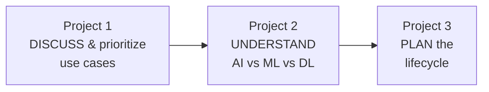

Take your **top use case from Project 1**, make sure you can classify its AI type using **Project 2's** knowledge, then **plan it stage-by-stage in Project 3**. That's a complete "think like an AI engineer" workflow.

---

## 15. Common Misconceptions & Myths

As a future professional, you should be able to **correct** these common myths. They come up constantly in the media and in conversation.

| ❌ Myth | ✅ Reality |
|---|---|
| "AI is conscious / thinks like a human." | All AI today is **Narrow AI** — pattern-matching software with no consciousness, understanding, or feelings. |
| "AI and Machine Learning are the same thing." | ML is a **subset** of AI. All ML is AI; not all AI is ML (some AI is rule-based). |
| "AI will replace all jobs immediately." | AI **automates tasks**, not whole jobs, and creates new roles. It shifts work more than it deletes it. |
| "AI is always objective and unbiased." | AI **learns human biases** from data and can amplify them. It is only as fair as its data. |
| "You need a PhD and advanced math to work in AI." | Many high-value AI roles need **applied** skills (Python, tools, lifecycle thinking) — exactly what this program teaches. |
| "More data always means a better model." | **Quality beats quantity.** Bad or biased data makes models worse, no matter how much you have. |
| "AI can predict anything." | AI predicts patterns it has seen before. It struggles with truly novel situations and can't foresee random events. |
| "ChatGPT/Claude are always right." | They **hallucinate** — state false things confidently. Always verify important outputs. |
| "AGI (human-level AI) is here." | It is **not**. AGI remains an unsolved research goal as of 2026. |

> **The single most valuable mindset from this module:** treat AI as a **powerful but limited tool** — neither magic nor a threat, but a technology you can learn to build and use responsibly.

---

## 16. Glossary

| Term | Meaning |
|---|---|
| **Artificial Intelligence (AI)** | Making machines perform tasks that require human intelligence. |
| **Machine Learning (ML)** | A subset of AI where machines learn patterns from data. |
| **Deep Learning (DL)** | A subset of ML using multi-layer neural networks. |
| **Data Science** | Extracting insight and value from data (overlaps AI + statistics). |
| **ANI / AGI / ASI** | Narrow / General / Super Artificial Intelligence (capability levels). |
| **Supervised Learning** | Learning from labeled data (input + correct answer). |
| **Unsupervised Learning** | Finding patterns in unlabeled data. |
| **Reinforcement Learning** | Learning by trial and error using rewards and penalties. |
| **Classification** | Predicting a category (spam / not spam). |
| **Regression** | Predicting a number (price, temperature). |
| **Clustering** | Grouping similar items without labels. |
| **Feature** | An input variable used to make a prediction. |
| **Label / Target** | The answer a model is trained to predict. |
| **Model** | The learned "rules" produced by training an ML algorithm. |
| **Training** | The process of a model learning patterns from data. |
| **Neural Network** | A brain-inspired model of connected "neurons" in layers. |
| **Structured / Unstructured data** | Tabular data vs images/audio/free text. |
| **Big Data** | Datasets too large/complex for ordinary tools (the 5 V's). |
| **AI Lifecycle** | The 7 stages from problem definition to deployment & monitoring. |
| **Generative AI** | AI that creates new content (text, images, code). |
| **Predictive / Discriminative AI** | AI that classifies or predicts, rather than creates. |
| **LLM** | Large Language Model — the deep-learning model behind chatbots. |
| **Transformer** | The neural-network architecture (2017) behind modern LLMs. |
| **Foundation Model** | A large model trained broadly, then adapted to many tasks. |
| **AI Agent** | An AI that takes actions and uses tools to complete multi-step goals. |
| **Prompt** | The instruction/question given to a generative AI model. |
| **Hallucination** | When an AI confidently produces false information. |
| **Bias** | Systematic unfairness a model learns from skewed data. |
| **Responsible AI** | Building AI that is fair, transparent, private, and accountable. |
| **Garbage In, Garbage Out** | Bad input data always produces bad model output. |

---

## 17. Practice Exercises & Self-Assessment

### 17.1 Concept checks (write one or two sentences each)

1. Define AI, ML, and DL, and explain how they are nested.
2. Give one everyday example each of classification, regression, and clustering.
3. Why is *all* current AI considered "Narrow" (ANI)?
4. Explain the difference between supervised and unsupervised learning with your own example.
5. What is the difference between Generative AI and Predictive AI?
6. Why is data quality more important than data quantity?
7. List the 7 stages of the AI project lifecycle in order.
8. Explain "Garbage In, Garbage Out" in the context of bias.

### 17.2 Classify these scenarios (AI type / paradigm)

For each, name the category (Rule-based AI, Supervised, Unsupervised, Reinforcement, Deep Learning, Generative):

9. Netflix grouping viewers with similar taste. → ?
10. Predicting tomorrow's temperature from weather history. → ?
11. A robot learning to walk by trying and falling. → ?
12. An AI writing a poem about the ocean. → ?
13. A thermostat that turns on heating below 18 °C using a fixed rule. → ?
14. Recognizing handwritten digits with a neural network. → ?

*(Answers: 9-Unsupervised/clustering, 10-Supervised/regression, 11-Reinforcement, 12-Generative, 13-Rule-based AI, 14-Deep Learning.)*

### 17.3 Applied / discussion tasks

15. Pick an industry and list **3 realistic AI use cases**; score each for impact & feasibility (use **Project 1**).
16. Choose one use case and map it through **all 7 lifecycle stages** (use **Project 3**).
17. Find **one news headline** about AI this week and identify: Is it Narrow or General AI? Which paradigm? Any ethical concern?
18. Describe one **ethical risk** of an AI you use daily, and how you'd reduce it.

### 17.4 Hands-on

19. Complete all three module projects and get **8/10 or higher** on the quiz (**Project 2**).
20. Add **2 of your own questions** to the quiz's question bank.

### 17.5 Quick self-check quiz

1. Which is broadest: AI, ML, or DL? *(→ AI)*
2. Labeled data is used in which paradigm? *(→ Supervised)*
3. Does AGI exist in 2026? *(→ No)*
4. Predicting a house price is classification or regression? *(→ Regression)*
5. What architecture powers modern LLMs? *(→ Transformer)*
6. What does "hallucination" mean for an AI? *(→ confidently stating false info)*
7. Roughly what % of data-science time is data cleaning? *(→ ~80%)*
8. Name the last stage of the AI lifecycle. *(→ Deployment & Monitoring)*

### 17.6 Solutions & Answer Key

> This is a concepts module, so most answers are short explanations. Try to answer in your own words first, then compare.

**17.1 Concept checks**

1. **AI, ML, DL nesting:** AI is any technique that makes machines act intelligently. ML is a *subset* of AI where machines learn patterns from data instead of being hand-coded. DL is a *subset* of ML that uses many-layered neural networks. So **DL ⊂ ML ⊂ AI** — every DL system is ML, every ML system is AI, but not the reverse.
2. **Examples:** *Classification* → spam vs not-spam email. *Regression* → predicting a house's price. *Clustering* → grouping customers into segments by behavior.
3. **Why all current AI is Narrow (ANI):** every system today — even ChatGPT/Claude — is specialized at particular tasks and cannot generalize across *any* task the way a human can. General intelligence (AGI) does not exist yet.
4. **Supervised vs unsupervised:** Supervised learns from **labeled** data (e.g., emails tagged spam/not-spam → predict the label). Unsupervised finds structure in **unlabeled** data (e.g., group shoppers into segments with no predefined groups).
5. **Generative vs Predictive AI:** Predictive/discriminative AI **classifies or predicts** ("is this spam?", "what's the price?"). Generative AI **creates new content** (text, images, code).
6. **Quality > quantity:** models learn patterns *from* the data — "garbage in, garbage out." A huge but biased/incorrect dataset teaches wrong patterns, while a smaller clean, representative one teaches right ones.
7. **7 lifecycle stages:** (1) Problem Definition, (2) Data Collection, (3) Data Preparation/Cleaning, (4) EDA & Feature Engineering, (5) Model Building & Training, (6) Model Evaluation, (7) Deployment & Monitoring.
8. **"Garbage In, Bias Out":** if training data reflects human bias (e.g., biased past hiring), the model *learns and amplifies* that bias at scale — with a false air of objectivity because "the computer decided."

**17.2 Classify the scenarios** — answers are shown inline: 9-Unsupervised (clustering), 10-Supervised (regression), 11-Reinforcement, 12-Generative, 13-Rule-based AI, 14-Deep Learning.

**17.3 Applied / discussion** *(sample answers — yours will differ)*

15. **Healthcare example:** (a) Detect tumors in scans — *impact 5, feasibility 3*; (b) Appointment no-show prediction — *impact 3, feasibility 4*; (c) Chatbot for FAQs — *impact 3, feasibility 5*. Priority score = impact × feasibility → the FAQ chatbot and no-show predictor are "quick wins," tumor detection is a "big bet."
16. **Lifecycle map (no-show prediction):** *Define* "predict which patients miss appointments" → *Collect* 2 yrs of booking + attendance data → *Prepare* clean dates, fill gaps → *EDA* find that distance & prior no-shows matter → *Build* a classifier → *Evaluate* on unseen data (recall matters) → *Deploy* a daily at-risk list + monitor.
17. **News-headline analysis:** any current AI story describes **Narrow AI** (not AGI). Identify the paradigm (a chatbot = generative; a fraud detector = supervised classification) and one ethical angle (bias, privacy, misinformation, or job impact).
18. **Everyday ethical risk (sample):** a recommendation feed can create filter bubbles/bias. *Reduce it* by adding diversity to recommendations, being transparent, and giving users control over what they see.

**17.4 Hands-on** — 19 & 20 are completed against the module's Project 2 (the quiz) — add your own scenario questions to its `QUESTIONS` list following the existing dictionary format.

**17.5 Quiz** — answers are shown inline next to each question above.

> **Ready for Module 3 when:** you can explain AI vs ML vs DL to a friend, classify any scenario into a paradigm, list the 7 lifecycle stages, and you've completed all three projects.

---

## 18. Summary & What's Next

### 18.1 Module 2 in one picture

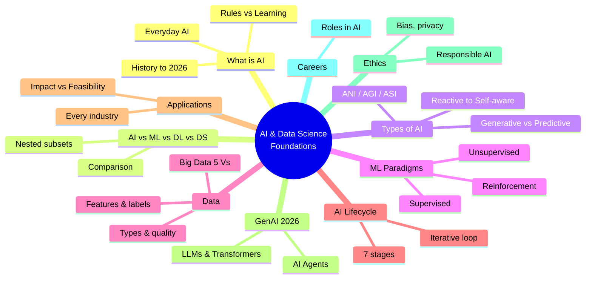

### 18.2 Key takeaways

- **AI is the umbrella; ML is inside it; DL is inside ML.** Data Science overlaps them all.
- **All AI in 2026 is Narrow AI** — powerful but specialized. AGI does not exist yet.
- **Three learning paradigms:** supervised (labeled), unsupervised (patterns), reinforcement (rewards).
- **Data is the fuel** — and *quality* beats quantity. Garbage in, garbage out.
- **Every AI project follows a 7-stage lifecycle** — and modeling is only one stage.
- **Generative AI and AI Agents** define the 2026 landscape, built on LLMs and Transformers.
- **Ethics is not optional** — bias, privacy, and accountability matter, and regulation is real.
- **The AI field has many roles** — this program lets you sample all of them.

### 18.3 Skills checklist

- [ ] I can define AI, ML, DL, and Data Science and how they relate.
- [ ] I can classify AI by capability (ANI/AGI/ASI) and functionality.
- [ ] I can identify supervised vs unsupervised vs reinforcement learning.
- [ ] I understand data types, data quality, features, and labels.
- [ ] I can list and explain the 7 stages of the AI lifecycle.
- [ ] I can give real industry use cases and prioritize them by impact/feasibility.
- [ ] I understand Generative AI, LLMs, and AI agents at a foundational level.
- [ ] I can name key AI ethics issues and responsible-AI principles.
- [ ] I completed all three hands-on projects.

### 18.4 Bridge to Module 3

You now have the **mental map** of the whole field. Next, in **Module 3 — Data Analysis & Visualization**, you'll roll up your sleeves and work with real data using **NumPy, Pandas, Matplotlib, and Seaborn** — putting stages 2, 3, and 4 of the AI lifecycle (data collection, preparation, and EDA) into practice. Everything becomes hands-on with data from here on.

> **Homework before Module 3:** complete the three projects; do concept checks 1–8 and the classification exercises 9–14; and bring **one real-world AI use case** you're excited about — we'll trace it through the lifecycle as the program continues.

---

### Instructor Notes (for the teaching team)

- **Suggested 4-hour split:** Hour 1 — What is AI + AI vs ML vs DL (§1–2); Hour 2 — Types of AI + ML paradigms + Data (§3–5); Hour 3 — AI Lifecycle + Applications + GenAI + Ethics + Careers (§6–10); Hour 4 — the three hands-on projects (§12–14), with the **AI Use Case Discussion** (Project 1) as the centerpiece group activity.
- **Teaching approach:** this is a *concepts* module — lean on **discussion, examples, and the diagrams**. Ask students for their own everyday-AI examples. Use the myths table (§15) as a lively "true or false" warm-up.
- **The core activity:** run Project 1 (AI Use Case Explorer) as a **team exercise** — groups brainstorm and defend impact/feasibility scores. This is the syllabus's "AI Use Case Discussion."
- **Assessment:** the quiz (Project 2) gives an instant, objective concept check; concept questions 1–8 and classification 9–14 make good classwork; Project 3 planning can be a take-home.
- **Keep it current:** briefly show a *live* AI tool (ChatGPT/Claude/Gemini) and point out it is Narrow AI that can hallucinate — a memorable, concrete reinforcement of §3 and §15.
- **Bridge:** end by connecting the lifecycle (§6) to the rest of the program so students see the roadmap.

---

*End of Module 2 — AI & Data Science Foundations.*
*AI Powered Engineering Upskilling Program · 2026 Edition.*
