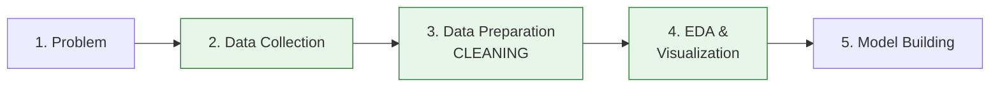
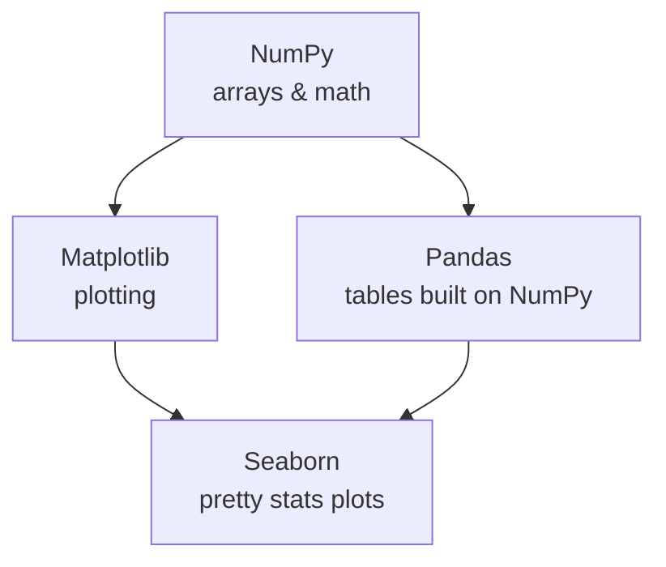
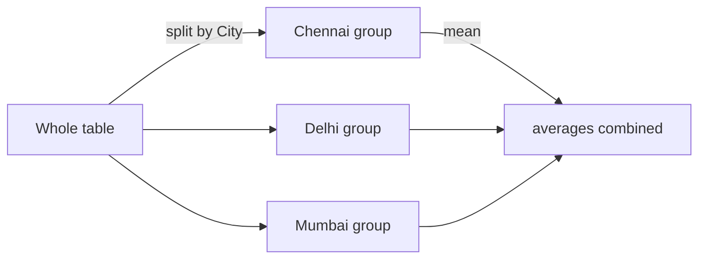
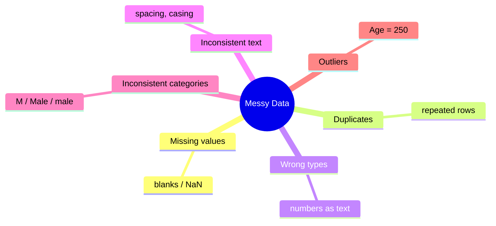
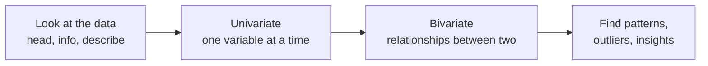
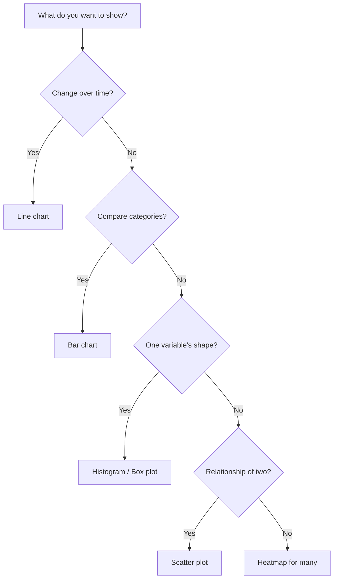
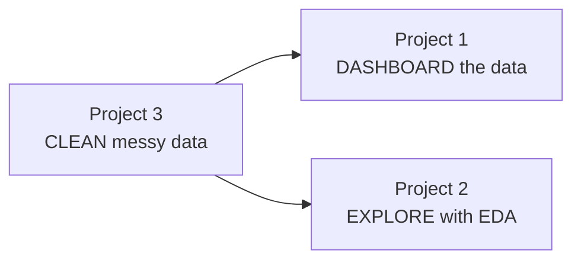
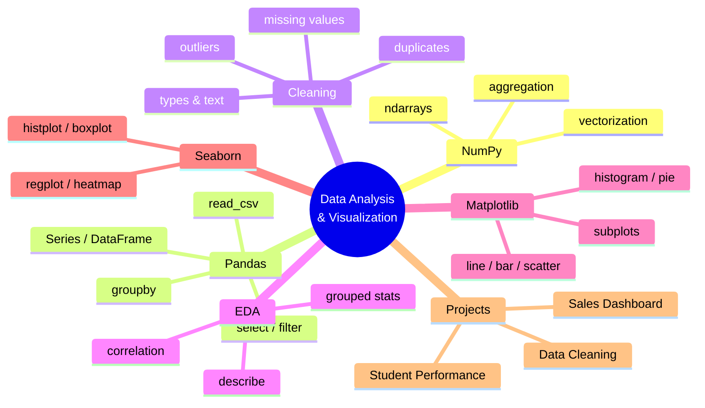

# Module 3 — Data Analysis & Visualization

> **AI Powered Engineering Upskilling Program**
> *From Fundamentals to Generative AI Applications*

---

## Module Information Card

| Field | Detail |
|---|---|
| **Module Number** | 3 of 10 |
| **Module Title** | Data Analysis & Visualization |
| **Duration** | 8 Hours (≈ 1.5 training days) |
| **Level** | Beginner → Intermediate |
| **Target Audience** | Engineering students, age 19–20 |
| **Prerequisites** | Module 1 (Python), Module 2 (AI/data concepts) |
| **Library Versions (2026)** | NumPy 2.x · Pandas 3.x · Matplotlib 3.x · Seaborn 0.13+ |
| **Primary Tools** | Python, Jupyter/Colab, VS Code, Anaconda |
| **Learning Outcome** | Analyze and visualize data. |
| **Hands-on Activities (syllabus)** | Sales Dashboard · Student Performance Analysis |
| **Hands-on Projects (this course)** | (1) Sales Dashboard · (2) Student Performance Analysis · (3) Data Cleaning Workshop |

### What you will be able to do after this module

1. Set up and use the professional Python data stack (**NumPy, Pandas, Matplotlib, Seaborn**).
2. Create and manipulate **NumPy arrays** for fast numerical computing.
3. Load, inspect, select, and filter data with **Pandas DataFrames**.
4. **Clean** messy real-world data: missing values, duplicates, wrong types, outliers.
5. Perform **Exploratory Data Analysis (EDA)** — summary statistics and correlations.
6. Build clear **visualizations**: line, bar, scatter, histogram, pie, boxplot, heatmap.
7. Choose the **right chart** for the question you're answering.
8. Deliver a complete **data pipeline**: raw data → clean → analyze → visualize → report.

> **How to use these notes**: This module is **hands-on**. Open Jupyter Notebook or Google Colab and **run every example as you read**. Data skills are built by *doing*, not watching. Every `# ->` comment shows the expected output.

---

## Table of Contents

1. [Why Data Analysis & Visualization for AI](#1-why-data-analysis--visualization-for-ai)
2. [Setting Up the Data Science Environment](#2-setting-up-the-data-science-environment)
3. [NumPy — Numerical Python](#3-numpy--numerical-python)
4. [Pandas — Series & DataFrame](#4-pandas--series--dataframe)
5. [Pandas — Manipulating & Aggregating Data](#5-pandas--manipulating--aggregating-data)
6. [Data Cleaning — The 80% Job](#6-data-cleaning--the-80-job)
7. [Exploratory Data Analysis (EDA)](#7-exploratory-data-analysis-eda)
8. [Data Visualization with Matplotlib](#8-data-visualization-with-matplotlib)
9. [Data Visualization with Seaborn](#9-data-visualization-with-seaborn)
10. [Choosing the Right Chart](#10-choosing-the-right-chart)
11. [Hands-on Activities Overview](#11-hands-on-activities-overview)
12. [Hands-on Project 1 — Sales Dashboard](#12-hands-on-project-1--sales-dashboard)
13. [Hands-on Project 2 — Student Performance Analysis](#13-hands-on-project-2--student-performance-analysis)
14. [Hands-on Project 3 — Data Cleaning Workshop](#14-hands-on-project-3--data-cleaning-workshop)
15. [Best Practices & Common Mistakes](#15-best-practices--common-mistakes)
16. [Glossary](#16-glossary)
17. [Practice Exercises & Self-Assessment](#17-practice-exercises--self-assessment)
18. [Summary & What's Next](#18-summary--whats-next)

---

## 1. Why Data Analysis & Visualization for AI

### 1.1 The connection to everything

In **Module 2** you learned that **data is the fuel of AI** and that an AI project follows a 7-stage lifecycle. This module is where you actually *work with data* — it covers **stages 2, 3, and 4** of that lifecycle:



Before *any* machine-learning model (Module 4) can be trained, the data must be **collected, cleaned, and understood**. That is the job of a **Data Analyst** and **Data Scientist**, and it is what you learn here.

### 1.2 Why visualization matters

Humans are visual creatures. A table of 10,000 numbers means nothing; a single well-made chart can reveal a trend instantly. Consider **Anscombe's Quartet** — four datasets with *identical* averages and statistics, but which look completely different when plotted. The lesson: **always visualize your data; summary numbers alone can lie.**

### 1.3 The four tools you'll master

| Library | Nickname | What it's for |
|---|---|---|
| **NumPy** | Numerical Python | Fast math on arrays of numbers — the foundation everything else sits on |
| **Pandas** | Panel Data | Working with tables (rows & columns) — loading, cleaning, analyzing |
| **Matplotlib** | — | The original, flexible plotting library — draws any chart |
| **Seaborn** | — | Built on Matplotlib — beautiful **statistical** charts in one line |



> **Key relationship:** Pandas is *built on* NumPy, and Seaborn is *built on* Matplotlib. Learning them in this order — NumPy → Pandas → Matplotlib → Seaborn — means each new tool stands on the last.

---

## 2. Setting Up the Data Science Environment

### 2.1 Installing the libraries

Unlike Modules 1–2 (which used only Python's built-in modules), this module needs **external libraries**. Install all four at once:

```bash
pip install numpy pandas matplotlib seaborn
```

If you use **Anaconda**, these come pre-installed. If you use **Google Colab**, they're *already there* — zero setup, which is why Colab is perfect for this module.

### 2.2 Jupyter Notebook / Colab — the data scientist's workspace

Data work is **exploratory**: you try something, see the result, adjust, repeat. **Jupyter Notebook** (and its cloud twin **Google Colab**) is built exactly for this — you write code in **cells** and see output (including charts) right below each cell.

```bash
pip install jupyter      # then run:
jupyter notebook         # opens in your browser
```

Or just open **[colab.research.google.com](https://colab.research.google.com)** — nothing to install.

### 2.3 The standard import conventions

Every data scientist imports these libraries with the **same short aliases**. Learn these — you'll see them in *all* real code:

```python
import numpy as np             # 'np' is the universal alias for NumPy
import pandas as pd            # 'pd' for Pandas
import matplotlib.pyplot as plt # 'plt' for Matplotlib's plotting module
import seaborn as sns          # 'sns' for Seaborn
```

- `import numpy as np` loads NumPy and lets you type `np.array(...)` instead of `numpy.array(...)`.
- These aliases are a **convention**, not a rule — but everyone follows them, so you should too.

### 2.4 Common data file formats you'll meet

Data comes in several formats. Know what each is and which Pandas loader reads it:

| Format | Extension | What it is | Pandas loader |
|---|---|---|---|
| **CSV** | `.csv` | Comma-Separated Values — plain-text table (the most common) | `pd.read_csv()` |
| **Excel** | `.xlsx` | Spreadsheet workbook | `pd.read_excel()` |
| **JSON** | `.json` | Structured text, common in web APIs (Module 7) | `pd.read_json()` |
| **Parquet** | `.parquet` | Compact, fast columnar format for big data | `pd.read_parquet()` |
| **SQL** | (database) | Tables in a database | `pd.read_sql()` |

> **Where to get real datasets to practise:** [Kaggle Datasets](https://www.kaggle.com/datasets), [Google Dataset Search](https://datasetsearch.research.google.com), and government open-data portals. Grab a CSV that interests you (sports, movies, weather) and follow along.

### 2.5 A note for these notes

The examples below assume you've run those four imports. Every output is shown with a `# ->` comment so you can check your work.

---

## 3. NumPy — Numerical Python

### 3.1 What is NumPy and why do we need it?

**NumPy** (Numerical Python) is the foundational library for numerical computing in Python. Its core gift is the **ndarray** (n-dimensional array) — a grid of numbers that is **far faster and more memory-efficient** than a normal Python list.

**Why not just use Python lists?** Two reasons:

| | Python list | NumPy array |
|---|---|---|
| Speed | Slow (loops in Python) | **10–100× faster** (optimized C under the hood) |
| Math | Must loop item by item | **Whole-array operations** in one line |
| Memory | Large | Compact |

Every AI/ML library (Pandas, TensorFlow, PyTorch, Scikit-learn) is built on NumPy arrays. **Images are NumPy arrays. Audio is a NumPy array. Model weights are NumPy arrays.** This is bedrock.

### 3.2 Creating arrays

```python
import numpy as np

a = np.array([1, 2, 3, 4, 5])          # a 1-D array from a list
print(a)          # -> [1 2 3 4 5]
print(type(a))    # -> <class 'numpy.ndarray'>

b = np.array([[1, 2, 3], [4, 5, 6]])   # a 2-D array (a matrix: 2 rows, 3 cols)
print(b)
# -> [[1 2 3]
#     [4 5 6]]
```

**Handy array-creation functions:**

```python
np.zeros(5)          # -> [0. 0. 0. 0. 0.]      (five zeros)
np.ones((2, 3))      # -> a 2x3 array of ones
np.arange(0, 10, 2)  # -> [0 2 4 6 8]           (like range(), but an array)
np.linspace(0, 1, 5) # -> [0.   0.25 0.5  0.75 1.  ]  (5 evenly spaced values)
np.random.default_rng(42).integers(1, 7, 5)  # -> 5 random dice rolls, e.g. [1 6 2 6 5]
```

- `np.zeros`/`np.ones` create arrays filled with 0 or 1 — useful as starting points.
- `np.arange(start, stop, step)` is NumPy's version of `range()`.
- `np.linspace(start, stop, count)` splits a range into a fixed *number* of points — great for plotting.

### 3.3 Array attributes

Every array knows its own shape and type:

```python
b = np.array([[1, 2, 3], [4, 5, 6]])
print(b.shape)   # -> (2, 3)   (2 rows, 3 columns)
print(b.ndim)    # -> 2        (number of dimensions)
print(b.size)    # -> 6        (total number of elements)
print(b.dtype)   # -> int64    (the data type of the elements)
```

- `shape` is the single most-used attribute in all of data science — it tells you the size of your data.

### 3.4 Indexing and slicing

Works like Python lists, but extends to multiple dimensions:

```python
a = np.array([10, 20, 30, 40, 50])
print(a[0])      # -> 10     (first element)
print(a[-1])     # -> 50     (last element)
print(a[1:4])    # -> [20 30 40]   (slice: index 1 up to 4)

b = np.array([[1, 2, 3], [4, 5, 6]])
print(b[0, 1])   # -> 2      (row 0, column 1)
print(b[:, 0])   # -> [1 4]  (all rows, column 0 -> a whole column!)
print(b[1, :])   # -> [4 5 6](row 1, all columns -> a whole row)
```

- For 2-D arrays, use `array[row, column]`. A colon `:` means "everything along this dimension".

### 3.5 Vectorized operations — NumPy's superpower

This is what makes NumPy special: math applies to the **whole array at once**, with no loops.

```python
a = np.array([1, 2, 3, 4])
print(a + 10)    # -> [11 12 13 14]   (add 10 to EVERY element)
print(a * 2)     # -> [2 4 6 8]       (double every element)
print(a ** 2)    # -> [ 1  4  9 16]   (square every element)

b = np.array([10, 20, 30, 40])
print(a + b)     # -> [11 22 33 44]   (element-by-element addition)
```

Compare — the "slow" Python way needs a loop; NumPy does it in one clean expression:

```python
# Python list way (slow, verbose):
result = []
for x in [1, 2, 3, 4]:
    result.append(x * 2)

# NumPy way (fast, one line):
result = np.array([1, 2, 3, 4]) * 2
```

### 3.6 Aggregation functions (statistics in one call)

```python
data = np.array([15, 22, 8, 19, 31, 12])
print(data.sum())    # -> 107
print(data.mean())   # -> 17.833...   (average)
print(data.min())    # -> 8
print(data.max())    # -> 31
print(data.std())    # -> standard deviation (how spread out the data is)
print(np.median(data))  # -> 17.0     (middle value)
```

For 2-D arrays you can aggregate along a specific **axis**:

```python
b = np.array([[1, 2, 3], [4, 5, 6]])
print(b.sum())         # -> 21   (everything)
print(b.sum(axis=0))   # -> [5 7 9]   (sum down each COLUMN)
print(b.sum(axis=1))   # -> [ 6 15]   (sum across each ROW)
```

- `axis=0` = "collapse the rows" → per-column result. `axis=1` = "collapse the columns" → per-row result. This trips up beginners; remember `axis=0` goes *down*.

### 3.7 Boolean masking (filtering)

You can filter an array with a condition — a preview of how you'll filter data in Pandas:

```python
data = np.array([15, 22, 8, 19, 31, 12])
print(data > 20)          # -> [False  True False False  True False]
print(data[data > 20])    # -> [22 31]   (keep only values greater than 20)
```

- `data > 20` creates a **mask** of True/False; `data[mask]` keeps only the True positions.

### 3.8 Reshaping and combining arrays

The same numbers can be **reshaped** into different dimensions — vital when preparing data for models (an image can be flattened into a row, for example):

```python
a = np.arange(1, 13)          # -> [ 1  2  3  4  5  6  7  8  9 10 11 12]
b = a.reshape(3, 4)           # reshape into 3 rows x 4 columns
print(b)
# -> [[ 1  2  3  4]
#     [ 5  6  7  8]
#     [ 9 10 11 12]]

print(b.reshape(-1))          # -> flatten back to 1-D ([1..12]); -1 means "figure it out"
```

- `reshape(rows, cols)` rearranges the data (the total number of elements must match).
- `reshape(-1)` **flattens** any array to 1-D — you'll use this to turn images into feature vectors in Module 5.

**Combining arrays:**

```python
x = np.array([1, 2, 3])
y = np.array([4, 5, 6])
np.concatenate([x, y])        # -> [1 2 3 4 5 6]   (join end to end)
np.vstack([x, y])             # -> stack as rows:    [[1 2 3], [4 5 6]]
np.hstack([x, y])             # -> [1 2 3 4 5 6]     (horizontal join)
```

### 3.9 `np.where` and generating random data

**`np.where(condition, value_if_true, value_if_false)`** builds a new array by choosing per element — a vectorized `if/else`:

```python
marks = np.array([85, 32, 67, 40, 25])
result = np.where(marks >= 40, "Pass", "Fail")
print(result)   # -> ['Pass' 'Fail' 'Pass' 'Pass' 'Fail']
```

You'll use `np.where` constantly to create labels and flags (it appears in this module's Student Performance project).

**Generating random data** is essential for testing and simulations. The modern way uses a **random generator** with a fixed *seed* so results are reproducible:

```python
rng = np.random.default_rng(42)     # 42 = the seed -> everyone gets the same numbers
rng.integers(1, 7, size=5)          # -> 5 dice rolls, e.g. [1 6 2 6 5]
rng.normal(loc=50, scale=10, size=5)# -> 5 values from a bell curve (mean 50, sd 10)
rng.choice(["A", "B", "C"], size=4) # -> random picks, e.g. ['B' 'A' 'C' 'A']
```

- Seeding (`default_rng(42)`) makes random results **reproducible** — critical in data science so your experiments can be repeated. All three hands-on projects use a seed so your data matches these notes.

> **Why this matters for AI:** every image you'll process in Module 5 is a NumPy array of pixel values; every dataset is a grid of numbers; model outputs are arrays you reshape and threshold with `np.where`. The array thinking you build here underpins all of it.

---

## 4. Pandas — Series & DataFrame

### 4.1 What is Pandas?

**Pandas** is *the* library for working with **structured (tabular) data** — data in rows and columns, like a spreadsheet or database table. If NumPy gives you fast arrays of numbers, Pandas gives you a **labelled table** you can slice, filter, group, and clean with ease. It is the single most-used tool in a data scientist's day.

Pandas has two core objects:

| Object | What it is | Analogy |
|---|---|---|
| **Series** | A single column of data (1-D) with labels | One column of a spreadsheet |
| **DataFrame** | A full table (2-D) — many columns | The whole spreadsheet |

### 4.2 The Series

```python
import pandas as pd

marks = pd.Series([85, 92, 78, 90], index=["Math", "Science", "English", "AI"])
print(marks)
# -> Math       85
#    Science    92
#    English    78
#    AI         90
#    dtype: int64

print(marks["Science"])   # -> 92    (access by label)
print(marks.mean())       # -> 86.25 (Series have built-in stats too)
```

- A Series is like a NumPy array **plus an index (labels)** for each value.

### 4.3 The DataFrame — the star of the show

A **DataFrame** is a table. The most common way to create one is from a **dictionary**, where each key is a column:

```python
data = {
    "Name": ["Aarav", "Diya", "Kabir", "Meera"],
    "Age": [20, 21, 19, 22],
    "Marks": [85, 92, 78, 90],
    "City": ["Chennai", "Delhi", "Mumbai", "Pune"],
}
df = pd.DataFrame(data)
print(df)
# ->      Name  Age  Marks     City
#    0   Aarav   20     85  Chennai
#    1    Diya   21     92    Delhi
#    2   Kabir   19     78   Mumbai
#    3   Meera   22     90     Pune
```

Notice Pandas automatically added an **index** (0, 1, 2, 3) on the left — the row numbers.

### 4.4 Reading real data from files

In practice you rarely type data by hand — you **load it from a file**. This one line is the workhorse of data science:

```python
df = pd.read_csv("sales.csv")        # load a CSV file into a DataFrame
# Other loaders:
# pd.read_excel("data.xlsx")         # Excel files
# pd.read_json("data.json")          # JSON files
```

> Remember Module 1's File Processing project, where you read a CSV line-by-line with the `csv` module? `pd.read_csv()` does all of that — and far more — in **one line**. This is the power of Pandas.

### 4.5 Inspecting a DataFrame (always do this first)

The moment you load data, you *inspect* it. These commands are your first five moves on any dataset:

```python
df.head()        # first 5 rows (df.head(10) for 10)
df.tail()        # last 5 rows
df.shape         # -> (4, 4)   (rows, columns)
df.columns       # -> the column names
df.info()        # column names, data types, and non-null counts
df.describe()    # summary statistics for every numeric column
df.dtypes        # the data type of each column
```

`df.describe()` is especially valuable — it instantly gives count, mean, std, min, max, and quartiles:

```python
print(df.describe())
# ->              Age      Marks
#    count   4.000000   4.000000
#    mean   20.500000  86.250000
#    std     1.290994   6.130525
#    min    19.000000  78.000000
#    ...
```

### 4.6 Selecting columns and rows

```python
# --- Selecting COLUMNS ---
df["Name"]                 # one column (returns a Series)
df[["Name", "Marks"]]      # multiple columns (note the double brackets -> a DataFrame)

# --- Selecting ROWS by position with .iloc ---
df.iloc[0]                 # the first row
df.iloc[0:2]               # the first two rows

# --- Selecting ROWS by label with .loc ---
df.loc[0]                  # row with index label 0
df.loc[0, "Name"]          # a single cell: row 0, column "Name"
```

- **`.loc`** selects by **label** (name); **`.iloc`** selects by **integer position**. Remember: **l**oc = **l**abel, **i**loc = **i**nteger.

### 4.7 Filtering rows with conditions (the most-used skill)

This is how you answer questions like "show me all students who passed":

```python
# Students with marks above 85:
high = df[df["Marks"] > 85]
print(high)
# ->     Name  Age  Marks   City
#    1   Diya   21     92  Delhi
#    3  Meera   22     90   Pune

# Combine conditions with & (and) / | (or) — each condition in ( ):
df[(df["Marks"] > 80) & (df["Age"] < 21)]   # marks>80 AND age<21
```

- `df["Marks"] > 85` builds a True/False mask (just like NumPy §3.7); `df[mask]` keeps the True rows.
- ⚠️ Use `&` and `|` (not `and`/`or`) for combining, and wrap each condition in **parentheses**.

### 4.8 Creating and exporting DataFrames

You'll build DataFrames from several sources and save your results back out:

```python
# From a dictionary of columns (most common):
pd.DataFrame({"Name": ["A", "B"], "Score": [90, 85]})

# From a list of dictionaries (each dict = one row):
pd.DataFrame([{"Name": "A", "Score": 90}, {"Name": "B", "Score": 85}])

# Exporting your cleaned/analyzed data:
df.to_csv("cleaned.csv", index=False)     # index=False = don't write row numbers
df.to_excel("report.xlsx", index=False)   # needs: pip install openpyxl
df.to_json("data.json", orient="records") # for web / APIs
```

- `index=False` is almost always what you want when saving a CSV — otherwise Pandas adds an extra unnamed column of row numbers.

---

## 5. Pandas — Manipulating & Aggregating Data

### 5.1 Adding and modifying columns

```python
# Create a new column from existing ones:
df["Passed"] = df["Marks"] >= 40          # a True/False column
df["Grade"] = df["Marks"] / 10            # a computed column

# Apply a custom function to a column with .apply():
def grade_letter(mark):
    if mark >= 90: return "A"
    elif mark >= 75: return "B"
    else: return "C"

df["Letter"] = df["Marks"].apply(grade_letter)
print(df[["Name", "Marks", "Letter"]])
# ->     Name  Marks Letter
#    0   Aarav     85      B
#    1    Diya     92      A
#    ...
```

- `.apply(function)` runs your function on every value in the column — a bridge to the functions you wrote in Module 1.

### 5.2 Sorting

```python
df.sort_values("Marks")                      # ascending (low to high)
df.sort_values("Marks", ascending=False)     # descending (high to low)
df.sort_values(["City", "Marks"])            # by City, then Marks
```

### 5.3 GroupBy — the most powerful analysis tool

**GroupBy** answers questions like *"what is the average mark **per city**?"*. It works in three steps: **split** the data into groups, **apply** a calculation to each, and **combine** the results.



```python
# Average marks per city:
df.groupby("City")["Marks"].mean()

# Count of students per city:
df.groupby("City").size()

# Multiple statistics at once:
df.groupby("City")["Marks"].agg(["mean", "min", "max", "count"])
```

This one tool powers nearly every dashboard and report you'll ever build — including this module's Sales Dashboard project.

### 5.4 Useful summarizing methods

```python
df["City"].value_counts()     # how many rows of each city (great for categories)
df["Marks"].sum()             # total
df["Marks"].mean()            # average
df["Marks"].max()             # highest
df["Marks"].nlargest(3)       # top 3 values
df["Marks"].unique()          # the distinct values
df["City"].nunique()          # count of distinct cities
```

### 5.5 Combining tables (a quick preview)

Real projects often join multiple tables (like a database). Pandas does this with `merge` (like a SQL join) and `concat` (stacking):

```python
pd.merge(orders, customers, on="customer_id")   # join two tables on a shared key
pd.concat([jan_sales, feb_sales])               # stack two tables on top of each other
```

You don't need to master joins now — just know Pandas can combine data sources when you need it.

### 5.6 Pivot tables & cross-tabulation

A **pivot table** summarizes data across two dimensions — exactly like the pivot tables in Excel. It answers questions like *"average marks by city AND gender."*

```python
df.pivot_table(values="Marks", index="City", columns="Gender", aggfunc="mean")
# ->            Female   Male
#    City
#    Chennai      88.0   79.0
#    Delhi        92.0   84.0
```

- `values` = what to summarize, `index` = rows, `columns` = columns, `aggfunc` = the calculation (mean, sum, count…).

**Cross-tabulation** (`crosstab`) counts combinations of two categories — great for seeing how categories relate:

```python
pd.crosstab(df["City"], df["Result"])   # how many Pass/Fail in each city
# -> Result   Fail  Pass
#    City
#    Chennai     1     3
#    Delhi       0     4
```

### 5.7 Working with dates

Time data is everywhere (sales dates, timestamps, logs). Pandas has a powerful **`.dt` accessor** once a column is converted to datetime:

```python
df["Date"] = pd.to_datetime(df["Date"])   # convert text -> real dates first
df["Year"]  = df["Date"].dt.year          # extract the year
df["Month"] = df["Date"].dt.month         # extract the month number
df["DayName"] = df["Date"].dt.day_name()  # -> "Monday", "Tuesday", ...

# Group sales by month (used in the Sales Dashboard project):
df["MonthLabel"] = df["Date"].dt.to_period("M").astype(str)  # -> "2025-01"
df.groupby("MonthLabel")["Revenue"].sum()
```

- `.dt.to_period("M")` buckets dates into months — the trick behind any "monthly trend" chart.

---

## 6. Data Cleaning — The 80% Job

In Module 2 you learned the golden rule: **"Garbage In, Garbage Out."** Real-world data is *always* messy — missing values, duplicates, typos, wrong formats. Data scientists spend about **80% of their time cleaning data**. Master this and you've mastered the most valuable, most-neglected data skill. (This section powers **Hands-on Project 3**.)

### 6.1 The common data problems



### 6.2 Finding missing values

Missing data shows up as **NaN** (Not a Number). Always check for it first:

```python
df.isna()                 # a True/False table of where values are missing
df.isna().sum()           # count of missing values PER column (most useful)
df.isna().sum().sum()     # total missing values in the whole table
```

```python
print(df.isna().sum())
# -> Name      0
#    Age       2      <- two ages are missing
#    Income    1      <- one income is missing
```

### 6.3 Handling missing values

You have two main strategies — **remove** or **fill**:

```python
# --- Strategy 1: DROP rows/columns with missing values ---
df.dropna()                     # drop any row that has a missing value
df.dropna(subset=["Age"])       # drop rows only where Age is missing

# --- Strategy 2: FILL missing values (usually better — keeps data) ---
df["Age"] = df["Age"].fillna(df["Age"].mean())     # fill with the average
df["Age"] = df["Age"].fillna(df["Age"].median())   # fill with the median (robust)
df["City"] = df["City"].fillna("Unknown")          # fill text with a placeholder
```

| Strategy | When to use |
|---|---|
| **Drop** | Few rows affected, or the row is unusable | 
| **Fill with mean** | Numeric data, roughly symmetric |
| **Fill with median** | Numeric data with outliers (more robust) |
| **Fill with mode/placeholder** | Categorical/text data |

> **Median vs Mean for filling:** the **median** (middle value) is *robust to outliers*. If one salary is ₹10,00,00,000, it drags the **mean** up wildly, but barely moves the median. For messy real data, median is often the safer fill.

### 6.4 Removing duplicates

```python
df.duplicated().sum()      # how many duplicate rows exist
df = df.drop_duplicates()  # remove exact duplicate rows
df = df.drop_duplicates(subset=["CustomerID"])   # duplicates by a key column
```

### 6.5 Fixing data types

A classic problem: numbers stored as text (`"50,000"`), so you can't do math on them.

```python
df["Income"] = df["Income"].str.replace(",", "")            # remove commas
df["Income"] = pd.to_numeric(df["Income"], errors="coerce") # text -> number
df["Date"] = pd.to_datetime(df["Date"], errors="coerce")    # text -> real dates
```

- `errors="coerce"` is important: any value that *can't* be converted becomes `NaN` instead of crashing the program — then you handle it as a missing value.

### 6.6 Cleaning text with the `.str` accessor

Text columns are full of inconsistencies. The `.str` accessor cleans a whole column at once:

```python
df["City"] = df["City"].str.strip()      # remove leading/trailing spaces
df["City"] = df["City"].str.title()      # "MUMBAI"/"mumbai" -> "Mumbai"
df["City"] = df["City"].str.lower()      # everything lowercase
df["Name"] = df["Name"].str.replace(r"\s+", " ", regex=True)  # collapse double spaces
```

**Standardizing categories** with `.map()`:

```python
gender_map = {"m": "Male", "male": "Male", "f": "Female", "female": "Female"}
df["Gender"] = df["Gender"].str.strip().str.lower().map(gender_map)
# Now "M", "male", "Male" all become the single clean value "Male".
```

### 6.7 Handling outliers

An **outlier** is a value far outside the normal range — often an error (Age = 250) or a genuine extreme. A simple approach: mark impossible values as missing, then fill them:

```python
df.loc[df["Age"] > 100, "Age"] = np.nan          # 250 is impossible -> NaN
df["Age"] = df["Age"].fillna(df["Age"].median()) # then fill with median
```

A more statistical approach uses the **IQR (Interquartile Range) rule**: values below `Q1 − 1.5×IQR` or above `Q3 + 1.5×IQR` are outliers. You'll see this in boxplots (§9).

### 6.8 A cleaning checklist

Before analyzing *any* dataset, run through this:

1. ☐ `df.info()` — check types and missing counts.
2. ☐ `df.isna().sum()` — handle missing values.
3. ☐ `df.drop_duplicates()` — remove duplicates.
4. ☐ Fix data types (`to_numeric`, `to_datetime`).
5. ☐ Clean text (`.str.strip()`, `.str.title()`).
6. ☐ Standardize categories (`.map()`).
7. ☐ Check for and handle outliers.

---

## 7. Exploratory Data Analysis (EDA)

### 7.1 What is EDA?

**Exploratory Data Analysis (EDA)** is the detective work of *understanding your data before modeling it*: What does it look like? What patterns exist? What relationships? EDA combines **summary statistics** (numbers) with **visualization** (charts) to build intuition. It is stage 4 of the AI lifecycle and the difference between a shallow and a deep data scientist.

### 7.2 The EDA workflow



### 7.3 Univariate analysis — one variable at a time

```python
# For NUMERIC columns:
df["Marks"].describe()      # count, mean, std, min, quartiles, max
df["Marks"].mean()          # center
df["Marks"].std()           # spread

# For CATEGORICAL columns:
df["City"].value_counts()             # frequency of each category
df["City"].value_counts(normalize=True)  # as proportions (%)
```

### 7.4 Bivariate analysis — relationships between two variables

The most important tool here is **correlation** — a number from **−1 to +1** that measures how strongly two numeric variables move together:

| Correlation | Meaning |
|---|---|
| **+1** | Perfect positive — when one goes up, the other goes up |
| **0** | No linear relationship |
| **−1** | Perfect negative — when one goes up, the other goes down |

```python
df["StudyHours"].corr(df["Marks"])   # -> e.g. 0.87 (strong positive)
df.corr(numeric_only=True)           # correlation between ALL numeric columns
```

- A correlation of **0.87** between study hours and marks means: *students who study more tend to score more* — visible as an upward trend in a scatter plot.

> ⚠️ **Correlation is not causation!** Ice-cream sales and drowning deaths are correlated — but ice cream doesn't cause drowning; hot weather drives both. Always think about *why* two things correlate.

### 7.5 Grouped analysis

Combining GroupBy (§5.3) with statistics is the core of EDA insight-finding:

```python
# Average marks by gender:
df.groupby("Gender")["Marks"].mean()

# Multiple stats per group:
df.groupby("City")["Income"].agg(["mean", "median", "count"])
```

### 7.6 What you're looking for in EDA

- **Distributions:** Is the data spread evenly, skewed, or bell-shaped?
- **Outliers:** Any suspicious extreme values?
- **Relationships:** Which variables predict the target? (crucial for Module 4)
- **Missing patterns:** Is missing data random or systematic?
- **Class balance:** For classification, are the categories evenly represented?

### 7.7 Understanding distribution shapes

When you look at a histogram, its **shape** tells a story. Learn to name these:

| Shape | Looks like | Meaning | Example |
|---|---|---|---|
| **Normal (bell)** | Symmetric hump in the middle | Values cluster around the average | Human heights |
| **Right-skewed** | Long tail to the right | A few very large values | Incomes, house prices |
| **Left-skewed** | Long tail to the left | A few very small values | Exam scores on an easy test |
| **Uniform** | Flat | All values equally likely | Dice rolls |
| **Bimodal** | Two humps | Two subgroups mixed together | Heights of a mixed-gender group |

```
  Normal (bell)        Right-skewed
      ___                _
     /   \              / \___
    /     \            /      \____
```

- **Skew matters:** for a **right-skewed** column (like income), the **median** describes the "typical" value far better than the mean — which is exactly why we fill such columns with the median (§6.3).

### 7.8 A worked mini-EDA

Putting it together on a student dataset — the thought process, not just the code:

```python
df = pd.read_csv("students.csv")

# 1) First look
df.shape            # -> (60, 7)          how big is it?
df.info()           # -> types + missing  any problems?
df.isna().sum()     # -> 3 missing marks  needs cleaning

# 2) Clean
df = df.fillna(df.median(numeric_only=True))

# 3) Univariate — understand single columns
df["Percentage"].describe()      # center & spread of scores
df["Gender"].value_counts()      # class balance

# 4) Bivariate — find relationships
df["StudyHours"].corr(df["Percentage"])   # -> 0.87  studying strongly helps
df.groupby("Gender")["Percentage"].mean() # any gender gap?

# 5) Conclusion (write it down!)
# "Scores are roughly normal (avg 52%). Study hours are the strongest driver
#  of performance (corr 0.87). No major gender gap. 3 values were imputed."
```

> **The habit to build:** always end an EDA by *writing one paragraph of findings in plain English.* Data science is worthless if you can't communicate what you found. This is a skill employers prize.

The insights you find in EDA directly shape the machine-learning models you'll build in **Module 4**.

---

## 8. Data Visualization with Matplotlib

### 8.1 Why Matplotlib?

**Matplotlib** is the original and most flexible Python plotting library. It can draw virtually any chart, and every other plotting library (including Seaborn) is built on it. We use its `pyplot` module, imported as `plt`.

### 8.2 Your first plot

```python
import matplotlib.pyplot as plt

x = [1, 2, 3, 4, 5]
y = [10, 25, 15, 30, 20]

plt.plot(x, y)              # draw a line connecting the points
plt.title("My First Plot") # add a title
plt.xlabel("Month")        # label the x-axis
plt.ylabel("Sales")        # label the y-axis
plt.show()                 # display the chart
```

- `plt.plot(x, y)` draws the data; the `title`/`xlabel`/`ylabel` calls **label** it (never leave a chart unlabelled!); `plt.show()` displays it.
- In a script (rather than a notebook), you can **save** instead of show: `plt.savefig("chart.png")`.

### 8.3 The main chart types

| Chart | Function | Best for |
|---|---|---|
| **Line** | `plt.plot()` | Trends over time |
| **Bar** | `plt.bar()` | Comparing categories |
| **Horizontal bar** | `plt.barh()` | Comparing many/long-named categories |
| **Scatter** | `plt.scatter()` | Relationship between two numbers |
| **Histogram** | `plt.hist()` | Distribution of one numeric variable |
| **Pie** | `plt.pie()` | Parts of a whole (use sparingly) |

```python
# Bar chart:
plt.bar(["North", "South", "East", "West"], [120, 90, 150, 80])
plt.title("Sales by Region")
plt.show()

# Histogram (distribution):
plt.hist(df["Marks"], bins=10)      # 'bins' = number of bars
plt.title("Distribution of Marks")
plt.show()

# Scatter (relationship):
plt.scatter(df["StudyHours"], df["Marks"])
plt.xlabel("Study Hours")
plt.ylabel("Marks")
plt.show()
```

### 8.4 Customizing your charts

```python
plt.plot(x, y,
         color="green",        # line color
         marker="o",           # show a dot at each point
         linestyle="--",       # dashed line
         label="Sales")        # name for the legend
plt.legend()                   # show the legend
plt.grid(True)                 # add gridlines
plt.figure(figsize=(10, 6))    # set the chart size (width, height in inches)
```

### 8.5 Multiple charts on one figure — subplots

To build a **dashboard**, you place several charts on a grid using `plt.subplots(rows, cols)`:

```python
fig, axes = plt.subplots(2, 2, figsize=(12, 8))   # a 2x2 grid of charts

axes[0, 0].bar(regions, sales)        # top-left
axes[0, 0].set_title("Sales by Region")

axes[0, 1].plot(months, revenue)      # top-right
axes[0, 1].set_title("Revenue Trend")

axes[1, 0].scatter(hours, marks)      # bottom-left
axes[1, 1].pie(shares, labels=cats)   # bottom-right

fig.tight_layout()                    # prevent overlapping labels
fig.savefig("dashboard.png")          # save the whole grid as one image
```

- `plt.subplots(2, 2)` returns the overall `fig` and a grid of `axes`. Each `axes[row, col]` is one chart. On an `axes` object you use `.set_title()` (note: `set_` prefix) instead of `plt.title()`.
- This exact pattern builds this module's **Sales Dashboard** project.

### 8.6 Saving figures (for scripts & reports)

```python
plt.savefig("chart.png", dpi=100, bbox_inches="tight")
```

- `dpi` controls resolution; `bbox_inches="tight"` trims extra whitespace. Saving (rather than showing) is how the hands-on projects produce shareable dashboard images.

### 8.7 Styling and annotating charts

A few touches turn a plain chart into a professional one:

```python
plt.figure(figsize=(10, 6))
bars = plt.bar(regions, sales, color=["#4c72b0", "#dd8452", "#55a868", "#c44e52"])
plt.title("Sales by Region", fontsize=14, fontweight="bold")
plt.ylabel("Revenue (₹)")

# Add the value on top of each bar (annotation):
for bar in bars:
    height = bar.get_height()
    plt.text(bar.get_x() + bar.get_width() / 2, height,
             f"{height:,}", ha="center", va="bottom")

plt.tight_layout()
plt.savefig("sales.png", dpi=100, bbox_inches="tight")
```

- Custom `color` lists, bold titles, and `plt.text(...)` annotations make charts presentation-ready.
- `plt.style.use("seaborn-v0_8")` (or Seaborn's own theme) instantly upgrades the default look.

### 8.8 The two Matplotlib styles (a note to avoid confusion)

You'll see two ways of writing Matplotlib in tutorials:

| Style | Looks like | When |
|---|---|---|
| **pyplot (state-based)** | `plt.plot(...)`, `plt.title(...)` | Quick single charts |
| **object-oriented (axes-based)** | `fig, ax = plt.subplots()`, `ax.plot(...)`, `ax.set_title(...)` | Dashboards & fine control |

Both are correct. The **object-oriented** style (`ax.set_title` instead of `plt.title`) is preferred for dashboards with multiple subplots — which is why the projects use it.

---

## 9. Data Visualization with Seaborn

### 9.1 Why Seaborn on top of Matplotlib?

**Seaborn** is built on Matplotlib but is designed for **statistical** charts and **beautiful defaults**. What takes many lines in Matplotlib often takes **one line** in Seaborn, and it works directly with Pandas DataFrames.

| | Matplotlib | Seaborn |
|---|---|---|
| Style | Basic by default | Attractive by default |
| Statistical plots | Manual | Built-in (regression, distributions, heatmaps) |
| Works with DataFrames | Somewhat | **Natively** (`data=df, x="col"`) |
| Lines of code | More | Fewer |

```python
import seaborn as sns
sns.set_theme(style="whitegrid")     # apply Seaborn's clean styling
```

### 9.2 The essential Seaborn plots

```python
# Histogram with a smooth density curve (KDE):
sns.histplot(data=df, x="Marks", bins=10, kde=True)

# Bar plot (auto-averages by category):
sns.barplot(data=df, x="City", y="Marks")

# Box plot (shows median, quartiles, and OUTLIERS):
sns.boxplot(data=df, x="Gender", y="Marks")

# Scatter with a fitted regression line:
sns.regplot(data=df, x="StudyHours", y="Marks")

# Correlation heatmap (the data scientist's favourite):
sns.heatmap(df.corr(numeric_only=True), annot=True, cmap="coolwarm")

# Pair plot — every variable vs every other, at once:
sns.pairplot(df)
```

### 9.3 Reading a box plot (an important skill)

A **box plot** compactly shows a distribution and is the standard way to *spot outliers*:

```
        outlier  o
                 |
             ┌───┴───┐   <- "whisker" (max within range)
             │       │
             ├───────┤   <- top of box = 75th percentile (Q3)
             │███████│   <- line in box = MEDIAN (50th)
             ├───────┤   <- bottom of box = 25th percentile (Q1)
             │       │
             └───┬───┘   <- whisker (min within range)
                 |
```

- The **box** holds the middle 50% of the data; the **line** is the median; **dots** beyond the whiskers are **outliers**. Perfect for comparing groups (e.g., marks by gender).

### 9.4 The correlation heatmap

The heatmap turns the correlation table (§7.4) into color — instantly showing which variables relate:

```python
corr = df.corr(numeric_only=True)
sns.heatmap(corr, annot=True, cmap="coolwarm", fmt=".2f")
```

- `annot=True` prints the numbers; `cmap="coolwarm"` colors strong positives red and strong negatives blue. This single chart is a staple of every EDA — and appears in this module's Student Performance project.

### 9.5 More useful Seaborn plots

```python
# Count plot — a bar chart of category frequencies (like value_counts, but plotted):
sns.countplot(data=df, x="City")

# Grouped bar — split bars by a second category with 'hue':
sns.barplot(data=df, x="City", y="Marks", hue="Gender")

# Violin plot — a box plot + distribution shape combined:
sns.violinplot(data=df, x="Gender", y="Marks")

# Pair plot — scatter plots of EVERY numeric pair at once (great first look):
sns.pairplot(df, hue="Result")
```

- The **`hue`** parameter is Seaborn's superpower: add one word and a chart splits by a category with automatic colors and a legend.

### 9.6 Styling with themes and palettes

```python
sns.set_theme(style="whitegrid")     # options: white, dark, whitegrid, darkgrid, ticks
sns.set_palette("viridis")           # a consistent, colorblind-friendly color scheme
```

- Set a theme once at the top of your notebook and every Seaborn chart inherits it — instant consistency across a whole report.

---

## 10. Choosing the Right Chart

A chart is only useful if it fits the **question**. Use this decision guide:

| Your question | Chart to use |
|---|---|
| How does something change **over time**? | **Line chart** |
| How do **categories compare**? | **Bar chart** |
| What is the **distribution** of one variable? | **Histogram** or **box plot** |
| Is there a **relationship** between two numbers? | **Scatter plot** |
| What are the **parts of a whole**? | **Pie chart** (≤ 5 slices) or bar |
| How do **many variables correlate**? | **Heatmap** |
| How do groups compare **including spread/outliers**? | **Box plot** |



> **Golden rules of good charts:** always add a **title** and **axis labels**; don't overload one chart; pick colors with meaning; and prefer clarity over decoration. A confusing chart is worse than a table.

---

## 11. Hands-on Activities Overview

The syllabus lists **two** activities — *Sales Dashboard* and *Student Performance Analysis*. We build both, plus a focused **Data Cleaning Workshop** (the "80% job"), for three complete, runnable programs.

| # | Project | Libraries | Reinforces |
|---|---|---|---|
| 1 | **Sales Dashboard** | Pandas, Matplotlib | groupby, aggregation, dashboards |
| 2 | **Student Performance Analysis** | Pandas, NumPy, Seaborn | cleaning, EDA, correlation, statistical plots |
| 3 | **Data Cleaning Workshop** | Pandas, NumPy | every cleaning technique in one place |

> ### 📦 About these projects
> The **complete, tested, ready-to-run** versions live in
> `Hands-on Projects/Module 3 Hands-on Projects/`, each in its own subfolder with a
> `README.md`. First run `pip install -r requirements.txt`. As before, all **console**
> output is plain ASCII; the visual projects **save PNG dashboards** you open afterward.

---

## 12. Hands-on Project 1 — Sales Dashboard

A complete Business-Intelligence pipeline: generate sales data, analyze it with Pandas, and build a **4-chart dashboard** with Matplotlib.

### 12.1 What we're building

`raw sales data → clean → group & aggregate → 4 charts on one image → KPI report`. The four charts: Revenue by Region (bar), Monthly Trend (line), Revenue by Product (horizontal bar), Category Share (pie).

### 12.2 The analysis — GroupBy in action

The heart of the dashboard is a few `groupby` calls (§5.3):

```python
def analyze(df):
    revenue_by_region  = df.groupby("Region")["Revenue"].sum().sort_values(ascending=False)
    revenue_by_product = df.groupby("Product")["Revenue"].sum().sort_values(ascending=False)
    revenue_by_month   = df.groupby("Month")["Revenue"].sum().sort_index()
    return {
        "total_revenue": int(df["Revenue"].sum()),
        "best_region": revenue_by_region.index[0],
        "by_region": revenue_by_region,
        "by_month": revenue_by_month,
        # ...
    }
```

- Each `groupby(...)["Revenue"].sum()` collapses the raw rows into a per-group total — exactly the numbers each chart needs.

### 12.3 The dashboard — subplots

```python
fig, axes = plt.subplots(2, 2, figsize=(14, 10))
kpis["by_region"].plot(kind="bar",  ax=axes[0, 0])   # Pandas can plot directly!
kpis["by_month"].plot(kind="line",  ax=axes[0, 1], marker="o")
kpis["by_product"].sort_values().plot(kind="barh", ax=axes[1, 0])
axes[1, 1].pie(kpis["by_category"].values, labels=list(kpis["by_category"].index),
               autopct="%1.1f%%")
fig.savefig("sales_dashboard.png")
```

- Notice a Pandas Series has its own `.plot(kind=..., ax=...)` — a convenient shortcut that draws straight onto a Matplotlib axis.

### 12.4 Sample output

```
Total revenue : 36,296,000
Orders        : 400
Best region   : East
Best product  : Laptop
-> Open 'sales_dashboard.png' to view the dashboard.
```

The saved image is a 2×2 grid of the four charts. **Full program:**
`Hands-on Projects/Module 3 Hands-on Projects/Project 1 - Sales Dashboard/sales_dashboard.py`.

---

## 13. Hands-on Project 2 — Student Performance Analysis

A full EDA of student exam data with Pandas, NumPy, and Seaborn — cleaning, statistics, correlation, and four statistical charts.

### 13.1 What we're building

`load → clean (fill missing marks) → analyze (describe, correlation) → 4 Seaborn charts → report`. The star insight: **study hours strongly correlate with marks**.

### 13.2 Cleaning + feature creation

```python
def load_and_clean(filename):
    df = pd.read_csv(filename)
    for subject in ["Math", "Science", "English"]:
        df[subject] = df[subject].fillna(round(df[subject].mean()))  # fill blanks
    df["Total"] = df[["Math", "Science", "English"]].sum(axis=1)
    df["Percentage"] = (df["Total"] / 300 * 100).round(1)
    df["Result"] = np.where((df[["Math","Science","English"]] >= 40).all(axis=1),
                            "Pass", "Fail")
    return df
```

- Missing marks are filled with the **subject average** (§6.3).
- `np.where(condition, "Pass", "Fail")` creates the Result column in one vectorized step — a student passes only if `.all()` subjects clear 40.

### 13.3 The correlation insight

```python
study_corr = df["StudyHours"].corr(df["Percentage"])
print(study_corr)   # -> 0.87  (strong positive: studying pays off)
```

### 13.4 Four Seaborn charts

```python
sns.histplot(df["Percentage"], kde=True, ax=axes[0, 0])          # distribution
sns.barplot(x=subject_avg.index, y=subject_avg.values, ax=axes[0, 1])  # subject averages
sns.regplot(data=df, x="StudyHours", y="Percentage", ax=axes[1, 0])    # relationship
sns.heatmap(df[num_cols].corr(), annot=True, cmap="coolwarm", ax=axes[1, 1])  # heatmap
```

### 13.5 Sample output

```
Students        : 60
Overall average : 52.0%
Topper          : S01 (79.0%)
Passed / Failed : 39 / 21
Study vs marks  : correlation 0.87
```

**Full program:**
`Hands-on Projects/Module 3 Hands-on Projects/Project 2 - Student Performance Analysis/student_performance_analysis.py`.

---

## 14. Hands-on Project 3 — Data Cleaning Workshop

The most important project of the module: take a deliberately **messy** dataset and clean it in 5 clear steps.

### 14.1 The mess (created on purpose)

Duplicate rows · missing Age/Income · messy text (`"  ravi kumar "`, `"MUMBAI"`) · inconsistent gender (`M`/`male`/`Female`) · numbers as text (`"50,000"`, `"unknown"`) · an impossible outlier (`Age = 250`).

### 14.2 The 5-step cleaning pipeline

```python
def clean_data(df):
    # Step 1: remove duplicate rows
    df = df.drop_duplicates()

    # Step 2: tidy text (trim spaces, fix case, collapse double spaces)
    df["Name"] = df["Name"].str.strip().str.replace(r"\s+", " ", regex=True).str.title()
    df["City"] = df["City"].str.strip().str.title()

    # Step 3: standardize categories
    gmap = {"m": "Male", "male": "Male", "f": "Female", "female": "Female"}
    df["Gender"] = df["Gender"].str.strip().str.lower().map(gmap)

    # Step 4: fix numeric columns stored as text
    df["Income"] = (df["Income"].astype(str).str.replace(",", "", regex=False)
                    .replace({"unknown": np.nan, "": np.nan}))
    df["Income"] = pd.to_numeric(df["Income"], errors="coerce")
    df["Age"] = pd.to_numeric(df["Age"], errors="coerce")

    # Step 5: handle outliers, then fill missing with the median
    df.loc[df["Age"] > 100, "Age"] = np.nan
    df["Age"] = df["Age"].fillna(df["Age"].median()).round().astype(int)
    df["Income"] = df["Income"].fillna(df["Income"].median()).astype(int)
    return df
```

Every technique from §6 appears here, in the order a professional would apply them.

### 14.3 Sample output (before → after)

```
BEFORE:  10 rows, Age has 2 missing + one value of 250, Income has 1 missing
AFTER :   8 rows, 0 missing anywhere, all text tidy, all numbers real
```

**Full program:**
`Hands-on Projects/Module 3 Hands-on Projects/Project 3 - Data Cleaning Workshop/data_cleaning_workshop.py`.

### 14.4 How the three projects fit together



Clean first (Project 3), then analyze and visualize (Projects 1 & 2). That order — **clean → analyze → visualize** — *is* the data-analysis workflow.

---

## 15. Best Practices & Common Mistakes

### 15.1 Data analysis best practices

- **Always inspect first:** `head()`, `info()`, `describe()` before anything else.
- **Never modify raw data:** keep the original file; clean into a *new* DataFrame/file.
- **Visualize early and often:** a chart reveals what statistics hide (remember Anscombe).
- **Label every chart:** title + axis labels, always.
- **Document your cleaning:** note every decision (why you filled with median, dropped a column, etc.).
- **Work in a notebook:** Jupyter/Colab lets you iterate cell by cell.

### 15.2 Top 10 beginner mistakes

| # | Mistake | Fix |
|---|---|---|
| 1 | Using `and`/`or` to combine filters | Use `&`/`\|`, each condition in `()` |
| 2 | Forgetting double brackets for multiple columns | `df[["A", "B"]]` not `df["A", "B"]` |
| 3 | Confusing `.loc` (label) and `.iloc` (position) | loc = label, iloc = integer |
| 4 | Not checking for missing values | Always `df.isna().sum()` first |
| 5 | Filling missing numbers with mean when outliers exist | Use the **median** |
| 6 | Doing math on numbers stored as text | `pd.to_numeric(..., errors="coerce")` |
| 7 | Assuming correlation = causation | It doesn't — think about *why* |
| 8 | `axis` confusion in aggregation | `axis=0` = down columns, `axis=1` = across rows |
| 9 | Unlabelled charts | Add title + `xlabel` + `ylabel` |
| 10 | Editing the original CSV | Clean into a copy; keep raw data safe |

### 15.3 Modern tooling (2026)

- **Google Colab** — free, zero-setup notebooks with all libraries pre-installed (and free GPUs for later modules).
- **Pandas 3.x** — faster, with better string handling than older versions. Prefer method chaining and avoid the old `inplace=True` habit.
- **AI assistants** (Copilot, Claude, Gemini) are excellent at generating Pandas/plotting code — but *understand* what they produce. Ask them to explain a `groupby` you don't follow.

### 15.4 Pandas quick-reference cheat sheet

Keep this handy — it covers 90% of daily Pandas work:

| Task | Code |
|---|---|
| Load a CSV | `df = pd.read_csv("file.csv")` |
| First rows | `df.head()` |
| Shape / info | `df.shape` · `df.info()` |
| Summary stats | `df.describe()` |
| Select a column | `df["col"]` |
| Select several columns | `df[["a", "b"]]` |
| Filter rows | `df[df["col"] > 5]` |
| Combine filters | `df[(df.a > 5) & (df.b < 3)]` |
| Row by position / label | `df.iloc[0]` · `df.loc[0]` |
| New column | `df["new"] = df["a"] + df["b"]` |
| Apply a function | `df["c"] = df["a"].apply(fn)` |
| Sort | `df.sort_values("col", ascending=False)` |
| Missing count | `df.isna().sum()` |
| Fill missing | `df["a"].fillna(df["a"].median())` |
| Drop duplicates | `df.drop_duplicates()` |
| Convert to number | `pd.to_numeric(df["a"], errors="coerce")` |
| Group & aggregate | `df.groupby("g")["v"].mean()` |
| Value frequencies | `df["col"].value_counts()` |
| Correlation | `df.corr(numeric_only=True)` |
| Pivot table | `df.pivot_table(values="v", index="r", columns="c")` |
| Save a CSV | `df.to_csv("out.csv", index=False)` |

---

## 16. Glossary

| Term | Meaning |
|---|---|
| **NumPy** | Library for fast numerical arrays. |
| **ndarray** | NumPy's n-dimensional array object. |
| **Vectorization** | Applying an operation to a whole array at once (no loop). |
| **Pandas** | Library for tabular data (rows & columns). |
| **Series** | A single labelled column (1-D). |
| **DataFrame** | A full table (2-D). |
| **Index** | The row labels of a Series/DataFrame. |
| **`.loc` / `.iloc`** | Select by label / by integer position. |
| **NaN** | "Not a Number" — a missing value. |
| **Data cleaning** | Fixing missing values, duplicates, types, text, outliers. |
| **GroupBy** | Split data into groups, apply a calculation, combine results. |
| **Aggregation** | Reducing many values to one (sum, mean, count). |
| **EDA** | Exploratory Data Analysis. |
| **Distribution** | How values of a variable are spread. |
| **Correlation** | How strongly two numeric variables move together (−1 to +1). |
| **Outlier** | A value far outside the normal range. |
| **Matplotlib** | The core Python plotting library. |
| **Seaborn** | Statistical visualization built on Matplotlib. |
| **Figure / Axes** | The whole canvas / a single chart on it. |
| **Subplots** | Multiple charts arranged on one figure. |
| **Histogram** | A chart of a single variable's distribution. |
| **Box plot** | Chart showing median, quartiles, and outliers. |
| **Heatmap** | A grid of colored cells (often a correlation matrix). |
| **KDE** | Kernel Density Estimate — a smooth distribution curve. |
| **DPI** | Dots Per Inch — image resolution when saving charts. |

---

## 17. Practice Exercises & Self-Assessment

### 17.1 NumPy

1. Create a NumPy array of numbers 1–20 and print only the even ones (boolean mask).
2. Make a 3×3 array of random integers 1–100; print its mean, max, and the sum of each column.
3. Given `temps = np.array([30, 35, 28, 40, 33])`, convert all to Fahrenheit in one line.

### 17.2 Pandas

4. Create a DataFrame of 5 products with Price and Quantity; add a `Total = Price × Quantity` column.
5. From a CSV of your choice, print `head()`, `shape`, `info()`, and `describe()`.
6. Filter the DataFrame to rows where Price > 100 **and** Quantity > 5.
7. Group by a category column and compute the average of a numeric column.
8. Find the top 3 rows by a numeric column using `nlargest`.

### 17.3 Data cleaning

9. Create a small DataFrame with some `NaN` values; fill numeric ones with the median and text ones with `"Unknown"`.
10. Given a column of `["  Delhi ", "DELHI", "delhi"]`, clean it to a single consistent value.
11. Convert a column of `["1,000", "2,500", "unknown"]` into proper numbers.

### 17.4 EDA & visualization

12. Compute the correlation between two numeric columns and interpret the number.
13. Draw a **bar chart** of a categorical column's `value_counts()`.
14. Draw a **histogram** of a numeric column and describe its shape.
15. Draw a **scatter plot** of two related columns; add a title and axis labels.
16. Build a **2×2 dashboard** with four different chart types and save it as a PNG.
17. Use Seaborn to draw a **correlation heatmap** of a dataset.

### 17.5 Integrative

18. Complete all three module projects and modify each with one challenge from its README.
19. Take any public CSV (e.g., from Kaggle), and run the full pipeline: **clean → EDA → 3 charts → written insight**.

### 17.6 Quick self-check quiz

1. Which is faster for math on 1M numbers: a Python list or a NumPy array? *(→ NumPy)*
2. What does `df.isna().sum()` tell you? *(→ missing values per column)*
3. `.loc` vs `.iloc`? *(→ label vs integer position)*
4. What does a correlation of −0.9 mean? *(→ strong negative relationship)*
5. Which chart shows a distribution and outliers? *(→ box plot / histogram)*
6. What library is Seaborn built on? *(→ Matplotlib)*
7. `axis=0` aggregates in which direction? *(→ down the columns)*
8. Best fill for a numeric column with outliers? *(→ median)*

### 17.7 Solutions & Answer Key

> Try each first, then check. Assumes `import numpy as np`, `import pandas as pd`, `import matplotlib.pyplot as plt`, `import seaborn as sns`. All code verified.

**17.1 NumPy**

```python
# 1. Numbers 1-20, keep only evens (boolean mask)
a = np.arange(1, 21)
print(a[a % 2 == 0])                 # -> [ 2  4 ... 20]

# 2. 3x3 random ints 1-100; mean, max, column sums
m = np.random.default_rng(0).integers(1, 101, (3, 3))
print(m.mean(), m.max(), m.sum(axis=0))   # axis=0 = down each column

# 3. Celsius -> Fahrenheit in one line (vectorized)
temps = np.array([30, 35, 28, 40, 33])
print(temps * 9 / 5 + 32)            # -> [86. 95. 82.4 104. 91.4]
```

**17.2 Pandas**

```python
# 4. Products DataFrame + Total column
df = pd.DataFrame({
    "Product": ["A", "B", "C", "D", "E"],
    "Price":   [10, 120, 50, 200, 30],
    "Quantity":[2, 6, 1, 8, 4],
})
df["Total"] = df["Price"] * df["Quantity"]

# 5. Inspect a CSV
df2 = pd.read_csv("yourfile.csv")
print(df2.head()); print(df2.shape); df2.info(); print(df2.describe())

# 6. Filter: Price > 100 AND Quantity > 5  (use & and parentheses)
print(df[(df["Price"] > 100) & (df["Quantity"] > 5)])

# 7. Group by a category, average a numeric column
df["Category"] = ["x", "y", "x", "y", "x"]
print(df.groupby("Category")["Price"].mean())

# 8. Top 3 rows by a numeric column
print(df.nlargest(3, "Total"))
```

**17.3 Data cleaning**

```python
# 9. Fill numeric NaN with median, text NaN with "Unknown"
d = pd.DataFrame({"age": [20, np.nan, 25], "city": ["A", None, "B"]})
d["age"] = d["age"].fillna(d["age"].median())
d["city"] = d["city"].fillna("Unknown")

# 10. Standardize messy text to one consistent value
s = pd.Series(["  Delhi ", "DELHI", "delhi"])
print(s.str.strip().str.title().unique())     # -> ['Delhi']

# 11. Text numbers -> real numbers
n = pd.Series(["1,000", "2,500", "unknown"])
n = n.str.replace(",", "", regex=False).replace("unknown", np.nan)
print(pd.to_numeric(n, errors="coerce"))       # -> 1000.0, 2500.0, NaN
```

**17.4 EDA & visualization**

```python
# 12. Correlation + interpretation
print(df["Price"].corr(df["Total"]))
# Interpretation: near +1 = strong positive (rise together);
# near 0 = no linear link; near -1 = strong negative.

# 13. Bar chart of a category's value_counts()
df["Category"].value_counts().plot(kind="bar"); plt.title("Counts"); plt.show()

# 14. Histogram (shape: bell/skewed/uniform/bimodal)
df["Price"].plot(kind="hist", bins=10); plt.title("Price distribution"); plt.show()

# 15. Scatter plot with labels
plt.scatter(df["Price"], df["Total"])
plt.xlabel("Price"); plt.ylabel("Total"); plt.title("Price vs Total"); plt.show()

# 16. 2x2 dashboard saved as PNG
fig, ax = plt.subplots(2, 2, figsize=(12, 8))
df["Category"].value_counts().plot(kind="bar", ax=ax[0, 0])
df["Price"].plot(kind="hist", ax=ax[0, 1])
ax[1, 0].scatter(df["Price"], df["Total"])
df.plot(kind="line", x="Price", y="Total", ax=ax[1, 1])
fig.tight_layout(); fig.savefig("dashboard.png")

# 17. Seaborn correlation heatmap
sns.heatmap(df.corr(numeric_only=True), annot=True, cmap="coolwarm")
plt.show()
```

**17.5 Integrative** — these are open, do-it tasks: apply the exact **clean → EDA → visualize** pipeline from the module's three projects to a Kaggle CSV of your choice, and write a one-paragraph "what I found" (§7.8 in the notes).

**17.6 Quiz** — answers are shown inline next to each question above.

> **Ready for Module 4 when:** you can load a CSV, clean it, compute grouped statistics and correlations, and produce a labelled multi-chart figure — the exact inputs a machine-learning model needs.

---

## 18. Summary & What's Next

### 18.1 Module 3 in one picture



### 18.2 Key takeaways

- **NumPy** gives fast arrays; **Pandas** gives labelled tables built on them.
- `read_csv` + `head`/`info`/`describe` is how every analysis begins.
- **Cleaning is ~80% of the work** — missing values, duplicates, types, text, outliers.
- **EDA** = summary statistics + visualization to *understand* data before modeling.
- **Correlation** measures relationships (−1 to +1) — but is not causation.
- **Matplotlib** draws anything; **Seaborn** makes statistical charts beautiful in one line.
- **Pick the chart that fits the question**, and always label it.

### 18.3 Skills checklist

- [ ] I can create and operate on NumPy arrays.
- [ ] I can load, inspect, select, and filter a Pandas DataFrame.
- [ ] I can clean missing values, duplicates, wrong types, and outliers.
- [ ] I can compute grouped statistics and correlations (EDA).
- [ ] I can draw line, bar, scatter, histogram, pie, box, and heatmap charts.
- [ ] I can build and save a multi-chart dashboard.
- [ ] I completed all three hands-on projects.

### 18.4 Bridge to Module 4

You can now turn raw, messy data into clean, understood, visualized data. That clean data is the **exact input a machine-learning model needs**. In **Module 4 — Machine Learning Essentials**, you'll use **Scikit-learn** to *train models* on data like this — building **House Price Prediction** (regression) and **Customer Churn Prediction** (classification). The `df` you learned to prepare here becomes the `X` (features) and `y` (label) that models learn from.

> **Homework before Module 4:** complete the three projects; do Pandas exercises 4–8 and cleaning 9–11; and download **one real dataset** (e.g., from [Kaggle](https://www.kaggle.com/datasets)) and run a full clean → EDA → visualize pass on it. Bring your most surprising finding to class.

---

### Instructor Notes (for the teaching team)

- **Suggested 8-hour split:** Hour 1 — setup + NumPy (§2–3); Hour 2 — Pandas basics (§4); Hour 3 — Pandas manipulation + GroupBy (§5); Hour 4 — Data Cleaning (§6) with **Project 3** as a live lab; Hour 5 — EDA (§7); Hour 6 — Matplotlib (§8) + **Project 1**; Hour 7 — Seaborn (§9–10) + **Project 2**; Hour 8 — finish projects, share dashboards, discuss insights.
- **Environment tip:** start everyone on **Google Colab** to avoid install friction on day one; move to local VS Code/Anaconda once comfortable.
- **Teaching approach:** live-code in a notebook and have students run each cell. Use a real, relatable dataset (student marks, cricket scores, movie ratings) to keep engagement high.
- **The cleaning lab (Project 3) is the highest-value hour** — emphasize that this unglamorous skill is what employers actually need. Show a "before" and "after" side by side.
- **Assessment:** exercises 4–17 as classwork; the two syllabus projects (Sales Dashboard, Student Performance) as graded deliverables; exercise 19 (a real Kaggle dataset) as a portfolio piece.
- **Bridge:** end by framing clean data as the fuel for Module 4's models — features (`X`) and label (`y`).

---

*End of Module 3 — Data Analysis & Visualization.*
*AI Powered Engineering Upskilling Program · 2026 Edition.*
