# Module 4 — Machine Learning Essentials

> **AI Powered Engineering Upskilling Program**
> *From Fundamentals to Generative AI Applications*

---

## Module Information Card

| Field | Detail |
|---|---|
| **Module Number** | 4 of 10 |
| **Module Title** | Machine Learning Essentials |
| **Duration** | 10 Hours (≈ 2 training days) |
| **Level** | Intermediate |
| **Target Audience** | Engineering students, age 19–20 |
| **Prerequisites** | Module 1 (Python), Module 2 (AI concepts), Module 3 (Pandas/NumPy) |
| **Library Versions (2026)** | scikit-learn 1.x · Pandas 3.x · NumPy 2.x · Matplotlib 3.x |
| **Primary Tools** | Python, scikit-learn, Jupyter/Colab, Pandas |
| **Learning Outcome** | Build Machine Learning models. |
| **Hands-on Activities (syllabus)** | House Price Prediction · Customer Churn Prediction |
| **Hands-on Projects (this course)** | (1) House Price Prediction · (2) Customer Churn Prediction · (3) Customer Segmentation |

### What you will be able to do after this module

1. Explain the end-to-end **Machine Learning workflow** and the estimator API of scikit-learn.
2. Prepare data for ML: **features/labels**, **train/test split**, **scaling**, **encoding**.
3. Build and interpret a **Regression** model (predicting numbers).
4. Build and interpret a **Classification** model (predicting categories).
5. Build a **Clustering** model (finding groups without labels).
6. **Evaluate** models correctly — MAE/RMSE/R² for regression; accuracy/precision/recall/F1/confusion matrix for classification.
7. Recognize and fight **overfitting** and **underfitting**.
8. Deliver three complete, trained ML models from raw data to prediction.

> **How to use these notes**: This is where AI stops being a concept and becomes something you *build*. Run every example in Jupyter/Colab. The magic of ML is that the same 4 lines of scikit-learn — `import`, `fit`, `predict`, `score` — solve an enormous range of problems. Learn that rhythm and you can build almost anything.

---

## Table of Contents

1. [What is Machine Learning (Deeper)](#1-what-is-machine-learning-deeper)
2. [Scikit-learn & the ML Workflow](#2-scikit-learn--the-ml-workflow)
3. [Data Preparation for Machine Learning](#3-data-preparation-for-machine-learning)
4. [Regression — Predicting Numbers](#4-regression--predicting-numbers)
5. [Evaluating Regression Models](#5-evaluating-regression-models)
6. [Classification — Predicting Categories](#6-classification--predicting-categories)
7. [Evaluating Classification Models](#7-evaluating-classification-models)
8. [Unsupervised Learning — Clustering](#8-unsupervised-learning--clustering)
9. [Overfitting, Underfitting & Generalization](#9-overfitting-underfitting--generalization)
10. [Common ML Algorithms — A Map](#10-common-ml-algorithms--a-map)
11. [Hands-on Activities Overview](#11-hands-on-activities-overview)
12. [Hands-on Project 1 — House Price Prediction](#12-hands-on-project-1--house-price-prediction)
13. [Hands-on Project 2 — Customer Churn Prediction](#13-hands-on-project-2--customer-churn-prediction)
14. [Hands-on Project 3 — Customer Segmentation](#14-hands-on-project-3--customer-segmentation)
15. [Best Practices & Common Mistakes](#15-best-practices--common-mistakes)
16. [Glossary](#16-glossary)
17. [Practice Exercises & Self-Assessment](#17-practice-exercises--self-assessment)
18. [Summary & What's Next](#18-summary--whats-next)

---

## 1. What is Machine Learning (Deeper)

### 1.1 A quick recap and a sharper definition

In **Module 2** you learned that Machine Learning is the subset of AI where machines **learn patterns from data** instead of being explicitly programmed. Now we go deeper and actually build these systems.

A precise, widely-quoted definition (Tom Mitchell, 1997):

> *"A computer program is said to learn from experience **E** with respect to some task **T** and performance measure **P**, if its performance at T, as measured by P, improves with experience E."*

In plain words: **the more relevant data (E) a model sees, the better it gets (P) at its task (T).** For spam detection: T = label email spam/not-spam, E = thousands of labelled emails, P = accuracy.

### 1.2 The fundamental shift (traditional code vs ML)

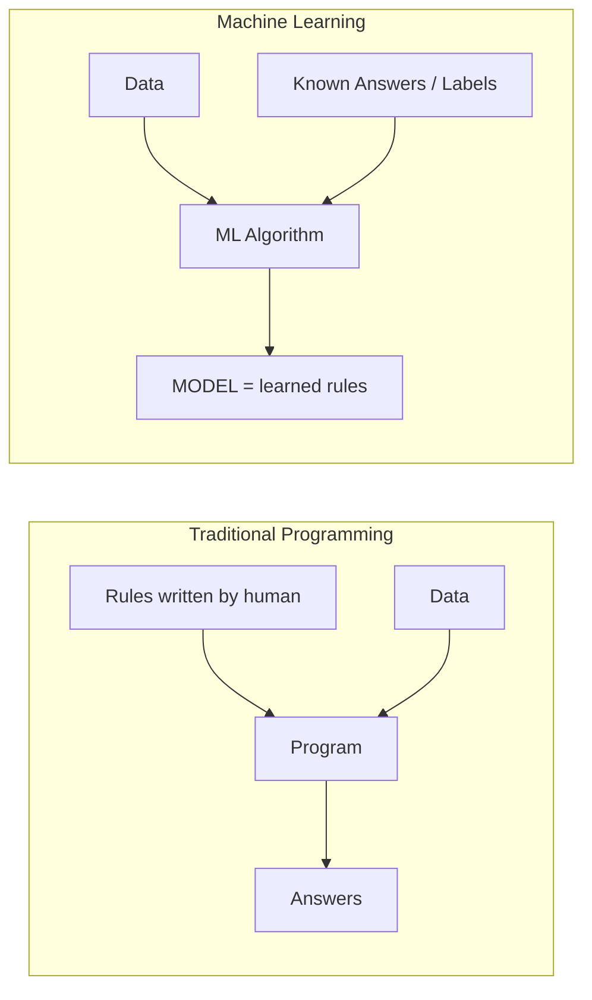

- Traditional: **you** write the rules. ML: the algorithm **discovers** the rules (the *model*) from examples. You then use that model to predict on new data.

### 1.3 The three types of ML (recap + focus)

From Module 2, ML has three paradigms. This module builds a working model of **all three**:

| Paradigm | Data | Goal | This module's project |
|---|---|---|---|
| **Supervised** | Labeled | Predict a known answer | Regression (Project 1), Classification (Project 2) |
| **Unsupervised** | Unlabeled | Find hidden structure | Clustering (Project 3) |
| **Reinforcement** | Reward signal | Learn by trial & error | *(not built here — see Module 2)* |

Supervised learning further splits into:

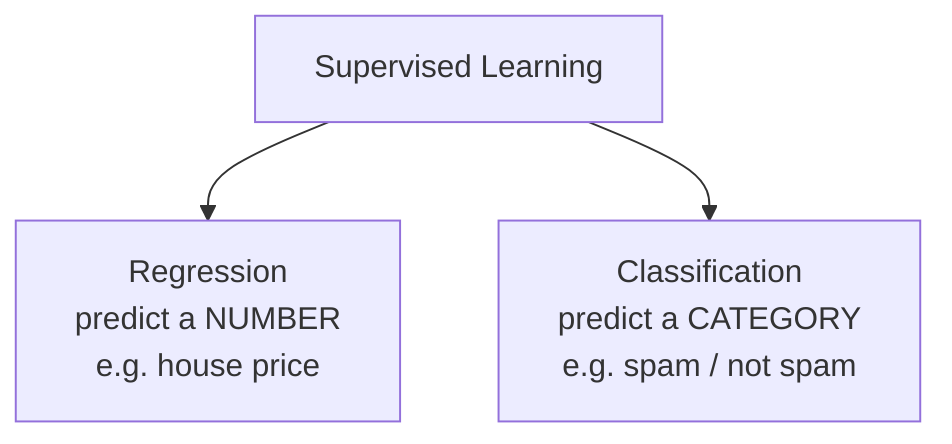

### 1.4 Key vocabulary (lock these in)

| Term | Meaning | House-price example |
|---|---|---|
| **Feature (X)** | An input variable | area, bedrooms, age |
| **Label / Target (y)** | The answer to predict | price |
| **Sample / Instance** | One row of data | one house |
| **Model** | The learned mapping from X → y | the trained predictor |
| **Training** | The process of learning from data | `model.fit(X, y)` |
| **Prediction / Inference** | Using the model on new data | `model.predict(new_house)` |

> **The convention:** features are called **`X`** (capital, because it's a table/matrix) and the label is **`y`** (lowercase, a single column). You'll see `X` and `y` in *every* ML codebase — including all three projects.

---

## 2. Scikit-learn & the ML Workflow

### 2.1 What is scikit-learn?

**Scikit-learn** (imported as `sklearn`) is the most popular Machine Learning library in Python. It provides dozens of ready-made algorithms (regression, classification, clustering) behind one **consistent, simple interface**. If NumPy and Pandas were Module 3's stars, scikit-learn is Module 4's.

```bash
pip install scikit-learn      # note: install name has a hyphen; import is 'sklearn'
```

### 2.2 The estimator API — one interface for everything

Scikit-learn's genius is that **every model works the same way**. Whether it's linear regression, a decision tree, or K-means, you use the same methods:

| Method | What it does |
|---|---|
| `model.fit(X, y)` | **Train** the model on data |
| `model.predict(X)` | Make **predictions** on new data |
| `model.score(X, y)` | **Evaluate** performance |
| `model.predict_proba(X)` | Prediction **probabilities** (classifiers) |

This means once you learn one model, you know how to use them all. **This is the single most important idea in the module.**

### 2.3 The 4-line ML rhythm

Almost every supervised ML task boils down to this rhythm:

```python
from sklearn.linear_model import LinearRegression

model = LinearRegression()          # 1. CHOOSE a model
model.fit(X_train, y_train)         # 2. TRAIN it on training data
predictions = model.predict(X_test) # 3. PREDICT on new (test) data
score = model.score(X_test, y_test) # 4. EVALUATE how good it is
```

To switch algorithms, you change **one line** (line 1). Everything else stays the same. Try a different model? Just swap `LinearRegression()` for `RandomForestRegressor()`.

### 2.4 The complete ML workflow

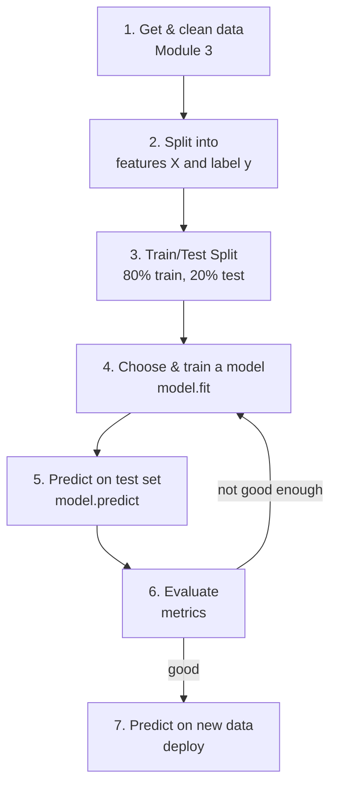

Notice this is a zoom-in on **stage 5–6** of the AI lifecycle from Module 2. Module 3 handled the data; now we build the model.

---

## 3. Data Preparation for Machine Learning

Models eat **numbers**, and they must be tested fairly. Three preparation steps come before *every* model.

### 3.1 Features (X) and label (y)

Split your DataFrame into the **inputs** and the **answer**:

```python
X = df.drop(columns=["Price"])   # features: everything EXCEPT the answer
y = df["Price"]                  # label: the column we want to predict
```

- `X` is a table (many columns); `y` is a single column. Capital `X`, lowercase `y` — a universal convention.

### 3.2 The train/test split (the golden rule of ML)

> **Never test a model on the same data it learned from.** That's like giving students the exam answers to study — of course they'll score 100%, but you've learned nothing about whether they *understand*.

We hold back some data the model never sees during training, to honestly measure how it performs on **new** data:

```python
from sklearn.model_selection import train_test_split

X_train, X_test, y_train, y_test = train_test_split(
    X, y, test_size=0.2, random_state=42)
```

- `test_size=0.2` → keep 20% for testing, train on 80%.
- `random_state=42` → makes the random split **reproducible** (same split every run).
- For classification, add `stratify=y` to keep the class balance identical in both sets.

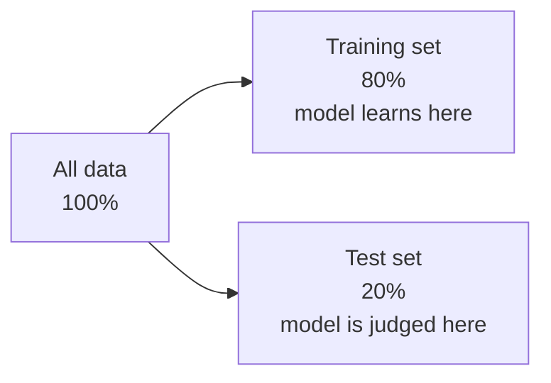

### 3.3 Encoding categorical (text) features

Models can't do math on the word `"Suburb"`. **One-hot encoding** turns each category into 0/1 columns:

```python
# Before:  Location = ["City-Center", "Suburb", "Rural"]
df_encoded = pd.get_dummies(df, columns=["Location"], drop_first=True)
# After:   two new 0/1 columns, e.g. Location_Rural, Location_Suburb
```

| Location | → | Location_Rural | Location_Suburb |
|---|---|---|---|
| City-Center | | 0 | 0 |
| Suburb | | 0 | 1 |
| Rural | | 1 | 0 |

- `drop_first=True` drops one column (it's redundant — "0 and 0" already means City-Center), avoiding a subtle problem called *multicollinearity*.

### 3.4 Feature scaling

Some models (logistic regression, K-means, neural networks) are sensitive to the **scale** of features. If `Income` ranges 20–120 and `Complaints` ranges 0–6, the model may wrongly think income matters more just because its numbers are bigger. **Scaling** puts every feature on a comparable footing:

```python
from sklearn.preprocessing import StandardScaler

scaler = StandardScaler()               # transforms each feature to mean 0, std 1
X_train_scaled = scaler.fit_transform(X_train)  # fit on train...
X_test_scaled = scaler.transform(X_test)        # ...apply same scaling to test
```

- ⚠️ **Fit the scaler on the training data only**, then apply it to test data. Fitting on test data leaks information — a classic beginner mistake.
- **Tip:** a `Pipeline` (`make_pipeline(StandardScaler(), LogisticRegression())`) bundles scaling + model so you can't forget or leak. The Churn project uses this.

### 3.5 Which models need scaling?

| Needs scaling | Doesn't need scaling |
|---|---|
| Logistic Regression | Decision Trees |
| K-Means, KNN, SVM | Random Forests |
| Neural Networks (Module 5) | Gradient-boosted trees |

### 3.6 Two ways to encode categories

There are two common encodings — pick the right one:

| Encoding | How | Use when |
|---|---|---|
| **One-hot** (`pd.get_dummies`) | One 0/1 column per category | Categories have **no order** (City, Color, Contract) |
| **Label / ordinal** | Map each category to a number | Categories **have an order** (Low<Med<High, Bronze<Silver<Gold) |

```python
# One-hot (nominal — no order):
pd.get_dummies(df, columns=["City"], drop_first=True)

# Ordinal (has a natural order):
df["Size"] = df["Size"].map({"Small": 0, "Medium": 1, "Large": 2})
```

- ⚠️ Don't label-encode unordered categories (e.g., City → 0,1,2). The model would wrongly think City 2 is "greater than" City 0. Use one-hot for those.

### 3.7 Feature engineering — the real edge

**Feature engineering** is creating better input features from raw data. It often improves a model *more than* switching algorithms — it's where domain knowledge pays off.

```python
# Combine columns into a more meaningful feature:
df["PricePerSqft"] = df["Price"] / df["Area"]

# Extract from dates (Module 3's .dt accessor):
df["SaleMonth"] = pd.to_datetime(df["Date"]).dt.month

# Bucket a number into categories:
df["AgeGroup"] = pd.cut(df["Age"], bins=[0, 5, 15, 100],
                        labels=["New", "Mid", "Old"])
```

> **A pro truth:** *"Better features beat fancier models."* Two data scientists with the same algorithm but different features will get very different results. Good features come from understanding the *problem*, not just the code.

---

## 4. Regression — Predicting Numbers

### 4.1 What is regression?

**Regression** is supervised learning where the label is a **continuous number**: a price, a temperature, a score, a sales figure. The model learns a mathematical relationship between the features and that number, then predicts it for new inputs.

Examples: house price from area/location; tomorrow's temperature from weather history; a student's final marks from study hours.

### 4.2 Linear Regression — the foundation

**Linear Regression** is the simplest and most important regression model. With one feature, it literally fits the **best straight line** through the data:

```
  Price
    |            . •
    |         ••/
    |       •/•        <- the "line of best fit"
    |     •/•
    |   •/
    |__/________________ Area
```

The line has the classic equation `y = mx + c`:
- `m` (the **slope / coefficient**) = how much the price changes per unit of area.
- `c` (the **intercept**) = the baseline price when area is 0.

With **many** features, it becomes:

```
price = w1·area + w2·bedrooms + w3·age + ... + b
```

Training **learns the best weights** (`w1, w2, …`) and bias (`b`) that make the predictions closest to the real prices.

### 4.3 Building it in scikit-learn

```python
from sklearn.linear_model import LinearRegression

model = LinearRegression()
model.fit(X_train, y_train)          # learn the weights
predictions = model.predict(X_test)  # predict prices for test houses

print(model.coef_)        # the learned weight for each feature
print(model.intercept_)   # the baseline (bias)
```

### 4.4 Reading the coefficients (interpretation)

The coefficients tell a **story** about what drives the prediction — this is why linear regression is loved for being *interpretable*:

```
Area      : +2,988 per unit   -> each extra sq ft adds ~₹2,988
Bedrooms  : +493,961 per unit -> each extra bedroom adds ~₹494k
Age       : -23,771 per unit  -> each year older subtracts ~₹24k
```

A **positive** coefficient means "more of this feature → higher prediction"; a **negative** one means the opposite. This is exactly what **Project 1** produces.

### 4.5 Other regression algorithms

Linear regression assumes a straight-line relationship. When relationships are complex/curved, use more powerful models — *same 4-line rhythm, different line 1*:

| Model | Strength |
|---|---|
| `LinearRegression` | Simple, fast, interpretable |
| `DecisionTreeRegressor` | Captures non-linear patterns |
| `RandomForestRegressor` | Many trees averaged — accurate & robust |
| `GradientBoostingRegressor` | Often the top performer on tabular data |

### 4.6 How does a model actually *learn*? (Loss & Gradient Descent)

When you call `.fit()`, what happens inside? This is the beating heart of ML — and understanding it makes **neural networks (Module 5)** far less mysterious.

**Step 1 — Measure how wrong the model is (the loss function).** The model starts with random weights and makes bad predictions. A **loss function** (also called a *cost function*) measures the total error. For regression, a common loss is **Mean Squared Error (MSE)**:

```
loss = average of (actual − predicted)²   over all training samples
```

- Big errors are squared → they hurt a lot. The goal of training is to make this loss as **small** as possible.

**Step 2 — Adjust the weights to reduce the loss (gradient descent).** Imagine the loss as a valley, and the model standing on a hillside. **Gradient descent** takes small steps *downhill* — repeatedly nudging the weights in the direction that most reduces the loss — until it reaches the bottom (minimum error):

```
  Loss
    |\
    | \        each step moves the weights
    |  \       a little further downhill
    |   \_
    |     \__
    |        \___•___  <- minimum loss (best weights)
    |_______________________ weight value
```

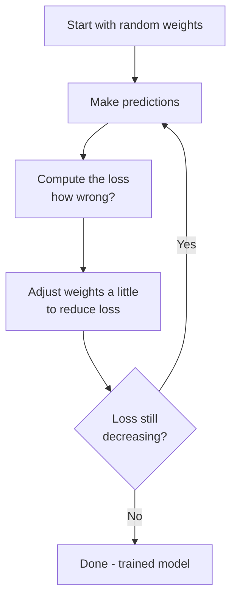

- The size of each step is the **learning rate**. Too big → it overshoots the valley; too small → training takes forever.
- **Linear Regression** finds the bottom directly with math; most other models (and *all* neural networks) use gradient descent to get there iteratively.

> **This one idea — "measure the error, then nudge the weights downhill, repeat" — is how almost all of modern AI learns**, from this simple regression to the giant language models of Module 7. You now understand the engine under the hood.

### 4.7 A worked prediction (using the learned equation)

Once trained, a linear model is just an equation. Say it learned:

```
price = 3000·Area + 500000·Bedrooms − 25000·Age + 1200000·(Suburb) + 300000
```

To predict a **2000 sq ft, 3-bedroom, 5-year-old Suburb house**, plug in the numbers:

```
price = 3000×2000 + 500000×3 − 25000×5 + 1200000×1 + 300000
      = 6,000,000 + 1,500,000 − 125,000 + 1,200,000 + 300,000
      = 8,875,000
```

That's *all* `model.predict(new_house)` does — multiply each feature by its learned weight and add them up. No magic, just arithmetic the model *learned*. (Project 1 does exactly this for a real house and prints the result.)

---

## 5. Evaluating Regression Models

A model is useless until you know *how good* it is — measured on the **test set** it never trained on. Regression uses "how far off" metrics.

### 5.1 The three key metrics

| Metric | Full name | What it measures | Better when |
|---|---|---|---|
| **MAE** | Mean Absolute Error | Average size of the error, in the original units | Lower |
| **RMSE** | Root Mean Squared Error | Like MAE but **punishes big misses** more | Lower |
| **R²** | R-squared (coefficient of determination) | Fraction of the variation the model explains (0→1) | Closer to 1 |

```python
from sklearn.metrics import mean_absolute_error, mean_squared_error, r2_score
import numpy as np

mae = mean_absolute_error(y_test, y_pred)
rmse = np.sqrt(mean_squared_error(y_test, y_pred))
r2 = r2_score(y_test, y_pred)
```

### 5.2 Understanding each metric

- **MAE** = "on average, our prediction is off by this many rupees." Easy to explain to anyone.
- **RMSE** squares the errors before averaging, so a few *large* mistakes hurt the score a lot. Use it when big errors are especially bad.
- **R²** answers "what fraction of the price differences does the model explain?" **R² = 0.98** means the model explains 98% of the variation — excellent. **R² = 0** means it's no better than always guessing the average. R² can even go **negative** for a terrible model.

### 5.3 The "actual vs predicted" plot

The best visual check: plot the true values against the predicted values. A perfect model puts every point on the diagonal line:

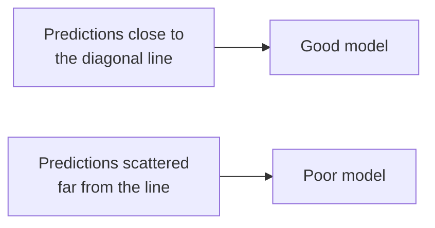

This is the chart **Project 1** saves — the tighter the points hug the line, the better the model.

---

## 6. Classification — Predicting Categories

### 6.1 What is classification?

**Classification** is supervised learning where the label is a **category** (a class), not a number. "Is this email spam or not?" "Will this customer churn — yes or no?" "Is this tumor benign or malignant?" The model learns to assign new inputs to the correct class.

| Type | Classes | Example |
|---|---|---|
| **Binary** | 2 classes | Spam / Not spam · Churn / Stay |
| **Multiclass** | 3+ classes | Cat / Dog / Bird · Grade A/B/C/D |

### 6.2 Logistic Regression — the classic classifier

Despite the confusing name (it has "regression" in it), **Logistic Regression** is a **classification** algorithm. Instead of predicting a number directly, it predicts a **probability** between 0 and 1, then applies a threshold (usually 0.5) to decide the class.

It uses the **sigmoid function** to squash any number into a 0–1 probability:

```
  probability
   1 |            _____----
     |        __--
   0.5 |     _-
     |   _-
   0 |_--___________________
              input (logit)
```

- If the model outputs 0.88, that's an **88% probability** of the positive class → predict "yes".
- This is why classifiers can give you `predict_proba` — a confidence, not just a label.

### 6.3 Building it in scikit-learn

```python
from sklearn.linear_model import LogisticRegression

model = LogisticRegression(max_iter=1000)
model.fit(X_train, y_train)
predictions = model.predict(X_test)          # the class (0 or 1)
probabilities = model.predict_proba(X_test)  # the probability of each class
```

- `max_iter=1000` gives the training algorithm enough steps to converge.
- Logistic regression benefits from **scaled features** (§3.4) — which is why **Project 2** wraps it in a Pipeline with a StandardScaler.

### 6.4 Other classification algorithms

| Model | Strength |
|---|---|
| `LogisticRegression` | Simple, fast, gives probabilities |
| `DecisionTreeClassifier` | Human-readable rules |
| `RandomForestClassifier` | Accurate, robust, gives feature importance |
| `KNeighborsClassifier` (KNN) | "Ask your nearest neighbors" — intuitive |
| `SVC` (Support Vector Machine) | Powerful on complex boundaries |

Remember: to try any of these, change **only line 1**.

### 6.5 Decision Trees — asking yes/no questions

A **Decision Tree** classifies by asking a series of yes/no questions, like a flowchart. It's the most *human-readable* model — you can literally follow its logic:

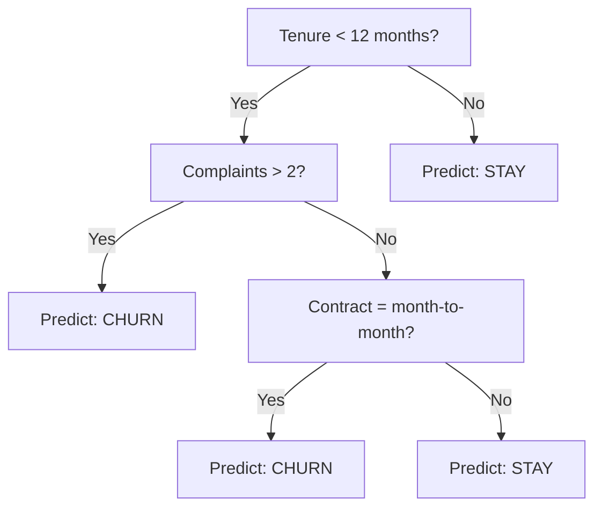

```python
from sklearn.tree import DecisionTreeClassifier
model = DecisionTreeClassifier(max_depth=4)   # limit depth to avoid overfitting
```

- **Pros:** easy to interpret, no scaling needed, handles non-linear patterns.
- **Cons:** a single deep tree easily **overfits** — which is why we often use many trees together.

**Random Forest** = **many** decision trees trained on random slices of the data, then their votes averaged. This "wisdom of the crowd" makes it one of the most reliable models for tabular data:

```python
from sklearn.ensemble import RandomForestClassifier
model = RandomForestClassifier(n_estimators=100, random_state=42)
model.feature_importances_    # bonus: which features mattered most
```

### 6.6 K-Nearest Neighbors (KNN) — ask your neighbors

**KNN** is beautifully simple: to classify a new point, look at its **k nearest** neighbors in the training data and take a **majority vote**.

```
   new point (?)  is surrounded by:
      3 "Churn" neighbors, 2 "Stay" neighbors
   -> majority vote -> predict "Churn"
```

```python
from sklearn.neighbors import KNeighborsClassifier
model = KNeighborsClassifier(n_neighbors=5)   # look at the 5 nearest
```

- KNN needs **scaled** features (it uses distance), and slows down on very large datasets, but it's a great intuition-builder: *"similar inputs have similar outputs."*

---

## 7. Evaluating Classification Models

### 7.1 Why accuracy alone is dangerous

**Accuracy** = fraction of predictions that were correct. It sounds perfect, but it **lies on imbalanced data.**

> **The trap:** if only 1% of transactions are fraud, a model that predicts "never fraud" is **99% accurate** — and completely useless (it catches zero fraud). Accuracy hides this failure.

So we need metrics that look deeper. They all come from the **confusion matrix**.

### 7.2 The confusion matrix

A table comparing predictions to reality. For "will churn?":

```
                      Predicted: Stay      Predicted: Churn
   Actual: Stay      True Negative (TN)    False Positive (FP)
   Actual: Churn     False Negative (FN)   True Positive (TP)
```

| Cell | Meaning |
|---|---|
| **True Positive (TP)** | Predicted churn, and they did churn ✅ |
| **True Negative (TN)** | Predicted stay, and they did stay ✅ |
| **False Positive (FP)** | Predicted churn, but they stayed (false alarm) ❌ |
| **False Negative (FN)** | Predicted stay, but they churned (missed!) ❌ |

**Project 2** saves this exact matrix as a heatmap.

### 7.3 Precision, Recall, and F1

From the confusion matrix we compute three vital metrics:

| Metric | Formula | Answers | Care about it when… |
|---|---|---|---|
| **Precision** | TP / (TP + FP) | Of those we *flagged*, how many were right? | False alarms are costly (e.g., spam filter deleting real mail) |
| **Recall** | TP / (TP + FN) | Of all *real* positives, how many did we catch? | Misses are costly (e.g., missing a disease, or a churner) |
| **F1-score** | balance of the two | A single combined score | You want both balanced |

```python
from sklearn.metrics import classification_report, confusion_matrix

print(confusion_matrix(y_test, y_pred))
print(classification_report(y_test, y_pred))   # precision, recall, F1 for each class
```

### 7.4 The precision–recall trade-off

There's usually **tension** between precision and recall. Flag *more* customers as churners → you catch more real ones (higher recall) but raise more false alarms (lower precision). Which matters more depends on the **cost of each mistake**:

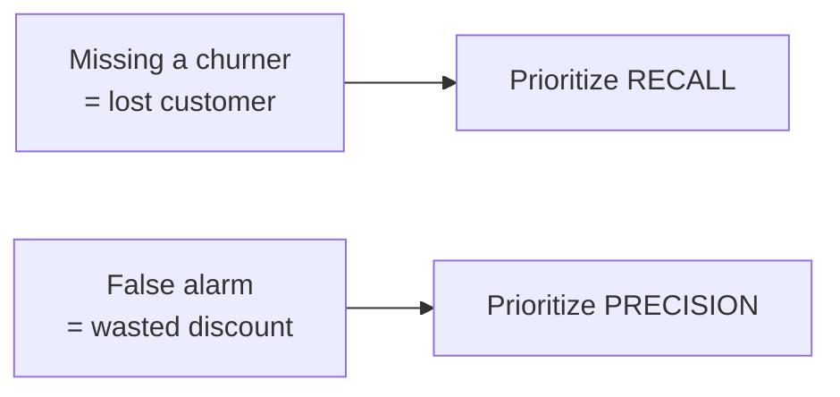

- **Medical screening:** recall matters most (never miss a real case).
- **Spam filter:** precision matters most (never trash a real email).

The **F1-score** is the go-to single number when you want a balance. This nuanced thinking — not just "accuracy" — is what separates a real ML practitioner from a beginner.

### 7.5 A worked example — compute the metrics by hand

Let's cement it. Suppose our churn model produces this confusion matrix on the test set:

```
                   Predicted Stay    Predicted Churn
   Actual Stay        TN = 104          FP = 7
   Actual Churn       FN = 14           TP = 35
```

Now compute each metric from these four numbers:

| Metric | Formula | Calculation | Result |
|---|---|---|---|
| **Accuracy** | (TP+TN) / total | (35+104) / 160 | **0.869** |
| **Precision** | TP / (TP+FP) | 35 / (35+7) = 35/42 | **0.833** |
| **Recall** | TP / (TP+FN) | 35 / (35+14) = 35/49 | **0.714** |
| **F1** | 2·(P·R)/(P+R) | 2·(0.833·0.714)/(0.833+0.714) | **0.769** |

- **Read it as:** the model catches **71%** of real churners (recall), and when it *does* flag someone, it's right **83%** of the time (precision). Whether that's "good enough" depends on the business cost of a missed churner vs a false alarm.
- These are the **exact numbers Project 2 prints** — now you know precisely where they come from.

> **Try it yourself:** if a fraud model had TP=8, FP=2, FN=40, TN=950 — its accuracy is 95.8% (looks great!) but its **recall is only 8/(8+40)=0.17** — it misses 83% of fraud. This is *why* we never trust accuracy alone.

### 7.6 The decision threshold, ROC curve & AUC

Recall that a classifier outputs a **probability**, then applies a **threshold** (default 0.5) to decide the class. You can *move* that threshold to trade precision for recall:

| Threshold | Effect |
|---|---|
| **Lower** (e.g., 0.3) | Flags more positives → higher **recall**, lower precision (catch more churners, more false alarms) |
| **Higher** (e.g., 0.7) | Flags fewer → higher **precision**, lower recall (only the most certain) |

```python
probs = model.predict_proba(X_test)[:, 1]   # probability of the positive class
custom = (probs >= 0.3).astype(int)          # use a 0.3 threshold instead of 0.5
```

The **ROC curve** plots the true-positive rate against the false-positive rate across *all* thresholds, and **AUC** (Area Under the Curve) summarizes it in one number:

| AUC | Meaning |
|---|---|
| **1.0** | Perfect classifier |
| **0.5** | No better than a coin flip |
| **> 0.8** | Generally a strong model |

```python
from sklearn.metrics import roc_auc_score
auc = roc_auc_score(y_test, probs)   # threshold-independent quality score
```

- **AUC** is popular because it judges a model's ranking ability *independent* of any single threshold — great for comparing models on imbalanced data.

---

## 8. Unsupervised Learning — Clustering

### 8.1 What is clustering?

**Clustering** is **unsupervised** learning: there is **no label (`y`)**. The algorithm groups similar data points together based only on their features, discovering structure you didn't know was there. It's like sorting a pile of mixed photos into groups without being told the categories.

**Uses:** customer segmentation, grouping documents, image compression, anomaly detection, organizing biological data.

### 8.2 K-Means — the most popular clustering algorithm

**K-Means** partitions data into **k** clusters. It works by repeating two steps until stable:

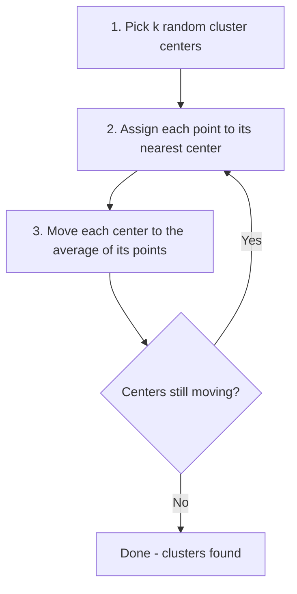

- Each cluster has a **centroid** (its center point = the "average member").
- You must choose **k** (the number of clusters) in advance — see the Elbow Method below.

### 8.3 Building it in scikit-learn

```python
from sklearn.preprocessing import StandardScaler
from sklearn.cluster import KMeans

X_scaled = StandardScaler().fit_transform(X)   # scaling is essential for K-Means!

kmeans = KMeans(n_clusters=5, random_state=42, n_init=10)
labels = kmeans.fit_predict(X_scaled)          # each point's cluster number
centers = kmeans.cluster_centers_              # the centroids
```

- Note there's **no `y`** — `fit_predict` learns groups from `X` alone.
- **Scaling matters a lot** here because K-Means uses distances; unscaled big-range features would dominate.

### 8.4 Choosing k — the Elbow Method

How many clusters? Plot the model's **inertia** (total within-cluster spread) for several values of k. Inertia always drops as k rises, but at some point the gains flatten — that "elbow" is a good k:

```
  Inertia
    |•
    | •
    |  •
    |   •___         <- the "elbow" (good k)
    |      •___•___•___•
    |________________________ k
      1  2  3  4  5  6  7
```

```python
inertias = []
for k in range(1, 11):
    km = KMeans(n_clusters=k, random_state=42, n_init=10).fit(X_scaled)
    inertias.append(km.inertia_)
# plot inertias vs k, and look for the bend
```

**Project 3** draws exactly this elbow plot alongside the discovered segments.

### 8.5 The real skill: interpreting clusters

Finding clusters is easy; **naming them** is where the value is. After clustering, examine each group's averages and give it a business meaning:

| Cluster | Avg income | Avg spending | Name → Action |
|---|---|---|---|
| A | High | High | **Premium** → VIP treatment |
| B | High | Low | **Savers** → tempt with offers |
| C | Low | High | **Young spenders** → loyalty program |
| D | Low | Low | **Budget** → low-cost options |

Turning math into a decision — that's what makes you valuable.

### 8.6 How do you know the clusters are any good?

Clustering has **no labels**, so there's no "accuracy". Instead we measure how *well-separated and tight* the clusters are with the **silhouette score** (ranges −1 to +1; higher is better):

```python
from sklearn.metrics import silhouette_score
score = silhouette_score(X_scaled, labels)   # e.g. 0.55 = reasonably clean clusters
```

| Silhouette score | Meaning |
|---|---|
| Near **+1** | Dense, well-separated clusters (great) |
| Near **0** | Clusters overlap (borderline) |
| Below **0** | Points likely in the wrong cluster (bad) |

Use the **elbow method** *and* the **silhouette score** together to choose a good `k`.

### 8.7 Other clustering algorithms

K-Means is popular but assumes round, similar-sized clusters. Two alternatives:

| Algorithm | Strength | Note |
|---|---|---|
| **DBSCAN** | Finds arbitrary shapes; auto-detects outliers | No need to pick `k`; uses density instead |
| **Hierarchical** | Builds a tree (dendrogram) of nested clusters | Great for exploring structure at many levels |

---

## 9. Overfitting, Underfitting & Generalization

### 9.1 The central challenge of ML

The whole goal of ML is **generalization** — performing well on **new, unseen** data, not just the training data. Two failures block this:

| Problem | What happens | Analogy |
|---|---|---|
| **Underfitting** | Model too simple; misses real patterns. Bad on *both* train and test. | A student who didn't study |
| **Overfitting** | Model too complex; memorizes training data (including noise). Great on train, **bad on test**. | A student who memorized past papers but can't answer new questions |

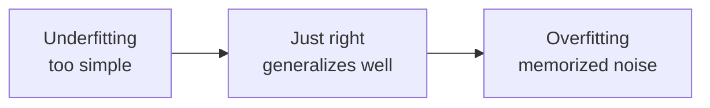

### 9.2 How to spot overfitting

Compare training score to test score:

| Train score | Test score | Diagnosis |
|---|---|---|
| Low | Low | **Underfitting** |
| High | High | **Good fit** ✅ |
| High | **Low** | **Overfitting** |

A big gap between a great training score and a poor test score is the classic sign of overfitting.

### 9.3 How to fight overfitting

- **Get more training data** (the best fix when possible).
- **Use a simpler model** or fewer features.
- **Regularization** (e.g., `Ridge`/`Lasso` for linear models) penalizes complexity.
- **Cross-validation** — a more robust evaluation (below).

### 9.4 Cross-validation

A single train/test split can be lucky or unlucky. **k-fold cross-validation** splits the data into k parts, trains k times (each time testing on a different part), and averages — a far more trustworthy score:

```python
from sklearn.model_selection import cross_val_score
scores = cross_val_score(model, X, y, cv=5)   # 5-fold
print(scores.mean())   # the average performance across 5 splits
```

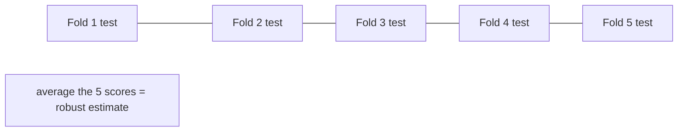

---

## 10. Common ML Algorithms — A Map

You don't need to master every algorithm — but knowing the landscape helps you pick. Here's a practical map:

| Task | Algorithm | Notes |
|---|---|---|
| **Regression** | Linear Regression | Simple, interpretable baseline |
| | Random Forest Regressor | Strong all-rounder |
| | Gradient Boosting (XGBoost/LightGBM) | Often best on tabular data |
| **Classification** | Logistic Regression | Fast baseline, gives probabilities |
| | Decision Tree | Readable rules |
| | Random Forest | Accurate, robust, feature importance |
| | KNN / SVM | Intuitive / powerful boundaries |
| **Clustering** | K-Means | Fast, popular, needs k |
| | DBSCAN | Finds arbitrary shapes, no k needed |
| | Hierarchical | Builds a tree of clusters |

> **A practical workflow:** start with a **simple, interpretable** model (Linear/Logistic Regression) as a **baseline**. Only reach for complex models (Random Forest, boosting) if the baseline isn't good enough — and always compare on the **test set**.

---

## 11. Hands-on Activities Overview

The syllabus lists **two** activities — *House Price Prediction* and *Customer Churn Prediction*. We build both, plus a **Customer Segmentation** project so you experience all three ML paradigms.

| # | Project | Paradigm | Algorithm |
|---|---|---|---|
| 1 | **House Price Prediction** | Supervised — Regression | LinearRegression |
| 2 | **Customer Churn Prediction** | Supervised — Classification | LogisticRegression |
| 3 | **Customer Segmentation** | Unsupervised — Clustering | K-Means |

> ### 📦 About these projects
> The **complete, tested, ready-to-run** programs live in
> `Hands-on Projects/Module 4 Hands-on Projects/`, each with a `README.md`. First run
> `pip install -r requirements.txt`. Console output is plain ASCII; each project **saves a
> PNG chart**. Every project uses a fixed `random_state=42` so your results match these notes.

---

## 12. Hands-on Project 1 — House Price Prediction

The canonical first ML model: predict a house's **price** (regression).

### 12.1 The full pipeline in miniature

```python
# 1. Prepare — features X, label y, encode text, split
df_encoded = pd.get_dummies(df, columns=["Location"], drop_first=True)
X = df_encoded.drop(columns=["Price"]);  y = df_encoded["Price"]
X_train, X_test, y_train, y_test = train_test_split(X, y, test_size=0.2, random_state=42)

# 2. Train (the 4-line rhythm)
model = LinearRegression()
model.fit(X_train, y_train)
y_pred = model.predict(X_test)

# 3. Evaluate
print("R2 :", r2_score(y_test, y_pred))
print("MAE:", mean_absolute_error(y_test, y_pred))
```

### 12.2 Sample output

```
----- MODEL PERFORMANCE (on unseen test data) -----
MAE  (avg error)        : 312,196
RMSE (penalizes big miss): 407,108
R2   : 0.984  -> explains 98.4% of price variation

----- WHAT THE MODEL LEARNED (coefficients) -----
   Area              : +2,988 per unit
   Bedrooms          : +493,961 per unit
   Age               : -23,771 per unit
```

- **R² = 0.984** is excellent — the model explains 98% of price variation on houses it never saw.
- The coefficients are *interpretable*: each sq ft adds ~₹2,988; each year of age subtracts ~₹24k. **This is the power of linear regression** — it doesn't just predict, it explains.

**Full program:** `Hands-on Projects/Module 4 Hands-on Projects/Project 1 - House Price Prediction/`. It also saves an "actual vs predicted" scatter that hugs the diagonal.

---

## 13. Hands-on Project 2 — Customer Churn Prediction

Predict whether a customer will **leave** (classification) — and evaluate it *properly*.

### 13.1 The key steps

```python
# Encode + split (stratify keeps the churn ratio in both sets)
df_encoded = pd.get_dummies(df, columns=["Contract"], drop_first=True)
X = df_encoded.drop(columns=["Churn"]);  y = df_encoded["Churn"]
X_train, X_test, y_train, y_test = train_test_split(
    X, y, test_size=0.2, random_state=42, stratify=y)

# Scale + model in one Pipeline (avoids leakage)
model = make_pipeline(StandardScaler(), LogisticRegression(max_iter=1000))
model.fit(X_train, y_train)
y_pred = model.predict(X_test)
print(classification_report(y_test, y_pred))
```

### 13.2 Sample output

```
Accuracy : 0.869
Precision: 0.833   (of those we flagged, how many really churned)
Recall   : 0.714   (of all real churners, how many we caught)
F1-score : 0.769

Prediction for a new customer (3mo tenure, $95/mo, 4 complaints, month-to-month):
  WILL CHURN (churn probability 88%)
```

- Notice we report **precision, recall, and F1 — not just accuracy** — because churn is imbalanced (~31%). The confusion-matrix heatmap the project saves shows exactly where it's right and wrong.
- `predict_proba` gives an **88% churn probability** for the risky new customer — a confidence a business can act on (e.g., offer a retention discount).

**Full program:** `Hands-on Projects/Module 4 Hands-on Projects/Project 2 - Customer Churn Prediction/`.

---

## 14. Hands-on Project 3 — Customer Segmentation

Group customers into segments with **no labels** (clustering).

### 14.1 The key steps

```python
X = df[["AnnualIncome_k", "SpendingScore"]]
X_scaled = StandardScaler().fit_transform(X)          # scale first!

# Elbow method to sanity-check k, then fit K-Means
kmeans = KMeans(n_clusters=5, random_state=42, n_init=10)
df["Segment"] = kmeans.fit_predict(X_scaled)          # no y — unsupervised

# Describe each segment and NAME it
df.groupby("Segment")[["AnnualIncome_k", "SpendingScore"]].mean()
```

### 14.2 Sample output

```
----- CUSTOMER SEGMENTS FOUND -----
   Segment 0:  40 customers | avg income  78.4k | avg spend  19.6 | Savers (win them over)
   Segment 1:  40 customers | avg income  30.6k | avg spend  79.1 | Young Spenders
   Segment 2:  40 customers | avg income  85.6k | avg spend  82.4 | Premium (VIP - target!)
   Segment 3:  40 customers | avg income  30.3k | avg spend  30.1 | Budget
   Segment 4:  40 customers | avg income  55.5k | avg spend  50.2 | Average
```

- The algorithm discovered **5 clean segments with no labels at all** — then we gave each a business name. The saved chart shows the elbow plot next to the colored clusters with their centroids.

**Full program:** `Hands-on Projects/Module 4 Hands-on Projects/Project 3 - Customer Segmentation/`.

### 14.3 The three projects together

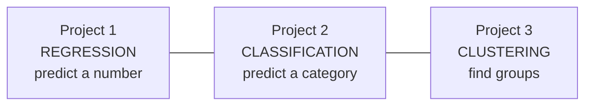

Between them, you've now built a model for **all three** core ML paradigms — the practical heart of Machine Learning.

---

## 15. Best Practices & Common Mistakes

### 15.1 ML best practices

- **Always split train/test** before training — and never let test data influence training.
- **Start simple:** a Linear/Logistic Regression baseline first; add complexity only if needed.
- **Scale features** for distance/gradient-based models (logistic regression, KNN, K-Means).
- **Choose the right metric** for the problem — accuracy is often the *wrong* one.
- **Use a fixed `random_state`** so results are reproducible.
- **Understand your model**, don't just run it — interpret coefficients and errors.
- **Compare against a baseline** (e.g., "always predict the average / majority class").

### 15.2 Top 10 beginner mistakes

| # | Mistake | Fix |
|---|---|---|
| 1 | Testing on training data | Always use `train_test_split` |
| 2 | Data leakage (fitting scaler on all data) | Fit on train only; use a `Pipeline` |
| 3 | Judging classifiers by accuracy alone | Use precision/recall/F1 + confusion matrix |
| 4 | Forgetting to encode text features | `pd.get_dummies` before training |
| 5 | Not scaling for logistic regression / KNN / K-Means | Add `StandardScaler` |
| 6 | Ignoring class imbalance | `stratify=y`, and the right metrics |
| 7 | Overfitting and not noticing | Compare train vs test score |
| 8 | Confusing regression and classification | Number → regression; category → classification |
| 9 | No baseline to compare against | Always benchmark a simple model |
| 10 | Reading too much into one random split | Use cross-validation |

### 15.3 Modern context (2026)

- **Scikit-learn** remains the go-to for *classical* ML on tabular data. **Deep learning** (Module 5) handles images/text/audio.
- On tabular data, **gradient-boosted trees** (XGBoost, LightGBM) are frequently the top performers — a natural next step after this module.
- **AutoML** tools and AI assistants can generate ML pipelines, but *understanding* metrics and validation — what this module teaches — is what keeps you from shipping a broken model.

### 15.4 Saving & loading a trained model (deployment preview)

Training can take time — you don't want to retrain every time your app runs. Save the trained model to a file with **joblib**, then load it later to make predictions instantly:

```python
import joblib

joblib.dump(model, "house_model.joblib")     # save the trained model to disk

# Later (e.g., inside a web app - Module 9):
model = joblib.load("house_model.joblib")    # load it back
model.predict(new_house)                      # predict - no retraining needed!
```

- This is the bridge to **Module 9 (Deployment)**: a saved model is what you put behind a **Streamlit** or **Flask** app so real users can get predictions. Save the *whole Pipeline* (scaler + model) so the same preprocessing is applied automatically.

---

## 16. Glossary

| Term | Meaning |
|---|---|
| **Model** | The learned mapping from features to prediction. |
| **Feature (X)** | An input variable. |
| **Label / Target (y)** | The value to predict. |
| **Training** | Learning patterns from data (`fit`). |
| **Prediction / Inference** | Using the model on new data (`predict`). |
| **Regression** | Predicting a continuous number. |
| **Classification** | Predicting a category/class. |
| **Clustering** | Grouping unlabeled data (unsupervised). |
| **Train/Test Split** | Holding back data to evaluate honestly. |
| **One-hot encoding** | Turning categories into 0/1 columns. |
| **Feature scaling** | Putting features on a comparable range. |
| **Coefficient / Weight** | How much a feature influences the prediction. |
| **MAE / RMSE** | Regression error metrics. |
| **R²** | Fraction of variation a regression explains. |
| **Accuracy** | Fraction of correct classifications. |
| **Confusion matrix** | Table of TP, TN, FP, FN. |
| **Precision** | Of predicted positives, how many were right. |
| **Recall** | Of real positives, how many were caught. |
| **F1-score** | Balance of precision and recall. |
| **Sigmoid** | Function mapping any number to 0–1 (logistic regression). |
| **Overfitting** | Memorizing training data; poor on new data. |
| **Underfitting** | Too simple to capture the pattern. |
| **Generalization** | Performing well on unseen data. |
| **Cross-validation** | Averaging performance over several splits. |
| **Centroid** | The center point of a cluster. |
| **Inertia** | Within-cluster spread (used by the Elbow Method). |
| **Pipeline** | Bundling preprocessing + model into one object. |

---

## 17. Practice Exercises & Self-Assessment

### 17.1 Concept checks

1. Explain the difference between regression and classification with an example each.
2. Why must you never test a model on its training data?
3. Why is accuracy a poor metric for a fraud detector? What would you use instead?
4. What does an R² of 0.85 mean? What about R² of 0?
5. Explain precision vs recall using a disease-screening example.
6. When would you scale features? Name two models that need it and two that don't.
7. What is overfitting, and how do you detect and reduce it?
8. In K-Means, what is a centroid and how do you choose k?

### 17.2 Coding — regression

9. Load a CSV, split into X/y and train/test, and train a `LinearRegression`. Report R² and MAE.
10. Print and interpret the model's coefficients — which feature matters most?
11. Swap in a `RandomForestRegressor`; does R² improve on the test set?

### 17.3 Coding — classification

12. Train a `LogisticRegression` on a binary dataset; print the classification report.
13. Draw the confusion matrix; identify the false positives and false negatives.
14. Use `predict_proba` to list the 5 samples the model is most confident are positive.

### 17.4 Coding — clustering

15. Run K-Means with k=3 and k=5 on a 2-feature dataset; plot both.
16. Draw an elbow plot for k = 1…10 and pick the best k.
17. Name each cluster you find based on its feature averages.

### 17.5 Integrative

18. Complete all three projects, then do one README challenge in each.
19. Take a real Kaggle dataset (e.g., Titanic survival) and build + evaluate a classifier end to end.

### 17.6 Quick self-check quiz

1. Predicting temperature is regression or classification? *(→ regression)*
2. What are the 4 lines of the ML rhythm? *(→ choose, fit, predict, evaluate)*
3. Which metric can be misleading on imbalanced data? *(→ accuracy)*
4. What does `stratify=y` do? *(→ keeps class balance in the split)*
5. Which algorithm needs no `y`? *(→ K-Means / clustering)*
6. High train score, low test score means…? *(→ overfitting)*
7. What does `predict_proba` return? *(→ class probabilities)*
8. What does the Elbow Method choose? *(→ the number of clusters k)*

### 17.7 Solutions & Answer Key

> Try each first, then check. Assumes the usual sklearn imports. Code verified.

**17.1 Concept checks**

1. **Regression vs classification:** regression predicts a **number** (house price); classification predicts a **category** (spam / not-spam).
2. **Never test on training data:** the model has *seen* it, so it can memorize and score ~perfectly while failing on new data — you'd have no honest measure of real performance (like giving students the exam answers to study).
3. **Accuracy on a fraud detector:** with ~1% fraud, "predict never-fraud" scores 99% accuracy but catches zero fraud. Use **precision, recall, F1, and the confusion matrix** (recall matters — don't miss fraud).
4. **R²:** 0.85 = the model explains 85% of the variation in the target (good). 0 = no better than always predicting the mean.
5. **Precision vs recall (disease screening):** *Precision* = of those flagged sick, how many really are. *Recall* = of all truly sick people, how many we caught. Screening usually prioritizes **recall** (don't miss a real case).
6. **Scaling:** needed for distance/gradient models — **Logistic Regression, KNN, K-Means, SVM**; **not** needed for **Decision Trees / Random Forests**.
7. **Overfitting:** the model memorizes training data (great train score, poor test score). **Detect** by comparing train vs test; **reduce** with more data, a simpler model, regularization, or cross-validation.
8. **K-Means centroid & k:** a **centroid** is a cluster's center (the "average member"); choose **k** with the **Elbow Method** (plus the silhouette score).

**17.2 Coding — regression**

```python
from sklearn.model_selection import train_test_split
from sklearn.linear_model import LinearRegression
from sklearn.ensemble import RandomForestRegressor
from sklearn.metrics import r2_score, mean_absolute_error
import numpy as np

# 9. Load, split, train, report
X = df.drop(columns=["target"]);  y = df["target"]
X_tr, X_te, y_tr, y_te = train_test_split(X, y, test_size=0.2, random_state=42)
model = LinearRegression().fit(X_tr, y_tr)
pred = model.predict(X_te)
print("R2 :", r2_score(y_te, pred))
print("MAE:", mean_absolute_error(y_te, pred))

# 10. Interpret coefficients (biggest absolute value = most influential)
for name, coef in sorted(zip(X.columns, model.coef_), key=lambda kv: -abs(kv[1])):
    print(f"{name}: {coef:+.2f}")

# 11. Random Forest — often higher R2 on non-linear data
rf = RandomForestRegressor(n_estimators=100, random_state=42).fit(X_tr, y_tr)
print("RF R2:", r2_score(y_te, rf.predict(X_te)))
```

**17.3 Coding — classification**

```python
from sklearn.linear_model import LogisticRegression
from sklearn.metrics import classification_report, confusion_matrix
import numpy as np

X_tr, X_te, y_tr, y_te = train_test_split(X, y, test_size=0.2,
                                          random_state=42, stratify=y)
clf = LogisticRegression(max_iter=1000).fit(X_tr, y_tr)
pred = clf.predict(X_te)

# 12. Classification report
print(classification_report(y_te, pred))

# 13. Confusion matrix -> [[TN, FP], [FN, TP]]
cm = confusion_matrix(y_te, pred)
print(cm)  # top-right = false positives, bottom-left = false negatives

# 14. 5 samples the model is most confident are POSITIVE
proba = clf.predict_proba(X_te)[:, 1]          # probability of class 1
top5 = np.argsort(proba)[-5:][::-1]
print("Most-confident positives:", proba[top5].round(3))
```

**17.4 Coding — clustering**

```python
from sklearn.cluster import KMeans
import matplotlib.pyplot as plt

# 15. K-Means with k=3 and k=5, plot both
for k in (3, 5):
    km = KMeans(n_clusters=k, random_state=42, n_init=10)
    labels = km.fit_predict(X2)                 # X2 = 2-feature data
    plt.figure(); plt.scatter(X2[:, 0], X2[:, 1], c=labels); plt.title(f"k={k}")
plt.show()

# 16. Elbow plot
inertias = [KMeans(k, random_state=42, n_init=10).fit(X2).inertia_ for k in range(1, 11)]
plt.plot(range(1, 11), inertias, marker="o"); plt.xlabel("k"); plt.ylabel("inertia")
plt.show()   # pick k at the "elbow" where the curve flattens

# 17. Name clusters by their feature averages
import pandas as pd
km = KMeans(n_clusters=3, random_state=42, n_init=10).fit(X2)
df_c = pd.DataFrame(X2, columns=["f1", "f2"]); df_c["cluster"] = km.labels_
print(df_c.groupby("cluster").mean())          # then label each by its averages
```

**17.5 Integrative** — open, do-it tasks: the module's three projects plus an end-to-end classifier on the **Titanic** dataset (clean → encode → `train_test_split` → `LogisticRegression`/`RandomForestClassifier` → confusion matrix + precision/recall/F1).

**17.6 Quiz** — answers are shown inline next to each question above.

> **Ready for Module 5 when:** you can build, evaluate, and interpret a regression model, a classification model, and a clustering model — and you understand why accuracy alone isn't enough.

---

## 18. Summary & What's Next

### 18.1 Module 4 in one picture

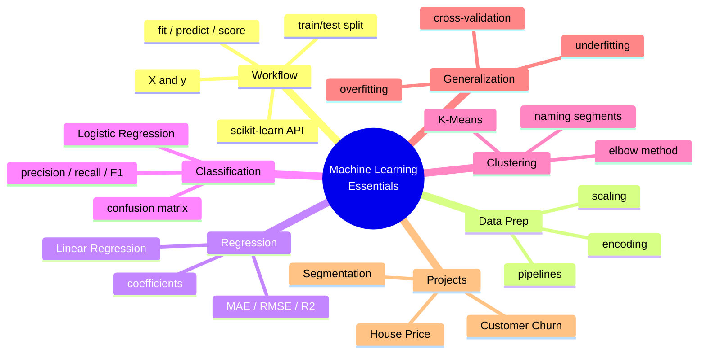

### 18.2 Key takeaways

- Every scikit-learn model shares one rhythm: **choose → fit → predict → evaluate.**
- **Split train/test** and never leak test data — it's the golden rule.
- **Regression** predicts numbers (MAE/RMSE/R²); **classification** predicts categories (precision/recall/F1/confusion matrix); **clustering** finds groups with no labels.
- **Accuracy alone is dangerous** on imbalanced data — think about the cost of each error.
- **Interpretability matters** — coefficients and cluster names turn models into decisions.
- **Overfitting** is the enemy of generalization; detect it by comparing train vs test.

### 18.3 Skills checklist

- [ ] I can split data into X/y and train/test.
- [ ] I can encode categorical features and scale numeric ones.
- [ ] I can build and interpret a regression model.
- [ ] I can build and evaluate a classification model (beyond accuracy).
- [ ] I can build a clustering model and name the clusters.
- [ ] I can recognize and reduce overfitting.
- [ ] I completed all three hands-on projects.

### 18.4 Bridge to Module 5

You've mastered **classical** Machine Learning — models that work brilliantly on **tabular** data (rows and columns). But how do you handle **images**, where each photo is a grid of thousands of pixels? For that, we need **Deep Learning**. In **Module 5 — Deep Learning & Computer Vision**, you'll build **neural networks** and **Convolutional Neural Networks (CNNs)** with TensorFlow, and use **OpenCV** and **YOLO** to detect objects and recognize images. The `fit`/`predict` rhythm you learned here carries straight over — just with far more powerful models.

> **Homework before Module 5:** complete the three projects and do one challenge in each; then take the **Titanic** dataset (a classic on Kaggle) and build a churn-style classifier, reporting precision, recall, and F1. Bring your confusion matrix to class.

---

### Instructor Notes (for the teaching team)

- **Suggested 10-hour split:** Hour 1 — ML recap + scikit-learn API (§1–2); Hour 2 — data prep (§3); Hours 3–4 — regression + evaluation + **Project 1** (§4–5); Hours 5–6 — classification + evaluation + **Project 2** (§6–7); Hour 7 — clustering + **Project 3** (§8); Hour 8 — overfitting & cross-validation (§9–10); Hours 9–10 — finish projects, compare models, discuss metrics and a real Kaggle dataset.
- **Teaching approach:** emphasize the **shared 4-line rhythm** so students see ML as one pattern, not many. Live-code each project; have students change *only line 1* to swap algorithms.
- **The metrics lesson is critical:** spend real time on *why accuracy misleads* and on the confusion matrix — it's the most common professional mistake to get wrong.
- **Keep it concrete:** relate every model to a business decision (a price to set, a customer to retain, a segment to target).
- **Assessment:** the two syllabus projects (House Price, Churn) as graded deliverables; exercise 19 (Titanic) as a portfolio piece; the quiz (§17.6) as a quick check before Module 5.
- **Reproducibility:** insist on `random_state=42` everywhere so student results are comparable and debuggable.

---

*End of Module 4 — Machine Learning Essentials.*
*AI Powered Engineering Upskilling Program · 2026 Edition.*
