# Module 5 — Deep Learning & Computer Vision

> **AI Powered Engineering Upskilling Program**
> *From Fundamentals to Generative AI Applications*

---

## Module Information Card

| Field | Detail |
|---|---|
| **Module Number** | 5 of 10 |
| **Module Title** | Deep Learning & Computer Vision |
| **Duration** | 10 Hours (≈ 2 training days) |
| **Level** | Intermediate → Advanced |
| **Target Audience** | Engineering students, age 19–20 |
| **Prerequisites** | Modules 1–4 (Python, data, ML, NumPy) |
| **Library Versions (2026)** | TensorFlow/Keras 2.x · OpenCV 4.x · Ultralytics YOLOv8/11 · scikit-learn 1.x |
| **Primary Tools** | TensorFlow/Keras, OpenCV, YOLO (Ultralytics), Google Colab |
| **Learning Outcome** | Develop image-based AI solutions. |
| **Hands-on Activities (syllabus)** | Object Detection · Digit Recognition |
| **Hands-on Projects (this course)** | (1) Digit Recognition · (2) Object Detection (YOLO) · (3) OpenCV Image Processing |

### What you will be able to do after this module

1. Explain **why Deep Learning** succeeds where classic ML struggles (images, audio, text).
2. Describe a **neural network** — neurons, weights, activation functions, layers.
3. Explain how networks learn via **loss, backpropagation, and gradient descent**.
4. Understand and read **TensorFlow/Keras** code to build a neural network.
5. Explain **Convolutional Neural Networks (CNNs)** — convolution, filters, pooling — and why they dominate vision.
6. Perform core **OpenCV** image processing: color spaces, blur, edges, thresholding, contours.
7. Use **YOLO** for real-time **object detection**.
8. Build an **image classifier** (digit recognition) end to end.

> **How to use these notes**: This is the most exciting module — you'll make computers *see*. Use **Google Colab** (free GPUs, everything pre-installed). Run every example. Deep learning clicks when you watch a model's accuracy climb epoch by epoch.

> ### ⚙️ A note on tools & this environment (read once)
> Deep-learning frameworks are heavy and version-sensitive. **TensorFlow/Keras** is the industry-standard teaching tool for neural networks/CNNs and is used throughout these notes — install it on **Python 3.10–3.13** (or just use **Google Colab**, where it's ready). Because the very latest Python builds sometimes lack a TensorFlow wheel, the **runnable Digit Recognition project uses scikit-learn's neural network** (`MLPClassifier`) so it runs *anywhere* instantly — the concepts are identical, and the Keras version is shown here for when you have TensorFlow. **OpenCV** and **YOLO (Ultralytics)** install cleanly and power Projects 2 and 3.

---

## Table of Contents

1. [From Machine Learning to Deep Learning](#1-from-machine-learning-to-deep-learning)
2. [Neural Networks — The Building Blocks](#2-neural-networks--the-building-blocks)
3. [How Neural Networks Learn](#3-how-neural-networks-learn)
4. [Building Neural Networks with TensorFlow/Keras](#4-building-neural-networks-with-tensorflowkeras)
5. [Images as Data — Seeing Like a Computer](#5-images-as-data--seeing-like-a-computer)
6. [Convolutional Neural Networks (CNNs)](#6-convolutional-neural-networks-cnns)
7. [Image Classification](#7-image-classification)
8. [OpenCV — The Computer Vision Toolkit](#8-opencv--the-computer-vision-toolkit)
9. [Object Detection & YOLO](#9-object-detection--yolo)
10. [Transfer Learning & Pre-trained Models](#10-transfer-learning--pre-trained-models)
11. [Hands-on Activities Overview](#11-hands-on-activities-overview)
12. [Hands-on Project 1 — Digit Recognition](#12-hands-on-project-1--digit-recognition)
13. [Hands-on Project 2 — Object Detection with YOLO](#13-hands-on-project-2--object-detection-with-yolo)
14. [Hands-on Project 3 — OpenCV Image Processing](#14-hands-on-project-3--opencv-image-processing)
15. [Best Practices & Common Mistakes](#15-best-practices--common-mistakes)
16. [Glossary](#16-glossary)
17. [Practice Exercises & Self-Assessment](#17-practice-exercises--self-assessment)
18. [Summary & What's Next](#18-summary--whats-next)

---

## 1. From Machine Learning to Deep Learning

### 1.1 What is Deep Learning?

**Deep Learning (DL)** is a subset of Machine Learning that uses **artificial neural networks with many layers** (hence "deep"). From Module 2, recall the nesting: **DL ⊂ ML ⊂ AI**. Deep learning is what powers the most impressive AI of the 2020s — image recognition, self-driving cars, ChatGPT, voice assistants.

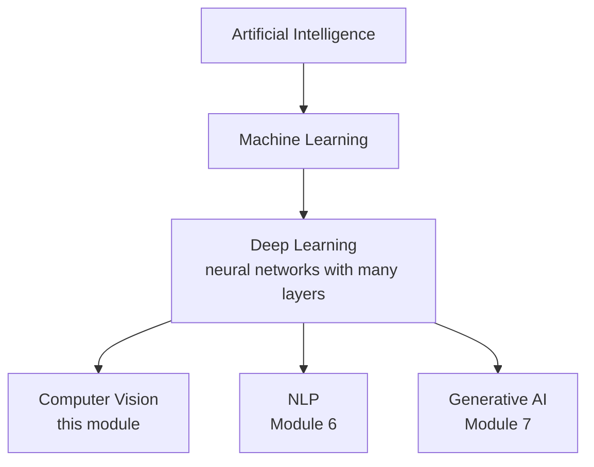

### 1.2 Why not just use the ML from Module 4?

Classic ML (Module 4) is brilliant on **tabular** data — neat rows and columns. But it struggles with **raw unstructured data** like images. Here's the key difference:

| | Classic Machine Learning | Deep Learning |
|---|---|---|
| **Feature engineering** | **You** hand-craft the features | The network **learns** features itself |
| **Best data type** | Tables (rows/columns) | Images, audio, text, video |
| **Data needed** | Thousands of rows | Often millions of examples |
| **Compute** | Runs on a CPU | Wants a **GPU** |
| **Interpretability** | Easier | Often a "black box" |

**The killer advantage:** in classic ML, *you* must tell the model what to look for ("is there an edge here? a curve there?"). A deep network **discovers those features on its own**, layer by layer. For a cat photo, early layers learn edges, middle layers learn shapes (ears, eyes), deep layers learn "cat". Nobody programmed that — it emerged from data.

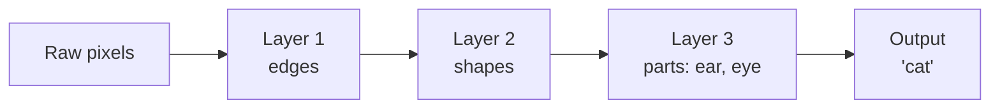

### 1.3 Why did Deep Learning explode?

Neural networks existed since the 1950s, but only "took off" around **2012**. Three things came together:

| Ingredient | What changed |
|---|---|
| **Big Data** | The internet created huge labelled datasets (e.g., ImageNet: 14M images) |
| **GPUs** | Graphics cards can do the massive parallel math of networks ~100× faster |
| **Algorithms** | Better techniques (ReLU, dropout, better optimizers) made deep nets trainable |

The spark: in 2012, a deep network called **AlexNet** crushed the ImageNet image-recognition contest, and the field was never the same.

### 1.4 What is Computer Vision?

**Computer Vision (CV)** is the field of AI that lets computers **understand images and video** — the main application of deep learning in this module. Tasks include:

| Task | Question it answers | Example |
|---|---|---|
| **Image Classification** | *What* is in this image? | "This is a cat" (Project 1: which digit?) |
| **Object Detection** | *What* and *where*? | "A person at (x,y), a car at (x,y)" (Project 2: YOLO) |
| **Segmentation** | Which *pixels* belong to each object? | Outline every pedestrian precisely |
| **Face Recognition** | *Who* is this? | Unlocking your phone |

---

## 2. Neural Networks — The Building Blocks

### 2.1 Inspired by the brain

An **artificial neural network** is loosely inspired by the human brain, which has ~86 billion **neurons** connected together. Each artificial "neuron" is a tiny math function; connect thousands of them in layers and the network can learn astonishingly complex patterns.

> It's only a *loose* inspiration — artificial neurons are simple math, not biology. But the metaphor helps.

### 2.2 A single neuron (the perceptron)

One neuron does three things:

1. **Multiply** each input by a **weight** (importance).
2. **Add** them all up, plus a **bias**.
3. Pass the result through an **activation function** to produce the output.

```
   inputs      weights
   x1 ───w1──┐
   x2 ───w2──┼──►  (x1·w1 + x2·w2 + x3·w3 + bias)  ──► activation ──► output
   x3 ───w3──┘
```

In formula form: `output = activation( w1·x1 + w2·x2 + … + bias )`.

- The **weights** decide how much each input matters — and **learning = adjusting these weights** (exactly like the coefficients in Module 4's regression).
- The **bias** shifts the result, like the intercept in a line.

### 2.3 Activation functions — adding non-linearity

Without an activation function, a neural network could only learn straight-line (linear) relationships — no better than Module 4's linear regression. **Activation functions add non-linearity**, letting networks learn curves and complex patterns. The main ones:

| Activation | Shape | Use |
|---|---|---|
| **ReLU** (Rectified Linear Unit) | 0 for negatives, linear for positives | **The default** for hidden layers — simple & fast |
| **Sigmoid** | Squashes to 0–1 | Output layer for **binary** classification (a probability) |
| **Softmax** | Turns scores into probabilities summing to 1 | Output layer for **multiclass** (e.g., 10 digits) |
| **Tanh** | Squashes to −1…1 | Sometimes in hidden layers |

- **ReLU** is used in almost every hidden layer today: `relu(x) = max(0, x)`. Simple, but it's a big reason deep learning works.

### 2.4 Layers — stacking neurons

Neurons are organized into **layers**:

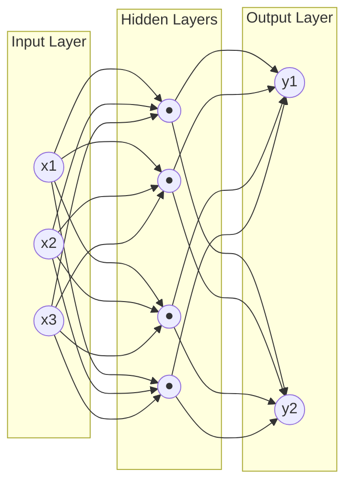

| Layer | Role |
|---|---|
| **Input layer** | One neuron per feature (e.g., 64 for an 8×8 image) |
| **Hidden layer(s)** | Where the learning happens; "deep" = many hidden layers |
| **Output layer** | One neuron per answer (e.g., 10 for digits 0–9) |

A network that's fully connected like this is called a **Dense** (or fully-connected) network — the type used in Project 1.

### 2.5 The forward pass

Making a prediction = pushing data **forward** through the network, layer by layer:

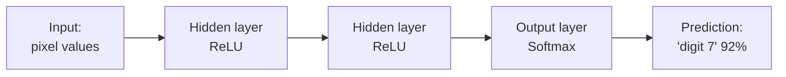

Each neuron computes its little weighted-sum-plus-activation, feeds the next layer, until the output layer produces the final answer. This is called the **forward pass** (or forward propagation).

### 2.6 A neuron by the numbers

Let's compute one neuron's output by hand so it's concrete. Say a neuron has:
- inputs `x = [1.0, 0.5, −1.0]`
- weights `w = [0.4, 0.2, −0.3]`
- bias `b = 0.1`
- activation = ReLU

**Step 1 — weighted sum:**
```
z = (1.0 × 0.4) + (0.5 × 0.2) + (−1.0 × −0.3) + 0.1
  =    0.4      +    0.1      +      0.3       + 0.1
  = 0.9
```

**Step 2 — activation:** `ReLU(0.9) = max(0, 0.9) = 0.9` → the neuron outputs **0.9**.

That's it — a neuron is just *multiply, add, activate*. A network is thousands of these, and **training changes the weights** (0.4, 0.2, −0.3…) until the whole network produces good answers. This is the same "learn the weights" idea as Module 4's regression, stacked deep.

---

## 3. How Neural Networks Learn

### 3.1 The learning loop

How does a network go from random guesses to 98% accuracy? It repeats a **training loop** — the same "measure the error, nudge the weights" idea from Module 4, now across many layers:

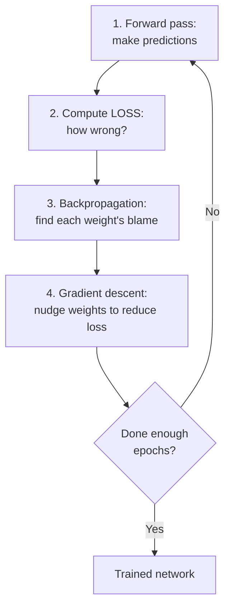

### 3.2 The loss function

The **loss** measures how wrong the network's predictions are (Module 4 §4.6). Common choices:
- **Cross-entropy loss** — for classification (digits, cats/dogs). Punishes confident-but-wrong predictions.
- **Mean Squared Error** — for regression.

Training's goal: make the loss as **small** as possible.

### 3.3 Backpropagation — the key algorithm

When the network is wrong, *which* of its thousands of weights should change, and by how much? **Backpropagation** answers this. It works *backwards* from the output error, using calculus (the chain rule) to compute how much each weight contributed to the mistake — its "share of the blame". Then gradient descent nudges each weight accordingly.

> You don't need the calculus — just the intuition: **backprop sends the error signal backward through the network so every weight learns how to improve.** TensorFlow/Keras does all the math for you.

### 3.4 Epochs, batches & learning rate

Three training terms you'll set:

| Term | Meaning |
|---|---|
| **Epoch** | One full pass through *all* the training data |
| **Batch** | A small chunk of data processed at once (e.g., 32 images) |
| **Learning rate** | How big a step to take when adjusting weights (too big = overshoot, too small = slow) |

Training runs for many **epochs**; you watch the loss go **down** and accuracy go **up** each epoch — one of the satisfying sights in AI.

### 3.5 Watch out: overfitting (again)

Just like Module 4, deep networks can **overfit** — memorize the training images instead of learning general patterns. Defenses specific to deep learning:

| Technique | What it does |
|---|---|
| **Dropout** | Randomly "switches off" some neurons during training, forcing robustness |
| **More data / augmentation** | Flip, rotate, zoom images to create more variety |
| **Early stopping** | Stop training when validation accuracy stops improving |

---

## 4. Building Neural Networks with TensorFlow/Keras

### 4.1 The deep-learning frameworks

You don't build networks from scratch — you use a **framework** that handles the math (forward pass, backprop, GPU). The two giants:

| Framework | Maker | Known for |
|---|---|---|
| **TensorFlow / Keras** | Google | Beginner-friendly (Keras API), production-ready |
| **PyTorch** | Meta | Loved in research; powers YOLO (Project 2) |

We teach with **Keras** (TensorFlow's high-level API) because it's the most readable for beginners. *(Install on Python 3.10–3.13, or use Google Colab.)*

### 4.2 A neural network in Keras — the digit classifier

Here is a complete neural network for digit recognition in Keras. Read how closely it mirrors the concepts from §2:

```python
from tensorflow import keras
from tensorflow.keras import layers

model = keras.Sequential([                 # a stack of layers
    layers.Input(shape=(64,)),             # 64 inputs (8x8 pixels flattened)
    layers.Dense(64, activation="relu"),   # hidden layer: 64 neurons + ReLU
    layers.Dense(32, activation="relu"),   # hidden layer: 32 neurons + ReLU
    layers.Dense(10, activation="softmax") # output: 10 digits, as probabilities
])

model.compile(optimizer="adam",                    # the gradient-descent method
              loss="sparse_categorical_crossentropy",  # loss for multiclass
              metrics=["accuracy"])

model.fit(X_train, y_train, epochs=20, batch_size=32,  # train!
          validation_split=0.1)

model.evaluate(X_test, y_test)             # test accuracy
predictions = model.predict(X_new)         # use it
```

Line by line:
- `keras.Sequential([...])` stacks layers in order.
- Each `layers.Dense(n, activation=...)` is a fully-connected layer of `n` neurons (§2.4).
- `compile()` chooses the **optimizer** (Adam = a smart gradient descent), the **loss**, and what to track.
- `fit()` runs the training loop (§3.1) for the given **epochs**.
- Notice the rhythm is the *same* `fit` / `predict` / `evaluate` as scikit-learn (Module 4)!

### 4.3 Watching it train

`fit()` prints progress each epoch — the loss falling and accuracy rising:

```
Epoch 1/20  - loss: 1.83 - accuracy: 0.52 - val_accuracy: 0.78
Epoch 2/20  - loss: 0.94 - accuracy: 0.81 - val_accuracy: 0.88
...
Epoch 20/20 - loss: 0.09 - accuracy: 0.98 - val_accuracy: 0.97
```

> **This is the runnable Project 1 in a nutshell.** Because TensorFlow isn't installable on every Python build, Project 1 uses scikit-learn's `MLPClassifier` (identical concept: `hidden_layer_sizes=(64, 32)` = the two Dense layers above). Once you have TensorFlow/Colab, swap in this Keras version to work with bigger images.

---

## 5. Images as Data — Seeing Like a Computer

### 5.1 An image is just numbers

To a computer, an image is a **grid of numbers**. Each **pixel** holds a brightness value from **0 (black) to 255 (white)**.

```
A tiny 5x5 grayscale image of a diagonal line:

  0   0   0   0 255
  0   0   0 255   0
  0   0 255   0   0
  0 255   0   0   0
255   0   0   0   0
```

- This is a **NumPy array** (Module 3!). A grayscale image has shape `(height, width)`.

### 5.2 Color images and channels

A **color** image has **three channels** — Red, Green, Blue (RGB) — stacked. So a 100×100 color photo is an array of shape `(100, 100, 3)`: three 100×100 grids, one per color.

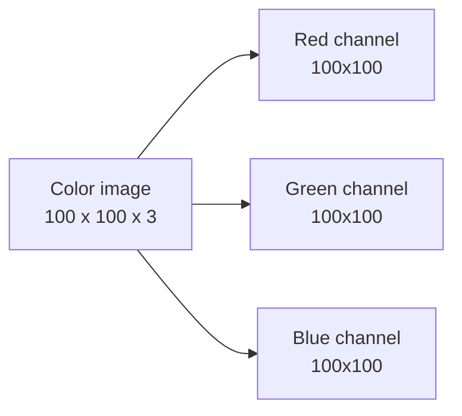

- Mixing different amounts of R, G, B makes any color. `(255, 0, 0)` = pure red; `(255, 255, 255)` = white; `(0, 0, 0)` = black.
- ⚠️ **OpenCV uses BGR order** (Blue, Green, Red), not RGB — a classic source of "why are my colors swapped?" bugs (Project 3 handles this).

### 5.3 Key image properties

| Property | Meaning |
|---|---|
| **Resolution** | Width × height in pixels (e.g., 1920×1080) |
| **Channels** | 1 (grayscale) or 3 (color) or 4 (with transparency) |
| **Pixel value** | 0–255 per channel |
| **Aspect ratio** | Width : height |

### 5.4 Why images are hard for classic ML

A modest 200×200 color image has 200×200×3 = **120,000 numbers**. Feeding all of these into a plain Dense network means an explosion of weights, and it ignores a crucial fact: **nearby pixels are related** (they form edges, shapes). Treating each pixel independently throws that away.

**The solution is a smarter architecture built for images — the Convolutional Neural Network.**

---

## 6. Convolutional Neural Networks (CNNs)

### 6.1 The breakthrough for images

A **Convolutional Neural Network (CNN)** is a neural network designed specifically for images. It's the architecture behind nearly all modern computer vision. Its key insight: instead of looking at every pixel independently, it looks at **small patches** and detects **local patterns** (edges, corners, textures) that build up into objects.

### 6.2 The convolution operation

A CNN slides a small grid of weights — a **filter** (or **kernel**) — across the image, computing a value at each position. Each filter learns to detect one kind of pattern (a vertical edge, a curve, a color blob):

```
   Image patch        Filter (edge detector)     Result
   ┌─┬─┬─┐            ┌──┬──┬──┐
   │1│1│1│            │-1│ 0│ 1│   slide across
   ├─┼─┼─┤     x      ├──┼──┼──┤   the whole   ──►  a "feature map"
   │1│1│1│            │-1│ 0│ 1│   image           (where this pattern is)
   ├─┼─┼─┤            ├──┼──┼──┤
   │1│1│1│            │-1│ 0│ 1│
   └─┴─┴─┘            └──┴──┴──┘
```

- The output is a **feature map** showing *where* in the image that pattern appears.
- Crucially, **the filters are learned** during training — the network figures out which patterns matter, all by itself.

### 6.3 Pooling — shrinking while keeping what matters

After convolution, a **pooling** layer (usually **max pooling**) shrinks the feature map by keeping only the strongest signal in each small region. This makes the network faster and more robust to small shifts:

```
  Max pooling (2x2):     take the biggest value in each 2x2 block
    ┌───┬───┐
    │ 1 3 │ 2 1 │            ┌───┬───┐
    │ 4 6 │ 0 1 │    ──►     │ 6 │ 2 │
    ├─────┼─────┤            ├───┼───┤
    │ 8 2 │ 5 4 │            │ 8 │ 5 │
    │ 1 0 │ 3 1 │            └───┴───┘
    └─────┴─────┘
```

### 6.4 The full CNN architecture

A CNN stacks these operations: **convolution → activation → pooling**, repeated, then flattens into Dense layers for the final decision:

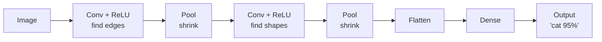

- **Early layers** learn simple features (edges); **deeper layers** combine them into complex features (eyes, wheels, faces). This *hierarchy of features* is the magic of deep learning (§1.2).

### 6.5 A CNN in Keras

```python
model = keras.Sequential([
    layers.Input(shape=(28, 28, 1)),                 # a 28x28 grayscale image
    layers.Conv2D(32, (3, 3), activation="relu"),    # 32 filters, 3x3
    layers.MaxPooling2D((2, 2)),                      # shrink by half
    layers.Conv2D(64, (3, 3), activation="relu"),    # deeper conv layer
    layers.MaxPooling2D((2, 2)),
    layers.Flatten(),                                # 2D feature maps -> 1D
    layers.Dense(64, activation="relu"),
    layers.Dense(10, activation="softmax")           # 10 digit classes
])
```

- `Conv2D(32, (3,3))` = 32 learned filters of size 3×3. `MaxPooling2D` shrinks. `Flatten` connects to the Dense decision layers.
- This exact style of model, trained on the **28×28 MNIST** dataset, reaches ~99% accuracy — it's the "hello world" of deep learning. *(Run it in Colab where TensorFlow is ready.)*

### 6.6 Why CNNs beat Dense networks on images

| | Dense network | CNN |
|---|---|---|
| Treats pixels | Independently | In local patches (respects spatial structure) |
| Parameters | Explode with image size | Shared filters → far fewer |
| Detects a feature | Only where it was seen | **Anywhere** in the image (translation invariance) |
| Result on images | Mediocre | **State of the art** |

### 6.7 Convolution by the numbers

Let's see how convolution *detects an edge*. Take a 3×3 image patch where the top is bright (value 10) and the bottom is dark (0) — a horizontal edge — and a filter that detects exactly that:

```
   Image patch          Filter (horizontal edge)
   ┌────┬────┬────┐     ┌────┬────┬────┐
   │ 10 │ 10 │ 10 │     │  1 │  1 │  1 │
   ├────┼────┼────┤     ├────┼────┼────┤
   │ 10 │ 10 │ 10 │     │  0 │  0 │  0 │
   ├────┼────┼────┤     ├────┼────┼────┤
   │  0 │  0 │  0 │     │ -1 │ -1 │ -1 │
   └────┴────┴────┘     └────┴────┴────┘
```

**Multiply matching cells, then add them all up:**
```
= (10·1 + 10·1 + 10·1)    top row  = 30
+ (10·0 + 10·0 + 10·0)    mid row  =  0
+ ( 0·−1 + 0·−1 + 0·−1)   bot row  =  0
= 30   → a HIGH value = "yes, there's a horizontal edge here!"
```

If the patch were uniform (all 10s), the result would be `30 − 30 = 0` → "no edge". Slide this filter over the whole image and you get a **feature map** highlighting every horizontal edge. A CNN has *many* such filters — and it **learns** them from data rather than being told. That's the whole trick.

---

## 7. Image Classification

### 7.1 What it is

**Image classification** assigns a single **label** to a whole image: "cat", "dog", "digit 7". It's the most fundamental computer-vision task and what **Project 1** does (classifying digit images 0–9).

### 7.2 The classification pipeline

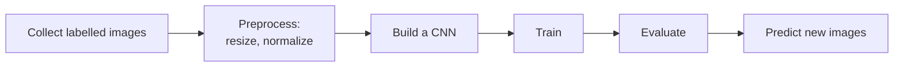

### 7.3 Preprocessing images for a model

Two steps almost always needed:

```python
# 1) Normalize pixel values from 0-255 to 0-1 (networks train better):
X = X / 255.0

# 2) Reshape to the shape the model expects (e.g., add a channel dim):
X = X.reshape(-1, 28, 28, 1)
```

- **Normalization** (dividing by 255) is critical — it keeps inputs small and consistent, so gradient descent behaves.

### 7.4 Famous benchmark datasets

| Dataset | Contents | Use |
|---|---|---|
| **MNIST** | 70,000 handwritten digits (28×28) | The classic starter (Project 1's big sibling) |
| **Fashion-MNIST** | 70,000 clothing images | A tougher drop-in for MNIST |
| **CIFAR-10** | 60,000 color images, 10 classes | Real-world objects (planes, cats, cars) |
| **ImageNet** | 14M images, 1000 classes | The benchmark that launched deep learning |

### 7.5 Evaluating an image classifier

Same tools as Module 4's classification: **accuracy**, a **confusion matrix** (which classes get confused — e.g., 4s mistaken for 9s), precision/recall per class. Project 1 prints exactly these.

### 7.6 Data augmentation — free extra data

Deep networks are data-hungry, but you rarely have enough labelled images. **Data augmentation** creates *new* training images by randomly transforming existing ones — teaching the model that a cat is still a cat when flipped, rotated, or dimmed:

| Transformation | Effect |
|---|---|
| **Flip** | Mirror left↔right |
| **Rotate** | Turn a few degrees |
| **Zoom / crop** | Scale in or out |
| **Brightness / contrast** | Lighting changes |
| **Shift** | Move the object around the frame |

```python
data_augmentation = keras.Sequential([
    layers.RandomFlip("horizontal"),
    layers.RandomRotation(0.1),
    layers.RandomZoom(0.1),
])
```

- One photo becomes many, so the model **generalizes better and overfits less** — often the single biggest boost for small image datasets. (Don't flip where orientation matters — e.g., digits or text!)

---

## 8. OpenCV — The Computer Vision Toolkit

### 8.1 What is OpenCV?

**OpenCV** (Open Source Computer Vision) is the standard library for **image and video processing**. It handles the practical work *around* deep learning: loading images, resizing, converting colors, detecting edges, drawing boxes, reading from a webcam. **Project 3** is a hands-on tour of it.

```bash
pip install opencv-python      # import it as: import cv2
```

### 8.2 Reading, showing, and saving images

```python
import cv2

img = cv2.imread("photo.jpg")        # load an image -> a NumPy array (BGR!)
print(img.shape)                     # e.g. (720, 1280, 3)
cv2.imwrite("output.jpg", img)       # save an image
# cv2.imshow("window", img); cv2.waitKey(0)   # display (needs a screen)
```

> **Tip for scripts/servers:** prefer `cv2.imwrite` (save to file) over `cv2.imshow` (opens a window) — saving works everywhere, including headless machines. The projects save PNGs for this reason.

### 8.3 Color spaces

```python
gray = cv2.cvtColor(img, cv2.COLOR_BGR2GRAY)   # color -> grayscale
rgb  = cv2.cvtColor(img, cv2.COLOR_BGR2RGB)    # BGR -> RGB (for Matplotlib)
```

- Remember: OpenCV loads images as **BGR**. To display with Matplotlib (which expects RGB), convert first, or your reds and blues will swap.

### 8.4 Core operations (the Project 3 toolkit)

| Operation | Function | Purpose |
|---|---|---|
| **Resize** | `cv2.resize(img, (w, h))` | Change image size |
| **Grayscale** | `cv2.cvtColor(..., BGR2GRAY)` | Drop color |
| **Blur** | `cv2.GaussianBlur(img, (5,5), 0)` | Smooth / reduce noise |
| **Edges** | `cv2.Canny(img, 50, 150)` | Find outlines |
| **Threshold** | `cv2.threshold(...)` | Make pure black/white |
| **Contours** | `cv2.findContours(...)` | Detect object outlines |
| **Draw** | `cv2.rectangle`, `cv2.circle`, `cv2.putText` | Annotate images |

```python
gray = cv2.cvtColor(img, cv2.COLOR_BGR2GRAY)
blurred = cv2.GaussianBlur(gray, (9, 9), 0)
edges = cv2.Canny(blurred, 50, 150)                 # outlines
_, thresh = cv2.threshold(gray, 240, 255, cv2.THRESH_BINARY_INV)
contours, _ = cv2.findContours(thresh, cv2.RETR_EXTERNAL, cv2.CHAIN_APPROX_SIMPLE)
print(f"Found {len(contours)} objects")             # count shapes
```

### 8.5 Face detection with Haar cascades

OpenCV ships with classic (pre-deep-learning) detectors called **Haar cascades** — fast face/eye detectors that need no training:

```python
face_cascade = cv2.CascadeClassifier(
    cv2.data.haarcascades + "haarcascade_frontalface_default.xml")
faces = face_cascade.detectMultiScale(gray, 1.1, 4)   # returns boxes (x,y,w,h)
for (x, y, w, h) in faces:
    cv2.rectangle(img, (x, y), (x+w, y+h), (0, 255, 0), 2)
```

- Great for a quick face detector. For accuracy on hard images, modern deep-learning detectors (YOLO) win — which is next.

### 8.6 Video and webcam

OpenCV reads video frame by frame (each frame is just an image):

```python
cap = cv2.VideoCapture(0)          # 0 = default webcam; or "video.mp4"
while True:
    ret, frame = cap.read()        # grab one frame (a NumPy image)
    if not ret: break
    # ... process 'frame' like any image ...
cap.release()
```

This is how real-time vision apps work — apply your image processing (or a YOLO model) to each frame.

### 8.7 More OpenCV operations (quick reference)

A grab-bag of everyday operations you'll reach for:

```python
# --- Geometry ---
resized = cv2.resize(img, (300, 200))              # to width x height
rotated = cv2.rotate(img, cv2.ROTATE_90_CLOCKWISE)
cropped = img[50:200, 100:300]                     # it's just NumPy slicing!
flipped = cv2.flip(img, 1)                         # 1=horizontal, 0=vertical

# --- Drawing & text (annotate images) ---
cv2.rectangle(img, (10, 10), (100, 100), (0, 255, 0), 2)   # green box
cv2.circle(img, (60, 60), 30, (0, 0, 255), -1)             # filled red circle
cv2.line(img, (0, 0), (100, 100), (255, 0, 0), 2)          # blue line
cv2.putText(img, "Hello", (10, 40), cv2.FONT_HERSHEY_SIMPLEX,
            1, (0, 0, 0), 2)                               # text label

# --- Morphological ops (clean up binary images) ---
kernel = np.ones((5, 5), np.uint8)
dilated = cv2.dilate(thresh, kernel)               # grow white regions
eroded  = cv2.erode(thresh, kernel)                # shrink white regions
```

| Category | Functions |
|---|---|
| **Geometry** | `resize`, `rotate`, `flip`, slicing (crop) |
| **Drawing** | `rectangle`, `circle`, `line`, `putText` |
| **Cleanup** | `dilate`, `erode`, `morphologyEx` |
| **Combine** | `addWeighted` (blend), `bitwise_and/or` (masks) |

- **Key takeaway:** because an image is a NumPy array, cropping is just **slicing** (`img[y1:y2, x1:x2]`) — Module 3's skills pay off directly.

---

## 9. Object Detection & YOLO

### 9.1 Classification vs Detection vs Segmentation

Three levels of "understanding" an image:

| Task | Output | Example |
|---|---|---|
| **Classification** | One label for the whole image | "This image contains a dog" |
| **Detection** | Labels **+ boxes** for each object | "Dog at (x,y,w,h), ball at (x,y,w,h)" |
| **Segmentation** | Labels **+ exact pixel masks** | Outline every pixel of the dog |

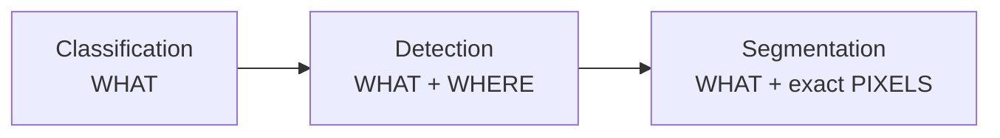

**Project 2** does **detection** — the sweet spot for most real applications (self-driving cars, security, retail analytics).

### 9.2 What is YOLO?

**YOLO** — *You Only Look Once* — is a family of fast, accurate object detectors. The name captures its trick: older detectors scanned an image many times; YOLO looks at the **whole image in a single pass**, predicting all boxes and labels at once. That speed makes it usable in **real time** (video, webcams, drones).

- YOLO has evolved rapidly: YOLOv1 (2016) → … → **YOLOv8 / YOLOv11** (the 2024–2026 versions from **Ultralytics**), which are the easy-to-use standard today.

### 9.3 Using YOLO with Ultralytics

The `ultralytics` library makes YOLO astonishingly simple:

```python
from ultralytics import YOLO

model = YOLO("yolov8n.pt")            # load a small pre-trained model (n = nano)
results = model("street.jpg")         # run detection on an image

for box in results[0].boxes:
    label = model.names[int(box.cls)] # e.g. "person"
    confidence = float(box.conf)      # e.g. 0.87
    print(label, confidence)

results[0].plot()                     # get the image with boxes drawn
```

- `yolov8n.pt` is **pre-trained** on the **COCO** dataset — it already recognizes **80 everyday object classes** (person, car, dog, bottle, laptop…). You don't train anything; you *use* it. This is **Project 2** exactly.
- Model sizes trade speed for accuracy: `n` (nano, fastest) → `s` → `m` → `l` → `x` (largest, most accurate).

### 9.4 What the output means

Each detection has:
- a **bounding box** (x, y, width, height),
- a **class label** (from the 80 COCO classes),
- a **confidence** score (0–1) — how sure the model is.

You typically keep detections above a confidence threshold (e.g., 0.5) and can filter to specific classes (e.g., count only people).

### 9.5 Computer vision in the real world (2026)

Object detection and image classification aren't toys — they run in production across every industry. This is *why* the skill matters:

| Industry | Computer-vision application |
|---|---|
| **Healthcare** | Detecting tumors in X-rays/CT, diabetic retinopathy in eye scans |
| **Automotive** | Self-driving perception — detecting cars, lanes, pedestrians, signs |
| **Retail** | Cashier-less stores, shelf monitoring, footfall counting |
| **Manufacturing** | Automated defect inspection on production lines |
| **Agriculture** | Crop-disease detection and weed spraying from drones |
| **Security** | Surveillance, intrusion detection, license-plate recognition |
| **Sports** | Player tracking, automated highlights, line-call systems |
| **Finance** | Reading cheques and documents (OCR), ID verification |

> Nearly all of these are built the way you built Project 2: take a **pre-trained detector**, fine-tune it on domain images, and deploy. You now have the exact skill these systems are made of.

---

## 10. Transfer Learning & Pre-trained Models

### 10.1 The idea that makes modern CV practical

Training a deep vision model from scratch needs millions of images and huge compute — out of reach for most. **Transfer learning** solves this: take a model **already trained** on a massive dataset, and reuse its learned features for *your* task. YOLO's `yolov8n.pt` is exactly this — trained by others on COCO, ready for you to use.

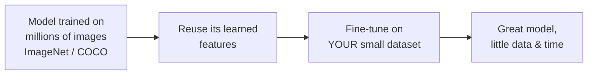

### 10.2 Why it works

The early layers of any vision model learn **universal** features — edges, textures, shapes — that are useful for *any* image task. Only the final layers are task-specific. So you keep the early layers and retrain just the last part on your data.

| Approach | Data needed | Compute | When |
|---|---|---|---|
| **From scratch** | Millions | Huge (many GPUs) | Rarely (big labs) |
| **Transfer learning** | Hundreds–thousands | Modest | **Almost always** |

### 10.3 Where you'll use it

- **Project 2** uses a pre-trained YOLO directly (no training).
- Popular pre-trained image backbones: **ResNet, VGG, MobileNet, EfficientNet** (via `keras.applications`).
- The same idea powers **Module 6 (NLP)** and **Module 7 (Generative AI)** — those giant language models are pre-trained foundations you adapt. Transfer learning is one of the most important ideas in all of modern AI.

### 10.4 Fine-tuning in practice (how it looks)

To classify *your own* categories (say, "healthy vs diseased leaf") with only a few hundred images, you take a pre-trained backbone, **freeze** its learned layers, and train a fresh small head on top:

```python
from tensorflow.keras.applications import MobileNetV2

base = MobileNetV2(weights="imagenet", include_top=False)  # pre-trained features
base.trainable = False                                      # freeze them

model = keras.Sequential([
    base,
    layers.GlobalAveragePooling2D(),
    layers.Dense(2, activation="softmax")   # your 2 classes: healthy / diseased
])
model.compile(optimizer="adam", loss="sparse_categorical_crossentropy",
              metrics=["accuracy"])
model.fit(your_images, your_labels, epochs=10)   # trains fast - most work is reused
```

- `include_top=False` drops the original 1000-class head; you add your own. Freezing the base means you only train the tiny new head → **fast training, little data, strong results.** This recipe is how most real-world image classifiers are built. YOLO fine-tuning (`model.train(data="your_data.yaml")`) follows the same spirit for detection.

---

## 11. Hands-on Activities Overview

The syllabus lists **two** activities — *Digit Recognition* and *Object Detection*. We build both, plus an **OpenCV Image Processing** toolkit that grounds the computer-vision fundamentals.

| # | Project | Focus | Tool |
|---|---|---|---|
| 1 | **Digit Recognition** | Neural network / image classification | scikit-learn (Keras version in notes) |
| 2 | **Object Detection** | Deep-learning detection | YOLOv8 (Ultralytics) |
| 3 | **OpenCV Image Processing** | Vision fundamentals | OpenCV |

> ### 📦 About these projects
> The **complete, tested, ready-to-run** programs live in
> `Hands-on Projects/Module 5 Hands-on Projects/`, each with a `README.md`. First run
> `pip install -r requirements.txt`. Console output is plain ASCII; each project **saves a
> PNG image** you open afterward. Project 2 downloads a ~6 MB YOLO model on first run.

---

## 12. Hands-on Project 1 — Digit Recognition

Train a neural network to read handwritten digits — the "hello world" of computer vision.

### 12.1 The core

```python
from sklearn.datasets import load_digits
from sklearn.neural_network import MLPClassifier

digits = load_digits()                       # 1,797 images, 8x8 pixels, labels 0-9
X, y = digits.data, digits.target            # X: 64 pixels per image

model = MLPClassifier(hidden_layer_sizes=(64, 32), max_iter=500)  # a neural net
model.fit(X_train_scaled, y_train)           # train
print(model.score(X_test_scaled, y_test))    # accuracy
```

- `hidden_layer_sizes=(64, 32)` = two hidden layers — the exact same architecture as the Keras model in §4.2. `MLPClassifier` **is** a neural network.

### 12.2 Sample output

```
Loaded 1797 images, each 8x8 pixels, labelled 0-9.
Training a neural network (2 hidden layers: 64 -> 32)...
Test accuracy: 0.981  (98.1% of digits correct)
Total misclassified: 7 out of 360 test images.
```

The project saves a grid of test images with the model's prediction on each (green = correct). **98% accuracy on unseen handwriting** — from a model that trains in seconds.

**Full program:** `Hands-on Projects/Module 5 Hands-on Projects/Project 1 - Digit Recognition/`. The notes' §4.2 / §6.5 show how to rebuild it as a Keras CNN for the full 28×28 MNIST.

---

## 13. Hands-on Project 2 — Object Detection with YOLO

Detect and label objects in real photos with a state-of-the-art model — in about 15 lines.

### 13.1 The core

```python
from ultralytics import YOLO
model = YOLO("yolov8n.pt")                   # pre-trained on 80 object classes
results = model("street.jpg")
for box in results[0].boxes:
    print(model.names[int(box.cls)], float(box.conf))   # label, confidence
results[0].plot()                            # image with boxes drawn
```

### 13.2 Sample output

```
----- OBJECTS DETECTED -----
   bus          (confidence 87%)
   person       (confidence 87%)
   person       (confidence 85%)
   person       (confidence 83%)
   stop sign    (confidence 26%)

Summary (counts):  4 x person, 1 x bus, 1 x stop sign
```

On a street photo, YOLO finds the bus and every pedestrian, drawing a labelled box around each. **You built a real object detector by *using* a pre-trained model** (transfer learning, §10) — no training required.

**Full program:** `Hands-on Projects/Module 5 Hands-on Projects/Project 2 - Object Detection/`. Point it at your own photos!

---

## 14. Hands-on Project 3 — OpenCV Image Processing

The vision fundamentals every system uses before deep learning.

### 14.1 The core

```python
import cv2
gray = cv2.cvtColor(img, cv2.COLOR_BGR2GRAY)          # 1. grayscale
blurred = cv2.GaussianBlur(gray, (9, 9), 0)           # 2. blur
edges = cv2.Canny(blurred, 50, 150)                   # 3. edges
_, thresh = cv2.threshold(gray, 240, 255, cv2.THRESH_BINARY_INV)  # 4. threshold
contours, _ = cv2.findContours(thresh, cv2.RETR_EXTERNAL,
                               cv2.CHAIN_APPROX_SIMPLE)  # 5. find objects
print(f"Found {len(contours)} objects")
```

### 14.2 Sample output

```
Sample image created: 600x400 pixels, 3 color channels (array shape (400, 600, 3)).
Contour detection found 5 object(s) in the image.
[OK] Montage saved to 'processing_steps.png'.
```

The saved montage shows all six steps — original, grayscale, blur, edges, threshold, and contours — applied to a generated image of 5 shapes, all correctly detected and boxed.

**Full program:** `Hands-on Projects/Module 5 Hands-on Projects/Project 3 - OpenCV Image Processing/`.

### 14.3 The three projects together

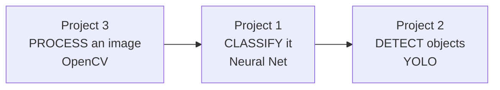

From "an image is an array" to "a neural network reads it" to "YOLO finds every object" — you've traversed the whole computer-vision stack.

---

## 15. Best Practices & Common Mistakes

### 15.1 Deep-learning best practices

- **Use Google Colab** for free GPUs — deep learning is painfully slow on CPU.
- **Normalize images** (pixels 0–1) before training.
- **Start with transfer learning**, not from scratch.
- **Watch training vs validation accuracy** to catch overfitting early.
- **Use data augmentation** (flips, rotations) to squeeze more from small datasets.
- **Save your trained models** (`model.save(...)`) so you don't retrain.

### 15.2 Top 10 beginner mistakes

| # | Mistake | Fix |
|---|---|---|
| 1 | Forgetting to normalize pixels | Divide by 255.0 |
| 2 | RGB vs BGR color swap | Convert with `cvtColor` for Matplotlib |
| 3 | Wrong input shape into the model | Match `(height, width, channels)` |
| 4 | Training deep nets on CPU (too slow) | Use Colab / a GPU |
| 5 | Too few epochs (underfit) or too many (overfit) | Watch validation accuracy |
| 6 | Using a Dense net where a CNN belongs | CNNs for images |
| 7 | Tiny dataset, training from scratch | Use transfer learning |
| 8 | `cv2.imshow` on a server (crashes) | Save with `cv2.imwrite` |
| 9 | Judging only on training accuracy | Always check a test/validation set |
| 10 | Ignoring class imbalance | Augment / weight classes |

### 15.3 Modern context (2026)

- **Vision Transformers (ViT)** now rival CNNs on many tasks; **YOLOv8/v11** remain the go-to for real-time detection.
- **Multimodal models** (that see *and* read) blur the line between vision and language — a bridge to Modules 6 and 7.
- Cloud vision APIs and pre-trained models mean you can build powerful vision apps **without training anything** — understanding the concepts here is what lets you use them well.

---

## 16. Glossary

| Term | Meaning |
|---|---|
| **Deep Learning** | ML with many-layered neural networks. |
| **Neuron** | A unit computing a weighted sum + activation. |
| **Weight / Bias** | Learned parameters of a neuron. |
| **Activation function** | Adds non-linearity (ReLU, Sigmoid, Softmax). |
| **Layer** | A group of neurons (input/hidden/output). |
| **Dense layer** | A fully-connected layer. |
| **Forward pass** | Pushing data through the network to predict. |
| **Loss function** | Measures how wrong predictions are. |
| **Backpropagation** | Sends error backward to update weights. |
| **Gradient descent** | Nudges weights to reduce loss. |
| **Epoch / Batch** | One pass over all data / a small chunk. |
| **Dropout** | Randomly disabling neurons to reduce overfitting. |
| **CNN** | Convolutional Neural Network — for images. |
| **Filter / Kernel** | Small learned grid that detects a pattern. |
| **Feature map** | Output showing where a pattern appears. |
| **Pooling** | Downsampling a feature map (max pooling). |
| **Pixel** | One image dot, value 0–255. |
| **Channel** | A color plane (R, G, or B). |
| **OpenCV** | Library for image/video processing (`cv2`). |
| **BGR** | OpenCV's color order (Blue, Green, Red). |
| **Contour** | The outline of a shape/object. |
| **Image classification** | Assigning one label to an image. |
| **Object detection** | Finding labels **and** boxes for objects. |
| **Segmentation** | Labeling every pixel of each object. |
| **YOLO** | "You Only Look Once" — fast object detector. |
| **Bounding box** | The rectangle around a detected object. |
| **Transfer learning** | Reusing a pre-trained model for a new task. |
| **TensorFlow / Keras** | Google's deep-learning framework / its friendly API. |
| **PyTorch** | Meta's deep-learning framework (powers YOLO). |

---

## 17. Practice Exercises & Self-Assessment

### 17.1 Concept checks

1. Why does deep learning beat classic ML on images?
2. What does an activation function add, and why is ReLU popular?
3. Describe the training loop (forward pass, loss, backprop, gradient descent).
4. What is a convolution filter, and what does pooling do?
5. Why do CNNs beat Dense networks on images (give two reasons)?
6. Classification vs detection vs segmentation — define each.
7. What is transfer learning and why is it so useful?
8. Why must you normalize pixels and match input shape?

### 17.2 Coding — neural network / classification

9. Run Project 1; change the hidden layers to `(128, 64)` — does accuracy change?
10. Read the confusion matrix — which digits are confused most?
11. (Colab) Build the Keras CNN from §6.5 on MNIST; report test accuracy.

### 17.3 Coding — OpenCV

12. Load one of your own photos; convert to grayscale and save it.
13. Apply Canny edge detection and a threshold; compare the results.
14. Detect faces in a group photo using a Haar cascade.

### 17.4 Coding — YOLO

15. Run Project 2 on 3 of your own images; note what it detects and misses.
16. Filter the detections to **count only people** in an image.
17. Try a larger model (`yolov8s.pt`) — does it detect more?

### 17.5 Integrative

18. Complete all three projects and one challenge from each README.
19. Build a mini app: use OpenCV to read a webcam frame and run YOLO on it.

### 17.6 Quick self-check quiz

1. What library powers Project 2's detection? *(→ YOLO/Ultralytics/PyTorch)*
2. What color order does OpenCV use? *(→ BGR)*
3. Which layer type is built for images? *(→ Convolutional / CNN)*
4. What does pooling do? *(→ shrinks feature maps)*
5. What's the output of object detection (vs classification)? *(→ labels + boxes)*
6. Why normalize pixels to 0–1? *(→ networks train better)*
7. What does "transfer learning" mean? *(→ reuse a pre-trained model)*
8. Digit recognition is which CV task? *(→ image classification)*

### 17.7 Solutions & Answer Key

> Try each first, then check. OpenCV code was verified; the Keras CNN runs on Colab / TensorFlow-ready Python.

**17.1 Concept checks**

1. **DL beats classic ML on images** because it **learns the useful features itself** (edges → shapes → objects) instead of you hand-crafting them, and it handles the raw, high-dimensional pixel data that classic ML struggles with.
2. **Activation functions add non-linearity**, letting a network learn curves and complex patterns (without them a deep net is just a linear model). **ReLU** (`max(0, x)`) is popular because it's simple, fast, and trains well.
3. **Training loop:** *forward pass* (make predictions) → *loss* (measure how wrong) → *backpropagation* (find each weight's share of the blame) → *gradient descent* (nudge weights to reduce loss) → repeat over many epochs.
4. **Convolution filter** = a small learned grid slid over the image to detect a pattern (edge, curve), producing a feature map. **Pooling** downsamples the feature map (keeps the strongest signal), making the network smaller and more robust to small shifts.
5. **CNNs beat Dense nets on images because** (a) they respect spatial structure (nearby pixels relate) via local filters, and (b) shared filters mean far fewer parameters and they detect a feature **anywhere** in the image (translation invariance).
6. **Classification** = one label for the whole image ("a cat"). **Detection** = labels **+ boxes** for each object ("cat here, ball there"). **Segmentation** = a label for **every pixel** (exact outlines).
7. **Transfer learning** = reuse a model already trained on a huge dataset and adapt it to your task. Useful because it gives strong results with **little data and compute** (the early layers' universal features are reused).
8. **Normalize + match shape:** dividing pixels by 255 (→ 0–1) keeps inputs small and consistent so gradient descent behaves; the input shape must match what the model's first layer expects (e.g., `(28, 28, 1)`), or it errors.

**17.2 Neural network / classification**

```python
# 9. Bigger hidden layers in Project 1's MLP
model = MLPClassifier(hidden_layer_sizes=(128, 64), max_iter=500, random_state=42)
# Often a small accuracy change; more neurons can help or slightly overfit small data.

# 10. Which digits are confused? Read the confusion matrix off-diagonal:
from sklearn.metrics import confusion_matrix
cm = confusion_matrix(y_test, y_pred)
# Large off-diagonal cells = confused pairs (classically 4<->9, 3<->5, 7<->1).

# 11. Keras CNN on MNIST (run on Colab / TensorFlow-ready Python)
from tensorflow import keras
from tensorflow.keras import layers
(x_tr, y_tr), (x_te, y_te) = keras.datasets.mnist.load_data()
x_tr, x_te = x_tr/255.0, x_te/255.0                       # normalize
x_tr = x_tr.reshape(-1, 28, 28, 1); x_te = x_te.reshape(-1, 28, 28, 1)
model = keras.Sequential([
    layers.Input((28, 28, 1)),
    layers.Conv2D(32, (3, 3), activation="relu"), layers.MaxPooling2D(),
    layers.Conv2D(64, (3, 3), activation="relu"), layers.MaxPooling2D(),
    layers.Flatten(), layers.Dense(64, activation="relu"),
    layers.Dense(10, activation="softmax"),
])
model.compile(optimizer="adam", loss="sparse_categorical_crossentropy", metrics=["accuracy"])
model.fit(x_tr, y_tr, epochs=5, validation_split=0.1)
print(model.evaluate(x_te, y_te))                         # ~99% test accuracy
```

**17.3 OpenCV** *(needs the full `opencv-python`; Haar cascades require its objdetect module)*

```python
import cv2

img = cv2.imread("photo.jpg")

# 12. Grayscale + save
gray = cv2.cvtColor(img, cv2.COLOR_BGR2GRAY)
cv2.imwrite("gray.jpg", gray)

# 13. Canny edges vs threshold
edges = cv2.Canny(gray, 50, 150)
_, thresh = cv2.threshold(gray, 127, 255, cv2.THRESH_BINARY)
cv2.imwrite("edges.jpg", edges); cv2.imwrite("thresh.jpg", thresh)
# Canny = thin outlines; threshold = solid black/white regions.

# 14. Face detection with a Haar cascade
cascade = cv2.CascadeClassifier(
    cv2.data.haarcascades + "haarcascade_frontalface_default.xml")
faces = cascade.detectMultiScale(gray, scaleFactor=1.1, minNeighbors=4)
for (x, y, w, h) in faces:
    cv2.rectangle(img, (x, y), (x + w, y + h), (0, 255, 0), 2)
cv2.imwrite("faces.jpg", img)
print(f"Found {len(faces)} face(s)")
```

**17.4 YOLO**

```python
from ultralytics import YOLO
model = YOLO("yolov8n.pt")

# 15. Run detection on your own images; each result carries boxes + labels
results = model("street.jpg")
for box in results[0].boxes:
    print(model.names[int(box.cls)], round(float(box.conf), 2))
# Note the detects vs misses - small, distant, or overlapping objects are common misses.

# 16. Count ONLY people (class name "person")
names = model.names
people = sum(1 for box in results[0].boxes if names[int(box.cls)] == "person")
print(f"People detected: {people}")

# 17. A bigger model usually detects more / more accurately:
model_s = YOLO("yolov8s.pt")     # 's' > 'n' in size and accuracy (slower)
```

**17.5 Integrative** — open, do-it tasks: the three projects plus a webcam+YOLO mini-app (loop `cv2.VideoCapture(0).read()` → `model(frame)` → show/annotate).

**17.6 Quiz** — answers are shown inline next to each question above.

> **Ready for Module 6 when:** you can explain neural networks and CNNs, run an image classifier and a YOLO detector, and do basic OpenCV processing.

---

## 18. Summary & What's Next

### 18.1 Module 5 in one picture

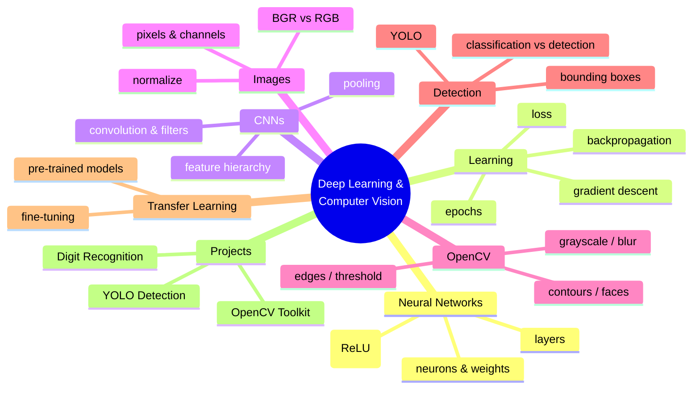

### 18.2 Key takeaways

- **Deep learning** shines on images because networks **learn features** instead of you hand-crafting them.
- A **neural network** = layers of neurons; it learns by **loss → backprop → gradient descent** over many **epochs**.
- **CNNs** are the architecture for images — convolution finds local patterns, pooling shrinks, deeper layers build up to objects.
- **An image is a NumPy array** of pixels; **OpenCV** processes them (grayscale, blur, edges, contours).
- **Object detection** (YOLO) finds *what and where*; **transfer learning** lets you use powerful pre-trained models with little data.

### 18.3 Skills checklist

- [ ] I can explain neurons, layers, and activation functions.
- [ ] I can describe how a network trains (loss, backprop, gradient descent).
- [ ] I can explain CNNs (convolution, pooling) and why they suit images.
- [ ] I can read/write Keras model code.
- [ ] I built an image classifier (digit recognition).
- [ ] I ran a YOLO object detector on real images.
- [ ] I performed core OpenCV image processing.

### 18.4 Bridge to Module 6

You've taught computers to **see**. Next, we teach them to **read and understand language**. In **Module 6 — Natural Language Processing (NLP)**, you'll process text: tokenization, sentiment analysis, word embeddings, and the **Transformer** architecture (including **BERT**) — the same architecture that powers ChatGPT and Claude. The deep-learning foundations from this module — neurons, training, transfer learning — carry straight over from pixels to words.

> **Homework before Module 6:** complete the three projects and one challenge each; if you have Colab, build and train the Keras CNN on MNIST and beat 98%. Bring your YOLO detection on a photo you took yourself.

---

### Instructor Notes (for the teaching team)

- **Suggested 10-hour split:** Hour 1 — DL vs ML + neural networks (§1–2); Hour 2 — how networks learn + Keras (§3–4); Hour 3 — images as data + **Project 3 (OpenCV)** (§5, §8); Hours 4–5 — CNNs + image classification + **Project 1** (§6–7); Hour 6 — OpenCV deeper (§8); Hours 7–8 — object detection + YOLO + **Project 2** (§9); Hour 9 — transfer learning (§10); Hour 10 — finish projects, run YOLO on students' own photos.
- **Use Google Colab** to sidestep TensorFlow/GPU install pain and to *see* a CNN train live. Note that the runnable Project 1 uses scikit-learn so it works even without TensorFlow.
- **The "wow" moments:** watching digit accuracy hit 98%, and running YOLO on a student's own photo. Lean into these — they cement motivation.
- **Emphasize intuition over calculus:** students don't need to derive backprop; they need to *understand* the loop and be able to build/use models.
- **Assessment:** the two syllabus projects (Digit Recognition, Object Detection) as graded deliverables; the OpenCV toolkit and a webcam+YOLO mini-app as bonus/portfolio pieces.
- **Hardware note:** if GPUs aren't available locally, standardize on Colab for the CNN work.

---

*End of Module 5 — Deep Learning & Computer Vision.*
*AI Powered Engineering Upskilling Program · 2026 Edition.*
