# Module 6 — Natural Language Processing

> **AI Powered Engineering Upskilling Program**
> *From Fundamentals to Generative AI Applications*

---

## Module Information Card

| Field | Detail |
|---|---|
| **Module Number** | 6 of 10 |
| **Module Title** | Natural Language Processing |
| **Duration** | 6 Hours (≈ 1 training day) |
| **Level** | Intermediate → Advanced |
| **Target Audience** | Engineering students, age 19–20 |
| **Prerequisites** | Modules 1–5 (Python, ML, some deep learning) |
| **Library Versions (2026)** | scikit-learn 1.x · NLTK / spaCy · Hugging Face Transformers 4.x |
| **Primary Tools** | scikit-learn, NLTK/spaCy, Hugging Face, Google Colab |
| **Learning Outcome** | Process and understand text. |
| **Hands-on Activity (syllabus)** | Spam Detection |
| **Hands-on Projects (this course)** | (1) Spam Detection · (2) Sentiment Analysis · (3) Text Preprocessing Toolkit |

### What you will be able to do after this module

1. Explain what **NLP** is and why human language is hard for computers.
2. **Preprocess** text: tokenization, stop words, stemming, lemmatization.
3. Turn text into numbers with **Bag-of-Words** and **TF-IDF**.
4. Understand **word embeddings** — dense vectors that capture meaning.
5. Build a **text classifier** (spam detection, sentiment analysis).
6. Explain the **Transformer** architecture and **self-attention** at a foundational level.
7. Understand **BERT** and modern pre-trained language models.
8. See the direct bridge from NLP to **Generative AI / LLMs** (Module 7).

> **How to use these notes**: NLP is the technology behind ChatGPT, Claude, translation, and search. The mental leap here is: **computers only understand numbers, so all of NLP is turning language into numbers a model can learn from.** Keep that idea central and everything clicks.

---

## Table of Contents

1. [What is Natural Language Processing?](#1-what-is-natural-language-processing)
2. [Text Preprocessing](#2-text-preprocessing)
3. [Turning Text into Numbers](#3-turning-text-into-numbers)
4. [Word Embeddings](#4-word-embeddings)
5. [Text Classification](#5-text-classification)
6. [Sentiment Analysis](#6-sentiment-analysis)
7. [Sequence Models — RNNs & LSTMs](#7-sequence-models--rnns--lstms)
8. [The Transformer Architecture](#8-the-transformer-architecture)
9. [BERT & Modern Language Models](#9-bert--modern-language-models)
10. [NLP in 2026 & the Bridge to LLMs](#10-nlp-in-2026--the-bridge-to-llms)
11. [Hands-on Activities Overview](#11-hands-on-activities-overview)
12. [Hands-on Project 1 — Spam Detection](#12-hands-on-project-1--spam-detection)
13. [Hands-on Project 2 — Sentiment Analysis](#13-hands-on-project-2--sentiment-analysis)
14. [Hands-on Project 3 — Text Preprocessing Toolkit](#14-hands-on-project-3--text-preprocessing-toolkit)
15. [Best Practices & Common Mistakes](#15-best-practices--common-mistakes)
16. [Glossary](#16-glossary)
17. [Practice Exercises & Self-Assessment](#17-practice-exercises--self-assessment)
18. [Summary & What's Next](#18-summary--whats-next)

---

## 1. What is Natural Language Processing?

### 1.1 Definition

**Natural Language Processing (NLP)** is the branch of AI that gives computers the ability to **read, understand, interpret, and generate human language** — text and speech. "Natural language" means the languages *humans* speak (English, Hindi, Spanish), as opposed to programming languages.

NLP sits at the intersection of **linguistics** (how language works) and **machine learning** (learning patterns from data).

### 1.2 Why is language so hard for computers?

Numbers are precise; language is gloriously messy. Computers struggle with:

| Challenge | Example |
|---|---|
| **Ambiguity** | "I saw her duck" — a bird, or ducking down? |
| **Context** | "That's sick!" — ill, or awesome? Depends on context. |
| **Sarcasm & tone** | "Oh great, another Monday" — not actually great. |
| **Synonyms** | "big", "large", "huge" all mean similar things. |
| **Spelling & slang** | "u r gr8", typos, emojis, new words. |
| **Word order** | "Dog bites man" ≠ "Man bites dog". |

Teaching a machine to handle all this is why NLP is one of AI's hardest and most impressive achievements.

### 1.3 Where you use NLP every day

| Application | NLP task |
|---|---|
| **Spam filters** | Text classification (Project 1!) |
| **Google Translate** | Machine translation |
| **Siri / Alexa** | Speech recognition + understanding |
| **Autocomplete / autocorrect** | Language modeling |
| **ChatGPT / Claude** | Text generation (Module 7) |
| **Search engines** | Understanding your query |
| **Product review analysis** | Sentiment analysis (Project 2!) |
| **Chatbots** | Intent recognition + generation |

### 1.4 The NLP pipeline

Almost every NLP system follows this flow — and it structures this entire module:

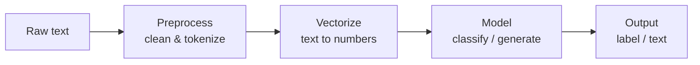

- **The single most important idea:** a model can't read words — so step C, **turning text into numbers**, is the heart of NLP. Everything in this module builds toward doing that well.

---

## 2. Text Preprocessing

Raw text is messy. **Preprocessing** cleans and standardizes it so a model can work with it — the NLP equivalent of the data cleaning you did in Module 3. This section powers **Project 3**.

### 2.1 The preprocessing steps

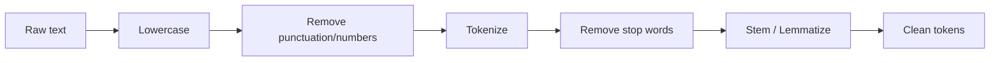

### 2.2 Lowercasing

Convert everything to lowercase so "Apple", "APPLE", and "apple" are treated as the same word:

```python
text = "AI is AMAZING".lower()    # -> "ai is amazing"
```

- ⚠️ Sometimes case matters ("US" the country vs "us"), but for most tasks lowercasing helps.

### 2.3 Removing punctuation and numbers

Punctuation and digits often add noise for tasks like classification:

```python
import re
clean = re.sub(r"[^a-z\s]", "", "hello, world! in 2026.")   # -> "hello world in "
```

### 2.4 Tokenization

**Tokenization** splits text into individual units called **tokens** (usually words). It's the foundation of NLP — you can't process text without first breaking it up:

```python
"I love NLP".split()          # simple: -> ['I', 'love', 'NLP']
# Real tokenizers (NLTK/spaCy) handle punctuation, contractions, etc.
```

- Modern LLMs use **subword tokenization** (splitting into pieces like "play", "##ing"), so they can handle any word — even ones they've never seen.

### 2.5 Stop-word removal

**Stop words** are extremely common words (*the, is, a, and, of*) that carry little meaning for many tasks. Removing them reduces noise and data size:

```python
from sklearn.feature_extraction.text import ENGLISH_STOP_WORDS
tokens = ["this", "is", "a", "great", "movie"]
meaningful = [t for t in tokens if t not in ENGLISH_STOP_WORDS]
# -> ['great', 'movie']
```

> ⚠️ **Big caveat (from Project 2):** for **sentiment analysis**, do **not** remove *not, no, never* — they flip meaning! "not good" ≠ "good". Choose your stop-word list per task.

### 2.6 Stemming vs Lemmatization

Both reduce a word to a base form so "running", "ran", "runs" are treated as related:

| | Stemming | Lemmatization |
|---|---|---|
| Method | Chops off suffixes (crude rules) | Uses a dictionary + grammar (smart) |
| "studies" → | "studi" | "study" |
| "better" → | "better" | "good" |
| Speed | Fast | Slower |
| Accuracy | Rough | Correct real words |

```python
# Stemming (NLTK's Porter stemmer):
from nltk.stem import PorterStemmer
PorterStemmer().stem("running")     # -> "run"

# Lemmatization (spaCy or NLTK WordNet):
# "better" -> "good", "studies" -> "study"
```

- **Rule of thumb:** stemming is faster and fine for search/classification; lemmatization is better when you need real, correct words. *(Project 3 uses a simplified stemmer so it runs with zero downloads.)*

### 2.7 A full worked preprocessing example

Watch one sentence go through the whole pipeline:

```
Original:   "The 2 CATS are Running QUICKLY!! :)"
[1] lower:  "the 2 cats are running quickly!! :)"
[2] clean:  "the cats are running quickly"        (removed 2, !!, :) )
[3] tokens: ["the", "cats", "are", "running", "quickly"]
[4] no stop:["cats", "running", "quickly"]        (dropped the, are)
[5] stem:   ["cat", "run", "quick"]               (roots)
```

The messy original becomes three clean, meaningful root tokens — ready to turn into numbers. **This is what Project 3 does live.**

### 2.8 Handling real-world text

Real text has extras that need decisions:

| Element | Common handling |
|---|---|
| **Emojis** 😀 | Remove, or map to sentiment ("😀" → positive) |
| **URLs / emails** | Replace with a token like `<URL>` or remove |
| **Contractions** | Expand ("don't" → "do not") — matters for negation! |
| **Numbers** | Remove, or replace with `<NUM>` |
| **Hashtags / @mentions** | Split or strip (social media text) |
| **Extra whitespace** | Collapse to single spaces |

- There's no single "right" pipeline — you choose steps based on the **task**. For sentiment, keep emojis and negations; for topic classification, you can be more aggressive.

---

## 3. Turning Text into Numbers

This is the **core** of NLP. A machine-learning model does math — it needs numbers, not words. **Vectorization** turns each piece of text into a vector (a list of numbers). Two classic methods: Bag-of-Words and TF-IDF.

### 3.1 Bag-of-Words (BoW)

**Bag-of-Words** represents text by **counting how often each word appears**, ignoring order (as if you threw all the words into a bag). First build a **vocabulary** of all words, then count.

Example — two sentences:
- S1: "I love NLP"
- S2: "I love AI and NLP"

Vocabulary: `[ai, and, i, love, nlp]`

| | ai | and | i | love | nlp |
|---|---|---|---|---|---|
| **S1** | 0 | 0 | 1 | 1 | 1 |
| **S2** | 1 | 1 | 1 | 1 | 1 |

Each row is now a **numeric vector** the model can use.

```python
from sklearn.feature_extraction.text import CountVectorizer
vec = CountVectorizer()
X = vec.fit_transform(["I love NLP", "I love AI and NLP"])
print(vec.get_feature_names_out())   # ['ai' 'and' 'love' 'nlp']
print(X.toarray())                   # the count matrix
```

- **Limitation:** BoW ignores word order and treats all words as equally important. "the" gets the same footing as "excellent".

### 3.2 TF-IDF — smarter word weighting

**TF-IDF** (Term Frequency–Inverse Document Frequency) improves BoW by weighting words: a word is important if it appears **often in one document** but **rarely across all documents**. It downweights common words and highlights distinctive ones.

```
TF-IDF = TF (how often the word is in THIS text)
       × IDF (how RARE the word is across ALL texts)
```

- A word like "the" appears everywhere → low IDF → low weight.
- A word like "refund" appears in few messages → high IDF → high weight (very informative!).

```python
from sklearn.feature_extraction.text import TfidfVectorizer
vec = TfidfVectorizer()
X = vec.fit_transform(corpus)     # each text -> a vector of TF-IDF weights
```

TF-IDF is the workhorse of classic NLP — **both Project 1 (spam) and Project 2 (sentiment) use it.** It's simple, fast, and surprisingly effective.

### 3.3 N-grams — capturing short phrases

BoW/TF-IDF ignore word order, which loses meaning ("not good" becomes "not" + "good"). **N-grams** fix this partly by treating sequences of N words as single tokens:

| N-gram | Example from "not very good" |
|---|---|
| **Unigram** (1) | "not", "very", "good" |
| **Bigram** (2) | "not very", "very good" |
| **Trigram** (3) | "not very good" |

```python
TfidfVectorizer(ngram_range=(1, 2))   # use single words AND word pairs
```

- Bigrams let the model learn that "not good" is negative — which is exactly why **Project 2 uses `ngram_range=(1, 2)`**.

### 3.4 The limitation of BoW/TF-IDF

These methods treat words as **independent symbols**. To them, "king" and "queen" are as unrelated as "king" and "banana" — they share no numeric similarity. They also produce huge, mostly-zero (sparse) vectors. The next idea fixes this: **embeddings**.

### 3.5 TF-IDF by the numbers

Let's compute TF-IDF for one word to demystify it. Suppose we have **3 documents** and want the TF-IDF of "cat" in Document 1:

- Document 1: "the cat sat" (3 words, "cat" appears once)
- "cat" appears in **1 of the 3** documents.

```
TF  = (times "cat" appears in Doc1) / (total words in Doc1) = 1/3 = 0.33
IDF = log( total docs / docs containing "cat" ) = log(3 / 1) = 1.10
TF-IDF = TF × IDF = 0.33 × 1.10 = 0.37
```

Now compare with "the", which appears in **all 3** documents:
```
IDF("the") = log(3 / 3) = log(1) = 0    →    TF-IDF = anything × 0 = 0
```

- See the magic? "the" gets a TF-IDF of **0** (it's everywhere, so uninformative), while "cat" gets a real weight. *(scikit-learn uses a smoothed variant of this formula, but the intuition is identical.)*

### 3.6 Comparing texts with cosine similarity

Once texts are vectors, you can measure how **similar** two of them are with **cosine similarity** — the cosine of the angle between their vectors (1 = identical direction, 0 = unrelated):

```python
from sklearn.metrics.pairwise import cosine_similarity
sim = cosine_similarity(vec_doc1, vec_doc2)   # -> e.g. 0.82 = very similar
```

- This powers **search** ("find documents similar to this query"), **recommendations**, and **duplicate detection**. It's also the core of **semantic search** (§4.6) and the retrieval in **RAG** systems (Module 7).

---

## 4. Word Embeddings

### 4.1 The big idea

A **word embedding** represents each word as a **dense vector of numbers** (say 100–300 values) that **captures its meaning**. Words with similar meanings get similar vectors — so "king" and "queen" are *close together* in this number-space, while "king" and "banana" are far apart.

> **The famous slogan:** *"You shall know a word by the company it keeps."* Words that appear in similar contexts get similar embeddings. "cat" and "dog" both appear near "pet", "feed", "vet" — so they end up near each other.

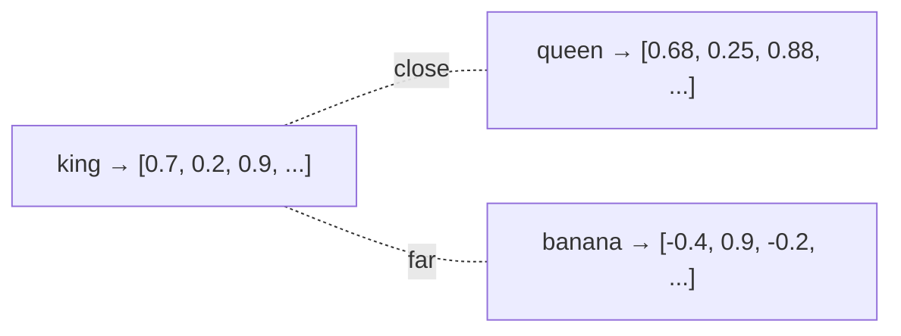

### 4.2 The magic: word arithmetic

Because embeddings capture meaning as directions in space, you can do *arithmetic* with words:

```
vector("king") − vector("man") + vector("woman") ≈ vector("queen")
```

The model learned the concept of "royalty" and "gender" as directions — nobody programmed that! This stunned researchers and proved embeddings capture real semantic structure.

### 4.3 How embeddings are made

| Method | Idea |
|---|---|
| **Word2Vec** (Google, 2013) | Train a small network to predict a word from its neighbors (or vice-versa) |
| **GloVe** (Stanford) | Factorize a giant word co-occurrence table |
| **Contextual embeddings** (BERT, 2018) | The *same word gets different vectors* depending on its sentence — a huge leap |

### 4.4 Static vs contextual embeddings

Early embeddings (Word2Vec) gave each word **one** fixed vector. But "bank" means different things in "river **bank**" vs "**bank** account"! **Contextual embeddings** (from Transformers/BERT, §8–9) give a word a vector that **depends on the surrounding words** — solving this and powering modern NLP.

| | Static (Word2Vec) | Contextual (BERT) |
|---|---|---|
| "bank" vector | Always the same | Different per sentence |
| Captures | General meaning | Meaning *in context* |
| Era | 2013 | 2018 → today |

### 4.5 Why embeddings matter

Embeddings are the bridge from "words as symbols" to "words as meaning". They are the input representation for essentially all modern NLP — including the LLMs behind ChatGPT and Claude. **TF-IDF (Project 3) is your first step; embeddings are the same idea made vastly richer.**

### 4.6 Sentence embeddings & semantic search

Words aren't the only things we embed — whole **sentences and documents** can be turned into a single meaning-vector. This unlocks **semantic search**: finding results by *meaning*, not just keyword matching.

```
Query:   "how to reset my password"
Matches: "steps to recover your login"   ← different words, SAME meaning!
```

- Keyword search would miss that match (no shared words); **semantic search** finds it because the two sentences have **similar embeddings**.
- You compute this with sentence-embedding models (e.g., `sentence-transformers`) and **cosine similarity** (§3.6).
- **This is the heart of RAG** (Retrieval-Augmented Generation) in Module 7 — giving an LLM the *relevant* documents to answer from. You're seeing the foundation now.

---

## 5. Text Classification

### 5.1 What it is

**Text classification** assigns a **category** to a piece of text. It's the most common practical NLP task, and it's just Module 4's classification applied to text-turned-into-numbers.

| Task | Categories |
|---|---|
| **Spam detection** | spam / ham (Project 1) |
| **Sentiment analysis** | positive / negative (Project 2) |
| **Topic labeling** | sports / politics / tech |
| **Intent detection** | book_flight / check_weather (chatbots) |
| **Language detection** | English / Hindi / Spanish |

### 5.2 The text-classification pipeline

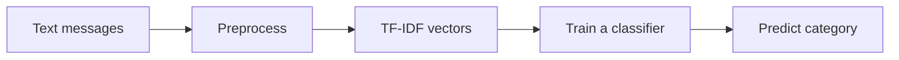

This is *exactly* Project 1 and Project 2. The classifier is a standard ML model from Module 4 (Naive Bayes, Logistic Regression) — the only new part is turning text into vectors first.

### 5.3 Naive Bayes — the classic text classifier

**Naive Bayes** is a fast, probability-based classifier that works remarkably well on text. It uses **Bayes' theorem** and a "naive" assumption that each word contributes independently. For spam detection it asks: *given these words, what's the probability this is spam?*

```python
from sklearn.naive_bayes import MultinomialNB
model = MultinomialNB()
model.fit(X_train, y_train)      # X = TF-IDF vectors, y = spam/ham
```

- **Why it's great for text:** fast to train, handles many features (words) well, and needs little data. It's the default first choice for text — and what **Project 1** uses.

**The intuition by numbers.** Naive Bayes learns, from the training data, how likely each word is in spam vs ham. For a new message it multiplies these probabilities:

```
Message: "free prize"
P(spam) depends on:  P("free" | spam) × P("prize" | spam) × P(spam)
P(ham)  depends on:  P("free" | ham)  × P("prize" | ham)  × P(ham)
```

If "free" and "prize" are far more common in spam, `P(spam)` wins and the message is flagged. That's the whole idea — **multiply the per-word evidence, pick the bigger side.** The "naive" part is assuming words are independent (they're not, but it works well anyway).

### 5.4 Evaluating text classifiers

Same tools as Module 4: **accuracy, precision, recall, F1, confusion matrix**. For spam, **recall on the spam class matters** (don't miss spam), but **precision matters too** (don't send real mail to the spam folder — a false positive is very annoying). This is the precision/recall trade-off in action.

### 5.5 Other core NLP tasks (the wider field)

Classification is just one of many NLP tasks. Knowing the landscape helps you recognize what's possible:

| Task | What it does | Example |
|---|---|---|
| **Named Entity Recognition (NER)** | Find & label people, places, orgs, dates | "**Apple** released the **iPhone** in **2007**" |
| **Part-of-Speech (POS) tagging** | Label each word's grammatical role | "run" = verb or noun? |
| **Machine Translation** | Translate between languages | English → Hindi |
| **Summarization** | Condense long text to key points | A 10-page report → 3 sentences |
| **Question Answering** | Answer questions from a passage | "Who wrote it?" → "Shakespeare" |
| **Topic Modeling** | Discover themes in a document set | Group 10,000 articles by topic |
| **Text Generation** | Produce new text | Autocomplete, ChatGPT (Module 7) |
| **Speech-to-Text** | Transcribe audio to text | Voice assistants, captions |

- In **2026**, a single **LLM** can do *most* of these tasks when prompted — but understanding them individually is how you know what to ask for and how to evaluate the result.

```python
# With Hugging Face, many of these are one line:
from transformers import pipeline
ner = pipeline("ner")                       # named entities
summarizer = pipeline("summarization")      # summaries
qa = pipeline("question-answering")         # answer from a passage
```

---

## 6. Sentiment Analysis

### 6.1 What it is

**Sentiment analysis** (or *opinion mining*) determines the **emotional tone** of text — positive, negative, or neutral. Businesses use it to analyze reviews, tweets, and support tickets at scale. It's **Project 2**.

### 6.2 Two approaches

| Approach | How it works | Pros / Cons |
|---|---|---|
| **Lexicon-based** | Count positive vs negative words from a dictionary | Simple, no training; but misses context |
| **Machine learning** | Train a classifier on labelled examples (Project 2) | Learns from data; needs labelled reviews |
| **Deep learning / Transformers** | Fine-tune BERT-style models | Best accuracy; needs more setup |

### 6.3 Why sentiment is hard

Sentiment is subtler than spam. Watch out for:

| Trap | Example |
|---|---|
| **Negation** | "not good" — the "not" flips it (keep negation words!) |
| **Sarcasm** | "Oh, *wonderful*, it broke again." |
| **Context** | "unpredictable plot" (good for a movie, bad for a car's brakes) |
| **Comparatives** | "better than the last one" (still might be bad) |
| **Mixed** | "Great screen, terrible battery." |

> **This is why Project 2 keeps negation words and uses bigrams** — so the model can learn "not good" as a negative phrase. It's also why real sentiment models train on *thousands* of examples.

### 6.4 A note on accuracy

Because sentiment is harder and language is subtle, a small-data sentiment model reaches lower accuracy than a spam model. That's expected and honest — more (and better-labelled) data is the main lever. Real-world sentiment systems reach 85–95% by training on huge review datasets.

---

## 7. Sequence Models — RNNs & LSTMs

### 7.1 Why order matters

BoW and TF-IDF throw away **word order**, but order carries meaning: "the dog chased the cat" ≠ "the cat chased the dog". To truly understand language, models must process text as a **sequence**. This motivated a family of neural networks built for sequences.

### 7.2 Recurrent Neural Networks (RNNs)

A **Recurrent Neural Network (RNN)** reads text **one word at a time**, keeping a "memory" (hidden state) that carries information forward — so earlier words influence how later ones are understood:

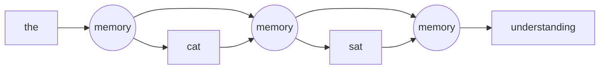

### 7.3 LSTMs — fixing RNN's memory problem

Plain RNNs **forget** early words in long sentences (the "vanishing gradient" problem). **LSTMs** (Long Short-Term Memory networks) add gates that let them **remember important information over long distances** — a big improvement for language.

| Model | Strength | Weakness |
|---|---|---|
| **RNN** | Handles sequences | Forgets long-range context |
| **LSTM** | Remembers longer | Slow (processes word by word) |

### 7.4 The limitation that led to Transformers

RNNs and LSTMs process words **one at a time, in order** — which is slow and still struggles with very long-range relationships. The question researchers asked: *what if a model could look at all words at once and directly decide which ones matter to each other?* The answer — the **Transformer** — changed everything.

---

## 8. The Transformer Architecture

### 8.1 The most important idea in modern AI

The **Transformer** (introduced in the 2017 paper *"Attention Is All You Need"*) is the architecture behind **every** modern language model — ChatGPT, Claude, Gemini, BERT. If you understand one thing from this module, make it this. It replaced RNNs by processing **all words at once** and using **attention** to decide which words matter to each other.

### 8.2 Self-attention — the key mechanism

**Attention** lets the model, when processing each word, **look at all the other words** and weigh how relevant each is. Consider:

> "The animal didn't cross the street because **it** was too tired."

What does "it" refer to — the animal or the street? A human knows "animal". **Self-attention** lets the model learn to connect "it" strongly to "animal" — directly, no matter how far apart they are in the sentence.

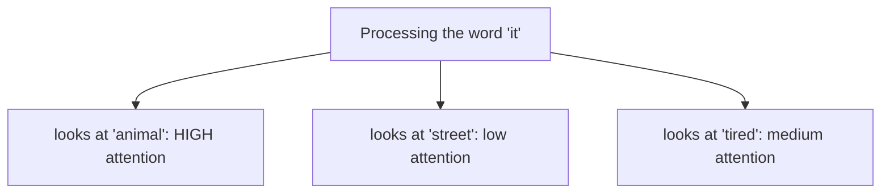

- Each word builds an understanding of itself **in context** by attending to the relevant words. This is how Transformers produce **contextual embeddings** (§4.4).

### 8.3 Why Transformers won

| | RNN / LSTM | Transformer |
|---|---|---|
| Processes words | One at a time (sequential) | **All at once** (parallel) |
| Speed on GPUs | Slow | **Very fast** (parallelizable) |
| Long-range links | Weak | **Strong** (direct attention) |
| Scales to huge data | Poorly | **Extremely well** |

That last point is the key: Transformers keep getting better as you add data and size — which led directly to the giant models of today.

### 8.4 The architecture at a glance

A Transformer stacks many layers of **self-attention + feed-forward networks**. Two families emerged:

| Type | Reads | Best for | Examples |
|---|---|---|---|
| **Encoder** | Whole text at once (both directions) | *Understanding* text | BERT |
| **Decoder** | Left to right, predicting next word | *Generating* text | GPT, Claude |

You don't need the internal math — the intuition (attention + parallelism + scale) is what matters.

### 8.5 Two more Transformer ideas (for the curious)

Two mechanisms make attention work in practice — good to recognize:

**Positional encoding.** Since a Transformer reads all words at once (not in order), it needs a way to know *where* each word is. **Positional encodings** add position information to each word's vector, so "dog bites man" and "man bites dog" are distinguishable.

**Multi-head attention.** Instead of one attention calculation, a Transformer runs **several in parallel** ("heads"), each learning to focus on a different kind of relationship — one head might track grammar, another might link pronouns to nouns, another might track topic.

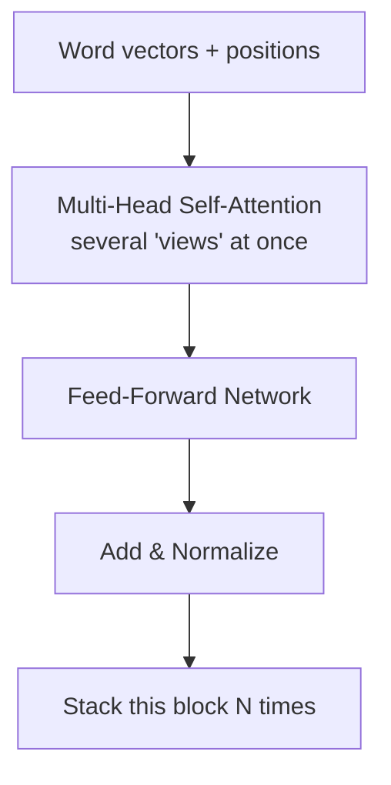

- A full Transformer stacks this block **many times** (BERT-base has 12, large models have far more). Each layer builds a richer understanding. **More layers + more data = more capable models** — the recipe behind today's giants.

---

## 9. BERT & Modern Language Models

### 9.1 What is BERT?

**BERT** (Bidirectional Encoder Representations from Transformers, Google 2018) is a landmark Transformer model that **reads text in both directions at once** (left-to-right *and* right-to-left), giving it deep understanding of context. It set new records across NLP tasks and made **transfer learning** standard in NLP.

### 9.2 Pre-training + fine-tuning (transfer learning for text)

BERT's power comes from the same **transfer learning** idea as Module 5's vision models:

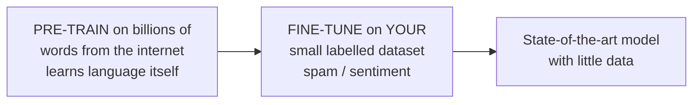

1. **Pre-training:** BERT reads *enormous* amounts of text (Wikipedia, books), learning grammar, facts, and meaning by predicting masked-out words. This is done once, by Google, at great cost.
2. **Fine-tuning:** *you* take pre-trained BERT and train it briefly on your small labelled dataset. It already "knows language", so it learns your task with little data.

### 9.3 Using BERT with Hugging Face (the easy way)

The **Hugging Face Transformers** library makes using these models remarkably simple. A sentiment analyzer in a few lines:

```python
from transformers import pipeline

classifier = pipeline("sentiment-analysis")     # downloads a pre-trained model
result = classifier("I absolutely love this course!")
print(result)   # -> [{'label': 'POSITIVE', 'score': 0.9998}]
```

- `pipeline(...)` hides all the complexity — tokenization, the model, the output. **This is the modern, professional way to do NLP.**
- *(This needs `pip install transformers` and downloads a model, so it's shown here rather than as a required project — but do try it in Colab! Compare its accuracy to Project 2's small model.)*

### 9.4 The family of Transformer models

| Model | Type | Known for |
|---|---|---|
| **BERT** | Encoder | Understanding tasks (classification, Q&A) |
| **GPT** family | Decoder | Text generation (Module 7) |
| **T5 / BART** | Encoder-decoder | Translation, summarization |
| **DistilBERT** | Small BERT | Faster, lighter, ~same accuracy |

---

## 10. NLP in 2026 & the Bridge to LLMs

### 10.1 From NLP to Large Language Models

Everything in this module leads to the biggest story in AI: **Large Language Models (LLMs)**. An LLM is a **giant Transformer decoder** (§8.4) trained on a huge chunk of the internet to predict the next word — scaled up enormously. Do that well enough, and you get ChatGPT, Claude, and Gemini.

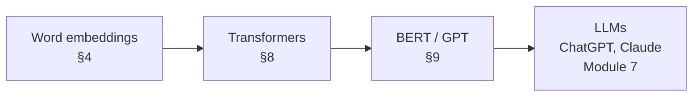

### 10.2 What LLMs can do

Because they learned language so deeply, LLMs handle many NLP tasks with a single model, just by being *asked*:
- Classification, sentiment, translation, summarization, Q&A, and **generation**.
- No task-specific training needed — you **prompt** them (Module 7's **Prompt Engineering**).

### 10.3 The 2026 landscape

- **NLP is now dominated by large pre-trained Transformers.** Classic methods (TF-IDF + Naive Bayes) are still valuable for small, fast, interpretable tasks — and for *understanding the foundations*, which is why you learn them here.
- **Multimodal models** combine language with vision (Module 5) and audio.
- The line between "NLP" and "AI assistant" has blurred — and **Module 7 (Generative AI)** picks up exactly here.

> **You now understand the whole chain:** text → numbers (TF-IDF/embeddings) → attention → Transformers → BERT → LLMs. That's the intellectual backbone of modern AI.

### 10.4 The NLP toolkit — which library when?

You'll meet several NLP libraries. Here's what each is for:

| Library | Best for | In this module |
|---|---|---|
| **scikit-learn** | Classic ML on text: TF-IDF, Naive Bayes, classifiers | **All 3 projects** |
| **NLTK** | Learning/teaching: tokenizers, stemmers, stop words, corpora | Preprocessing concepts |
| **spaCy** | Fast, production NLP: tokenization, NER, POS, lemmatization | Real-world pipelines |
| **Gensim** | Topic modeling and Word2Vec embeddings | Embeddings |
| **Hugging Face Transformers** | State-of-the-art pre-trained models (BERT, GPT) | Modern NLP (§9) |

- **A good progression:** start with **scikit-learn** (you did — it's simple and teaches the fundamentals), reach for **spaCy** for robust preprocessing, and use **Hugging Face** when you need top accuracy or a pre-trained Transformer. Knowing the fundamentals first is what lets you use the powerful tools *wisely*.

---

## 11. Hands-on Activities Overview

The syllabus activity is **Spam Detection**. We build it plus **Sentiment Analysis** and a **Text Preprocessing Toolkit**, covering three of the module's core topics with runnable code.

| # | Project | Task | Technique |
|---|---|---|---|
| 1 | **Spam Detection** | Text classification | TF-IDF + Naive Bayes |
| 2 | **Sentiment Analysis** | Positive/negative | TF-IDF (bigrams) + Logistic Regression |
| 3 | **Text Preprocessing Toolkit** | Clean & vectorize text | Tokenize/stopwords/BoW/TF-IDF |

> ### 📦 About these projects
> The **complete, tested, ready-to-run** programs live in
> `Hands-on Projects/Module 6 Hands-on Projects/`, each with a `README.md`. They use only
> **scikit-learn** — no heavy downloads. Console output is plain ASCII; each saves a PNG.
> The Transformers/BERT code (§9.3) is optional and shown for Colab.

---

## 12. Hands-on Project 1 — Spam Detection

The syllabus project: an spam filter that classifies messages as spam or ham.

### 12.1 The core

```python
from sklearn.feature_extraction.text import TfidfVectorizer
from sklearn.naive_bayes import MultinomialNB

vectorizer = TfidfVectorizer(stop_words="english")
X = vectorizer.fit_transform(messages)     # text -> TF-IDF vectors

model = MultinomialNB()                     # a great text classifier
model.fit(X_train, y_train)
model.predict(vectorizer.transform(["Claim your FREE prize now!"]))  # -> 'spam'
```

### 12.2 Sample output

```
Dataset: 40 messages (20 spam, 20 ham).
Accuracy: 0.917
Top words the model treats as SPAM signals:
   free, limited, claim, account, offer, details, week, cheap, text, win

----- PREDICTIONS ON NEW MESSAGES -----
   [SPAM] ( 62% spam)  Congratulations! Claim your FREE prize money now...
   [ham ] ( 36% spam)  Hey, can we reschedule our call to 3pm tomorrow?...
```

- **92% accuracy**, and the model even shows *which words* it treats as spam signals — a bonus of interpretable models. This is the whole NLP pipeline (§1.4) end to end.

**Full program:** `Hands-on Projects/Module 6 Hands-on Projects/Project 1 - Spam Detection/`.

---

## 13. Hands-on Project 2 — Sentiment Analysis

Classify reviews as positive or negative — with the crucial negation lesson.

### 13.1 The core

```python
# Keep negation words + use bigrams, so "not good" is learned as negative:
vectorizer = TfidfVectorizer(lowercase=True, ngram_range=(1, 2))
model = LogisticRegression(C=10)            # less regularization = more confident
```

### 13.2 Sample output

```
Accuracy: 0.722
Most POSITIVE words: wonderful, great, value, excellent, beautiful, loved ...
Most NEGATIVE words: not, unhelpful, boring, awful, bad, disappointing ...

   [POSITIVE] ( 63% positive)  This is the best thing I have ever bought...
   [NEGATIVE] ( 26% positive)  What a horrible waste of time, I want a refund...
```

- Notice **"not" is the strongest negative signal** — proof the negation-handling worked. The chart of positive (green) vs negative (red) words makes the model's "thinking" visible.
- Sentiment is harder than spam; more data pushes accuracy higher (§6.4).

**Full program:** `Hands-on Projects/Module 6 Hands-on Projects/Project 2 - Sentiment Analysis/`.

---

## 14. Hands-on Project 3 — Text Preprocessing Toolkit

The foundation under Projects 1 & 2: turn raw text into numbers, step by step.

### 14.1 What it shows

Every preprocessing step with before/after output, then Bag-of-Words and TF-IDF:

```
[3] Tokenized: ['natural', 'language', 'processing', 'is', ...]
[4] Stop words removed: ['natural', 'language', 'processing', ...]
[5] Stemmed: ['natural', 'language', 'process', 'amaz', ...]

[7] TF-IDF weights for sentence 1:
   natural: 0.58   processing: 0.58   love: 0.44   language: 0.35
```

- You **see** text become tokens, get cleaned, and finally turn into the TF-IDF numbers that Projects 1 & 2 feed to their models. It saves a word-frequency chart too.

**Full program:** `Hands-on Projects/Module 6 Hands-on Projects/Project 3 - Text Preprocessing Toolkit/`.

### 14.2 The three projects together

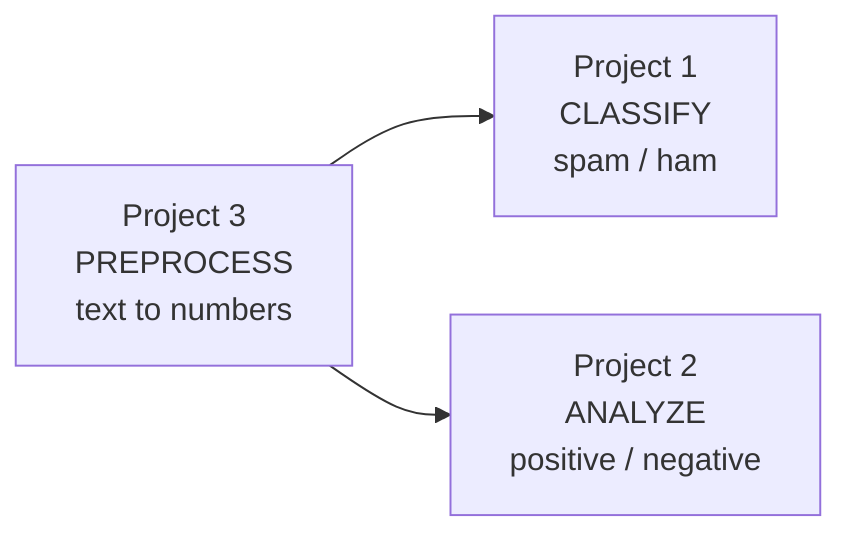

Do them **3 → 1 → 2**: understand how text becomes numbers, then build classifiers on top.

---

## 15. Best Practices & Common Mistakes

### 15.1 NLP best practices

- **Preprocess consistently** — apply the *same* cleaning to training and new text.
- **Fit the vectorizer on training data only**, then `transform` new text (no leakage).
- **Choose stop words per task** — keep negations for sentiment!
- **Start simple** (TF-IDF + Naive Bayes/LogReg) before reaching for Transformers.
- **Use Hugging Face `pipeline`** when you need state-of-the-art quality fast.
- **Get more labelled data** — it's the biggest lever for NLP accuracy.

### 15.2 Top 10 beginner mistakes

| # | Mistake | Fix |
|---|---|---|
| 1 | Removing "not"/"no" for sentiment | Keep negation words |
| 2 | Fitting the vectorizer on test data | Fit on train, transform test |
| 3 | Ignoring word order entirely | Add n-grams |
| 4 | Different preprocessing for train vs predict | Use the same pipeline |
| 5 | Judging spam filters by accuracy only | Watch precision & recall |
| 6 | Tiny dataset, expecting high accuracy | Get more data |
| 7 | Forgetting to lowercase | Standardize case |
| 8 | Treating TF-IDF vectors as meanings | They're symbols; embeddings capture meaning |
| 9 | Over-cleaning (losing signal) | Clean thoughtfully, not blindly |
| 10 | Reinventing the wheel | Use scikit-learn / Hugging Face |

### 15.3 Modern context (2026)

- **Transformers dominate** high-accuracy NLP; classic TF-IDF methods remain great for fast, small, interpretable, offline tasks.
- **`transformers` + `pipeline`** gives near state-of-the-art results in a few lines — worth trying once you understand the fundamentals here.
- The frontier is **LLMs** (Module 7): one model, prompted in plain English, does many NLP tasks at once.

---

## 16. Glossary

| Term | Meaning |
|---|---|
| **NLP** | Natural Language Processing. |
| **Token** | A unit of text (usually a word). |
| **Tokenization** | Splitting text into tokens. |
| **Stop words** | Common low-meaning words (the, is, and). |
| **Stemming** | Chopping a word to a rough root. |
| **Lemmatization** | Reducing a word to its correct dictionary form. |
| **Corpus** | A collection of text documents. |
| **Vocabulary** | The set of all unique words in a corpus. |
| **Bag-of-Words** | Text as word counts, ignoring order. |
| **TF-IDF** | Word weighting: frequent-here but rare-overall. |
| **N-gram** | A sequence of N consecutive words. |
| **Vectorization** | Turning text into numeric vectors. |
| **Word embedding** | A dense vector capturing a word's meaning. |
| **Word2Vec / GloVe** | Methods to learn static embeddings. |
| **Contextual embedding** | A word vector that depends on its sentence. |
| **Text classification** | Assigning a category to text. |
| **Naive Bayes** | A fast probabilistic text classifier. |
| **Sentiment analysis** | Detecting the emotional tone of text. |
| **RNN / LSTM** | Neural nets that process sequences. |
| **Attention** | Weighing which words matter to each other. |
| **Self-attention** | Attention within one text. |
| **Transformer** | The attention-based architecture behind modern NLP. |
| **BERT** | A bidirectional Transformer for understanding text. |
| **GPT** | A Transformer decoder for generating text. |
| **Pre-training / Fine-tuning** | Learn language broadly, then specialize. |
| **Hugging Face** | Library/hub of pre-trained NLP models. |
| **LLM** | Large Language Model (ChatGPT, Claude). |

---

## 17. Practice Exercises & Self-Assessment

### 17.1 Concept checks

1. Why can't a model use raw text directly? What must happen first?
2. Explain Bag-of-Words vs TF-IDF with a small example.
3. What is a word embedding, and how does it differ from TF-IDF?
4. Why should you *not* remove "not" for sentiment analysis?
5. What problem do RNNs/LSTMs solve, and what's their limitation?
6. What is self-attention, in one sentence?
7. How does BERT use transfer learning (pre-train + fine-tune)?
8. Give three everyday applications of NLP.

### 17.2 Coding — preprocessing

9. Preprocess a paragraph: lowercase, remove punctuation, tokenize, remove stop words.
10. Build a Bag-of-Words matrix for 3 sentences with `CountVectorizer`.
11. Compare TF-IDF weights for a common vs a rare word.

### 17.3 Coding — classification

12. Run Project 1; add 5 of your own spam/ham messages and retest.
13. Swap Naive Bayes for Logistic Regression — compare accuracy.
14. Run Project 2; add "not bad" and "not good" as test reviews — does it get them right?

### 17.4 Coding — modern NLP

15. In Colab, run Hugging Face `pipeline("sentiment-analysis")` on 5 reviews; compare to Project 2.
16. Try `pipeline("summarization")` or `pipeline("translation_en_to_fr")`.

### 17.5 Integrative

17. Complete all three projects and one challenge from each README.
18. Build a mini "review analyzer": preprocess → TF-IDF → classify sentiment → print a summary.

### 17.6 Quick self-check quiz

1. What does tokenization do? *(→ splits text into tokens/words)*
2. Which weighting highlights rare, distinctive words? *(→ TF-IDF)*
3. "king − man + woman ≈ ?" *(→ queen — embeddings)*
4. Which stop word must you keep for sentiment? *(→ not/no/never)*
5. What architecture powers ChatGPT and BERT? *(→ Transformer)*
6. What mechanism lets a model weigh relevant words? *(→ attention)*
7. BERT reads text in how many directions? *(→ both / bidirectional)*
8. Naive Bayes is used for which task here? *(→ spam/text classification)*

### 17.7 Solutions & Answer Key

> Try each first, then check. sklearn code verified; Hugging Face code runs on Colab / a transformers-ready setup.

**17.1 Concept checks**

1. **Raw text can't be used directly** because models do math on **numbers**, not words. Text must first be **preprocessed and vectorized** (tokenize → clean → turn into numbers with BoW/TF-IDF/embeddings).
2. **BoW vs TF-IDF:** Bag-of-Words counts each word ("the cat sat" → `the:1, cat:1, sat:1`). **TF-IDF** weights those counts so common-everywhere words (like "the") get low weight and rare, distinctive words (like "cat") get high weight — so it highlights what's informative.
3. **Word embedding** = a dense vector that captures a word's **meaning**, so similar words have similar vectors ("king"≈"queen"). TF-IDF treats words as **independent symbols** (no notion that "king" and "queen" are related); embeddings capture that relatedness.
4. **Keep "not" for sentiment** because it **flips meaning**: "not good" is negative, but removing "not" leaves "good" (positive). Standard stop-word lists delete "not/no/never" — for sentiment you must keep them (and add bigrams).
5. **RNNs/LSTMs** process text as a **sequence** so word order matters (solving BoW's order-blindness); their **limitation** is they're slow (one word at a time) and struggle with very long-range links. Transformers fixed this.
6. **Self-attention** (one sentence): a mechanism that lets the model, when processing each word, look at all the other words and weigh how relevant each is.
7. **BERT transfer learning:** *pre-train* once on billions of words (learns language broadly), then *fine-tune* briefly on your small labelled dataset — strong results with little data.
8. **NLP applications:** spam filtering, machine translation, and voice assistants (also: autocomplete, sentiment analysis, chatbots, search).

**17.2 Preprocessing**

```python
import re
from sklearn.feature_extraction.text import (CountVectorizer, TfidfVectorizer,
                                             ENGLISH_STOP_WORDS)

# 9. Preprocess a paragraph
text = "Natural Language Processing is AMAZING, in 2026!"
clean = re.sub(r"[^a-z\s]", "", text.lower())          # lowercase + strip non-letters
tokens = clean.split()                                  # tokenize
tokens = [t for t in tokens if t not in ENGLISH_STOP_WORDS]   # remove stop words
print(tokens)             # -> ['natural', 'language', 'processing', 'amazing']

# 10. Bag-of-Words matrix for 3 sentences
sents = ["i love nlp", "nlp is fun", "i love ai"]
cv = CountVectorizer()
bow = cv.fit_transform(sents)
print(cv.get_feature_names_out())   # the vocabulary
print(bow.toarray())                # one count-row per sentence

# 11. TF-IDF: common vs rare word
docs = ["the cat sat", "the dog ran", "the bird flew"]
tv = TfidfVectorizer()
m = tv.fit_transform(docs)
w = dict(zip(tv.get_feature_names_out(), m.toarray()[0].round(2)))
print("the:", w["the"], "cat:", w["cat"])   # 'the' (in all docs) < 'cat' (rare)
```

**17.3 Classification**

```python
# 12. Add your own messages to Project 1's DATA list (same ("text", "spam"/"ham") format), rerun.

# 13. Swap Naive Bayes for Logistic Regression in Project 1
from sklearn.linear_model import LogisticRegression
model = LogisticRegression(max_iter=1000)      # replaces MultinomialNB()
model.fit(X_train, y_train)                     # compare accuracy_score to NB

# 14. Test negation in Project 2 — add to new_reviews:
#     "not bad" (mildly positive), "not good" (negative)
# Because Project 2 KEEPS negation words + uses bigrams, it should handle "not good"
# as negative; "not bad" is subtle and may need more data.
```

**17.4 Modern NLP** *(Colab / transformers installed)*

```python
from transformers import pipeline

# 15. Sentiment with a pre-trained model
clf = pipeline("sentiment-analysis")
print(clf(["I love this course!", "Worst purchase ever."]))
# Compare its accuracy/confidence to your small Project 2 model.

# 16. Other one-line tasks
summarizer = pipeline("summarization")
translator = pipeline("translation_en_to_fr")
print(translator("Artificial intelligence is amazing."))
```

**17.5 Integrative** — open tasks: the three projects plus a "review analyzer" that chains **preprocess → `TfidfVectorizer` → a trained classifier → print the predicted sentiment**.

**17.6 Quiz** — answers are shown inline next to each question above.

> **Ready for Module 7 when:** you can preprocess text, build a TF-IDF classifier, and explain embeddings, Transformers, and BERT at a high level.

---

## 18. Summary & What's Next

### 18.1 Module 6 in one picture

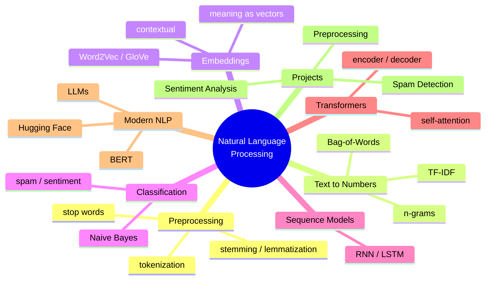

### 18.2 Key takeaways

- **All of NLP is turning language into numbers**, then running a model on them.
- **Preprocess** (tokenize, stop words, stem) → **vectorize** (BoW, TF-IDF, embeddings) → **model**.
- **TF-IDF** is simple and effective; **embeddings** capture *meaning* as vectors.
- **Keep negation words for sentiment** — a small detail with big impact.
- **Transformers + self-attention** replaced RNNs and power all modern NLP.
- **BERT** (understanding) and **GPT** (generation) are pre-trained Transformers you fine-tune or prompt.
- The path **embeddings → Transformers → BERT → LLMs** is the backbone of modern AI.

### 18.3 Skills checklist

- [ ] I can preprocess text (tokenize, stop words, stem).
- [ ] I can vectorize text with Bag-of-Words and TF-IDF.
- [ ] I can explain word embeddings and why they capture meaning.
- [ ] I built a spam detector and a sentiment analyzer.
- [ ] I can explain self-attention and Transformers at a high level.
- [ ] I understand BERT and pre-training + fine-tuning.
- [ ] I completed all three hands-on projects.

### 18.4 Bridge to Module 7

You've taught computers to **understand** language. Next, you'll use computers that **generate** language at a superhuman level. In **Module 7 — Generative AI & Prompt Engineering**, you'll work directly with **LLMs** (ChatGPT, Claude, Gemini, Copilot) — the giant Transformer models this module has been building toward. You'll learn **prompt engineering** to get great results, and build an **AI Resume Generator** and **Research Assistant**. The embeddings, Transformers, and BERT you just learned are the engine inside those tools.

> **Homework before Module 7:** complete the three projects and one challenge each; in Colab, run Hugging Face's `pipeline("sentiment-analysis")` and compare it to your Project 2 model. Come with one NLP task you'd love an AI to do for you.

---

### Instructor Notes (for the teaching team)

- **Suggested 6-hour split:** Hour 1 — what is NLP + preprocessing (§1–2) + **Project 3**; Hour 2 — text to numbers: BoW/TF-IDF (§3); Hour 3 — text classification + **Project 1 (Spam)** (§5); Hour 4 — sentiment + **Project 2** (§6); Hour 5 — embeddings + sequence models + Transformers (§4, §7, §8); Hour 6 — BERT, Hugging Face, LLM bridge (§9–10), and a live `pipeline` demo.
- **Anchor everything on the pipeline (§1.4):** preprocess → vectorize → model. Students who hold that map never get lost.
- **The negation lesson (Project 2) is a highlight** — show the model getting "not good" wrong, then right after keeping negations. Memorable.
- **Demo Hugging Face live** in Colab (`pipeline("sentiment-analysis")`) to show how far the field has come — one line vs a whole project — then explain the fundamentals are what let you use it wisely.
- **Assessment:** Spam Detection (syllabus) as the graded deliverable; sentiment + preprocessing as reinforcement; the quiz (§17.6) before Module 7.
- **Keep the math light:** attention and Transformers should be taught by intuition and diagrams, not equations.

---

*End of Module 6 — Natural Language Processing.*
*AI Powered Engineering Upskilling Program · 2026 Edition.*
