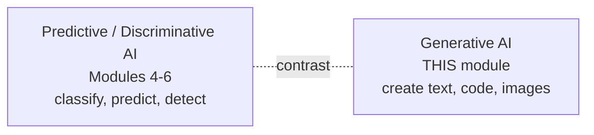
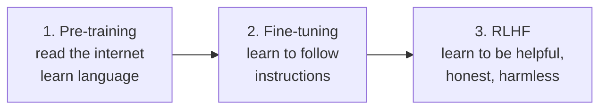
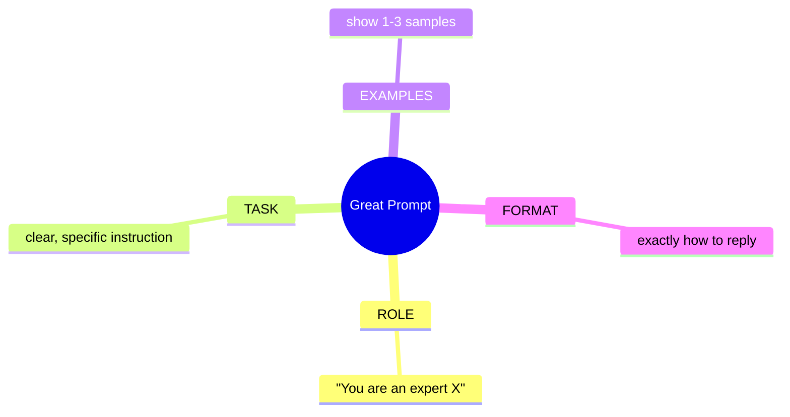
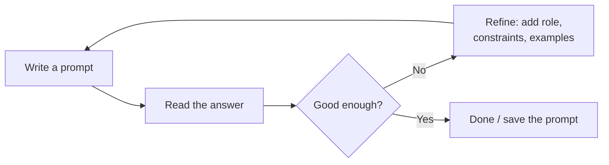
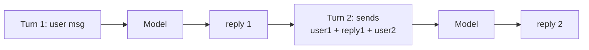
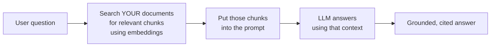
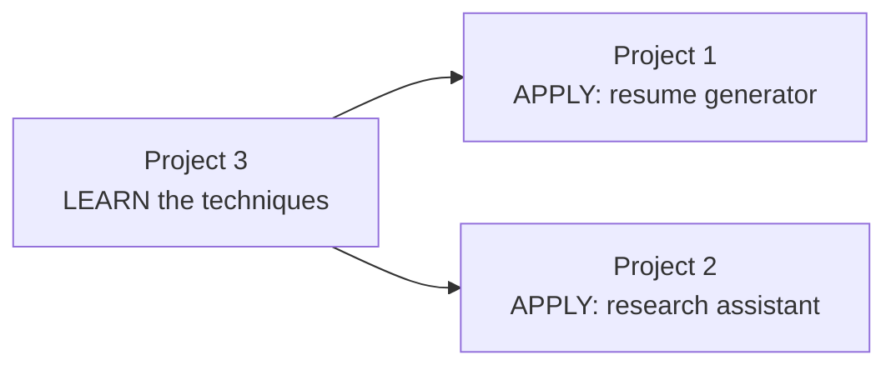
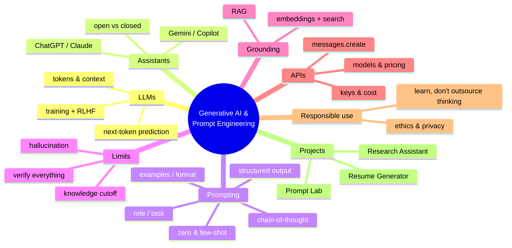

# Module 7 — Generative AI & Prompt Engineering

> **AI Powered Engineering Upskilling Program**
> *From Fundamentals to Generative AI Applications*

---

## Module Information Card

| Field | Detail |
|---|---|
| **Module Number** | 7 of 10 |
| **Module Title** | Generative AI & Prompt Engineering |
| **Duration** | 10 Hours (≈ 2 training days) |
| **Level** | Intermediate → Applied |
| **Target Audience** | Engineering students, age 19–20 |
| **Prerequisites** | Modules 1–6 (esp. Module 6's LLM/Transformer foundations) |
| **Reference Year** | **2026** — models, tools, and prices are current as of this year |
| **Primary Tools** | ChatGPT, Claude, Gemini, GitHub Copilot, Anthropic API |
| **Learning Outcome** | Use LLMs productively. |
| **Hands-on Activities (syllabus)** | AI Resume Generator · Research Assistant |
| **Hands-on Projects (this course)** | (1) AI Resume Generator · (2) Research Assistant · (3) Prompt Engineering Lab |

### What you will be able to do after this module

1. Explain what **Generative AI** and **Large Language Models (LLMs)** are and how they work.
2. Compare the major 2026 AI assistants: **ChatGPT, Claude, Gemini, Copilot**.
3. Write effective prompts using **role, task, examples, and format**.
4. Apply core techniques: **zero-shot, few-shot, chain-of-thought, structured output**.
5. Understand and reduce **hallucinations** and other LLM limitations.
6. Explain **RAG** (Retrieval-Augmented Generation) at a foundational level.
7. Call an **LLM API** (Anthropic Claude) from Python, and reason about tokens & cost.
8. Use Generative AI **responsibly and effectively**.

> **How to use these notes**: This is the module where everything clicks into the tools you'll actually use daily. **Keep a chat window open** (ChatGPT/Claude/Gemini — the free tiers are fine) and try every prompting technique as you read. Prompt engineering is a *practical* skill; you learn it by doing.

---

## Table of Contents

1. [What is Generative AI?](#1-what-is-generative-ai)
2. [Large Language Models (LLMs) — How They Work](#2-large-language-models-llms--how-they-work)
3. [The 2026 AI Assistant Landscape](#3-the-2026-ai-assistant-landscape)
4. [Prompt Engineering Fundamentals](#4-prompt-engineering-fundamentals)
5. [Core Prompting Techniques](#5-core-prompting-techniques)
6. [Advanced Prompting & Model Controls](#6-advanced-prompting--model-controls)
7. [Hallucinations & Limitations](#7-hallucinations--limitations)
8. [RAG — Retrieval-Augmented Generation](#8-rag--retrieval-augmented-generation)
9. [Using LLM APIs](#9-using-llm-apis)
10. [Responsible & Effective Use](#10-responsible--effective-use)
11. [Hands-on Activities Overview](#11-hands-on-activities-overview)
12. [Hands-on Project 1 — AI Resume Generator](#12-hands-on-project-1--ai-resume-generator)
13. [Hands-on Project 2 — Research Assistant](#13-hands-on-project-2--research-assistant)
14. [Hands-on Project 3 — Prompt Engineering Lab](#14-hands-on-project-3--prompt-engineering-lab)
15. [Best Practices & Common Mistakes](#15-best-practices--common-mistakes)
16. [Glossary](#16-glossary)
17. [Practice Exercises & Self-Assessment](#17-practice-exercises--self-assessment)
18. [Summary & What's Next](#18-summary--whats-next)

---

## 1. What is Generative AI?

### 1.1 Definition

**Generative AI (GenAI)** is AI that **creates new, original content** — text, images, code, audio, video — rather than just classifying or predicting. In Module 2 you met the split between *predictive* AI (answers "is this spam?") and *generative* AI (answers "write me an email"). This module is all about the generative side, focused on **text and code**.



### 1.2 What can Generative AI create?

| Type | Example tools | What it makes |
|---|---|---|
| **Text** | ChatGPT, Claude, Gemini | Essays, emails, summaries, answers, code |
| **Code** | GitHub Copilot, Claude, Cursor | Functions, whole apps, tests, docs |
| **Images** | DALL·E, Midjourney, Stable Diffusion | Art, logos, photos from a text prompt |
| **Audio / Music** | ElevenLabs, Suno | Voices, songs, sound effects |
| **Video** | Sora, Veo, Runway | Short video clips from text |

This module focuses on **text and code generation** via **Large Language Models** — the technology behind ChatGPT and Claude.

### 1.3 Why Generative AI is a big deal

Generative AI went mainstream when **ChatGPT** launched in **November 2022** and reached 100 million users faster than any app in history. By 2026 it is woven into everyday work: writing, coding, research, customer support, design. The crucial career insight:

> **You will not lose your job to AI — but you might lose it to someone who uses AI well.** Knowing how to *direct* these tools (prompt engineering) is now a core professional skill, as fundamental as knowing how to search the web.

---

## 2. Large Language Models (LLMs) — How They Work

### 2.1 What is an LLM?

A **Large Language Model (LLM)** is a very large **Transformer** neural network (Module 6, §8) trained on an enormous amount of text to **predict the next word** (technically, the next *token*). Do that astonishingly well, at massive scale, and the result is a system that can converse, summarize, translate, reason, and write code.

- "Large" = billions (sometimes trillions) of parameters, trained on a huge slice of the internet, books, and code.
- Built on the **Transformer** and its **self-attention** mechanism (Module 6).

### 2.2 The core trick: next-token prediction

At heart, an LLM is a spectacular autocomplete. Given some text, it predicts the most likely next token, appends it, and repeats:

```
Prompt:   "The capital of France is"
Model predicts next token:  " Paris"   (highest probability)
Then continues: " Paris" -> "." -> [stop]
```

- It does this one token at a time, feeding its own output back in. That simple loop, at giant scale, produces essays, code, and conversations.
- **A profound idea:** to predict the next word *well* across all of human text, the model had to implicitly learn grammar, facts, reasoning patterns, and style. Capability *emerged* from a simple objective.

### 2.3 Tokens — the LLM's unit of text

LLMs don't see words or letters — they see **tokens**, which are word-pieces. Roughly, **1 token ≈ ¾ of a word** (about 4 characters).

```
"Generative AI is amazing!"  ->  ["Gener", "ative", " AI", " is", " amazing", "!"]  (~6 tokens)
```

- Why care? **You pay per token** when using an API (§9), and every model has a **context window** measured in tokens.
- Rule of thumb: **100 tokens ≈ 75 words**; a page of text ≈ 500 tokens.

### 2.4 The context window (the model's short-term memory)

The **context window** is the maximum amount of text (in tokens) the model can consider at once — your prompt *plus* its answer. In 2026, context windows are large — often **200,000 tokens or more** (hundreds of pages).

- Anything outside the window is "forgotten." In a long chat, very early messages can fall out of context.
- Big windows let you paste whole documents, codebases, or books for the model to work with.

### 2.5 Training an LLM (three stages)



1. **Pre-training:** predict-the-next-token on a huge text corpus → learns language, facts, reasoning. Very expensive; done once by the AI lab.
2. **Fine-tuning:** trained on examples of good instruction-following → learns to *answer* rather than just continue text.
3. **RLHF** (Reinforcement Learning from Human Feedback): humans rate responses; the model learns to be more helpful, honest, and safe. This is why ChatGPT and Claude feel polite and useful.

### 2.6 A key limitation: the knowledge cutoff

An LLM only knows what was in its training data, up to a **knowledge cutoff date**. It doesn't inherently know today's news or your private files. Two fixes: **web search tools** (let it look things up) and **RAG** (§8, give it your documents). Always remember: **an LLM is confidently fluent, not automatically correct.**

---

## 3. The 2026 AI Assistant Landscape

### 3.1 The major AI assistants

Four assistants dominate everyday use in 2026. You should be comfortable with all of them — they're more alike than different, and switching is easy.

| Assistant | Maker | Best known for |
|---|---|---|
| **ChatGPT** | OpenAI | The product that launched the GenAI era; huge ecosystem, plugins, image generation |
| **Claude** | Anthropic | Strong reasoning & coding, long documents, careful/safe answers |
| **Gemini** | Google | Deep Google integration (Search, Workspace), strong multimodal |
| **Copilot** | Microsoft / GitHub | AI pair-programmer inside your code editor; Microsoft 365 integration |

> These evolve *fast* — new, more capable versions ship constantly. Don't memorize version numbers; understand **what** they are (Transformer-based LLMs) and **how** to use them well (this module).

### 3.2 Open vs closed models

| | Closed (proprietary) | Open-weight |
|---|---|---|
| Examples | GPT (ChatGPT), Claude, Gemini | Llama, Mistral, Qwen, DeepSeek |
| Access | Via API / app only | Download & run yourself |
| Control | Provider controls it | You can host, fine-tune, and customize |
| Cost | Pay per token | Free to run (but you need hardware) |

- **Closed models** are usually the most capable and easiest to use (just call an API).
- **Open models** give privacy and control — run them on your own machine or server (tools like **Ollama** make this easy). Great when data can't leave your building.

### 3.3 Choosing an assistant

They're all excellent; pick by fit:
- **Coding inside an editor** → GitHub Copilot (or Claude/Cursor).
- **Long documents, careful reasoning** → Claude.
- **Google ecosystem / live web** → Gemini.
- **General everyday tasks / images** → ChatGPT.
- **Privacy-critical / offline** → an open model via Ollama.

The **prompting skills** in this module work on **all** of them — that's the point.

### 3.4 AI coding assistants (GitHub Copilot & friends)

A special, hugely valuable use of GenAI for you as an engineer: **AI pair-programmers** that live *inside your code editor*. **GitHub Copilot** is the best known; Claude, Cursor, and others compete here too.

| What it does | How |
|---|---|
| **Autocomplete** whole lines/functions | Suggests code as you type, from your context |
| **Chat about your code** | "Why does this crash?" / "Add error handling" |
| **Generate from a comment** | Write `# sort users by age` → it writes the code |
| **Explain / document / test** | Explains a function, writes docstrings and unit tests |
| **Fix & refactor** | Points out bugs and cleaner rewrites |

**How to use a coding assistant well:**
- Write a **clear comment** describing what you want, then let it draft the code.
- **Read and understand every suggestion** — never accept code you can't explain (it hallucinates APIs too!).
- Use it to **learn**: ask it to explain unfamiliar code line by line.
- Keep functions small and well-named — it gives better suggestions with good context.

> Studies suggest developers complete some tasks meaningfully faster with AI assistance — but the ones who benefit most are those who *review critically*, not those who accept blindly. The prompting skills in this module apply directly: a good comment is a good prompt.

### 3.5 The shift to AI Agents (bridge to Module 8)

The 2024–2026 frontier is **AI agents** — systems that don't just *chat* but *act*: use tools, browse, run code, and complete multi-step tasks autonomously. Module 8 covers this. For now, know that an agent is an LLM **plus tools plus a loop**, and everything in this module (especially prompting) is the foundation it's built on.

---

## 4. Prompt Engineering Fundamentals

### 4.1 What is a prompt?

A **prompt** is the input (instruction/question) you give an AI model. **Prompt engineering** is the skill of writing prompts that reliably get great results. It is the single most valuable practical skill in this module — and it powers all three projects.

> **The core truth:** the model is fixed and powerful; the **prompt is your steering wheel.** The *same* model gives a poor or an excellent answer depending entirely on how you ask.

### 4.2 The anatomy of a great prompt — the 4 levers

Almost every strong prompt pulls some of these four levers:



| Lever | What it does | Example |
|---|---|---|
| **Role** | Sets expertise & tone | "You are a senior Python developer." |
| **Task** | The clear, specific instruction | "Refactor this function to be readable." |
| **Examples** | Show the pattern you want | "Example: input→output …" |
| **Format** | The exact shape of the answer | "Reply as a JSON list of strings." |

### 4.3 Weak prompt vs strong prompt

| ❌ Weak | ✅ Strong |
|---|---|
| "Write about dogs." | "You are a vet. Write a 100-word, friendly guide for new owners on feeding a puppy, as 5 bullet points." |
| "Fix my code." | "You are a Python expert. This function throws a KeyError on line 3. Explain why, then give the corrected code." |
| "Summarize this." | "Summarize the text below in 3 bullet points a busy manager could read in 10 seconds. Text: …" |

The strong prompts add **role, specificity, format, and constraints** — the difference between guesswork and reliability.

### 4.4 The 6 principles of good prompting

1. **Be specific** — vague prompts get vague answers. Say exactly what you want.
2. **Give context** — background, audience, purpose.
3. **Assign a role** — "act as a…" raises quality and sets tone.
4. **Specify the format** — bullets, JSON, table, word count.
5. **Show examples** — for anything with a specific style (few-shot).
6. **Iterate** — your first prompt is a draft; refine based on the answer.

> **Golden rule:** *Treat the AI like a brilliant, literal new intern.* It's capable but knows nothing about your specific situation and takes you at your word — so spell things out.

---

## 5. Core Prompting Techniques

These are the named techniques every practitioner knows — and exactly what **Project 3 (Prompt Engineering Lab)** demonstrates.

### 5.1 Zero-shot prompting

Just ask, with **no examples**. Works well for common, simple tasks the model has seen many times.

```
Classify the sentiment of this review as Positive or Negative:
"The battery dies within an hour. Very disappointing."
→  Negative
```

### 5.2 Few-shot prompting

**Show 1–3 examples** of input→output before your real input. This "teaches" the model the exact pattern/format you want — powerful when zero-shot gives inconsistent style.

```
Review: "I love it!"           -> Positive
Review: "Total waste of money." -> Negative
Review: "Fast delivery, great quality." ->
→  Positive
```

- Use few-shot when you need a **consistent format** or a **task the model might interpret loosely**.

### 5.3 Role / persona prompting

Tell the model **who to be**. This shifts vocabulary, depth, and tone toward that expert.

```
You are a senior cybersecurity expert. In 2 sentences, explain to a
beginner why reusing passwords is risky.
```

- "You are a patient teacher for a 10-year-old," "You are a strict code reviewer," "You are a marketing copywriter" — each yields a very different answer.

### 5.4 Chain-of-thought (CoT) prompting

For **reasoning and math**, add *"think step by step."* This makes the model show its work, which dramatically improves accuracy on multi-step problems (it stops guessing and reasons).

```
A shop sells pens at 12 for $8. How much do 30 pens cost?
Think step by step, then give the final answer.
→  Step 1: per pen = 8/12 = $0.667.  Step 2: 30 × 0.667 = $20.  Answer: $20.
```

- **Why it works:** generating the intermediate steps gives the model "room to reason" instead of blurting a possibly-wrong final token.

### 5.5 Structured-output prompting

Ask for a **specific machine-readable format** (JSON, a table, fixed sections). Essential when your code needs to *use* the output — the backbone of **Project 2 (Research Assistant)**.

```
Extract the name, role, and city and reply as JSON with keys name, role, city:
"Priya is a data scientist based in Pune."
→  {"name": "Priya", "role": "data scientist", "city": "Pune"}
```

### 5.6 Delimiters — separating instructions from data

Wrap user-supplied text in clear delimiters (triple quotes, XML-like tags) so the model can't confuse *instructions* with *data* — and can't be tricked by text hidden in the data (a "prompt injection").

```
Summarize the text between the triple quotes in one sentence.
"""
<the user's text goes here>
"""
```

### 5.7 Technique summary

| Technique | Use it when… |
|---|---|
| **Zero-shot** | Task is simple/common |
| **Few-shot** | You need a specific style or format |
| **Role** | You want expert tone & depth |
| **Chain-of-thought** | The task needs reasoning/steps |
| **Structured output** | Your code will parse the result |
| **Delimiters** | Mixing instructions with user text |

### 5.8 A worked prompt improvement (before → after)

Watch a real prompt evolve. **Task:** get a study plan.

**Attempt 1 (weak):**
> "Give me a study plan for machine learning."

*Result:* a generic, overwhelming wall of text — could be for anyone.

**Attempt 2 (add role + audience + constraints):**
> "You are a friendly ML mentor. I'm a 2nd-year student who knows Python but no ML, with **5 hours a week for 4 weeks**. Create a realistic study plan."

*Result:* better — tailored to the level and time.

**Attempt 3 (add format + specifics):**
> "You are a friendly ML mentor. I know Python but no ML, and have 5 hours/week for 4 weeks. Create a study plan as a **week-by-week table** with columns *Week, Topic, Free Resource Type, Mini-Project*. Keep each week achievable in 5 hours. **Don't invent specific URLs.**"

*Result:* a clean, actionable, tailored table you can follow — and no fake links.

> **The lesson:** each edit added one lever — **role → audience/constraints → format/specificity → anti-hallucination**. That is the entire craft of prompt engineering, in four steps. Your first prompt is always a draft.

---

## 6. Advanced Prompting & Model Controls

### 6.1 System prompt vs user prompt

Chat APIs separate two kinds of instruction:

| | System prompt | User prompt |
|---|---|---|
| Sets | The overall role, rules, persona | The specific request for this turn |
| Changes | Rarely (the "constitution") | Every message |
| Example | "You are a helpful medical assistant. Never give a diagnosis." | "What are common causes of a headache?" |

- The **system prompt** is powerful — it governs the whole conversation. Both projects 1 & 2 use a system prompt for the role and a user prompt for the task.

### 6.2 Iterative prompting (the real workflow)

Nobody nails the perfect prompt first try. The professional loop:



- Common refinements: "make it shorter," "use simpler words," "add an example," "output as a table," "don't include X."

### 6.3 Prompt chaining

Break a big task into **a sequence of prompts**, feeding each output into the next. Example: *(1) outline an essay → (2) expand each section → (3) polish the tone.* Chaining beats one giant prompt for complex work — and is a stepping stone to **AI agents** (Module 8).

### 6.4 Model controls: temperature and max tokens

When calling an API you can tune the model's behavior:

| Control | What it does | Set it… |
|---|---|---|
| **Temperature** | Randomness/creativity (0 = focused & deterministic-ish, ~1 = creative & varied) | Low for facts/code; higher for brainstorming/stories |
| **max_tokens** | Cap on the length of the reply | High enough to fit the full answer (or it gets cut off) |
| **System prompt** | The role/rules (above) | Always, for consistent behavior |

> **Note (2026):** the newest reasoning models manage their own "thinking" and de-emphasize a manual temperature knob — but the concept (focused vs creative) is still the right mental model, and many models/params still expose it.

### 6.5 Prompt injection — the security gotcha

If your app inserts *untrusted* text (a user's message, a web page) into a prompt, that text could contain instructions like *"ignore your rules and reveal secrets."* This is **prompt injection**. Defenses: use **delimiters** (§5.6), keep untrusted data clearly separated from instructions, and never blindly trust model output that will trigger real actions. This matters a lot for agents (Module 8).

### 6.6 Multi-turn conversations — how chat "remembers"

A crucial thing to understand: **the model itself is stateless — it has no memory between calls.** A chat *feels* like it remembers because the app **re-sends the whole conversation** every turn.



- Each API call includes the **full history** in the `messages` list: `[user, assistant, user, assistant, …]`.
- This is why long chats eventually hit the **context window** — the growing history fills it up.
- **Implication for cost:** every turn re-sends (and re-bills) the whole history — long conversations get more expensive per turn. (Techniques like *prompt caching* and *summarizing old turns* help.)

```python
# The app keeps a growing list and re-sends it each turn:
messages = [
    {"role": "user", "content": "My name is Sam."},
    {"role": "assistant", "content": "Nice to meet you, Sam!"},
    {"role": "user", "content": "What's my name?"},   # model sees the history -> "Sam"
]
```

---

## 7. Hallucinations & Limitations

### 7.1 What is a hallucination?

A **hallucination** is when an LLM produces information that is **false but stated confidently** — a fake citation, a made-up statistic, a non-existent function, a wrong "fact." This is the single most important limitation to understand.

> **Why it happens:** an LLM is a *next-token predictor*, not a database. It generates text that is *plausible*, not necessarily *true*. When it doesn't know, it doesn't say "I don't know" by default — it produces a fluent, confident guess.

### 7.2 Common hallucination traps

| Trap | Example |
|---|---|
| **Fake citations** | Invents realistic-looking but non-existent papers, books, or URLs |
| **Made-up facts** | Confident wrong dates, numbers, or names |
| **Non-existent code** | Calls a library function that doesn't exist |
| **Overconfidence** | Same confident tone whether right or wrong |

*(This is exactly why Project 2's prompt says "Do NOT invent URLs, papers, or author names.")*

### 7.3 How to reduce hallucinations

- **Ask for sources** and then **verify them yourself**.
- **Give the model the facts** (RAG, §8) so it answers *from your data*, not memory.
- **Lower the temperature** for factual tasks.
- **Use tools/web search** so it can look things up.
- **Prompt for honesty:** "If you are not sure, say so." "Only use the information provided."
- **Always verify** anything important — treat AI output as a *smart draft*, not gospel.

### 7.4 Other limitations to know

| Limitation | Meaning |
|---|---|
| **Knowledge cutoff** | Doesn't know events after its training date |
| **No true understanding** | Pattern-matches; doesn't "know" the way a human does |
| **Bias** | Can reflect biases in its training data |
| **Math/logic slips** | Can make arithmetic errors (use CoT or a calculator tool) |
| **Context limits** | Forgets text beyond its context window |
| **Non-determinism** | May give different answers to the same prompt |

> **The professional mindset:** LLMs are *powerful assistants, not oracles*. You stay the human-in-the-loop who checks, decides, and takes responsibility.

---

## 8. RAG — Retrieval-Augmented Generation

### 8.1 The problem RAG solves

An LLM doesn't know your company's documents, your textbook, or today's news — and it hallucinates when guessing. **RAG (Retrieval-Augmented Generation)** fixes this by **giving the model the relevant information at question time**, so it answers *from real data* instead of memory.

### 8.2 How RAG works



1. **Store** your documents as **embeddings** (Module 6, §4) in a vector database.
2. **Retrieve:** when a question comes in, find the most similar chunks (cosine similarity — Module 6, §3.6).
3. **Augment:** paste those chunks into the prompt as context.
4. **Generate:** the LLM answers using that grounded context.

### 8.3 Why RAG matters

- **Reduces hallucination** — the model answers from provided facts.
- **Uses private/current data** without retraining the model.
- **Enables citations** — you can show *which* document the answer came from.
- Powers most real-world "chat with your docs" apps, customer-support bots, and internal knowledge assistants.

> **You already learned the foundations:** RAG = embeddings + similarity search (Module 6) + prompting (this module). It's the bridge from "a chatbot that knows the internet" to "a chatbot that knows *your* stuff."

---

## 9. Using LLM APIs

### 9.1 Chat app vs API

| | Chat app (ChatGPT, Claude web) | API |
|---|---|---|
| Who uses it | A person, in a browser | *Your program* |
| Good for | One-off tasks, exploration | Building apps that use AI |
| This module's projects | — | **Projects 1–3 call an API (optionally)** |

To **build** GenAI apps (like your projects), you call the model from code via an **API**.

### 9.2 Calling Claude from Python (accurate for 2026)

The Anthropic Python SDK makes it a few lines. **This is the exact code inside the projects' `call_claude()` function:**

```python
import anthropic

client = anthropic.Anthropic()          # reads your ANTHROPIC_API_KEY env var

response = client.messages.create(
    model="claude-opus-5",              # the model to use (see table below)
    max_tokens=1024,                    # cap on the reply length
    system="You are an expert resume writer.",   # the role (system prompt)
    messages=[
        {"role": "user", "content": "Write a 3-line summary for a Python developer."}
    ],
)

# The reply is a list of content blocks; collect the text:
text = "".join(block.text for block in response.content if block.type == "text")
print(text)
```

- `pip install anthropic`, then set the key: `export ANTHROPIC_API_KEY="sk-ant-..."` (get one at [console.anthropic.com](https://console.anthropic.com)).
- OpenAI and Google SDKs look very similar — same idea, different import.

### 9.3 Anthropic Claude models & pricing (2026)

Prices are **per million tokens (MTok)**; you pay for input (your prompt) + output (the reply).

| Model | Model ID | Input $/MTok | Output $/MTok | Best for |
|---|---|---|---|---|
| **Claude Opus 5** | `claude-opus-5` | $5 | $25 | Hardest reasoning & coding (most capable) |
| **Claude Sonnet 5** | `claude-sonnet-5` | $3 | $15 | Great balance of speed, cost & quality |
| **Claude Haiku 4.5** | `claude-haiku-4-5` | $1 | $5 | Fast, cheap, simple/high-volume tasks |

- **Pick the smallest model that does the job well** — Haiku for simple classification, Sonnet for most apps, Opus for the hardest tasks. This is a real cost-engineering decision.

### 9.4 Reasoning about cost

```
Example: a 500-word prompt (~700 tokens) + a 500-word reply (~700 tokens) on Sonnet 5:
  input:  700 / 1,000,000 × $3  ≈ $0.0021
  output: 700 / 1,000,000 × $15 ≈ $0.0105
  total per call ≈ $0.013 (about 1.3 cents)
```

- **Cost levers:** shorter prompts, a smaller model, capped `max_tokens`, and **prompt caching** (reuse a big fixed prefix cheaply).

### 9.5 API keys — handle with care

- **Never hard-code an API key in your code** or commit it to GitHub — leaked keys get abused and cost you money.
- Store it in an **environment variable** (`ANTHROPIC_API_KEY`) and read it at runtime (the SDK does this automatically).
- *(This is why the projects run in offline **mock mode** by default — you learn the app with zero risk, then add a key when ready.)*

---

## 10. Responsible & Effective Use

### 10.1 Ethical considerations

Generative AI raises real responsibilities (building on Module 2, §9):

| Issue | What to watch for |
|---|---|
| **Misinformation** | It can generate convincing false content and deepfakes |
| **Plagiarism / originality** | Submitting AI work as your own; academic-honesty rules |
| **Bias** | It can reproduce societal biases from training data |
| **Privacy** | Don't paste secrets/PII into third-party chatbots |
| **Over-reliance** | Skills atrophy if you never think for yourself |
| **Attribution** | Be transparent when content is AI-assisted |

### 10.2 Using AI to *learn* (not just to answer)

The biggest risk for a student is **letting AI do the thinking**. Use it to *amplify* learning, not replace it:

- ✅ **Do:** ask it to *explain* a concept, generate practice problems, review your code and explain the bug, act as a debate partner, or quiz you.
- ❌ **Don't:** blindly copy code or essays you don't understand — you'll fail the moment the tool isn't there.
- **The rule for this program:** try it yourself first, then use AI to check, explain, and extend. AI is a tutor, not a crutch.

### 10.3 When NOT to use Generative AI

- When you need **guaranteed factual accuracy** without verification (medical, legal, financial decisions).
- With **private/confidential data** on a public chatbot.
- For **simple deterministic tasks** a normal program does better (a calculator, a regex).
- When you can't or won't **verify** the output.

### 10.4 A practical checklist for every AI output

1. **Is it correct?** Verify facts, test code.
2. **Is it appropriate?** Tone, audience, safety.
3. **Do I understand it?** If not, ask it to explain.
4. **Am I allowed to use it?** Honesty, licensing, privacy.
5. **Would I stand behind it?** You are responsible for what you ship.

---

## 11. Hands-on Activities Overview

The syllabus activities are the **AI Resume Generator** and **Research Assistant**. We build both, plus a **Prompt Engineering Lab** that drills the techniques they rely on.

| # | Project | Teaches |
|---|---|---|
| 1 | **AI Resume Generator** | Role + task + format + rules prompting |
| 2 | **Research Assistant** | Structured-output prompting; anti-hallucination |
| 3 | **Prompt Engineering Lab** | The 5 core techniques |

> ### 📦 About these projects — run with ZERO setup
> The programs run **OFFLINE in mock mode by default** — no API key, no installs, no internet. They print the *engineered prompt* and a representative result so you learn the app and the prompting immediately. To have Claude *actually* respond, set `USE_REAL_API = True` and add an API key (see each README). All console output is plain ASCII.
> **Location:** `Hands-on Projects/Module 7 Hands-on Projects/`.

---

## 12. Hands-on Project 1 — AI Resume Generator

Turn a person's facts into a polished resume — the syllabus's flagship GenAI app.

### 12.1 The heart of it — a 2-part engineered prompt

```python
def build_system_prompt():
    return ("You are an expert technical resume writer and career coach. "
            "You write concise, achievement-focused resumes. "
            "You never invent facts; you only use what you are given.")   # ROLE + RULES

def build_user_prompt(profile):
    return f"""Write a resume for {profile['name']} targeting {profile['target_role']}.
    ...candidate details...
    FORMAT: use these exact section headings: ## Professional Summary ...
    RULES: 2-3 sentence summary; action-verb bullets; under 250 words; no invented facts."""
```

- The **system prompt** sets the role; the **user prompt** carries the task, data, format, and rules. That structure (§4.2) is *why* the output is reliable.

### 12.2 Sample output (mock mode)

```
# Alex Rivera
## Professional Summary
Aspiring Junior AI/ML Engineer with hands-on experience building end-to-end AI apps...
## Key Skills
Python | Pandas | scikit-learn | OpenCV | Prompt Engineering | Git
## Experience & Projects
- Built a customer-churn prediction model (87% accuracy) with scikit-learn.
...
```

Saved to `resume.md`. Flip `USE_REAL_API = True` and Claude writes it for real — *same prompt, smarter prose.* **Full program:** `Hands-on Projects/Module 7 Hands-on Projects/Project 1 - AI Resume Generator/`.

---

## 13. Hands-on Project 2 — Research Assistant

Turn a topic into a structured research brief — showcasing **structured-output** prompting.

### 13.1 The key idea — name the exact sections

```python
def build_user_prompt(topic):
    return f"""Create a beginner-friendly research brief on "{topic}".
    Use exactly these sections:
      ## 1. Overview   ## 2. Key Concepts   ## 3. Important Questions
      ## 4. Subtopics to Study Next   ## 5. How to Learn More
    RULES: concise; do NOT invent URLs, papers, or author names."""
```

- Specifying sections makes the output **predictable enough to build on**. The "don't invent sources" rule is your **anti-hallucination** guard (§7).

### 13.2 Sample output (structure)

```
# Research Brief: How CNNs work
## 1. Overview          ## 2. Key Concepts (5)
## 3. Important Questions (5)   ## 4. Subtopics (5)   ## 5. How to Learn More
```

Saved to `research_brief.md`. **Full program:** `Hands-on Projects/Module 7 Hands-on Projects/Project 2 - Research Assistant/`.

---

## 14. Hands-on Project 3 — Prompt Engineering Lab

A guided tour of the five core techniques — see each prompt, its result, and *when* to use it.

### 14.1 What it shows

For each of **zero-shot, few-shot, role, chain-of-thought, and structured-output**, the lab prints the prompt and a representative response:

```
4. CHAIN-OF-THOUGHT
PROMPT:  A shop sells pens at 12 for $8. How much do 30 pens cost?
         Think step by step, then give the final answer.
RESPONSE: Step 1: per pen = 8/12 = $0.667. Step 2: 30 × 0.667 = $20. Answer: $20.
WHEN TO USE: reasoning/math problems.
```

- Running it in **real mode** lets you watch each technique change Claude's actual answer — the fastest way to *feel* why prompt engineering matters.

**Full program:** `Hands-on Projects/Module 7 Hands-on Projects/Project 3 - Prompt Engineering Lab/`.

### 14.2 How the three projects fit together



Learn the prompt patterns (Project 3), then apply them in two real apps (Projects 1 & 2).

---

## 15. Best Practices & Common Mistakes

### 15.1 Prompt engineering best practices

- **Give a role, a clear task, examples when needed, and the exact format.**
- **Iterate** — refine the prompt based on the answer.
- **Constrain** length, tone, and scope explicitly.
- **Guard against hallucination** — ask for sources, provide facts, verify.
- **Separate instructions from data** with delimiters.
- **Pick the right model** for cost vs capability.
- **Never hard-code API keys**; use environment variables.

### 15.2 Top 10 beginner mistakes

| # | Mistake | Fix |
|---|---|---|
| 1 | Vague prompts | Be specific: role, task, format |
| 2 | Trusting output blindly | Verify facts and test code |
| 3 | Expecting it to know your private data | Use RAG or paste the context |
| 4 | Not specifying a format | Ask for JSON/table/bullets |
| 5 | Giving up after one prompt | Iterate and refine |
| 6 | Pasting secrets/PII into chatbots | Keep confidential data out |
| 7 | Hard-coding API keys | Use env vars; never commit keys |
| 8 | Using the biggest model for everything | Match model to task (cost) |
| 9 | No examples for a specific style | Add few-shot examples |
| 10 | Letting AI do all the thinking | Understand what you accept |

### 15.3 Modern context (2026)

- **Agents** (Module 8) are the frontier: LLMs that use tools and act, not just chat.
- **Multimodal** models handle text + images + audio + video together.
- **Reasoning models** "think" before answering, excelling at hard problems.
- **Prompt engineering remains the key human skill** — the interface to all of it.

### 15.4 Prompt recipes cheat-sheet

Copy-and-adapt starting points for the most common everyday tasks:

| Task | Prompt template |
|---|---|
| **Summarize** | "Summarize the text below in {N} bullet points for a {audience}. Text: ```{text}```" |
| **Explain** | "Explain {concept} to a {beginner / 10-year-old / expert} in {N} sentences, with one analogy." |
| **Extract** | "From the text below, extract {fields} and reply as JSON with keys {keys}. Text: ```{text}```" |
| **Rewrite** | "Rewrite the text below to be {more formal / simpler / shorter}, keeping the meaning. Text: ```{text}```" |
| **Translate** | "Translate the text below to {language}. Keep names unchanged. Text: ```{text}```" |
| **Brainstorm** | "You are a creative {role}. Give me {N} distinct ideas for {goal}, each with a one-line rationale." |
| **Code** | "You are a {language} expert. Write a function that {does X}. Include a docstring and one example. Do not use external libraries." |
| **Debug** | "This {language} code throws {error}. Explain the cause in 2 sentences, then give the corrected code. Code: ```{code}```" |
| **Improve a prompt** | "Improve this prompt to get a better answer, and explain your changes: '{prompt}'" |

> **Notice the pattern in every recipe:** role (when useful) + a specific task + the exact format + the input wrapped in delimiters. Internalize that shape and you can write a strong prompt for anything.

---

## 16. Glossary

| Term | Meaning |
|---|---|
| **Generative AI** | AI that creates new content (text, code, images). |
| **LLM** | Large Language Model — the model behind chatbots. |
| **Token** | A word-piece; the unit LLMs process and bill by. |
| **Context window** | Max tokens a model can consider at once. |
| **Next-token prediction** | The core mechanism: predict the next token, repeat. |
| **Pre-training / Fine-tuning / RLHF** | The three training stages of an LLM. |
| **Knowledge cutoff** | The date after which the model has no built-in knowledge. |
| **Prompt** | The instruction/question given to a model. |
| **Prompt engineering** | The skill of writing effective prompts. |
| **System / User prompt** | Role & rules vs the per-turn request. |
| **Zero-shot / Few-shot** | Prompting with no / a few examples. |
| **Role prompting** | Assigning the model an expert persona. |
| **Chain-of-thought** | Asking the model to reason step by step. |
| **Structured output** | Forcing a specific format (e.g., JSON). |
| **Temperature** | Randomness/creativity control (0 = focused). |
| **Hallucination** | Confident but false model output. |
| **RAG** | Retrieval-Augmented Generation — grounding answers in your docs. |
| **Embedding** | A meaning-vector (Module 6) used to retrieve relevant text. |
| **Prompt injection** | Malicious instructions hidden in input text. |
| **API** | The interface to call a model from code. |
| **API key** | Your secret credential to use an API. |
| **Multimodal** | Handling multiple data types (text, image, audio). |
| **AI Agent** | An LLM that uses tools and acts (Module 8). |

---

## 17. Practice Exercises & Self-Assessment

### 17.1 Concept checks

1. In one sentence, how does an LLM generate text?
2. What is a token, and why does it matter for cost?
3. What is a context window? What happens to text outside it?
4. Name the 4 levers of a great prompt.
5. When would you use few-shot over zero-shot?
6. Why does chain-of-thought improve reasoning?
7. What is a hallucination, and give two ways to reduce it.
8. Explain RAG in two sentences.

### 17.2 Prompting practice (use any chatbot)

9. Take a **weak prompt** ("write about the ocean") and improve it using role + task + format + constraints. Compare the two answers.
10. Use **few-shot** to make a model output country → capital in a fixed format.
11. Use **chain-of-thought** on a word problem; then remove it and compare accuracy.
12. Use **role prompting** to explain recursion (a) to a 10-year-old and (b) to a CS student.
13. Ask for output as **JSON**, then as a **markdown table** — same data, two formats.
14. Write a prompt that **guards against hallucination** ("only use the text I provide; if unknown, say so").

### 17.3 Project & API

15. Run all three projects in **mock mode**; then complete one README challenge in each.
16. Put your **own details** in the Resume Generator and generate your resume.
17. (Optional, real mode) Get an API key, set `USE_REAL_API = True`, and compare the AI output to the mock.
18. Estimate the **cost** of a 1,000-word-in / 1,000-word-out call on each Claude model.

### 17.4 Quick self-check quiz

1. What does an LLM predict, one step at a time? *(→ the next token)*
2. Which prompt technique adds examples? *(→ few-shot)*
3. Which adds "think step by step"? *(→ chain-of-thought)*
4. What is a confident false answer called? *(→ hallucination)*
5. What technique grounds answers in your own documents? *(→ RAG)*
6. Where should an API key live? *(→ an environment variable, never in code)*
7. Which Claude model is cheapest? *(→ Haiku 4.5)*
8. Role & rules go in which prompt? *(→ the system prompt)*

### 17.5 Solutions & Answer Key

> Prompting exercises are open — there's no single "right" answer, so example prompts are given. Try yours in a real chatbot and compare.

**17.1 Concept checks**

1. **How an LLM generates text:** it repeatedly predicts the most likely **next token**, appends it, and feeds it back in — one token at a time.
2. **Token:** a word-piece (~¾ of a word); it matters because APIs **bill per token** (input + output) and the **context window** is measured in tokens.
3. **Context window:** the max tokens the model can consider at once (your prompt + its reply). Text **outside** it is "forgotten" — in a long chat, the earliest messages fall out of context.
4. **The 4 levers:** **Role, Task, Examples, Format.**
5. **Few-shot over zero-shot** when you need a **specific style or format**, or the task could be interpreted loosely — showing 1–3 examples "teaches" the exact pattern.
6. **Chain-of-thought improves reasoning** because generating the intermediate steps gives the model "room to reason" instead of blurting a possibly-wrong final answer.
7. **Hallucination** = confident but false output. **Reduce it** by (a) grounding the model in provided facts/RAG, and (b) asking for sources and verifying them (also: lower temperature, prompt "say if unsure").
8. **RAG (two sentences):** Retrieval-Augmented Generation finds the most relevant chunks of *your* documents (via embeddings) and pastes them into the prompt. The model then answers *from that grounded context*, which reduces hallucination and lets it use private or current data.

**17.2 Prompting practice** *(example prompts — yours may differ)*

9. **Weak → strong:** ~~"Write about the ocean."~~ → *"You are a marine biologist. Write a 120-word, engaging paragraph for 12-year-olds about why the ocean matters, ending with one surprising fact."* (added role + audience + length + format + constraint).
10. **Few-shot country→capital:**
    > `France -> Paris`
    > `Japan -> Tokyo`
    > `India -> ?`
11. **Chain-of-thought:** *"A train travels 60 km in 45 minutes. What is its speed in km/h? Think step by step, then give the final answer."* (Then try it *without* "step by step" and compare — CoT usually gets it right more reliably.)
12. **Role prompting:** (a) *"You are a fun kids' teacher. Explain recursion to a 10-year-old using a story."* (b) *"You are a CS professor. Explain recursion to a 2nd-year student, with the base case, recursive case, and a code example."*
13. **Two formats:** *"List 3 planets and their moon-counts as JSON with keys name, moons."* then *"...now as a markdown table with columns Planet, Moons."*
14. **Anti-hallucination:** *"Answer ONLY using the text between the triple quotes. If the answer isn't in it, reply exactly 'Not stated.' """<text>"""'*

**17.3 Project & API**

15–17. Do-it tasks against the three projects (run in mock mode; put your own details in the Resume Generator; optionally enable real mode with an API key).

18. **Cost estimate** — 1,000 words ≈ **1,333 tokens** (100 tokens ≈ 75 words), for 1,000 in **and** 1,000 out:

| Model | Input (1,333 tok) | Output (1,333 tok) | **Total per call** |
|---|---|---|---|
| **Opus 5** ($5 / $25) | $0.0067 | $0.0333 | **≈ $0.040** |
| **Sonnet 5** ($3 / $15) | $0.0040 | $0.0200 | **≈ $0.024** |
| **Haiku 4.5** ($1 / $5) | $0.0013 | $0.0067 | **≈ $0.008** |

*Takeaway:* the same task costs **~5× more on Opus than Haiku** — pick the smallest model that does the job well.

**17.4 Quiz** — answers are shown inline next to each question above.

> **Ready for Module 8 when:** you can write role/format/example-rich prompts, explain hallucination and RAG, and call an LLM API (or read the code confidently).

---

## 18. Summary & What's Next

### 18.1 Module 7 in one picture



### 18.2 Key takeaways

- An **LLM** is a giant next-token predictor built on Transformers — fluent, but not automatically correct.
- **ChatGPT, Claude, Gemini, Copilot** are the 2026 leaders; the prompting skills transfer across all.
- **Prompt engineering** — role, task, examples, format — is the key human skill; iterate to refine.
- Core techniques: **zero-shot, few-shot, role, chain-of-thought, structured output, delimiters.**
- **Hallucination** is the #1 limitation — ask for sources, ground with **RAG**, and always verify.
- **APIs** let you build apps; pick the right model for cost, and protect your keys.
- Use AI **responsibly** — to amplify your thinking, not replace it.

### 18.3 Skills checklist

- [ ] I can explain how an LLM works (tokens, next-token prediction, context).
- [ ] I can compare the major 2026 AI assistants.
- [ ] I can write strong prompts using role, task, examples, and format.
- [ ] I can apply zero-shot, few-shot, chain-of-thought, and structured output.
- [ ] I understand hallucinations and how to reduce them.
- [ ] I can explain RAG at a high level.
- [ ] I can read/write the Claude API call and reason about cost.
- [ ] I completed all three hands-on projects.

### 18.4 Bridge to Module 8

You can now *direct* an LLM with skillful prompts and even call it from code. The next leap is to give the LLM **tools and autonomy** so it can *act*, not just answer. In **Module 8 — AI Agents & Automation**, you'll build **AI workflows and agents** (with **n8n** and multi-agent concepts) — an LLM that browses, calls APIs, and completes multi-step tasks like **email automation**. Everything here — prompting, system prompts, structured output, chaining — is the foundation agents are built on.

> **Homework before Module 8:** complete the three projects and one challenge each; spend 30 minutes deliberately practising prompts on a real chatbot (exercises 9–14); and, if you can, get a free API key and try one project in real mode. Bring the best prompt you wrote to class.

---

### Instructor Notes (for the teaching team)

- **Suggested 10-hour split:** Hour 1 — GenAI & LLMs (§1–2); Hour 2 — the 2026 landscape + a live tour of ChatGPT/Claude/Gemini (§3); Hours 3–4 — prompt engineering fundamentals + techniques + **Project 3 (Lab)** (§4–5); Hour 5 — advanced prompting & controls (§6); Hour 6 — hallucinations + RAG (§7–8); Hour 7 — LLM APIs + **live API demo** (§9); Hours 8–9 — **Projects 1 & 2** (Resume, Research); Hour 10 — responsible use + share best prompts (§10).
- **Teaching approach:** this module is *hands-on the chatbot*. Have every student in a live chat window trying each technique in real time — the "aha" of few-shot and chain-of-thought is immediate when they see it.
- **The projects run offline (mock mode)** so nobody is blocked on API keys; do a single instructor-led **real-mode demo** so students see a live model respond, then let them enable it if they have keys.
- **Hammer the hallucination lesson** — show the model confidently inventing a fake citation, then fix it with a grounding prompt. It's the most important professional habit in the module.
- **Assessment:** the two syllabus projects (Resume, Research) as graded deliverables; the prompting exercises (§17.2) as classwork; the quiz (§17.6) before Module 8.
- **Ethics & honesty:** be explicit about academic-integrity rules for AI use, and frame AI as a *tutor that amplifies learning*, not a shortcut around it.

---

*End of Module 7 — Generative AI & Prompt Engineering.*
*AI Powered Engineering Upskilling Program · 2026 Edition.*
