# Module 8 — AI Agents & Automation

> **AI Powered Engineering Upskilling Program**
> *From Fundamentals to Generative AI Applications*

---

## Module Information Card

| Field | Detail |
|---|---|
| **Module Number** | 8 of 10 |
| **Module Title** | AI Agents & Automation |
| **Duration** | 6 Hours (≈ 1 training day) |
| **Level** | Intermediate → Applied |
| **Target Audience** | Engineering students, age 19–20 |
| **Prerequisites** | Modules 1–7 (especially Module 7's LLMs & prompting) |
| **Reference Year** | **2026** — tools and frameworks are current as of this year |
| **Primary Tools** | Python, n8n, LLM APIs, agent frameworks (CrewAI, LangGraph) |
| **Learning Outcome** | Build AI workflows. |
| **Hands-on Activity (syllabus)** | Email Automation |
| **Hands-on Projects (this course)** | (1) Email Automation · (2) AI Agent with Tools · (3) Multi-Agent Workflow |

### What you will be able to do after this module

1. Explain the leap from a **chatbot** (talks) to an **AI agent** (acts).
2. Describe the **agent loop** — think → act (use a tool) → observe → repeat.
3. Understand **tools / function calling** — how agents *do* things.
4. Explain **workflow automation** and build a flow with **n8n**.
5. Describe **multi-agent** systems and when to use them.
6. Understand agent **memory, planning, and safety**.
7. Build three working programs: an **automated email workflow**, a **tool-using agent**, and a **multi-agent pipeline**.

> **How to use these notes**: This module ties the whole program together — AI that *does* things. The runnable projects are offline (mock mode), so you can build the concepts immediately, then wire in a real LLM when ready. Try modifying every project; agents are best understood by tinkering.

---

## Table of Contents

1. [From Chatbots to Agents](#1-from-chatbots-to-agents)
2. [What is an AI Agent?](#2-what-is-an-ai-agent)
3. [Tools — Giving Agents Abilities](#3-tools--giving-agents-abilities)
4. [Building an Agent (The Loop in Detail)](#4-building-an-agent-the-loop-in-detail)
5. [Workflow Automation](#5-workflow-automation)
6. [n8n Basics](#6-n8n-basics)
7. [Multi-Agent Systems](#7-multi-agent-systems)
8. [Agent Memory & Planning](#8-agent-memory--planning)
9. [Real-World Agents & Use Cases](#9-real-world-agents--use-cases)
10. [Challenges, Safety & Best Practices](#10-challenges-safety--best-practices)
11. [Hands-on Activities Overview](#11-hands-on-activities-overview)
12. [Hands-on Project 1 — Email Automation](#12-hands-on-project-1--email-automation)
13. [Hands-on Project 2 — AI Agent with Tools](#13-hands-on-project-2--ai-agent-with-tools)
14. [Hands-on Project 3 — Multi-Agent Workflow](#14-hands-on-project-3--multi-agent-workflow)
15. [Best Practices & Common Mistakes](#15-best-practices--common-mistakes)
16. [Glossary](#16-glossary)
17. [Practice Exercises & Self-Assessment](#17-practice-exercises--self-assessment)
18. [Summary & What's Next](#18-summary--whats-next)

---

## 1. From Chatbots to Agents

### 1.1 The big leap

In Module 7 you used LLMs that **talk** — you ask, they answer. That's powerful, but limited: a chatbot can't check today's weather, send an email, run code, or book a flight. It only produces *text*.

An **AI agent** changes that. An agent is an LLM given **tools** and a **loop**, so it can **take actions** in the world to accomplish a goal — not just describe how.

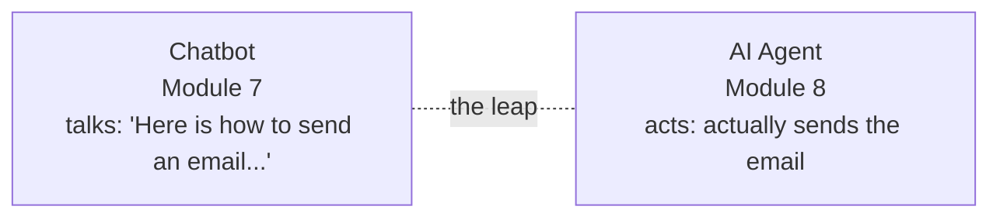

### 1.2 A concrete comparison

| Task: "Email the team the latest sales figures." | Chatbot | Agent |
|---|---|---|
| Understand the request | ✅ | ✅ |
| Look up the sales figures | ❌ (doesn't have them) | ✅ (uses a database tool) |
| Write the email | ✅ | ✅ |
| Actually send it | ❌ | ✅ (uses an email tool) |

The chatbot gives you a *draft and instructions*; the agent **gets the job done**.

### 1.3 Why agents are the 2024–2026 frontier

Once LLMs got good enough to reason and follow instructions reliably (Module 7), the natural next step was to let them **act**. In 2026, "agentic AI" is the hottest area: coding agents that build features, research agents that browse and summarize, customer-service agents that resolve tickets, and personal assistants that manage your calendar and inbox. The tool used to *build* much of this very course is an example of an agentic coding assistant.

> **The one-line definition to remember:** **An AI agent is an LLM (the brain) + tools + a loop.** Everything in this module elaborates that sentence.

---

## 2. What is an AI Agent?

### 2.1 Definition

An **AI agent** is a system that uses an LLM to **perceive** a goal, **decide** what to do, **act** using tools, **observe** the results, and **repeat** until the goal is done. It's autonomous within limits — it chooses its own steps rather than following a fixed script.

### 2.2 The agent loop (the heart of everything)

Agents work in a cycle, often called the **ReAct** loop (Reason + Act):

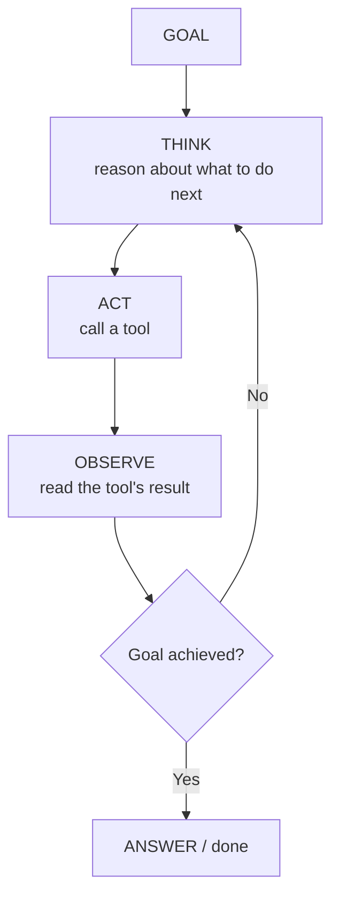

| Step | What happens |
|---|---|
| **Think** | The LLM reasons: "To answer this, I should use the calculator." |
| **Act** | It calls a tool: `calculator("15 * 23")`. |
| **Observe** | It reads the result: `345`. |
| **Repeat/Answer** | If more steps are needed, loop; else give the final answer. |

**This is exactly what Project 2 demonstrates**, with a visible `THINK → ACT → OBSERVE → ANSWER` trace.

### 2.3 The components of an agent

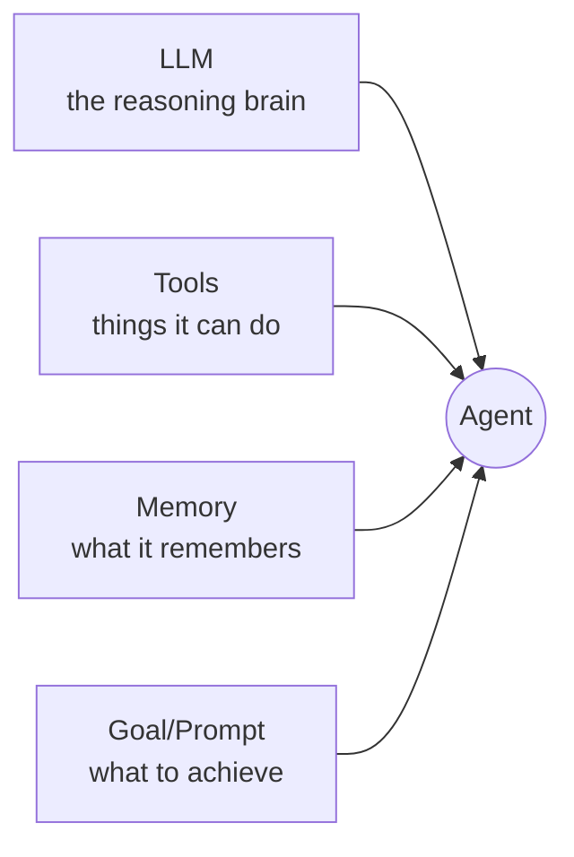

| Component | Role |
|---|---|
| **LLM (brain)** | Reasons and decides the next action |
| **Tools** | The actions it can take (calculator, search, email, code…) |
| **Memory** | Keeps track of progress and context (§8) |
| **Goal** | What the user wants achieved |
| **Loop/Orchestrator** | Runs the think-act-observe cycle |

### 2.4 Agent vs workflow — a useful distinction

| | Fixed Workflow | Agent |
|---|---|---|
| Steps | **Predefined** by you | **Decided by the LLM** at runtime |
| Flexibility | Rigid, predictable | Flexible, adaptive |
| Example | "For each row, send this email" (Project 1) | "Figure out how to answer this question" (Project 2) |
| Reliability | Very high | Lower (LLM can err) |

- **Start with a workflow** if the steps are known and fixed — it's reliable and cheap.
- **Use an agent** when the path can't be scripted in advance and you need adaptability.
- Real systems often **blend** both: an automated workflow that calls an agent for the tricky step.

### 2.5 A worked example — an agent chaining tools

The real power shows when an agent uses **several tools in sequence** to reach a goal it couldn't in one step. Suppose the goal is:

> *"How many days until New Year, and what is that times 24 hours?"*

A tool-using agent might loop like this:

```
GOAL: days until New Year × 24
THINK   : I need today's date first.        ACT: clock()          OBSERVE: 2026-12-01
THINK   : New Year is 2027-01-01; that's 31 days away. Now multiply.
ACT     : calculator("31 * 24")             OBSERVE: 744
THINK   : I have the answer.
ANSWER  : 31 days until New Year, which is 744 hours.
```

- Notice the agent **used the clock tool, reasoned, then used the calculator** — two tools, one goal. No single step could do it.
- This *chaining* — observe, reason, act again — is what separates an agent from a one-shot chatbot, and it's why the **loop** matters. (Project 2's challenges invite you to build exactly this multi-tool chaining.)

---

## 3. Tools — Giving Agents Abilities

### 3.1 What is a tool?

A **tool** is a function the agent can call to *do something* beyond generating text. Tools are what turn a "talker" into a "doer." Each tool has a **name**, a **description** (so the LLM knows when to use it), and **inputs**.

| Tool | What it lets the agent do |
|---|---|
| **Calculator** | Do exact maths (LLMs are bad at arithmetic!) |
| **Web search** | Get current information beyond its training cutoff |
| **Code execution** | Run code to compute or test things |
| **Database / API** | Read/write real data (orders, users, sales) |
| **Email / Slack** | Communicate and notify |
| **File read/write** | Work with documents |
| **RAG / knowledge base** | Answer from *your* documents (Module 6 & 7) |

*(Project 2's agent has four local tools: calculator, clock, word-counter, and a knowledge lookup.)*

### 3.2 Why tools matter — covering LLM weaknesses

LLMs have real weaknesses (Module 7, §7): they can't do reliable maths, don't know current facts, and hallucinate. **Tools fix exactly these:** a calculator gives correct maths, web search gives current facts, a database gives real data. The agent's job is to *know which tool to reach for* — and that's a reasoning task the LLM is good at.

> **Analogy:** the LLM is a smart person; tools are their phone, calculator, and web browser. Give a smart person the right tools and they can accomplish far more than by memory alone.

### 3.3 Function calling — how LLMs use tools

Modern LLM APIs support **function calling** (a.k.a. **tool use**): you describe your tools to the model, and when it wants to use one, it replies with a **structured request** naming the tool and its inputs. Your code runs the tool and feeds the result back.

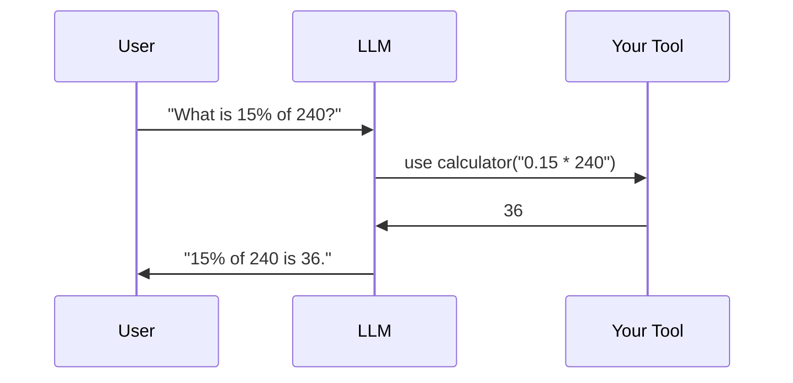

- You define tools (name, description, input schema).
- The LLM decides *whether* and *which* tool to call, and with what inputs.
- **Your code executes the tool** (the LLM never runs it itself) and returns the result.
- The LLM continues, using that result.

> **Security note:** because *your code* runs the tool, you control what's allowed — gate dangerous actions (sending money, deleting data) behind checks or human approval. Never let an agent take irreversible actions unsupervised.

---

## 4. Building an Agent (The Loop in Detail)

### 4.1 The rule-based brain vs the LLM brain

**Project 2** uses a **rule-based router** as the brain (simple `if` rules pick the tool) so it runs **offline and is fully testable**. A *real* agent replaces those rules with an **LLM** that decides. Crucially, **the loop is identical** — only the decision-maker changes:

```python
# Project 2's rule-based brain (offline, testable):
def choose_tool(goal):
    if has_math(goal):    return "calculator", ...
    if "time" in goal:    return "clock", ...
    ...

# A real LLM brain (conceptual): the model returns which tool + inputs to use.
```

### 4.2 The full agentic loop with an LLM (conceptual)

Here's how a real tool-using agent loop looks with an LLM making the decisions:

```python
messages = [{"role": "user", "content": goal}]

while True:
    response = llm.create(messages=messages, tools=my_tools)   # LLM thinks
    if response.wants_to_use_a_tool:
        tool_name, tool_input = response.tool_call
        result = run_tool(tool_name, tool_input)               # ACT (your code)
        messages.append(tool_result(result))                   # OBSERVE
        # loop again so the LLM can use the result
    else:
        answer = response.text                                 # ANSWER
        break
```

- The `while` loop is the agent loop. The LLM keeps asking for tools until it has enough to answer.
- Real frameworks (below) handle this loop for you.

### 4.3 Agent frameworks (2026)

You rarely hand-write agent loops in production. Popular frameworks do the heavy lifting:

| Framework | Focus |
|---|---|
| **LangChain / LangGraph** | Building and orchestrating agent workflows as graphs |
| **CrewAI** | Teams of role-based agents collaborating (multi-agent) |
| **AutoGen** (Microsoft) | Multi-agent conversations |
| **OpenAI / Anthropic SDKs** | Built-in tool use / "tool runner" helpers |
| **Managed/hosted agents** | The provider runs the loop & sandbox for you |

- You still design the **tools, prompts, and guardrails** — the framework runs the loop.

### 4.4 Prompting an agent well

Agents live or die on their instructions (Module 7 pays off here). A good agent system prompt says:
- **Who it is** and its goal ("You are a research assistant that…").
- **Which tools it has** and *when* to use each.
- **Rules & limits** ("Always verify facts with the search tool." "Never delete files.").
- **When to stop** ("When you have the answer, reply directly.").

---

## 5. Workflow Automation

### 5.1 What is workflow automation?

**Workflow automation** means connecting apps and steps so a task runs **automatically** without manual work. A workflow is a sequence: **a trigger starts it, then steps process data, then actions produce a result.**

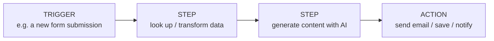

- **Trigger:** what *starts* the workflow (a schedule, a new email, a form submission, a webhook).
- **Steps:** processing (filter, transform, call an AI model, look up data).
- **Action:** the outcome (send an email, update a sheet, post to Slack).

**Project 1 (Email Automation)** is exactly this shape: *trigger* (a recipient list) → *step* (generate a personalized email) → *action* (send it).

### 5.2 Why automate?

| Benefit | Example |
|---|---|
| **Save time** | No more manually sending 100 personalized emails |
| **Reduce errors** | The workflow does the same thing correctly every time |
| **Scale** | Handle 10 or 10,000 items with the same effort |
| **Work 24/7** | Runs on a schedule while you sleep |
| **Connect apps** | Glue together tools that don't natively talk |

### 5.3 Where AI fits into automation

Traditional automation follows fixed rules. **AI-powered automation** adds a *smart* step: an LLM that can **understand, generate, classify, or decide**. Examples:
- Auto-**summarize** every incoming support email and route it.
- Auto-**generate** a personalized reply (Project 1).
- Auto-**classify** feedback as positive/negative (Module 6) and alert on the negatives.

This blend — reliable automation + intelligent AI steps — is where enormous real-world value is in 2026.

---

## 6. n8n Basics

### 6.1 What is n8n?

**n8n** (pronounced "n-eight-n," short for *nodenation*) is a popular **visual workflow-automation tool**. You build automations by **dragging and connecting boxes (nodes)** on a canvas — no heavy coding required. It's like a flowchart that actually runs. (Similar tools: **Zapier**, **Make**.) n8n is **open-source** and can be self-hosted, which is why it's popular for AI workflows and privacy-sensitive tasks.

### 6.2 The building blocks: nodes

In n8n, every step is a **node**. Data flows from one node to the next along the connections.

| Node type | What it does | Example |
|---|---|---|
| **Trigger node** | Starts the workflow | "When a new email arrives", "Every day at 9am", "On webhook" |
| **Action node** | Does something | "Send email", "Add row to Google Sheet", "Post to Slack" |
| **App node** | Connects to a service | Gmail, Slack, Notion, an HTTP API |
| **AI / LLM node** | Calls an AI model | "Ask OpenAI/Claude to write a reply" |
| **Logic node** | Branches / filters / loops | "IF sentiment is negative → alert" |

### 6.3 A visual workflow — email automation in n8n

Here's how **Project 1's email automation** would look as an n8n workflow:

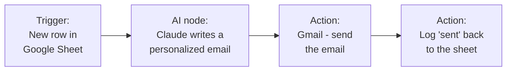

1. **Trigger** — a new recipient is added to a Google Sheet.
2. **AI node** — an LLM writes a personalized email from that row's data.
3. **Action** — Gmail sends the email.
4. **Action** — the sheet is updated to mark it "sent."

You build this by **dragging four nodes and connecting them** — no code. That's the power of n8n.

### 6.4 Why learn a tool like n8n?

- **Speed:** build real automations in minutes, visually.
- **Integrations:** hundreds of pre-built app connectors (Gmail, Slack, databases, APIs).
- **AI-ready:** built-in nodes to call LLMs, so you add intelligence easily.
- **No-code/low-code:** accessible to non-programmers, extensible for programmers.

> **Notes vs project:** n8n is a *visual* tool, so we teach it here in concept and diagrams, and build the *same idea* in Python (Project 1) so you understand the mechanics. In practice, you'd prototype fast in n8n and drop to code (like our projects) when you need custom logic.

### 6.5 Getting started with n8n (self-study)

- Try the free **n8n Cloud** trial or run it locally with Docker.
- Build a first workflow: a **schedule trigger → HTTP request → send yourself a Slack/email message.**
- Then add an **AI node** to generate the message content — you've built an AI automation!

### 6.6 n8n vs other ways to automate

You have several options for building automations — pick by need:

| Tool | Style | Best for |
|---|---|---|
| **n8n** | Visual, open-source, self-hostable | AI + privacy-sensitive workflows; flexible |
| **Zapier** | Visual, cloud, huge app library | Non-technical users; quick integrations |
| **Make (Integromat)** | Visual, cloud, powerful branching | Complex visual scenarios |
| **Python + APIs (code)** | Full code (like our projects) | Custom logic, full control, version-controlled |

- **No-code tools** (n8n/Zapier/Make) win for **speed** and **connecting apps** you don't want to code against.
- **Code** wins for **custom logic**, testing, and control — which is why this course teaches the *concepts in Python* (the projects) *and* the *visual tool* (n8n).
- A common pro pattern: **prototype in n8n, then rebuild the critical parts in code** once the flow is proven.

### 6.7 A second n8n example — auto-triage support emails

To see AI + automation together, here's a support-email triage flow:

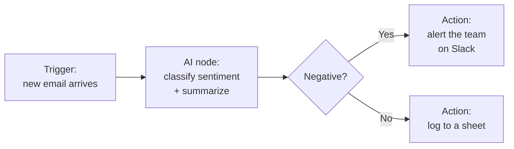

- A new email **triggers** the flow; an **AI node** summarizes and classifies it (Module 6 skills!); a **logic node** branches on the result; **action nodes** alert or log. This is a genuinely useful production pattern — built with a handful of nodes.

---

## 7. Multi-Agent Systems

### 7.1 Why more than one agent?

For complex tasks, one agent trying to do everything gets confused. **Multi-agent systems** split the work among **specialist agents**, each with a focused role — like a team of people. Each agent does one job well and passes its work along.

> **The idea:** a single generalist vs a *team of specialists*. Just as a company has a researcher, a writer, and an editor, an AI system can too. **Project 3** builds exactly this: Researcher → Writer → Editor.

### 7.2 Multi-agent patterns

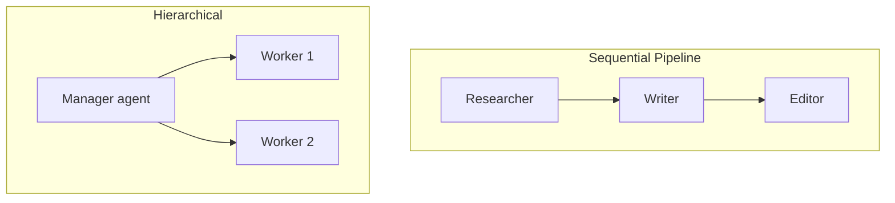

| Pattern | How it works | Example |
|---|---|---|
| **Sequential (pipeline)** | Agents work in order; output → input | Research → Write → Edit (Project 3) |
| **Hierarchical (manager)** | A manager agent delegates to workers | A "lead" splits a task among specialists |
| **Collaborative / debate** | Agents discuss and critique each other | Two agents debate to reach a better answer |

### 7.3 Benefits of multi-agent design

- **Specialization** → each agent is better at its narrow job (better quality).
- **Separation of concerns** → easier to build, test, and improve one agent at a time.
- **Parallelism** → independent agents can work at the same time.
- **Modularity** → swap or upgrade one agent without touching the others.

### 7.4 Multi-agent frameworks (2026)

| Framework | Known for |
|---|---|
| **CrewAI** | Easy "crews" of role-based agents with tasks |
| **AutoGen** (Microsoft) | Multi-agent conversations & collaboration |
| **LangGraph** | Agents as a graph/state machine with control |

- These handle the orchestration (who runs when, how work is passed) so you focus on **roles, tools, and prompts** — exactly the pieces you built by hand in Project 3.

### 7.5 A caution

More agents = more complexity, cost, and points of failure. **Don't reach for multi-agent unless a single agent (or a plain workflow) genuinely can't do the job.** Start simple; add agents only when the task clearly benefits.

---

## 8. Agent Memory & Planning

### 8.1 Why memory?

An LLM is **stateless** (Module 7, §6.6) — it forgets between calls. To pursue a multi-step goal, an agent needs **memory** to track what it has done and learned.

| Memory type | What it holds | Analogy |
|---|---|---|
| **Short-term** | The current task's steps & observations (the running conversation) | Your working memory during a task |
| **Long-term** | Facts/preferences that persist across sessions (often in a database or via RAG) | Your notebook / long-term memory |

- Short-term memory is usually just the growing **message history** in the loop.
- Long-term memory often uses **embeddings + a vector store** (Module 6) — the same tech as **RAG** (Module 7, §8).

### 8.2 Planning

Advanced agents **plan** before acting: break a big goal into a sequence of sub-tasks, then execute them (using tools/memory), adjusting as they go.

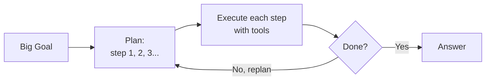

- Planning + memory + tools + a loop = a capable agent that can tackle real multi-step work.
- This is precisely how a coding agent turns "build this feature" into read files → write code → run tests → fix → repeat.

---

## 9. Real-World Agents & Use Cases

### 9.1 Agents in the wild (2026)

| Domain | What the agent does |
|---|---|
| **Software** | Coding agents that read a repo, write features, run tests, open pull requests |
| **Customer support** | Resolve tickets end-to-end: look up the order, issue a refund, reply |
| **Research** | Browse the web, gather sources, and write a cited summary |
| **Personal assistant** | Manage calendar/inbox, book things, draft replies |
| **Data / ops** | Monitor dashboards, detect anomalies, and alert or act |
| **Sales / marketing** | Personalized outreach at scale (like Project 1) |

### 9.2 The automation spectrum

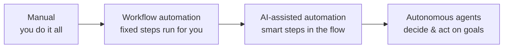

Most real value in 2026 sits in the **middle two** — reliable automation with intelligent AI steps — with fully autonomous agents used carefully where they're proven.

### 9.3 A worked case study — a customer-support agent

Let's trace how a real support agent handles *"Where is my order #4471? It's late."* end to end — it combines everything in this module:

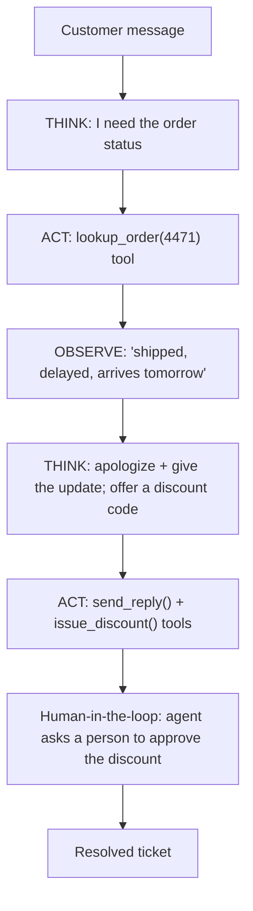

- **Tools** give it real abilities (look up the order, send a reply, issue a discount).
- The **loop** lets it gather info, then act.
- **Human-in-the-loop** guards the consequential action (issuing money/discount) — the safety practice from §10.
- **Memory** keeps the conversation coherent if the customer replies again.

This single example shows *why* the pieces matter: without tools it couldn't look up the order; without the loop it couldn't act on what it found; without human-in-the-loop it might hand out discounts unwisely. **Agents are these pieces working together.**

---

## 10. Challenges, Safety & Best Practices

### 10.1 Why agents are hard

Giving an LLM the power to *act* multiplies both value and risk:

| Challenge | Why it matters |
|---|---|
| **Reliability** | The LLM can misjudge or hallucinate a step; errors compound over a loop |
| **Cost** | Every loop step is an LLM call — long loops get expensive (tokens!) |
| **Safety** | An agent that can act can act *wrongly* (send the wrong email, delete data) |
| **Prompt injection** | Malicious text in a tool result could hijack the agent (Module 7, §6.5) |
| **Infinite loops** | A confused agent can loop forever — always cap the steps |
| **Debuggability** | Non-deterministic behavior is harder to trace |

### 10.2 Best practices for safe, useful agents

- **Human-in-the-loop** for consequential actions — require approval before sending money, emails to real people, or deleting anything.
- **Cap the loop** — a maximum number of steps so it can't run forever or rack up huge cost.
- **Limit tool power** — give the agent the *least* access it needs; sandbox code execution.
- **Validate tool inputs/outputs** — don't blindly trust or execute model output.
- **Log everything** — a trace of think/act/observe makes debugging possible (Project 2 shows one).
- **Start with a workflow** — only use an agent where adaptability is truly required.
- **Test on safe/mock actions first** — exactly why the projects "send" to an outbox, not real inboxes.

### 10.3 The responsibility principle

> An agent acts **on your behalf** — so you are responsible for what it does. Design for **safety first**: assume it *will* occasionally be wrong, and make sure a wrong action is caught, reversible, or requires a human's "yes." This is the professional mindset that turns an impressive demo into a trustworthy product.

---

## 11. Hands-on Activities Overview

The syllabus activity is **Email Automation**. We build it plus a **tool-using AI Agent** and a **Multi-Agent Workflow**, covering the module's core ideas with runnable code.

| # | Project | Concept |
|---|---|---|
| 1 | **Email Automation** | Workflow automation (trigger → generate → deliver) |
| 2 | **AI Agent with Tools** | The single-agent loop (think → act → observe) |
| 3 | **Multi-Agent Workflow** | Specialist agents collaborating |

> ### 📦 About these projects — run with ZERO setup
> Every program runs **OFFLINE in mock mode** — no API key, no installs, no internet. They print a clear trace so you *see* the workflow/agent working. Set `USE_REAL_API = True` + an API key to power the agents with Claude. All console output is plain ASCII. **Location:** `Hands-on Projects/Module 8 Hands-on Projects/`.

---

## 12. Hands-on Project 1 — Email Automation

The syllabus project: an automated workflow that personalizes and "sends" an email to everyone in a list.

### 12.1 The workflow shape

```python
for recipient in RECIPIENTS:          # loop over the data (the "trigger")
    prompt = build_prompt(recipient)  # personalize
    email  = generate_email(recipient)# generate (template or LLM)
    send_email(recipient, email)      # deliver (save to outbox/)
```

- This is the classic **trigger → process each item → action** automation shape (§5.1).
- The **"send" is mocked** (saves to `outbox/`) so nobody is emailed by accident; the README shows real `smtplib` sending.

### 12.2 Sample output

```
[1/3] Processing Aarav Sharma <aarav@example.com>
        Subject: A quick update from the AI Program team
        [SENT -> saved to outbox/aarav_sharma.txt]
...
Emails generated and 'sent': 3
```

Flip `USE_REAL_API = True` and Claude writes each email. **Full program:** `Hands-on Projects/Module 8 Hands-on Projects/Project 1 - Email Automation/`.

---

## 13. Hands-on Project 2 — AI Agent with Tools

The single-agent loop made concrete — watch it think, act, observe, and answer.

### 13.1 The agent loop

```python
def run_agent(goal):
    tool_name, tool_fn, tool_input = choose_tool(goal)   # THINK (pick a tool)
    observation = tool_fn(tool_input)                    # ACT + OBSERVE
    return f"The answer is: {observation}"               # ANSWER
```

- Tools: **calculator, clock, word_counter, knowledge**. The "brain" is rule-based so it runs offline; a real agent swaps in an LLM to choose (§4).

### 13.2 Sample output

```
GOAL: What is 15 * 23 + 100?
  THINK  : This needs the 'calculator' tool.
  ACT    : calculator('15 * 23 + 100')
  OBSERVE: 445
  ANSWER : The answer is: 445
```

- The trace shows the agent *reasoning* — the key difference from a plain chatbot. **Full program:** `Hands-on Projects/Module 8 Hands-on Projects/Project 2 - AI Agent with Tools/`.

---

## 14. Hands-on Project 3 — Multi-Agent Workflow

Three specialist agents collaborate to turn a topic into an article.

### 14.1 The pipeline

```python
points = researcher_agent(topic)      # Agent 1: gather key points
draft  = writer_agent(topic, points)  # Agent 2: write a draft   (hand-off)
final  = editor_agent(topic, draft)   # Agent 3: polish & format (hand-off)
```

- Each agent has its **own role** (its own system prompt), and **each output becomes the next agent's input** — the essence of multi-agent design (§7).

### 14.2 Sample output

```
[Agent 1: RESEARCHER] gathering key points...
   ...handing the points to the Writer...
[Agent 2: WRITER] drafting the article...
   ...handing the draft to the Editor...
[Agent 3: EDITOR] polishing and formatting...
# How AI agents work
*TL;DR: A beginner-friendly overview...*
```

Saved to `article.md`. In real mode, three Claude agents collaborate. **Full program:** `Hands-on Projects/Module 8 Hands-on Projects/Project 3 - Multi-Agent Workflow/`.

### 14.3 How the three projects fit together

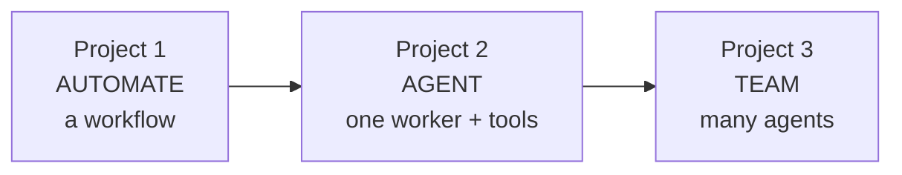

Automation → single agent → multi-agent team: the arc of the whole module.

---

## 15. Best Practices & Common Mistakes

### 15.1 Best practices

- **Match the tool to the job:** plain workflow if steps are fixed; agent if adaptability is needed.
- **Give agents clear roles, tools, and limits** in the system prompt.
- **Cap the loop** and **log the trace** for reliability and debugging.
- **Human-in-the-loop** for anything consequential or irreversible.
- **Sandbox and least-privilege** every tool the agent can use.
- **Start simple** — one agent or a workflow — before going multi-agent.
- **Watch cost** — every loop step is an LLM call.

### 15.2 Top 10 beginner mistakes

| # | Mistake | Fix |
|---|---|---|
| 1 | Using an agent where a fixed workflow would do | Prefer the simpler, cheaper option |
| 2 | No loop cap → runaway/expensive agent | Set a max-steps limit |
| 3 | Letting an agent take irreversible actions unsupervised | Add human approval |
| 4 | Vague tool descriptions | Describe *when* to use each tool |
| 5 | Trusting tool inputs/outputs blindly | Validate; guard against injection |
| 6 | Ignoring cost of long loops | Cap steps; use a cheaper model |
| 7 | Over-engineering with too many agents | Start with one |
| 8 | No logging/trace | Log think/act/observe |
| 9 | Testing on real actions first | Use mock/sandbox actions |
| 10 | Forgetting agents can hallucinate | Verify important results |

### 15.3 Modern context (2026)

- **Agentic AI** is the industry's hottest area — from coding agents to autonomous research.
- **Hosted/managed agents** let providers run the loop and sandbox for you.
- **No-code tools (n8n)** + **agent frameworks (CrewAI, LangGraph)** make building fast.
- The durable skills are **prompting, tool design, and safety** — all taught here.

---

## 16. Glossary

| Term | Meaning |
|---|---|
| **AI Agent** | An LLM that uses tools and a loop to *act*, not just talk. |
| **Agent loop** | Think → act → observe → repeat until done. |
| **ReAct** | Reason + Act — the common agent loop pattern. |
| **Tool** | A function an agent can call to do something. |
| **Function calling / Tool use** | The LLM feature of requesting a tool in a structured way. |
| **Workflow** | A sequence of steps: trigger → process → action. |
| **Trigger** | The event that starts a workflow. |
| **Action** | The outcome step of a workflow (send, save, notify). |
| **n8n** | A visual, node-based workflow-automation tool. |
| **Node** | One step/box in an n8n workflow. |
| **Multi-agent system** | Several specialist agents collaborating. |
| **Orchestration** | Coordinating which agent/step runs when. |
| **Hand-off** | Passing one agent's output as the next agent's input. |
| **Short-term memory** | The current task's running context. |
| **Long-term memory** | Persistent knowledge across sessions (often RAG). |
| **Planning** | Breaking a goal into sub-tasks before acting. |
| **Human-in-the-loop** | Requiring human approval for key actions. |
| **Prompt injection** | Malicious instructions hidden in inputs/tool results. |
| **CrewAI / AutoGen / LangGraph** | Frameworks for building (multi-)agents. |
| **Autonomous** | Acting toward a goal without step-by-step human control. |

---

## 17. Practice Exercises & Self-Assessment

### 17.1 Concept checks

1. In one sentence, what is the difference between a chatbot and an agent?
2. Name the four steps of the agent loop.
3. Why do agents need tools? Give two examples of weaknesses tools fix.
4. What is a trigger, a step, and an action in a workflow?
5. Sketch (in words) an n8n workflow that emails you a daily weather summary.
6. When should you use multi-agent instead of a single agent?
7. What are two types of agent memory, and what does each store?
8. Give three safety practices for agents that can take real actions.

### 17.2 Coding — with the projects

9. Run all three projects (mock mode) and complete **one README challenge** in each.
10. Add a **new tool** (e.g., temperature converter) to Project 2's agent.
11. Load Project 1's recipient list from a **CSV** instead of the inline list.
12. Add a **4th agent** (a Fact-Checker) to Project 3's pipeline.
13. Make Project 2 **interactive** — read the goal with `input()` in a loop.
14. Add a **max-steps cap** and a log to any project that loops.

### 17.3 Applied / design

15. Design (on paper) an **AI automation** for a real chore in your life (trigger → steps → action).
16. Pick a task and decide: **fixed workflow, single agent, or multi-agent?** Justify it.
17. (Optional) Try **n8n** free and build a schedule-trigger → send-message workflow.
18. (Optional, real mode) Enable an API key and run one project with a live LLM.

### 17.4 Quick self-check quiz

1. An agent = an LLM + ___ + a ___. *(→ tools; loop)*
2. What starts a workflow? *(→ a trigger)*
3. What kind of tool is n8n? *(→ visual workflow automation)*
4. What's the risk of no loop cap? *(→ runaway/expensive/infinite loop)*
5. Research → Write → Edit is which pattern? *(→ sequential/pipeline multi-agent)*
6. Where should consequential actions get a human's OK? *(→ human-in-the-loop)*
7. What lets an LLM request a tool in a structured way? *(→ function calling / tool use)*
8. Which is simpler and more reliable — workflow or agent? *(→ workflow)*

### 17.5 Solutions & Answer Key

**17.1 Concept checks**

1. **Chatbot vs agent:** a chatbot only *talks* (text in → text out); an **agent** can *act* — it uses tools in a loop to actually get a goal done.
2. **The agent loop:** **Think → Act (call a tool) → Observe (read the result) → Repeat** until the goal is met (or a step cap is hit).
3. **Why tools:** an LLM alone can't do live or exact things. Tools fix, e.g. (a) **no live data** → a weather/search API; (b) **bad at exact math** → a calculator; (also: no memory → a database, can't act → send-email).
4. **Trigger / step / action:** a **trigger** starts the flow (schedule, new email, webhook); a **step** is one unit of work in the middle (transform/decide); an **action** is the final effect on the world (send message, write row).
5. **Daily-weather n8n flow (in words):** **Schedule trigger (8 AM daily)** → **HTTP Request** node calls a weather API for your city → **Set/Function** node formats a short summary → **Email/Gmail** node sends it to you.
6. **Use multi-agent when** the job splits into **distinct specialties** (research vs write vs edit) or is too big for one prompt — separate agents each do one role well and hand off.
7. **Two memory types:** **short-term** (the current conversation/scratchpad — the running context) and **long-term** (facts/notes saved to a file or vector DB and recalled later across sessions).
8. **Three safety practices:** (1) **human-in-the-loop** approval for consequential actions; (2) **limits/caps** (max steps, spending, allowed tools); (3) **logging + read-only-by-default / sandboxing** so actions are auditable and reversible.

**17.2 Coding — with the projects** *(patterns; adapt to your project files)*

9. **Do-it task:** run each project's `.py` in mock mode (no installs, no API key) and complete one challenge from its README — e.g. add a recipient in Project 1, a new goal in Project 2, or a new writing topic in Project 3.
10. **New tool — temperature converter** (register it like the other tools):
    ```python
    def temp_convert(args):
        value, to = float(args["value"]), args["to"].lower()
        if to == "f": return value * 9/5 + 32
        if to == "c": return (value - 32) * 5/9
        return "unknown unit"

    TOOLS["temp_convert"] = temp_convert   # add to the agent's tool registry
    # temp_convert({"value":100,"to":"f"}) -> 212.0
    ```
11. **Load recipients from a CSV** instead of the inline list:
    ```python
    import csv
    with open("recipients.csv", newline="") as f:
        recipients = [row["email"] for row in csv.DictReader(f)]
    # recipients.csv has a header row: name,email
    ```
12. **4th agent — Fact-Checker** in the pipeline: insert it after Write, before Edit, so the chain becomes **Research -> Write -> Fact-Check -> Edit**:
    ```python
    def fact_checker(draft):
        prompt = f"Check this draft for false or unsupported claims. List any, or say 'No issues'.\n\n{draft}"
        return ask_llm(prompt)          # mock or real, same as the other agents
    pipeline = [researcher, writer, fact_checker, editor]
    ```
13. **Make it interactive** with an `input()` loop:
    ```python
    while True:
        goal = input("Goal (or 'quit'): ").strip()
        if goal.lower() in ("quit", "exit", ""):
            break
        run_agent(goal)
    ```
14. **Max-steps cap + log** (prevents runaway loops):
    ```python
    def agent_loop(goal, max_steps=5):
        log = []
        for step in range(1, max_steps + 1):
            log.append(f"step {step}: ...")
            if goal_reached():           # your done-check
                log.append("DONE"); break
        else:
            log.append("stopped: hit max_steps cap")
        return log
    ```

**17.3 Applied / design** *(open-ended — sample answers)*

15. **Sample automation:** *trigger* = 7 PM daily → *steps* = read today's calendar + tomorrow's todos, summarize → *action* = send me a "tomorrow at a glance" message.
16. **Choosing the pattern:** if the steps are **fixed and predictable**, use a **workflow** (cheapest, most reliable); if it needs **judgment/branching**, use a **single agent**; only go **multi-agent** when there are clearly separate specialist roles. *Rule: use the simplest thing that works.*
17–18. **Optional hands-on** (try n8n free; enable a real API key and run one project live) — no written answer needed.

**17.4 Quiz** — answers are shown inline next to each question above.

> **Ready for Module 9 when:** you can explain agents, tools, and workflows; describe an n8n flow; and read/modify the three projects.

---

## 18. Summary & What's Next

### 18.1 Module 8 in one picture

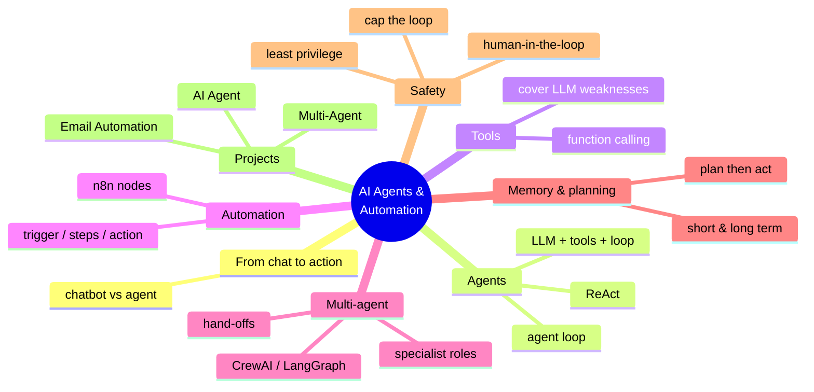

### 18.2 Key takeaways

- **A chatbot talks; an agent acts** — an agent is an **LLM + tools + a loop.**
- The **agent loop** (think → act → observe → repeat) is the core mechanism.
- **Tools / function calling** give agents real abilities and cover LLM weaknesses.
- **Workflow automation** (trigger → steps → action) is reliable and scalable; **n8n** builds it visually.
- **Multi-agent** systems split work among specialists with hand-offs — powerful, but add complexity.
- **Memory and planning** let agents handle multi-step goals.
- **Safety is paramount** — cap loops, sandbox tools, and keep a human in the loop for consequential actions.

### 18.3 Skills checklist

- [ ] I can explain the difference between a chatbot and an agent.
- [ ] I can describe the agent loop and its components.
- [ ] I understand tools / function calling.
- [ ] I can describe workflow automation and an n8n flow.
- [ ] I can explain multi-agent patterns and when to use them.
- [ ] I understand agent memory, planning, and safety practices.
- [ ] I completed all three hands-on projects.

### 18.4 Bridge to Module 9

You can now build AI that *acts* — agents and automated workflows. Next you'll make your AI **usable by real people**: in **Module 9 — Deployment & Career Readiness**, you'll turn your models and apps into shareable web apps with **Streamlit** and **Flask**, put your code on **GitHub**, and prepare your **resume, LinkedIn, and interview** skills. It's the step from "it works on my machine" to "here's a live app anyone can use" — and from "I built projects" to "I'm ready for an internship."

> **Homework before Module 9:** complete the three projects and one challenge each; sketch one real-life AI automation (exercise 15); and, if you can, spend 30 minutes exploring n8n's free tier. Bring your favorite project — you'll deploy something like it in Module 9.

---

### Instructor Notes (for the teaching team)

- **Suggested 6-hour split:** Hour 1 — chatbots → agents + the agent loop (§1–2) + **Project 2 (Agent)**; Hour 2 — tools & function calling (§3–4); Hour 3 — workflow automation + **n8n live demo** (§5–6); Hour 4 — **Project 1 (Email Automation)**; Hour 5 — multi-agent + **Project 3** (§7); Hour 6 — memory, safety, use cases (§8–10) + share designs.
- **Do a live n8n demo** — building a 3-node workflow visually makes automation click instantly; then show Project 1 as "the same thing in code."
- **The agent trace (Project 2) is the teaching centerpiece** — students *see* think→act→observe, which demystifies agents.
- **Safety is not optional** — spend real time on human-in-the-loop, loop caps, and why the projects "send" to an outbox. This is the difference between a cool demo and a responsible engineer.
- **Projects run offline (mock mode)** so no one is blocked; do one instructor-led real-mode run so students see a live agent.
- **Assessment:** Email Automation (syllabus) as the graded deliverable; the agent/multi-agent challenges as reinforcement; the quiz (§17.4) before Module 9.

---

*End of Module 8 — AI Agents & Automation.*
*AI Powered Engineering Upskilling Program · 2026 Edition.*
