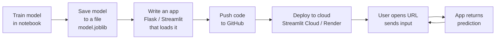
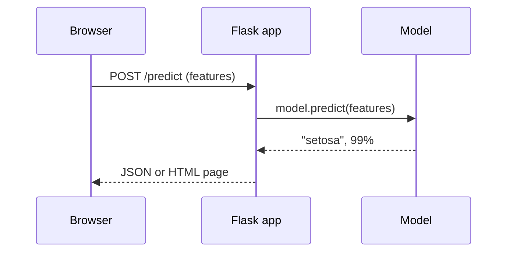
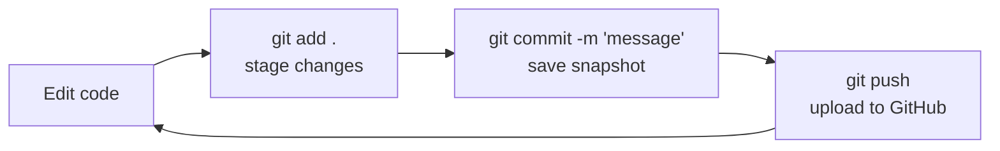
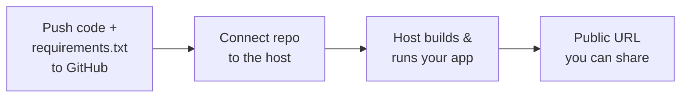
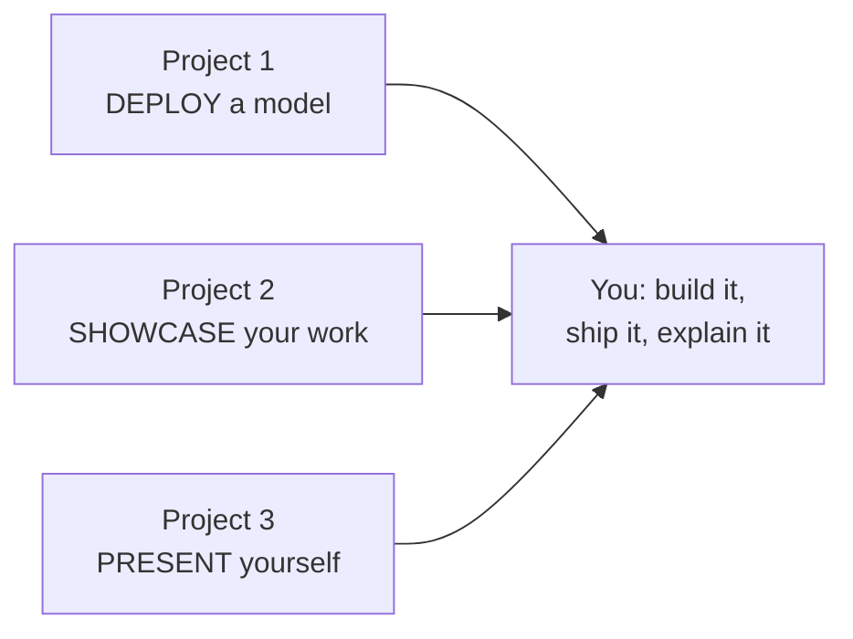

# Module 9 — Deployment & Career Readiness 🚀🎯

**AI Powered Engineering Upskilling Program**

---

## Module Information Card

| | |
|---|---|
| **Module** | 9 of 10 |
| **Title** | Deployment & Career Readiness |
| **Duration** | 4 hours |
| **Learning Outcome** | Prepare for industry — deploy your AI work and present yourself professionally |
| **Topics Covered** | Streamlit, Flask, GitHub, Resume, LinkedIn, Interview Preparation |
| **Hands-on Activity** | Portfolio Showcase |
| **Prerequisites** | Modules 1–8 (Python, ML, and at least one project you can show) |
| **Tools** | Python, VS Code, Git, GitHub, Flask, Streamlit |

### What you will be able to do after this module

- Explain **why** a model must leave the notebook to be useful.
- **Save and load** a trained model so an app can reuse it.
- Build a web app two ways: **Streamlit** (fast data apps) and **Flask** (APIs and full control).
- Use **Git and GitHub** to version your code and publish it.
- **Deploy** an app for free so anyone on the internet can use it.
- Build a **portfolio** that makes recruiters stop and read.
- Write an **AI/tech resume**, a strong **LinkedIn** profile, and prepare for **interviews**.

---

## Table of Contents

1. [Why This Module Matters](#1-why-this-module-matters)
2. [The Deployment Mindset](#2-the-deployment-mindset)
3. [The Deployment Pipeline](#3-the-deployment-pipeline)
4. [Saving & Loading Models](#4-saving--loading-models)
5. [Streamlit — Turn Scripts into Apps](#5-streamlit--turn-scripts-into-apps)
6. [Flask — Web Apps & APIs](#6-flask--web-apps--apis)
7. [Streamlit vs Flask — Which to Use](#7-streamlit-vs-flask--which-to-use)
8. [Version Control with Git & GitHub](#8-version-control-with-git--github)
9. [Deploying to the Cloud (Free Options)](#9-deploying-to-the-cloud-free-options)
10. [Building Your Portfolio](#10-building-your-portfolio)
11. [The AI / Tech Resume](#11-the-ai--tech-resume)
12. [LinkedIn for AI Engineers](#12-linkedin-for-ai-engineers)
13. [Interview Preparation](#13-interview-preparation)
14. [Responsible & Production-Ready Deployment](#14-responsible--production-ready-deployment)
15. [Career Paths & Roles in AI (2026)](#15-career-paths--roles-in-ai-2026)
16. [Hands-on Activities Overview](#16-hands-on-activities-overview)
17. [Practice Exercises & Self-Assessment](#17-practice-exercises--self-assessment)
18. [Summary & What's Next](#18-summary--whats-next)

---

## 1. Why This Module Matters

You have spent eight modules learning to **build** AI: cleaning data, training models, doing computer vision and NLP, prompting LLMs, and building agents. That is a real achievement. But there is a hard truth about all of it:

> **A model that lives only in your Jupyter notebook is invisible.** No recruiter, teammate, or user can touch it.

Think about it from the other side. A hiring manager reads 200 resumes that all say *"trained a machine-learning model with 90% accuracy."* Which candidate stands out?

- Candidate A: "I trained a spam classifier (90% accuracy)." — a claim.
- Candidate B: "Here is a **link** — type a message and my classifier tells you if it is spam." — **proof**.

This module is about becoming Candidate B. It has two halves:

1. **Deployment** — packaging your model so it runs as a real app on the internet (Streamlit, Flask, GitHub, cloud hosting).
2. **Career readiness** — packaging *yourself* so people can see your value (portfolio, resume, LinkedIn, interviews).

Both are the same skill applied to different things: **taking something valuable that is hidden and making it visible and usable.**

### The gap this module closes

```
WHAT YOU CAN DO NOW              WHAT INDUSTRY NEEDS
--------------------             -------------------
Train a model in a notebook  ->  Ship it as an app people can use
Run code on your laptop      ->  Host it so it runs 24/7 for anyone
Have projects on your disk   ->  Show projects on a public portfolio
Know your skills             ->  Prove your skills in resume + interview
```

Closing this gap is often the difference between "studied AI" and "hired for AI."

---

## 2. The Deployment Mindset

**Deployment** means: taking software that works *on your machine* and making it work *for other people*, reliably, without you sitting there running it by hand.

### 2.1 Notebook vs application

A **notebook** (Jupyter/Colab) is a lab bench. It is perfect for exploring, plotting, and experimenting — you run cells in any order and see results instantly. But it is a bad way to *deliver* software:

| Notebook (great for building) | Application (needed for delivering) |
|---|---|
| You run cells manually | Runs on its own when a user acts |
| Only you can use it | Anyone with the link can use it |
| Order of cells matters, state is messy | Predictable start-to-finish flow |
| Retrains every time you re-run | Trains once; loads the saved model |
| Lives on your laptop | Lives on a server, online 24/7 |

The mindset shift: stop thinking *"how do I get the answer once?"* and start thinking *"how does someone else get an answer, again and again, without me?"*

### 2.2 "Dev" vs "Prod"

Two words you will hear constantly:

- **Development (dev)** — your machine, where you write and test. Breaking things is fine.
- **Production (prod)** — the live version real users touch. Breaking things is *not* fine.

The classic bug is *"it works on my machine."* It fails in production because production has a different Python version, missing libraries, or no access to your local files. The cures — which this module teaches — are **`requirements.txt`** (list your libraries), **Git** (track exactly what code you shipped), and **the cloud** (a clean, standard place to run).

### 2.3 The three questions every deployment answers

1. **Where does the model live?** → a saved file (`model.joblib`) loaded when the app starts.
2. **How does a user send input?** → a web form, sliders, or an API request.
3. **How does the answer come back?** → a rendered web page or a JSON response.

Keep these three in mind and every deployment tool below will make sense.

---

## 3. The Deployment Pipeline

Here is the journey of a model from your notebook to a user's screen. Every project in this module follows some version of it.



Read it as a relay race. Each stage hands a baton to the next:

| Stage | You produce | Tool |
|---|---|---|
| Train | a trained model in memory | scikit-learn (Modules 4–6) |
| Save | `model.joblib` on disk | joblib / pickle (§4) |
| Wrap | an app that loads and serves it | Streamlit or Flask (§5–6) |
| Version | a public code repository | Git + GitHub (§8) |
| Deploy | a live public URL | cloud host (§9) |
| Serve | answers for real users | the running app |

Notice training happens **once** (offline), but serving happens **millions of times** (live). That split is why we *save* the model instead of retraining on every request.

---

## 4. Saving & Loading Models

Before an app can serve a model, the model must be **saved to a file**. This is called **serialization** (also "pickling"): turning a live Python object into bytes on disk, so you can load it back later exactly as it was.

### 4.1 Two tools: `pickle` and `joblib`

| | `pickle` (built in) | `joblib` (comes with scikit-learn) |
|---|---|---|
| Part of Python? | Yes, standard library | No, but installed with sklearn |
| Best for | any Python object | objects with big NumPy arrays (most ML models) |
| Speed on models | fine | **faster / smaller** for ML models |
| Recommendation | fine for small things | **preferred for ML models** |

### 4.2 Saving and loading with joblib

```python
import joblib
from sklearn.ensemble import RandomForestClassifier
from sklearn.datasets import load_iris

# train
data = load_iris()
model = RandomForestClassifier().fit(data.data, data.target)

# SAVE once (after training)
joblib.dump(model, "model.joblib")

# LOAD later (in your app) - no retraining!
model = joblib.load("model.joblib")
print(model.predict([[5.1, 3.5, 1.4, 0.2]]))   # -> [0]  (setosa)
```

### 4.3 Save a *bundle*, not just the model

A model alone is not enough — the app also needs the **label names** and **feature names**. Save them together in a dictionary so the app is self-contained:

```python
bundle = {
    "model": model,
    "feature_names": list(data.feature_names),
    "target_names": list(data.target_names),
}
joblib.dump(bundle, "model.joblib")
```

This is exactly the pattern in **Project 1**. Now the app can load one file and know everything: the model, what inputs it expects, and how to name its outputs.

> ⚠️ **Safety note:** only load model files you trust. Unpickling a file can run code, so never `joblib.load` a file from a stranger.

---

## 5. Streamlit — Turn Scripts into Apps

**Streamlit** is the fastest way for a Python person to build a web app. You write a normal script; Streamlit turns it into an interactive web page. **No HTML, CSS, or JavaScript required.**

### 5.1 The mental model

Streamlit's one big idea:

> **Every time the user interacts (moves a slider, clicks a button), Streamlit re-runs your whole script top-to-bottom and redraws the page.**

That sounds wasteful, but it makes apps trivially easy to write: you just describe *what the page should look like right now*, and Streamlit handles the rest.

### 5.2 Install and "Hello, app"

```bash
pip install streamlit
```

```python
# hello.py
import streamlit as st

st.title("My First App")
st.write("Hello! This is a web app written in pure Python.")

name = st.text_input("What is your name?")
if name:
    st.success(f"Nice to meet you, {name}!")
```

Run it:

```bash
streamlit run hello.py
```

Your browser opens at `http://localhost:8501`. Type your name and watch the page update live.

### 5.3 The most useful widgets

Widgets are the interactive parts. Each returns the user's current value:

| Widget | Code | Returns |
|---|---|---|
| Text box | `st.text_input("Label")` | the typed string |
| Number | `st.number_input("Age")` | a number |
| Slider | `st.slider("Amount", 0, 100, 50)` | current position |
| Dropdown | `st.selectbox("Pick", ["A","B"])` | the chosen option |
| Checkbox | `st.checkbox("Agree?")` | True / False |
| Button | `st.button("Run")` | True on the click |
| File upload | `st.file_uploader("CSV")` | the uploaded file |

### 5.4 Showing output

| To show... | Use |
|---|---|
| Text / markdown | `st.write(...)`, `st.markdown(...)` |
| A big number | `st.metric("Accuracy", "92%")` |
| A dataframe (table) | `st.dataframe(df)` |
| A chart | `st.bar_chart(df)`, `st.line_chart(df)` |
| Success / warning / error | `st.success(...)`, `st.warning(...)`, `st.error(...)` |
| An image | `st.image("cat.png")` |

### 5.5 Layout: columns, sidebar, tabs

```python
# a sidebar for navigation or controls
page = st.sidebar.radio("Go to", ["Home", "Demo"])

# put things side by side
c1, c2 = st.columns(2)
c1.metric("Precision", "0.88")
c2.metric("Recall", "0.81")
```

### 5.6 Caching — don't repeat slow work

Because Streamlit re-runs everything on each click, slow steps (like training a model or loading a big file) would repeat needlessly. **Caching** fixes this:

```python
@st.cache_resource       # for models, database connections (created once)
def load_model():
    return joblib.load("model.joblib")

@st.cache_data           # for data (dataframes, API results)
def load_csv():
    return pd.read_csv("big.csv")
```

The first call runs the function; later calls return the remembered result instantly. **Project 2** uses `@st.cache_resource` so the demo model trains only once.

### 5.7 A tiny ML app in Streamlit

```python
import streamlit as st, joblib

@st.cache_resource
def get_model():
    return joblib.load("model.joblib")   # a saved bundle

bundle = get_model()
st.title("Iris Predictor")

# four sliders -> a prediction
f = [st.slider(name, 0.0, 8.0, 3.0) for name in bundle["feature_names"]]
label = bundle["target_names"][bundle["model"].predict([f])[0]]
st.success(f"Prediction: {label}")
```

That is a complete, interactive ML web app in ~10 lines. This is why Streamlit is loved for demos and data tools.

---

## 6. Flask — Web Apps & APIs

**Flask** is a lightweight web framework. Where Streamlit hides the web, Flask **gives you the web** — you control the URLs (routes), the HTML, and the responses. It is the tool when you need a real **API** or a custom site.

### 6.1 The mental model

You define **routes**: a URL path + a Python function that runs when someone visits it and returns what they see.

```python
from flask import Flask
app = Flask(__name__)

@app.route("/")          # the URL path
def home():              # the function that handles it
    return "Hello from Flask!"

if __name__ == "__main__":
    app.run(debug=True)   # visit http://127.0.0.1:5000
```

### 6.2 Request → response

Every web interaction is a **request** (the browser asks) and a **response** (the server answers).



### 6.3 The two kinds of Flask endpoint

**(a) An HTML page** (for humans) using a template:

```python
from flask import render_template, request

@app.route("/")
def form():
    return render_template("index.html")   # a file in templates/

@app.route("/predict", methods=["POST"])
def predict():
    value = float(request.form["age"])     # read a form field
    return render_template("index.html", result=value * 2)
```

Flask uses **Jinja2** templates — HTML files with `{{ placeholders }}` and simple `` loops that Python fills in.

**(b) A JSON API** (for other programs):

```python
from flask import jsonify, request

@app.route("/api/predict", methods=["POST"])
def api():
    data = request.get_json()              # {"features": [5.1, 3.5, 1.4, 0.2]}
    label = model.predict([data["features"]])[0]
    return jsonify({"prediction": int(label)})
```

An API is how a mobile app, a website, or another service uses your model. **Project 1 offers both**: a form for people and `/api/predict` for programs.

### 6.4 Serving a saved model (the whole idea)

```python
import joblib
from flask import Flask, request, jsonify

app = Flask(__name__)
bundle = joblib.load("model.joblib")       # load ONCE at startup

@app.route("/api/predict", methods=["POST"])
def predict():
    features = request.get_json()["features"]
    probs = bundle["model"].predict_proba([features])[0]
    label = bundle["target_names"][probs.argmax()]
    return jsonify({"prediction": label})
```

Load the model **once** when the server starts (not per request — that would be slow), then reuse it for every incoming request. This is the single most important pattern in ML deployment.

### 6.5 Common HTTP status codes (good to know)

| Code | Meaning | When |
|---|---|---|
| 200 | OK | success |
| 400 | Bad Request | user sent invalid input |
| 404 | Not Found | that URL/route doesn't exist |
| 500 | Server Error | your code crashed |

Return `400` when input is bad (as Project 1 does), not `500` — it tells the user *they* need to fix the request.

---

## 7. Streamlit vs Flask — Which to Use

Both make web apps, but they are built for different jobs. Pick by asking: *"Am I building a data demo, or a service?"*

| | **Streamlit** | **Flask** |
|---|---|---|
| Best for | data apps, dashboards, ML demos | APIs, websites, custom apps |
| You write | pure Python | Python + a little HTML |
| UI control | limited (Streamlit's look) | total (your HTML/CSS) |
| Interactivity | built in (widgets) | you wire it up |
| Serve a JSON API? | not really | **yes, its strength** |
| Learning curve | very gentle | gentle, but more concepts |
| Speed to a demo | minutes | ~an hour |
| Typical use | "show my model to a human" | "let other programs call my model" |

**Rule of thumb:**

- Want to **show** a model to people quickly, with sliders and charts? → **Streamlit** (Project 2).
- Want other **software** to call your model, or need full control of the page? → **Flask** (Project 1).
- Many real systems use **both**: Flask serves the API; a separate frontend (or Streamlit) shows it.

There are cousins worth knowing by name: **Gradio** (like Streamlit, popular for ML demos and on Hugging Face), and **FastAPI** (like Flask but modern and very fast, the current favorite for production APIs).

---

## 8. Version Control with Git & GitHub

**Git** is a tool that tracks every change to your code, so you can save checkpoints, undo mistakes, and collaborate. **GitHub** is a website that hosts your Git repositories online — it is also, for a developer, your public résumé.

### 8.1 Why version control?

Without Git you end up with `project_final.py`, `project_final_v2.py`, `project_REALLY_final.py`. With Git you keep **one** file and a clean history of every change, each with a message explaining *why*.

- **Undo** to any past state.
- **See** exactly what changed, when, and why.
- **Collaborate** without overwriting each other.
- **Publish** your work for recruiters to see.

### 8.2 The core vocabulary

| Term | Meaning |
|---|---|
| **Repository (repo)** | a project folder that Git tracks |
| **Commit** | a saved snapshot with a message |
| **Branch** | a parallel line of work |
| **Remote** | the online copy (e.g. on GitHub) |
| **Push** | upload your commits to the remote |
| **Pull** | download others' commits |
| **Clone** | copy a remote repo to your machine |

### 8.3 The everyday workflow



The commands you will use 90% of the time:

```bash
git init                       # start tracking this folder (once)
git add .                      # stage all changes
git commit -m "Add predict route"   # save a snapshot with a message
git status                     # what has changed?
git log --oneline              # history of commits

# connect to GitHub and upload (first time)
git remote add origin https://github.com/you/project.git
git push -u origin main
```

After the first push, your daily loop is just: `git add .` → `git commit -m "..."` → `git push`.

### 8.4 The `.gitignore` file (very important)

Some files should **never** go to GitHub: secrets, huge datasets, and generated junk. List them in a `.gitignore` file:

```
# .gitignore
__pycache__/
*.pyc
.env                # API keys and secrets - NEVER commit these
venv/
*.csv               # large data
.DS_Store
```

> 🔒 **Golden rule:** never commit API keys, passwords, or `.env` files. Once pushed, assume they are public forever — even if you delete them later.

### 8.5 A good README is half the project

Every repo needs a `README.md` — it is the first (often only) thing a recruiter reads. A strong README has:

1. **What it is** (one clear sentence).
2. **A screenshot or demo GIF/link.**
3. **How to run it** (exact commands).
4. **What you learned / how it works** (briefly).

The project READMEs in this course are models you can copy.

---

## 9. Deploying to the Cloud (Free Options)

Your app runs on `localhost` — only *you* can see it. **Deploying** puts it on a server on the internet with a public URL. Several platforms host small apps for **free**, which is perfect for a portfolio.

### 9.1 The free hosts worth knowing (2026)

| Platform | Best for | Free tier | Difficulty |
|---|---|---|---|
| **Streamlit Community Cloud** | Streamlit apps | generous, free | ⭐ easiest |
| **Hugging Face Spaces** | ML demos (Streamlit/Gradio) | free | ⭐ easy |
| **Render** | Flask/FastAPI web services | free (sleeps when idle) | ⭐⭐ |
| **Railway** | Flask/FastAPI, small DBs | small free credit | ⭐⭐ |
| **PythonAnywhere** | simple Flask apps | free tier | ⭐⭐ |
| **GitHub Pages** | static sites (no Python) | free | ⭐ (static only) |

For this course: **Streamlit Cloud** for Project 2, and **Render** or **Hugging Face Spaces** for Project 1.

### 9.2 The universal recipe

Almost every host follows the same three steps:



### 9.3 `requirements.txt` — the key to "works everywhere"

The host has a blank machine. It needs to know which libraries to install. You tell it with `requirements.txt`:

```
flask>=3.0
scikit-learn>=1.3
joblib>=1.3
```

Generate it automatically from your environment:

```bash
pip freeze > requirements.txt
```

Without this file, deployment fails with "ModuleNotFoundError." With it, the host recreates your exact environment. This is how you defeat *"but it works on my machine."*

### 9.4 Deploying Project 2 to Streamlit Cloud (concrete)

1. Push the project (with `requirements.txt`) to a **public** GitHub repo.
2. Go to **share.streamlit.io**, sign in with GitHub.
3. Click "New app," pick your repo, branch, and `app.py`.
4. Wait ~2 minutes → you get `https://your-app.streamlit.app`.
5. Put that URL on your resume, LinkedIn, and GitHub profile.

---

## 10. Building Your Portfolio

Your **portfolio** is the collection of work that proves you can do the job. For an AI beginner in 2026, it usually means a strong **GitHub** plus 3–5 solid projects, ideally with a couple **live** (deployed) so people can click and try them.

### 10.1 What recruiters actually look at

| Signal | What it tells them |
|---|---|
| **Deployed apps** (live links) | you can *ship*, not just study |
| **Clean READMEs** | you can communicate |
| **Regular commits** | you actually did the work, over time |
| **Variety** (data, ML, NLP, deployment) | you have range |
| **Honest metrics** | you understand evaluation |

### 10.2 Quality over quantity

> **3 polished, deployed projects beat 15 half-finished notebooks.**

A polished project has: a clear README, a screenshot or live link, clean code, and an honest description of what works and what doesn't. Pick your best work from Modules 1–8 and bring 3 of them to this standard.

### 10.3 Your GitHub profile page

GitHub lets you add a **profile README** (create a repo named exactly your username). Use it as a mini landing page: a one-line intro, your top skills, links to your best projects and their live demos, and how to reach you. This is the first thing many recruiters open.

### 10.4 A portfolio checklist

- [ ] GitHub profile README with intro + top projects.
- [ ] 3–5 projects, each with a clear README and screenshot.
- [ ] At least 1–2 projects **deployed** with a live link.
- [ ] Consistent, meaningful commit messages.
- [ ] No secrets committed (check your `.gitignore`).
- [ ] A pinned "best project" on your profile.

**Project 2 (the Portfolio Showcase) is your starting point** — deploy it, and it becomes the hub that links to everything else.

---

## 11. The AI / Tech Resume

A resume is a **7-second pitch**. Recruiters skim; your job is to make your value obvious fast. For AI/tech roles, one page, clean, and **specific**.

### 11.1 Structure (top to bottom)

1. **Header** — name, one-line title, email, phone, GitHub, LinkedIn. (No full address needed.)
2. **Summary** — 2–3 lines: who you are + what you can do + what you want.
3. **Skills** — grouped: Languages (Python…), ML (scikit-learn…), Tools (Git, Flask…).
4. **Projects** — often *more important than experience* for a beginner. 2–4 projects with links.
5. **Experience** — internships, jobs (even unrelated ones show reliability).
6. **Education** — degree, school, relevant coursework.

### 11.2 Write bullets that land: quantify + action verb

The formula: **Action verb + what you did + tool + measurable result.**

| ❌ Weak | ✅ Strong |
|---|---|
| "Worked on a machine learning model." | "**Built** a churn classifier in scikit-learn reaching **0.82 ROC-AUC** on held-out data." |
| "Did data analysis." | "**Analysed** a 50k-row dataset with Pandas, **cutting report time ~60%**." |
| "Made a web app." | "**Deployed** a Flask model API serving predictions at a public URL." |

Start bullets with strong verbs: *Built, Designed, Deployed, Analysed, Automated, Improved, Reduced, Trained, Shipped.*

### 11.3 ATS — beat the robot first

Many companies use an **Applicant Tracking System (ATS)** that scans resumes before a human sees them. To pass it:

- Use a **simple, single-column layout** (fancy graphics confuse ATS).
- **Mirror keywords** from the job description (if it says "scikit-learn," say "scikit-learn").
- Save as **PDF** unless they ask otherwise; use standard section headings.
- No text inside images — ATS can't read it.

### 11.4 Do / Don't

| ✅ Do | ❌ Don't |
|---|---|
| Keep it to **one page** | Write three pages |
| **Quantify** results | Say "responsible for various tasks" |
| **Link** GitHub + live demos | List skills you can't back up |
| **Tailor** to each job | Send the same resume everywhere |
| Proofread twice | Leave typos (an instant reject) |

**Project 3** generates a clean, ATS-friendly resume from your `profile.json` — a fast way to a strong first draft.

---

## 12. LinkedIn for AI Engineers

LinkedIn is where recruiters *search* for candidates. A complete, keyword-rich profile means they find **you**.

### 12.1 The sections that matter

| Section | Make it count |
|---|---|
| **Photo** | clear, friendly, professional headshot |
| **Headline** | not just "Student" — say what you do: "Aspiring AI/ML Engineer \| Python, scikit-learn" |
| **About** | 3–5 short paragraphs: who you are, what you build, what you want. First person. |
| **Featured** | pin your best GitHub repos and live demos |
| **Experience/Projects** | mirror your resume bullets |
| **Skills** | add them so search finds you; get a few endorsements |

### 12.2 Headline formula

```
[Role you want]  |  [3-4 key skills]  |  [what you do / seeking]
```

Example: *"Aspiring AI/ML Engineer | Python, scikit-learn, Flask | Deploying ML projects end-to-end | Open to internships."*

### 12.3 Being found (SEO for people)

Recruiters search by keywords. Put the important ones — *Python, Machine Learning, scikit-learn, NLP, Data Analysis* — naturally into your headline, About, and Skills. Missing keywords = invisible in search.

### 12.4 Networking without being awkward

- **Connect** with classmates, speakers, and people in roles you want.
- **Personalise** connection requests ("I enjoyed your talk on…").
- **Post** occasionally: share a project you shipped, in plain language. It signals momentum.
- **Engage**: a thoughtful comment beats a silent profile.

**Project 3** drafts your headline and About section, so you start from something solid, not a blank box.

---

## 13. Interview Preparation

Interviews test three things: **can you code, do you understand the concepts, and are you someone we want to work with?** Prepare for all three.

### 13.1 The types of interview

| Type | What it checks | How to prep |
|---|---|---|
| **Phone/recruiter screen** | fit, communication, basics | know your resume cold; "tell me about yourself" |
| **Technical / coding** | problem solving in code | practice small problems; think out loud |
| **ML / concepts** | do you understand what you built | be able to explain every line of your projects |
| **Take-home** | real, unhurried work | keep it clean, documented, honest |
| **Behavioral** | teamwork, resilience | STAR stories |
| **System design** (later) | big-picture ML thinking | data → model → serve → monitor |

### 13.2 The "tell me about yourself" answer

A 60-second story, not your life history:

1. **Who you are** ("Final-year CS student focused on AI.")
2. **What you've built** ("I've deployed a spam classifier and an ML web app.")
3. **What you want next** ("Looking for an ML internship where I can keep shipping.")

### 13.3 The STAR method for behavioral questions

For "tell me about a time…" questions, structure the answer:

- **S**ituation — set the scene briefly.
- **T**ask — what you needed to do.
- **A**ction — what **you** did (the biggest part).
- **R**esult — the outcome, ideally measurable + what you learned.

> Use your *real projects* as STAR stories. "Tell me about a bug you fixed" → talk about a real one from Modules 1–8.

### 13.4 Concept questions you should be able to answer

Straight from your coursework — be ready to explain simply:

- What is the **train/test split** and why do we need it?
- What is **overfitting**, and how do you reduce it?
- When is **accuracy misleading**? (imbalanced data → use precision/recall/F1)
- **Supervised vs unsupervised** learning?
- What is **TF-IDF** in one sentence?
- How would you **deploy** a model? (save → load in an app → serve)

**Project 3** generates a question bank tailored to *your* skills, with model answers — practice by saying them out loud.

### 13.5 Golden rules

- **Think out loud** — interviewers grade your *reasoning*, not just the answer.
- **It's okay not to know** — say "I'm not sure, but I'd approach it by…" Never bluff.
- **Ask clarifying questions** before coding.
- **Prepare questions for them** — it shows interest ("What does the team's ML stack look like?").

---

## 14. Responsible & Production-Ready Deployment

Shipping is not just "does it run." A deployed app touches real people, so a few professional habits matter — and they impress interviewers.

### 14.1 Protect data and secrets

- **Never** hard-code API keys in your code. Use **environment variables** (`os.environ["API_KEY"]`) and a `.env` file that is git-ignored.
- Don't log or store users' personal data without a reason and their consent.
- Validate all input (Project 1 returns `400` on bad input) — never trust what comes from the web.

### 14.2 Cost and limits

- Free tiers **sleep** or have quotas — fine for portfolios, not for production.
- LLM/API calls cost money **per request**; add caps and caching.
- A public URL can get unexpected traffic — rate-limit if it matters.

### 14.3 Monitoring and honesty

- Add a **`/health`** endpoint (Project 1 has one) so a host knows the app is alive.
- **Log** errors so you can find out what broke.
- Models can **drift** — real-world data changes, so accuracy can drop over time. Plan to re-check and retrain.

### 14.4 Ethics in one line

> If your model can affect a person (a loan, a diagnosis, a hire), you are responsible for its **fairness, transparency, and mistakes** — "the model said so" is never an excuse.

---

## 15. Career Paths & Roles in AI (2026)

"AI" is not one job. Knowing the roles helps you aim your resume and interview prep.

| Role | Does what | Core skills |
|---|---|---|
| **Data Analyst** | finds insights, builds dashboards | SQL, Pandas, viz, stats |
| **Data Scientist** | models + experiments to answer questions | ML, stats, Python, communication |
| **ML Engineer** | builds & **deploys** models as systems | Python, ML, APIs, cloud, this module! |
| **AI/LLM Engineer** | builds apps on LLMs, agents, RAG | prompting, APIs, agents (Modules 7–8) |
| **MLOps Engineer** | keeps ML running in production | Docker, CI/CD, monitoring, cloud |
| **AI Product/Analyst** | bridges business and AI teams | domain + AI literacy + communication |

### 15.1 Where a beginner starts

Most people enter as a **Data Analyst**, **junior Data Scientist**, or **junior ML Engineer**. This program has given you a taste of all of them. Your **portfolio** decides which door opens first: lots of dashboards → analyst; lots of deployed models → ML engineer; LLM/agent projects → AI engineer.

### 15.2 What the market rewards (2026)

- **Shipping**: deployed projects (this module) stand out sharply.
- **LLM fluency**: prompting, RAG, and agents (Modules 7–8) are in high demand.
- **Communication**: explaining results simply is a rare, valued skill.
- **Fundamentals**: strong Python + honest evaluation never go out of style.

> Salaries vary hugely by country, company, and level, so this module won't quote numbers — but "can build **and** ship" reliably earns more than "can build."

---

## 16. Hands-on Activities Overview

Three projects turn this module's theory into things you can actually show. Full guides are in each project folder.

| # | Project | You practice | Maps to |
|---|---|---|---|
| 1 | **ML Web App (Flask)** | saving a model, serving it as a page + JSON API | **Flask**, deployment |
| 2 | **Portfolio Dashboard (Streamlit)** | building & deploying an interactive showcase | **Streamlit**, **Portfolio Showcase** |
| 3 | **Career Toolkit** | generating a resume, LinkedIn, interview prep | **Resume**, **LinkedIn**, **Interview Prep** |



Do them in order: deploy a model (1), put it in your portfolio (2), then generate the resume and prep that point to it (3).

> 📂 Projects live in
> [`Hands-on Projects/Module 9 Hands-on Projects/`](../Hands-on%20Projects/Module%209%20Hands-on%20Projects/).

---

## 17. Practice Exercises & Self-Assessment

Try each exercise before reading the answer key in §17.5. The point is to *do*, not just read.

### 17.1 Concept checks

1. Why is a model in a notebook "invisible"? What does deployment change?
2. Explain the difference between **dev** and **prod** in one sentence each.
3. Why do we **save** a model to a file instead of retraining it inside the app?
4. What does `requirements.txt` do, and why does deployment fail without it?
5. In one line each: when would you choose **Streamlit** vs **Flask**?
6. What is the difference between `git commit` and `git push`?
7. Name two things you must **never** commit to GitHub.
8. What is the STAR method, and when do you use it?

### 17.2 Deployment practice (coding)

9. **Save & load:** train any small sklearn model, save it with `joblib.dump`, load it in a *new* script, and make one prediction — proving it works without retraining.
10. **Streamlit mini-app:** build a 15-line Streamlit app with one slider that shows the square of the number.
11. **Flask JSON API:** write a Flask route `/api/double` that accepts `{"n": 5}` and returns `{"result": 10}`.
12. **Health check:** add a `/health` route to any Flask app that returns `{"status": "ok"}`.
13. **requirements.txt:** run `pip freeze` and create a `requirements.txt` for one of your projects.

### 17.3 Career readiness

14. Write your **resume summary** (2–3 lines) using the "who + what + want" formula.
15. Rewrite this weak bullet strongly (action verb + tool + number): *"Worked on a data project."*
16. Draft a **LinkedIn headline** for yourself using the §12.2 formula.
17. Write one **STAR** answer for "Tell me about a project you're proud of," using a real Module 1–8 project.
18. **Portfolio audit:** list your 3 best projects and, for each, note what it needs to be "recruiter-ready" (README? screenshot? live link?).

### 17.4 Quick self-check quiz

1. What turns a Python script into a web app with almost no web code? *(→ Streamlit)*
2. What framework is best for building a JSON API? *(→ Flask / FastAPI)*
3. What file tells a host which libraries to install? *(→ requirements.txt)*
4. `git ___` uploads commits to GitHub. *(→ push)*
5. A resume should ideally be how many pages for a beginner? *(→ one)*
6. What software scans resumes before a human does? *(→ ATS)*
7. STAR stands for? *(→ Situation, Task, Action, Result)*
8. Where do secrets like API keys belong? *(→ environment variables / .env, never committed)*

### 17.5 Solutions & Answer Key

**17.1 Concept checks**

1. A notebook runs only on **your** machine when **you** run cells, so no user can reach it. Deployment wraps it in an app on a server with a public URL, so **anyone** can use it, anytime, without you.
2. **Dev** = your local machine where you build and test (breaking things is fine). **Prod** = the live version real users touch (breaking things is not fine).
3. Training is **slow** and only needs to happen once; serving must be **fast** and happen on every request. Saving the model lets the app **load it once** and reuse it, instead of wastefully retraining each time.
4. `requirements.txt` lists the libraries (and versions) your app needs. A fresh host machine has none of them, so without the file it can't install them and crashes with `ModuleNotFoundError`.
5. **Streamlit** when you want to *show* a model/data to people fast with sliders and charts. **Flask** when you need a *JSON API* for other programs, or full control over the pages.
6. `git commit` saves a snapshot to your **local** history; `git push` uploads those commits to the **remote** (GitHub) so others can see them.
7. Any two of: **API keys/passwords/secrets** (`.env`), **large datasets**, generated junk (`__pycache__`, `venv/`). (Secrets are the critical one.)
8. **STAR** = Situation, Task, Action, Result — a structure for answering behavioral ("tell me about a time…") interview questions clearly.

**17.2 Deployment practice**

9. **Save & load** (two scripts, one model):
   ```python
   # train_and_save.py
   import joblib
   from sklearn.linear_model import LogisticRegression
   from sklearn.datasets import load_iris
   X, y = load_iris(return_X_y=True)
   joblib.dump(LogisticRegression(max_iter=200).fit(X, y), "m.joblib")

   # use_model.py  (run separately - no training here)
   import joblib
   model = joblib.load("m.joblib")
   print(model.predict([[5.1, 3.5, 1.4, 0.2]]))   # -> [0]
   ```
10. **Streamlit mini-app:**
    ```python
    import streamlit as st
    st.title("Square Calculator")
    n = st.slider("Pick a number", 0, 20, 4)
    st.write("Its square is", n * n)
    # run with:  streamlit run app.py
    ```
11. **Flask JSON API:**
    ```python
    from flask import Flask, request, jsonify
    app = Flask(__name__)

    @app.route("/api/double", methods=["POST"])
    def double():
        n = request.get_json()["n"]
        return jsonify({"result": n * 2})

    if __name__ == "__main__":
        app.run(debug=True)
    ```
12. **Health check:**
    ```python
    @app.route("/health")
    def health():
        return {"status": "ok"}     # Flask turns a dict into JSON automatically
    ```
13. **requirements.txt:** `pip freeze > requirements.txt` writes every installed package + version. Trim it to just what the project imports (e.g. `flask`, `scikit-learn`, `joblib`). Hosts read this file to rebuild your environment.

**17.3 Career readiness** *(examples — yours will differ)*

14. *"Final-year CS student who completed a 10-module AI program. I build and **deploy** ML projects end-to-end in Python. Seeking an AI/ML internship where I can keep shipping and learning."* (who + what + want)
15. Weak → strong: *"**Analysed** a 10k-row sales dataset with **Pandas** and built a **Seaborn** dashboard that surfaced the top 3 churn drivers."* (action verb + tool + measurable result)
16. Example headline: *"Aspiring ML Engineer | Python, scikit-learn, Flask | Deploying ML apps end-to-end | Open to internships."*
17. **STAR example:** *S* — In my AI program I had a spam classifier stuck at 44% accuracy. *T* — I needed it usable, above ~70%. *A* — I kept negation words in preprocessing and added bigrams to the TF-IDF features. *R* — Accuracy rose to ~72%; I learned that thoughtful preprocessing often beats a fancier model.
18. **Portfolio audit** — for each project note the gaps, e.g.: *Project A:* has code + README, **needs** a live link; *Project B:* has a demo, **needs** a screenshot in the README; *Project C:* works locally, **needs** a `requirements.txt` and deployment. "Recruiter-ready" = clear README + screenshot/live link + clean repo.

**17.4 Quiz** — answers are shown inline next to each question above.

> **Ready for Module 10 when:** you can deploy a model as an app, push it to GitHub, explain Streamlit vs Flask, and produce a resume + portfolio you would actually send to a recruiter.

---

## 18. Summary & What's Next

### The big picture

This module closed the gap between *building* AI and *being hired* to build AI:

- **Deployment** — save a model, wrap it in **Streamlit** (data apps) or **Flask** (APIs), version it with **Git/GitHub**, and put it online with a free cloud host. `requirements.txt` makes it run anywhere.
- **Career readiness** — a **portfolio** of deployed projects, an ATS-friendly **resume**, a keyword-rich **LinkedIn**, and **interview** prep (STAR + concept answers) turn your skills into offers.

### The one thing to remember

> **Build it, ship it, explain it.** Anyone can follow a tutorial; you can take a model from notebook to a live URL and talk about it clearly. That is what gets you hired.

### Key terms recap

| Term | One-line meaning |
|---|---|
| Deployment | making your app run for others, online |
| Serialization | saving a model to a file (joblib/pickle) |
| Streamlit | Python-only interactive web apps |
| Flask | web framework for pages and APIs |
| Git / GitHub | version control + public code hosting |
| requirements.txt | list of libraries a host must install |
| ATS | software that scans resumes first |
| STAR | Situation-Task-Action-Result interview structure |

### What's next — Module 10: Capstone Project 🏆

Everything so far has been practice. In the **final module** you bring it all together into **one complete, end-to-end AI solution** — planned, built, deployed, and presented, just like real work:

- Choose a project: an **AI Chatbot**, a **Resume Analyzer**, or a **Medical Assistant**.
- **Plan** it, **implement** it (data → model → app), **deploy** it (this module's skills), and **present** it.
- The result is the centerpiece of your portfolio — the project you'll talk about in interviews.

You now have every ingredient. Module 10 is where you cook the whole meal. 🎓
