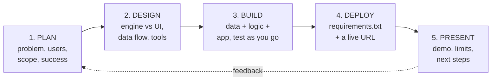
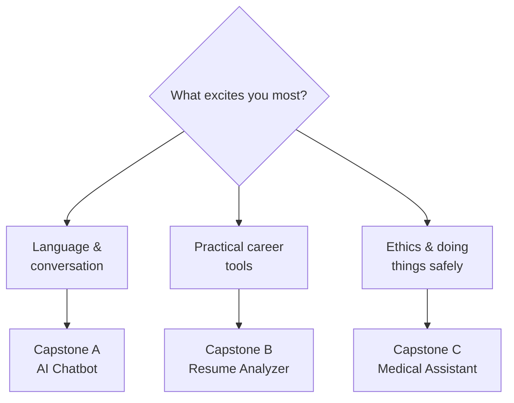
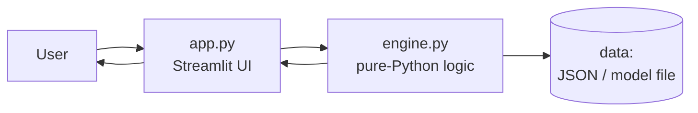
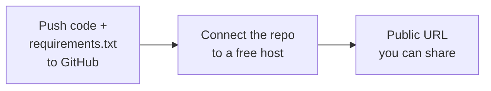
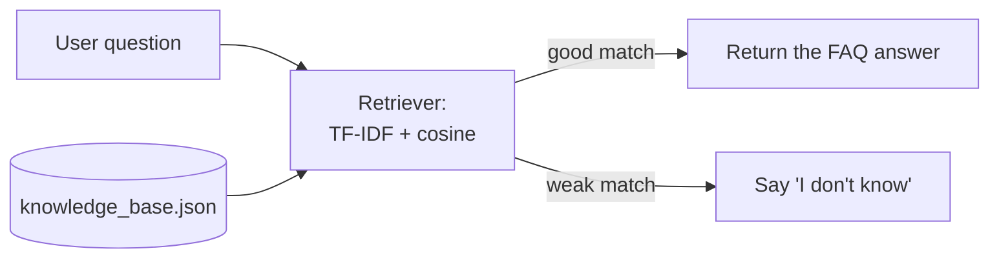
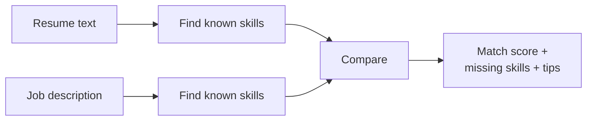
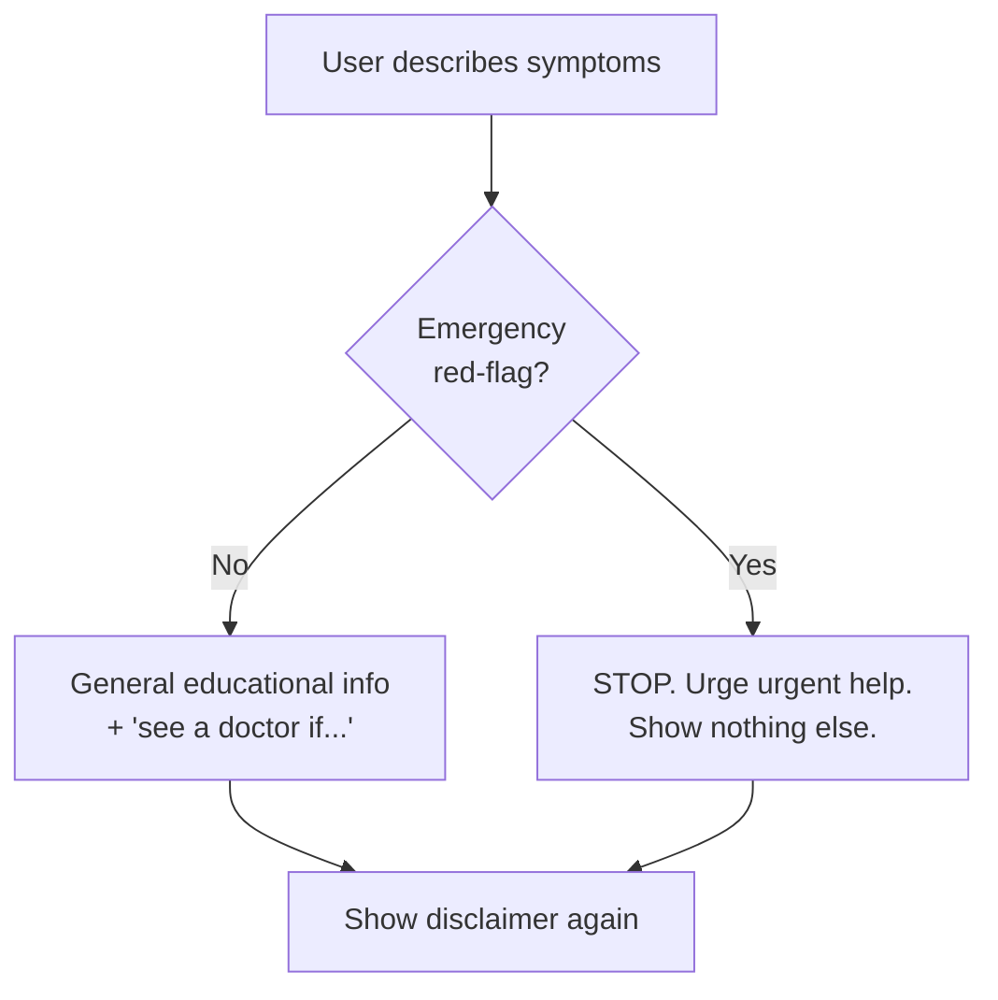

# Module 10 — Capstone Project 🏆🎓

**AI Powered Engineering Upskilling Program**

---

## Module Information Card

| | |
|---|---|
| **Module** | 10 of 10 — the finale |
| **Title** | Capstone Project |
| **Duration** | 6 hours |
| **Learning Outcome** | Deliver an end-to-end AI solution |
| **Topics Covered** | Project Planning, Implementation, Presentation |
| **Hands-on Activity** | AI Chatbot / Resume Analyzer / Medical Assistant |
| **Prerequisites** | Modules 1–9 (you'll use a bit of everything) |
| **Tools** | Python, Git/GitHub, Streamlit, and whatever your project needs |

### What you will be able to do after this module

- Turn a vague idea into a **scoped, planned** project with clear success criteria.
- **Design** an application by separating logic (the "engine") from the interface (the UI).
- **Build** it incrementally, testing as you go, and version it with Git.
- **Deploy** it so anyone can try it (using Module 9's skills).
- **Present** it: a crisp demo, honest limitations, and a story you can defend in an interview.
- Apply **responsible-AI** thinking — privacy, honesty, and knowing when *not* to answer.

---

## Table of Contents

1. [What Is a Capstone — and Why It's the Real Test](#1-what-is-a-capstone--and-why-its-the-real-test)
2. [The Shape of an End-to-End AI Solution](#2-the-shape-of-an-end-to-end-ai-solution)
3. [Phase 1 — Project Planning](#3-phase-1--project-planning)
4. [Choosing Your Capstone](#4-choosing-your-capstone)
5. [Phase 2 — Design & Architecture](#5-phase-2--design--architecture)
6. [Phase 3 — Implementation](#6-phase-3--implementation)
7. [Phase 4 — Deployment](#7-phase-4--deployment)
8. [Phase 5 — Presentation & Demo](#8-phase-5--presentation--demo)
9. [Capstone A Deep Dive — AI Chatbot](#9-capstone-a-deep-dive--ai-chatbot)
10. [Capstone B Deep Dive — Resume Analyzer](#10-capstone-b-deep-dive--resume-analyzer)
11. [Capstone C Deep Dive — Medical Assistant](#11-capstone-c-deep-dive--medical-assistant)
12. [Best Practices & Common Pitfalls](#12-best-practices--common-pitfalls)
13. [Documentation & the Final README](#13-documentation--the-final-readme)
14. [How a Capstone Is Judged (Rubric)](#14-how-a-capstone-is-judged-rubric)
15. [Responsible AI in Your Capstone](#15-responsible-ai-in-your-capstone)
16. [Practice Exercises & Self-Assessment](#16-practice-exercises--self-assessment)
17. [Course Wrap-Up — Your 10-Module Journey](#17-course-wrap-up--your-10-module-journey)
18. [Final Words](#18-final-words)

---

## 1. What Is a Capstone — and Why It's the Real Test

For nine modules you learned skills one at a time: Python, data analysis, machine learning, deep learning, computer vision, NLP, generative AI, agents, and deployment. A **capstone** is where those separate skills stop being nine things and become **one thing**: a working application you built from an empty folder to a live URL.

> A capstone is not "one more exercise." It is the project you point to when someone asks *"What can you actually do?"*

### 1.1 Why it matters more than any single lesson

- **It proves integration.** Anyone can follow a tutorial. A capstone shows you can plan, choose, build, connect, and finish — the messy real-world part tutorials skip.
- **It's your best interview asset.** "I built and deployed X; here's the link; here's what I'd improve" beats any list of buzzwords.
- **It builds judgment.** You'll make real trade-offs (scope, tools, time) — and judgment is what turns a student into an engineer.

### 1.2 What "end-to-end" means

```
IDEA  ->  PLAN  ->  DATA  ->  BUILD  ->  DEPLOY  ->  PRESENT
 (a need)  (scope)  (inputs) (engine+UI) (a URL)   (a demo)
```

Most beginner projects stop at "build" (a notebook that runs once). A capstone goes all the way to **deploy** and **present** — because software that no one can use, and that you can't explain, doesn't count.

### 1.3 The one sentence to remember

> **Build it, ship it, explain it.** That arc — not any single algorithm — is what an AI engineering job actually asks of you.

---

## 2. The Shape of an End-to-End AI Solution

Every capstone, no matter the topic, moves through the same five phases. Learn the shape once and you can build anything.



| Phase | Question it answers | Output |
|---|---|---|
| **Plan** | What am I building, for whom, and when is it "done"? | A one-page plan |
| **Design** | How will the pieces fit together? | An architecture sketch |
| **Build** | Does it actually work? | Working code (engine + UI) |
| **Deploy** | Can anyone use it? | A public link |
| **Present** | Can I explain and defend it? | A demo + README |

Notice the dashed **feedback** arrow: real projects loop. You'll present, learn something, and improve the plan. That's normal and good.

---

## 3. Phase 1 — Project Planning

Most failed projects fail *here*, before a line of code — by being too big, too vague, or solving no real problem. Spend real time on the plan; it's the cheapest place to fix mistakes.

### 3.1 The five planning questions

1. **Problem:** What specific problem does this solve? (One sentence.)
2. **User:** Who has this problem? (Be concrete — "a student applying for internships," not "people.")
3. **Solution:** What will the app do, in plain words?
4. **Success criteria:** How will you *know* it works? (Measurable, e.g. "returns a match score and 3 tips for any pasted resume.")
5. **Scope:** What is explicitly **out** of scope for v1? (This is the most important one.)

### 3.2 Write a one-line problem statement

A good template:

> **"[User] needs [outcome] because [reason], but [current pain]."**

Example: *"A student applying for internships needs to know if their resume fits a job, because tailoring matters, but comparing by hand is slow and error-prone."*

### 3.3 Scope: the art of doing less

The number-one beginner mistake is building too much. **Ruthlessly cut v1 to the smallest thing that's still useful** — the "minimum viable product" (MVP).

| ✅ v1 (ship this) | ⏳ v2 (later, if time) | ❌ Not now |
|---|---|---|
| Score one resume vs one job | Upload PDF files | Account logins |
| Show matched/missing skills | Weight required vs optional skills | A database of jobs |
| Give 3 tips | LLM-written rewrite | Mobile app |

A finished small thing beats an unfinished big thing — every time.

### 3.4 A lightweight milestone plan

For a 6-hour capstone, block your time:

| Time | Milestone |
|---|---|
| 0:00–0:45 | Plan: problem, scope, success criteria, sketch |
| 0:45–3:30 | Build the **engine** (logic) and test it |
| 3:30–4:45 | Build the **UI** (Streamlit) around the engine |
| 4:45–5:30 | Deploy + write the README |
| 5:30–6:00 | Prepare the demo + note limitations |

> 💡 Build the **engine first**, UI last. A tested engine with no UI is a real project; a pretty UI with broken logic is not.

---

## 4. Choosing Your Capstone

The syllabus offers three options. Any of them is a strong portfolio piece — pick the one whose **problem** you find most interesting, because you'll work harder on something you care about.

| | **A — AI Chatbot** 💬 | **B — Resume Analyzer** 📄 | **C — Medical Assistant** 🏥 |
|---|---|---|---|
| Solves | Answering FAQs instantly | Matching a resume to a job | Explaining common symptoms (educationally) |
| Leans on | NLP + Generative AI | Text processing + logic | Responsible/safe AI design |
| Core idea | Retrieval (find the best answer) | Skill matching + scoring | A safety gate before any output |
| Hardest part | Grounding answers in real facts | Fair, explainable scoring | Knowing when **not** to answer |
| Great if you like | Language & conversation | Careers & practical tools | Ethics & careful design |

### 4.1 How to decide



You'll **build one**. The other two are complete, working reference projects in the hands-on folder — read their code to learn different patterns. Sections 9–11 deep-dive all three.

---

## 5. Phase 2 — Design & Architecture

"Architecture" sounds grand, but for a capstone it means one main decision: **separate the brain from the face.**

### 5.1 The golden pattern: engine vs UI

Split your app into two parts:

- **The engine** — plain Python that does the actual work (retrieve an answer, score a resume, assess symptoms). *No Streamlit, no web code.*
- **The UI** — the Streamlit app that takes input, calls the engine, and shows results.



**Why this matters so much:**

| Benefit | Because... |
|---|---|
| **Testable** | You can run the engine with `python engine.py` — no browser, no server. |
| **Swappable** | Change the UI (Streamlit → Flask) without touching the logic. |
| **Explainable** | In an interview you can point to a small, clean logic file. |
| **Debuggable** | When something breaks, you know which half to look in. |

All three capstones in this course follow this pattern (`chatbot_engine.py` + `app.py`, `analyzer.py` + `app.py`, `medical_engine.py` + `app.py`).

### 5.2 Choosing your tools (don't over-engineer)

Pick the **simplest tool that does the job**:

| Need | Reach for |
|---|---|
| A data/demo UI, fast | **Streamlit** |
| A JSON API for other apps | **Flask / FastAPI** |
| Store a few facts/config | A **JSON** file |
| A trained ML model | **scikit-learn** + `joblib` |
| Natural-language generation | An **LLM** (Claude), mock-first |

You do **not** need a database, a login system, or a cloud account to have a great capstone. Add complexity only when the project genuinely needs it.

### 5.3 Sketch the data flow

Before coding, draw (on paper) the journey of one request: *input → engine step 1 → step 2 → output.* If you can't draw it, you can't build it. This 5-minute sketch saves hours.

---

## 6. Phase 3 — Implementation

Now you build. The trick is to build in **small, working steps**, not one giant leap.

### 6.1 Build the engine first, in slices

Don't write the whole engine and then run it. Write the smallest piece, run it, then add the next:

```
1. Load the data (json.load) ............... run it, print it
2. One core function (e.g. best_match) ..... run it on one example
3. Handle the "unknown" case ............... test a bad input
4. Wrap it in a single entry point ......... test 3-4 examples
```

Each slice ends with a `print()` or a quick `if __name__ == "__main__":` test. You always have something that runs.

### 6.2 The "mock-first" principle (for AI-powered features)

If your project uses an LLM or any paid/online service, **build a free offline version first**:

```python
USE_REAL_API = False        # start here

def get_answer(q):
    if USE_REAL_API:
        return call_the_real_model(q)   # real path, off by default
    return rule_based_answer(q)         # mock: free, instant, testable
```

This lets you build and demo the whole app with **no API key, no cost, no internet** — then flip one switch for the real thing. (Capstone A uses exactly this pattern.)

### 6.3 Test as you go

You don't need a testing framework. A few asserts or prints catch most bugs:

```python
assert analyze(resume, jd)["match_score"] <= 100      # can't exceed 100%
assert engine.assess("chest pain")["emergency"] is True  # safety must trigger
```

Run these after every change. A bug caught in 10 seconds beats one found during your demo.

### 6.4 Version control from commit #1

Start a Git repo immediately and commit small, often (Module 8/9 skills):

```bash
git init
git add .
git commit -m "Working engine: retrieves best FAQ match"
# ... keep committing as each slice works
```

Now you can always undo, and your commit history *shows* you did the work over time — recruiters notice.

### 6.5 Keep it ASCII-clean and cross-platform

Small but real: on Windows, printing fancy symbols/emoji from Python can crash with an encoding error. Keep text inside `print()` and files plain ASCII, and use `encoding="utf-8"` when reading/writing files. Little robustness details like this are what "production-ready" means.

---

## 7. Phase 4 — Deployment

A capstone that only runs on your laptop is invisible. Deployment (Module 9) turns it into a link. Quick recap applied to your capstone:

### 7.1 The three steps



1. **`requirements.txt`** — list your libraries so the host can install them:
   ```
   streamlit>=1.30
   pandas>=2.0
   ```
2. **Push to a public GitHub repo** (with a good README).
3. **Deploy on Streamlit Community Cloud** (`share.streamlit.io`) — pick the repo and `app.py`, wait ~2 minutes, get `https://your-app.streamlit.app`.

### 7.2 Deployment checklist

- [ ] `requirements.txt` lists everything the app imports.
- [ ] No secrets (API keys) committed — use environment variables.
- [ ] The app runs from a **clean clone** (test in a fresh folder).
- [ ] The README explains how to run it.
- [ ] The live link actually opens and works on your phone.

Put that live link on your **resume, LinkedIn, and GitHub profile** — it's the proof that you can ship.

---

## 8. Phase 5 — Presentation & Demo

You built something real. Now make people *get it* in three minutes. Presentation is a skill — and often the difference between projects that impress and projects that get scrolled past.

### 8.1 The 3-minute demo structure

1. **The problem (20s):** "Students can't tell if their resume fits a job."
2. **The solution (20s):** "So I built a tool that scores the match and suggests fixes."
3. **Live demo (90s):** *Do the thing.* Paste a resume, click, show the result. Live beats slides.
4. **How it works (30s):** one sentence on the approach ("it matches known skills and scores coverage").
5. **Limits & next steps (20s):** "Right now it uses a fixed skill list; next I'd add PDF upload." — honesty builds trust.

### 8.2 Tips that make demos land

- **Rehearse the happy path.** Know exactly what input you'll type so nothing breaks live.
- **Have a backup.** A screen recording or screenshots, in case the wifi/host fails.
- **Show, don't tell.** One working click is worth ten slides of architecture.
- **Own the limitations.** "It doesn't do X yet" shows maturity; pretending it's perfect doesn't.

### 8.3 Answering questions

- If you know it, answer briefly.
- If you don't: *"I'm not sure — I'd find out by trying Y."* Never bluff. Interviewers test how you handle not knowing.
- Prepare for the classic: *"What was the hardest part?"* and *"What would you do differently?"* — have a real answer.

### 8.4 A one-slide (or one-README) summary

If you make slides, you need very few: **Problem → Demo → How it works → Limits/Next → Link.** Often the README *is* the presentation — make it excellent (see §13).

---

## 9. Capstone A Deep Dive — AI Chatbot

**Problem:** people ask the same questions repeatedly; a bot can answer instantly, 24/7. **Approach:** find the best-matching answer from a knowledge base (retrieval), with an optional LLM for natural phrasing.

### 9.1 How it works



- **TF-IDF** (Module 6) turns each FAQ into a vector where meaningful, rare words count more than common ones.
- **Cosine similarity** finds the FAQ closest to the question.
- A **similarity floor** means the bot admits when nothing matches — better than confidently guessing.

### 9.2 The RAG idea (why grounding matters)

Left alone, an LLM can **hallucinate** (make things up). The professional fix is **Retrieval-Augmented Generation (RAG)**: first *retrieve* the relevant facts, then let the model answer *using only those facts*. Capstone A is RAG in miniature — the mock retrieves; the optional real mode hands the retrieved facts to Claude with the instruction "answer only from these facts."

### 9.3 Mock vs real

| | Mock (default) | Real (optional) |
|---|---|---|
| Answer source | best-matching FAQ text | Claude, grounded in the facts |
| Cost / internet | none | API key + per-request cost |
| Best for | building, testing, demos | natural, flexible phrasing |

Building the mock first means the whole app works offline; the real mode is one flag away.

---

## 10. Capstone B Deep Dive — Resume Analyzer

**Problem:** applicants can't easily tell how well their resume matches a job; recruiters (and software) filter on skills. **Approach:** find known skills in both texts, score the overlap, and give concrete fixes.

### 10.1 How it works



- **Skill detection:** whole-word matching against a skills list (`skills_db.json`), so "r" doesn't match inside "random".
- **Score:** of the skills the *job* requires, how many the resume has (e.g. 3 of 6 = 50%).
- **Health checks:** length, action verbs, contact info, quantified results.
- **Suggestions:** prioritised, specific fixes.

### 10.2 Why rule-based is a strength here

For feedback that affects someone's job search, **transparency matters**. A rule-based analyzer can always explain *why* a score came out as it did ("you're missing SQL, Docker, and data visualization"). That explainability is a feature, not a limitation — and it ties directly to the **ATS** idea from Module 9 (software that scans resumes for keywords before a human sees them).

### 10.3 Where an LLM could help (v2)

Rules score and flag; an LLM (Module 7) could *rewrite* a weak bullet in stronger language. A great v2: keep the transparent score, add an optional "improve this bullet" button powered by Claude.

---

## 11. Capstone C Deep Dive — Medical Assistant

> ⚠️ This project is an **educational demonstration only**. It does not diagnose and is not medical advice. Its purpose is to teach **responsible AI**.

**Problem:** people search symptoms online and get scary, unreliable results. **Approach (careful):** give *general, educational* information for everyday symptoms, always with disclaimers and "see a doctor if..." guidance — and, crucially, detect emergencies and redirect to urgent help.

### 11.1 The safety gate (the whole point)



The design rule: **check for danger before doing anything else.** If the text mentions "chest pain," "difficulty breathing," "slurred speech," etc., the app immediately urges emergency care and shows **no** self-care tips. Only for everyday symptoms does it show general info — and never a diagnosis.

### 11.2 The responsible-AI lessons

| Principle | How the app applies it |
|---|---|
| **Honesty about limits** | A disclaimer shown first and last; "this is not a diagnosis." |
| **Fail safe** | On any red flag, it refuses to give casual advice. |
| **Do no harm** | Never outputs a diagnosis or treatment decision. |
| **Transparency** | The user can see it's educational and rule-based. |

### 11.3 Why "no" is the best feature

The most important thing this app does is **decline** — it knows when *not* to answer. That instinct is exactly what makes AI safe to put in front of real people, and it's a mature, interview-worthy thing to have built and to be able to discuss.

---

## 12. Best Practices & Common Pitfalls

### 12.1 Do

- **Start small; finish it.** A working MVP beats an ambitious half-project.
- **Separate engine from UI.** Test the logic on its own.
- **Commit early and often** with clear messages.
- **Write the README as you build**, not at 2 a.m. the night before.
- **Handle bad input** (empty text, weird values) gracefully.
- **Be honest** about what works and what doesn't.

### 12.2 Don't (the classic traps)

| Pitfall | Fix |
|---|---|
| Scope creep ("just one more feature") | Freeze v1; write extras on a "v2 later" list. |
| Building UI before the logic works | Engine first, always. |
| Hard-coding an API key in the file | Use environment variables; never commit secrets. |
| No README / no run instructions | A project no one can run doesn't count. |
| Testing only the happy path | Try empty input, huge input, nonsense input. |
| Faking a live demo | Rehearse it; have a recorded backup. |

### 12.3 The "works on my machine" trap

Before you call it done, **clone your own repo into a fresh folder, `pip install -r requirements.txt`, and run it.** If it works there, it'll work for others. This one habit prevents most deployment disasters.

---

## 13. Documentation & the Final README

For a capstone, the **README is the front door**. Many people (recruiters especially) will read it and never open your code. Make it great.

### 13.1 What a strong capstone README contains

1. **Title + one-line description** — what it is, instantly.
2. **A screenshot or GIF** — or the **live link** — so people can *see* it.
3. **The problem it solves** — two sentences.
4. **How to run it** — exact commands, copy-pasteable.
5. **How it works** — a short paragraph or diagram (engine → UI).
6. **Limitations & next steps** — honesty that shows maturity.
7. **Tech used** — Python, Streamlit, etc.

### 13.2 A template you can copy

```markdown
# ResumeFit — Resume vs Job Matcher

Paste a resume and a job description; get a match score and fixes.
**Live demo:** https://resumefit.streamlit.app

## The problem
Applicants can't easily tell if their resume fits a job. ResumeFit
scores the match and suggests concrete improvements.

## Run it
    pip install -r requirements.txt
    streamlit run app.py

## How it works
A pure-Python engine finds known skills in both texts and scores the
overlap; the Streamlit UI shows the score, gaps, and tips.

## Limitations / next steps
Uses a fixed skill list; next I'd add PDF upload and weighted scoring.
```

The project READMEs in this course's hands-on folders are working models — copy their structure.

---

## 14. How a Capstone Is Judged (Rubric)

Whether it's a course, a bootcamp, or a hiring manager looking at your GitHub, capstones are evaluated on roughly the same things. Use this as a **self-check before you call it done.**

| Area | Weak | Strong |
|---|---|---|
| **Problem & scope** | vague, tries to do everything | clear problem, tight v1 scope |
| **It works** | crashes, only the demo input works | handles varied and bad input |
| **Code quality** | one giant file, no structure | engine/UI split, readable, commented where useful |
| **Deployment** | runs only locally | live public link |
| **Documentation** | no README / can't run it | clear README, screenshot/link, run steps |
| **Presentation** | reads slides, hides flaws | crisp demo, honest about limits |
| **Responsibility** | ignores privacy/ethics | handles data carefully, honest about limits |

### 14.1 The self-check checklist

- [ ] I can state the problem and user in one sentence each.
- [ ] The engine runs and passes a few `assert`/print tests.
- [ ] The app handles empty and weird input without crashing.
- [ ] It's deployed and the link works (on a phone too).
- [ ] The README lets a stranger run it in under 2 minutes.
- [ ] I can demo it in 3 minutes and name 2 limitations + 2 next steps.
- [ ] No secrets or personal data are committed.

If every box is ticked, you have a portfolio-grade capstone.

---

## 15. Responsible AI in Your Capstone

AI that touches people carries responsibility. You don't need a philosophy degree — just a few habits.

| Principle | What to do |
|---|---|
| **Privacy** | Don't collect or store personal data you don't need; don't commit it to GitHub. Use placeholder data in demos. |
| **Honesty** | Be clear about what your app is (and isn't). A demo chatbot shouldn't pretend to be human support. |
| **Fairness** | Notice if your rules or data could disadvantage a group; say so. |
| **Safety** | For anything high-stakes (health, money, safety), fail safe and add disclaimers — as Capstone C does. |
| **Transparency** | Let users understand, roughly, how it decides. |

> The rule of thumb: **if your app could affect a person's decision, you're responsible for its mistakes.** "The AI said so" is never an excuse. Being able to talk about this thoughtfully sets you apart in interviews.

---

## 16. Practice Exercises & Self-Assessment

These are mostly planning and reflection exercises — the skills a capstone really tests. Try each before reading the key in §16.5.

### 16.1 Planning

1. Write a **one-line problem statement** (using the §3.2 template) for a project idea of your own.
2. For that idea, list **3 features that are IN scope** for v1 and **3 that are OUT** (v2/later).
3. Write **two measurable success criteria** for it (how you'll know it works).

### 16.2 Design

4. Draw (in words) the **engine-vs-UI split** for your idea: what goes in `engine.py` vs `app.py`?
5. Pick the right tool: for each need, name Streamlit **or** Flask — (a) an interactive data demo, (b) a JSON API another program calls.
6. Sketch the **data flow** for one request through your app (input → steps → output).

### 16.3 Reflection (interview practice)

7. In 3 sentences, describe your capstone as if in an interview (problem → what you built → one limitation).
8. Answer out loud: *"What was the hardest part, and how did you solve it?"*
9. Name **two responsible-AI considerations** for your project and how you'd handle them.

### 16.4 Quick self-check quiz

1. What are the five phases of an end-to-end project? *(→ Plan, Design, Build, Deploy, Present)*
2. Why build the engine before the UI? *(→ you can test the logic on its own; a tested engine is a real project)*
3. What does "mock-first" mean? *(→ build a free offline version before wiring up a paid/online API)*
4. What file tells a host which libraries to install? *(→ requirements.txt)*
5. What is RAG, in one line? *(→ retrieve relevant facts, then let the model answer using only those facts)*
6. What's the single most important feature of the Medical Assistant? *(→ knowing when NOT to answer — the safety gate)*
7. Name two things a strong capstone README must have. *(→ any two of: one-line description, live link/screenshot, run steps, how-it-works, limitations)*
8. What should you never commit to GitHub? *(→ secrets/API keys, personal data)*

### 16.5 Solutions & Answer Key

**16.1 Planning** *(examples — yours will differ)*

1. *"A busy student needs quick answers about the course, because searching the notes is slow, but there's no instant help — so a chatbot that answers from the notes would save time."*
2. **In v1:** answer from a fixed FAQ; show "I don't know" when unsure; a simple chat UI. **Out (v2):** login accounts; learning from new questions automatically; voice input.
3. Measurable criteria: *(a)* "returns a relevant answer for at least 8 of 10 test questions"; *(b)* "responds in under 1 second in mock mode."

**16.2 Design**

4. **`engine.py`:** load the knowledge base, the retriever, the answer function (pure Python, testable with `python engine.py`). **`app.py`:** the Streamlit chat boxes, conversation memory, and calls into the engine. *Rule: anything that isn't about buttons/layout belongs in the engine.*
5. (a) **Streamlit** — interactive data demo with widgets and charts. (b) **Flask** (or FastAPI) — a JSON API another program calls.
6. Example data flow (chatbot): *user types question → tokenize + vectorize (TF-IDF) → cosine-compare to each FAQ → pick best; if score < floor → fallback message; else → return that FAQ's answer → display in chat.*

**16.3 Reflection** *(sample answers)*

7. *"Applicants can't tell if their resume fits a job, so I built a Streamlit tool that finds known skills in both the resume and the posting, scores the overlap, and gives targeted tips. Its main limit is a fixed skill list, which I'd expand and weight next."*
8. Sample: *"The hardest part was making out-of-scope questions return 'I don't know' instead of a wrong answer. I fixed it by dropping common stop-words and adding a similarity floor, so weak matches fall through to a safe fallback."*
9. Two responsible-AI points (Resume Analyzer): *(a) Privacy* — don't store pasted resumes; use placeholder data in demos. *(b) Fairness/transparency* — the score is rule-based and explainable, and I'd document that a fixed skill list can miss synonyms, so a low score isn't a judgment of the person.

**16.4 Quiz** — answers are shown inline next to each question above.

> **You've finished the program when:** you can take an idea from a blank folder to a deployed, documented, demo-ready AI app — and explain every part of it.

---

## 17. Course Wrap-Up — Your 10-Module Journey

Look back at how far you've come. Ten modules ago, "Python" might have been a snake.

| # | Module | You can now... |
|---|---|---|
| 1 | Python Fundamentals | write real programs: variables, loops, functions, files |
| 2 | AI & Data Science Foundations | explain AI/ML/DL and the data-science workflow |
| 3 | Data Analysis & Visualization | clean, analyze, and chart real datasets (NumPy, Pandas, Matplotlib, Seaborn) |
| 4 | Machine Learning Essentials | train and evaluate models honestly (scikit-learn) |
| 5 | Deep Learning & Computer Vision | build neural nets and work with images (CNNs, OpenCV, YOLO) |
| 6 | Natural Language Processing | process text and build classifiers (TF-IDF, transformers) |
| 7 | Generative AI & Prompt Engineering | use LLMs well and prompt them effectively |
| 8 | AI Agents & Automation | build agents that use tools, and automate workflows |
| 9 | Deployment & Career Readiness | ship apps and present yourself professionally |
| 10 | **Capstone Project** | **deliver a complete, end-to-end AI solution** |

### 17.1 What to do next

- **Polish your capstone** and pin it on your GitHub profile.
- **Update your resume + LinkedIn** with the project and your certificate (Module 9).
- **Build a second project** in a domain you love — repetition is how skills stick.
- **Keep learning:** pick one thing to go deeper on (LLMs, MLOps, a domain like health or finance).
- **Join the community:** read others' code, ask questions, share what you build.

### 17.2 The habits that will carry you

> The specific libraries will change. The habits won't: **scope small, build in slices, test as you go, ship it, document it, and be honest about limits.** Those are what make an engineer, and you've practiced all of them.

---

## 18. Final Words

You started by printing `Hello`. You're finishing by planning, building, deploying, and presenting a real AI application — the exact arc a working AI engineer repeats every day.

The tools in this course are today's tools; some will be replaced. But the ability to **take a problem from an idea to a working, deployed, explainable solution** never goes out of date. That's not a course skill — that's *the* skill.

> 🎓 **Build it, ship it, explain it.** You can do all three now. Go build something you're proud of — and then build the next thing.

**Congratulations on completing the AI Powered Engineering Upskilling Program.** 🎉
